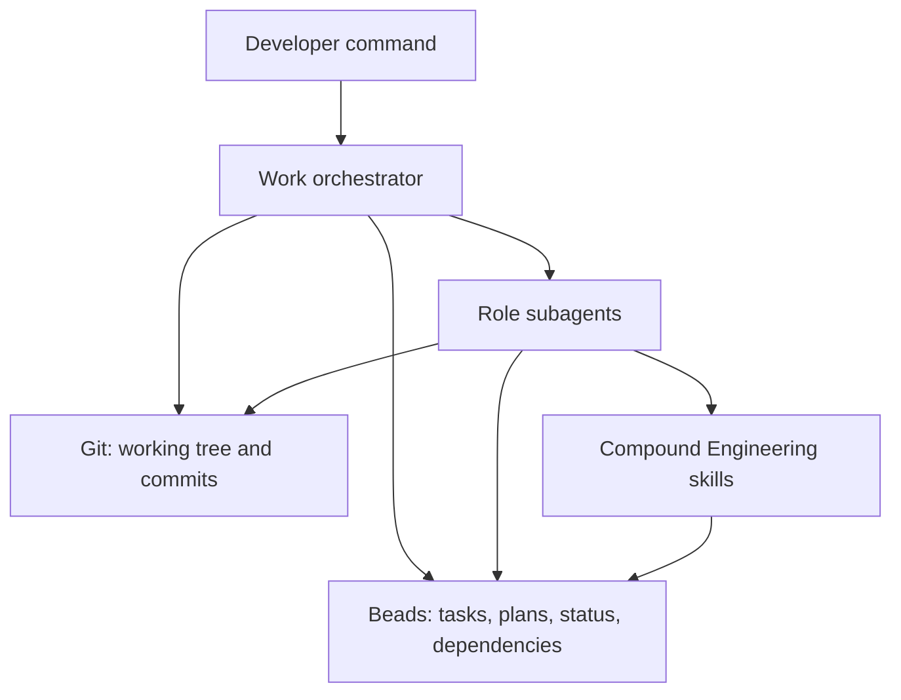

# Work Orchestrator Requirements

## Summary

Build a global Pi work-orchestrator package that turns short `/work-*` commands into Beads-backed software delivery flows. Beads owns durable work state, git owns code state, and the orchestrator advances one safe slice at a time through planner, worker, reviewer, fixer, and committer roles.

---

## Problem Frame

The current workflow requires long one-off prompts to combine Compound Engineering, Beads, subagents, git, review, and commit discipline. That makes autonomous progress hard to resume after interruption and easy to derail when manual edits or new urgent work appear.

The orchestrator exists to make the desired operating model repeatable: short commands start or resume work, Beads records every durable decision and status change, and each implementation slice finishes with verification, review, commit, and Bead closure before the loop continues.

---

## Key Decisions

- **Prompt and agent package before extension.** The first version should be a global Pi package made from skills, prompt templates, and subagent role definitions; a TypeScript extension is deferred until the loop proves useful.
- **Beads is the task authority.** Plans, executable slices, acceptance criteria, progress, discovered work, blockers, and closure live in Beads rather than chat memory or markdown TODO files.
- **Git is the code authority.** Code state is derived from the working tree and commits, not from Bead notes or conversation claims.
- **One writer at a time by default.** Worker and fixer roles may edit source, but concurrent writers in one checkout are out of scope unless a later version adds isolated worktrees.
- **CE is a reasoning layer, not durable state.** `ce-brainstorm`, `ce-plan`, `ce-work`, review, and commit skills can shape work, but their durable results must be reflected back into Beads.
- **`last` resolves from Beads first.** The orchestrator may add a convenience cache later, but resumption must work from Beads and git alone.
- **Commit-only by default.** The MVP commits completed Beads but does not push unless a repo policy or explicit user command adds that behavior later.

---

## Actors

- A1. **Developer** starts work with short `/work-*` commands, answers blocking product or architecture questions, and may make manual edits between orchestrator runs.
- A2. **Parent orchestrator** chooses one ready Bead at a time, dispatches role subagents, enforces stop conditions, and keeps durable state in Beads.
- A3. **Beads workspace** stores epics, planning beads, implementation beads, decision beads, fix beads, dependencies, acceptance criteria, status, and notes.
- A4. **Git repository** stores code state, diffs, verification targets, and completed commits.
- A5. **Role subagents** perform scoped planning, implementation, review, fixing, and commit-gating under narrow permissions.

---

## Requirements

**Source of truth and resume**

- R1. The orchestrator must treat Beads as the only durable source of work state.
- R2. The orchestrator must treat git as the only durable source of code state.
- R3. A fresh session must be able to resume from Beads and git without relying on chat memory.
- R4. Every worker, fixer, and committer must update Beads with enough notes for another session to know what changed, what verification ran, what failed, and what remains.

**Command surface**

- R5. `/work-small <task>` must create, claim, implement, verify, lightly review, commit, and close one obvious low-risk Bead.
- R6. `/work-med <task>` must create a bounded parent Bead, split it into one executable child Bead by default, with up to three only for obvious low-risk sequences, and start the first safe slice.
- R7. `/work-big <task>` must create a master epic Bead, create an initial planning Bead, run planning, and hand off to the continue loop.
- R8. `/work-auto <task>` must classify work as small, medium, or big and ask before launching big or ambiguous work.
- R9. `/work-continue [epic-id|last]` must resolve the target epic from Beads, choose exactly one ready related Bead, run the role loop, and repeat until a stop condition fires.
- R10. `/work-add <task>` must create new work during an active epic, link it only when it truly blocks current or future work, and support doing urgent work before returning to the prior epic.
- R11. `/work-pause` must checkpoint the active Bead, current git status, changed files, last verification, and remaining work without inventing unnecessary new tasks.
- R12. `/work-status` must report active epic candidates, in-progress Beads, ready Beads, blocked work, git status, and active subagent runs when available.

**Role behavior**

- R13. The planner role must mutate Beads only, creating or updating executable Beads, decision Beads, and real dependencies without editing source code.
- R14. The worker role must claim exactly one implementation Bead, implement only that Bead, run its verification, update Beads, and avoid committing.
- R15. The reviewer role must be read-only against source code, inspect the diff and Bead acceptance criteria, and return PASS or FAIL with evidence.
- R16. The fixer role must modify source only for reviewer-identified issues, rerun verification, update Beads, and avoid expanding scope.
- R17. The committer role must inspect status and diff, confirm verification and Bead notes, commit only related files, and close the Bead only after the commit exists.

**Safety and control**

- R18. The orchestrator must inspect dirty git state before writer work starts and stop when manual changes conflict with the current Bead.
- R19. Manual changes that belong to the current Bead must be included and verified rather than overwritten.
- R20. Manual changes that are unrelated must be left untouched unless the developer asks to classify or commit them.
- R21. Discovered follow-up work must become Beads with `discovered-from` context and must block other work only when it is a real blocker.
- R22. The orchestrator must stop when no ready Beads remain, a human decision is needed, verification invalidates the plan, the same subagent fails twice, or context budget becomes high.

**MVP packaging**

- R23. The MVP must be installable as a global Pi package that exposes the work-orchestrator skill, `/work-*` prompt templates, and five role subagents.
- R24. The MVP must not require a custom TUI dashboard, separate database, or TypeScript extension.
- R25. The package must be repo-agnostic and must not encode RFLib-specific behavior.

---

## Key Flows

- F1. Small work
  - **Trigger:** A1 invokes `/work-small <task>`.
  - **Actors:** A1, A2, A3, A4, A5
  - **Steps:** A2 creates and claims one Bead, dispatches or performs the bounded implementation, verifies it, runs light review, commits related files, and closes the Bead.
  - **Covered by:** R1, R2, R5, R14, R15, R17

- F2. Medium work
  - **Trigger:** A1 invokes `/work-med <task>`.
  - **Actors:** A1, A2, A3, A4, A5
  - **Steps:** A2 creates a parent Bead, creates one executable child Bead by default, with up to three only for obvious low-risk sequences, links only real dependencies, runs the first ready child through worker, reviewer, fixer when needed, and committer.
  - **Covered by:** R6, R13, R14, R15, R16, R17

- F3. Big work
  - **Trigger:** A1 invokes `/work-big <task>`.
  - **Actors:** A1, A2, A3, A5
  - **Steps:** A2 creates an epic Bead and planning Bead, runs the planner, records executable and decision Beads, then enters the continue loop for the epic.
  - **Covered by:** R7, R9, R13, R21

- F4. Continue loop
  - **Trigger:** A1 invokes `/work-continue`, `/work-continue last`, or `/work-continue <epic-id>`.
  - **Actors:** A1, A2, A3, A4, A5
  - **Steps:** A2 resolves the epic from Beads, selects one ready related Bead, routes planning Beads to planner or implementation Beads to worker, reviews the diff, fixes failures once safe, commits passing work, closes completed Beads, and repeats until stopped.
  - **Covered by:** R1, R2, R3, R4, R9, R13, R14, R15, R16, R17, R22

- F5. Add urgent work
  - **Trigger:** A1 invokes `/work-add <task>` during an active epic.
  - **Actors:** A1, A2, A3, A4, A5
  - **Steps:** A2 creates the new Bead with current context, links it only if it blocks active work, optionally runs it as a small or medium flow, then returns to the prior epic.
  - **Covered by:** R10, R21

- F6. Pause and resume
  - **Trigger:** A1 invokes `/work-pause`, the session is interrupted, or a stop condition fires.
  - **Actors:** A1, A2, A3, A4
  - **Steps:** A2 records current Bead state, git status, changed files, verification results, and remaining work in Beads; a later session resumes from Beads and git.
  - **Covered by:** R3, R4, R11, R22

---

## Acceptance Examples

- AE1. **Covers R3, R4.** Given a session is interrupted after a worker changes files and runs verification, when a fresh session starts with only Beads and git available, then `/work-continue last` can identify the active epic, current Bead state, changed files, verification result, and next safe action.
- AE2. **Covers R8.** Given `/work-auto` receives a cross-cutting or ambiguous request, when classification would route to big work, then the orchestrator asks before creating an epic and starting the autonomous loop.
- AE3. **Covers R18, R19, R20.** Given the working tree is dirty before worker dispatch, when dirty files conflict with the target Bead, then the orchestrator stops and asks rather than overwriting or silently mixing changes.
- AE4. **Covers R15, R16.** Given a reviewer reports FAIL with specific findings, when the fixer runs, then it changes only the reviewer-identified issues and sends the result back for review.
- AE5. **Covers R17.** Given review passes and verification is recorded, when the committer runs, then it commits only related files, uses a Bead-prefixed message, and closes the Bead only after the commit exists.
- AE6. **Covers R21.** Given implementation discovers optional future work, when it does not block current completion, then it becomes a discovered follow-up Bead without blocking the active Bead.

---

## Success Criteria

- A developer can start common work with short `/work-*` commands instead of long orchestration prompts.
- A stopped or compacted session can resume from Beads and git alone.
- Each completed implementation Bead has verification notes, a review result, a commit, and closure in Beads.
- Manual edits are classified before writer work and are never overwritten silently.
- The MVP works in a disposable Beads repo before being used on larger real repositories.

---

## Scope Boundaries

- Custom TUI dashboard is deferred.
- Native TypeScript extension commands, widgets, autocomplete, and context-budget automation are deferred until the prompt and agent MVP proves useful.
- Parallel source-writing subagents in one checkout are out of scope for MVP.
- Push automation is out of scope unless a repo-specific policy adds it later.
- A separate task database, markdown TODO ledger, or chat-memory state store is out of scope.
- Repo-specific logic such as RFLib-only behavior is out of scope.

---

## Dependencies / Assumptions

- Pi package loading, prompt templates, skills, and pi-subagents are available in the target environment.
- Beads is installed and initialized in each repository that uses the orchestrator.
- The package can rely on Beads parent relationships, labels, dependencies, acceptance criteria, design, and notes for MVP conventions.
- The user will install the package globally or per project before invoking `/work-*` commands.
- Repositories may have their own verification commands, and the worker must use Bead-provided verification when present.

---

## Outstanding Questions

### Deferred to Planning

- Exact Beads labels, metadata keys, and command flag conventions for planning, implementation, fix, and active-epic beads.
- Exact prompt-template bodies for each `/work-*` command.
- Exact subagent frontmatter, tool allowlists, and permission boundaries for each role.
- Whether the planner should create temporary CE plan documents before transcribing durable decisions into Beads.
- How the MVP should test interruption, resume, dirty manual edits, and role failure in a disposable repository.

---

## Sources / Research

- `docs/orchestrator.md` defines the desired autonomous loop, role responsibilities, stop conditions, and resume contract.
- `docs/orchestrator_idea.md` defines the package shape, command set, Beads model, role agents, MVP build plan, non-goals, and open questions.
- Pi package, skill, prompt-template, extension, and subagent documentation confirmed that this can start as a package of skills, prompts, and subagent agents, with an extension deferred.
