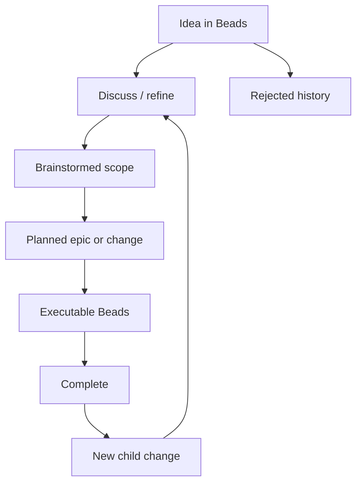

# Work Intelligence Requirements

## Summary

Build a Beads-owned work intelligence layer where ideas, brainstorms, plans, tasks, and telemetry are visible from `/work-*` commands instead of scattered across markdown files and chat history. The first slice captures and matures ideas; later slices expose usage and review cost from existing telemetry.

---

## Problem Frame

The current workflow can produce useful CE ideation, brainstorms, plans, and Beads epics, but the connecting memory is weak. A session can generate many ideas, brainstorm one, plan it, work it, and later leave the developer hunting through old markdown files or rerunning ideation to recover what was left.

The sharper pain is not that ideation is unavailable. It is that the project lacks a durable, queryable view of idea lineage: what was generated, what was promising, what was rejected, what was brainstormed, what became tasks, and what is complete.

Telemetry is already recorded, but it is mostly used by agents and text summaries. The same workflow should make expensive agents, long tasks, repeated reviews, and stalled work easy for the developer to inspect before changing model or review policy.

---

## Key Decisions

- **Beads owns idea memory.** Ideas, refinement notes, brainstorm links, plan links, task progress, rejection, and completion state belong in Beads rather than in standalone markdown TODOs.
- **Idea lifecycle ships before usage analytics.** Preventing lost ideas is the primary outcome; `/work-usage` follows as the visual telemetry surface.
- **Statuses are hybrid.** Links to brainstorms, plans, and tasks derive durable status when possible; manual notes and marks represent discussion, acceptance, contender, and rejection state.
- **Generated ideas are saved by default.** Top picks become accepted candidates, contenders remain visible but inert, and rejected ideas stay as history without entering automation.
- **Automation starts only after shaping.** `/work-resume` may continue brainstormed, planned, or task-backed ideas, but it must not auto-work raw accepted ideas.
- **Changes create lineage, not rewritten history.** Tiny changes may update tasks directly; meaningful additions or modifications become linked child changes under the original idea.
- **Usage reporting reuses telemetry.** `/work-usage` should render the existing telemetry data as a sortable HTML report instead of creating a parallel analytics store.
- **Workflow quality is part of the epic.** CE brainstorming, ideation, and planning handoffs should be more proactive, high-effort while thinking, and review should stay scoped to the current diff.

---

## Actors

- A1. Developer generates ideas, reviews the idea dashboard, accepts or rejects ideas, and asks to discuss, brainstorm, plan, or work selected ideas.
- A2. Work extension provides deterministic `/work-*` command surfaces for listing, importing, reporting, and opening local usage views.
- A3. Parent orchestrator invokes CE skills and role agents with the right scope, effort, and prompt stance.
- A4. Beads workspace stores idea records, lineage, links, statuses, notes, tasks, dependencies, and completion evidence.
- A5. CE skills provide ideation, brainstorming, planning, and code review as reasoning layers whose durable outputs are reflected back into Beads.
- A6. Telemetry store records command, agent, usage, context, and duration events for reporting and tuning.

---

## Requirements

**Idea ledger and dashboard**

- R1. `/work-ideate` without arguments must render a deterministic dashboard of ideas grouped by Active, Raw, Brainstormed, Planned, Complete, Contender, and Rejected where groups with no ideas do not add noise.
- R2. The idea dashboard must show a stable index, short title, status, enough lineage context to recognize the idea, and command hints for common next actions.
- R3. `/work-ideate <topic>` must run ideation and save all generated ideas into Beads, marking top picks as accepted candidates and the rest as contenders.
- R4. Contender ideas must remain visible for review but must not be picked by automatic work progression.
- R5. Rejected ideas must remain inspectable as history and must never be picked by automatic work progression.
- R6. The user must be able to accept, reject, discuss, and inspect an idea by dashboard index or stable identifier.
- R7. Explicit import must convert selected existing brainstorms, plans, or documents into idea records without auto-importing old markdown files.

**Discussion, brainstorm, and plan lifecycle**

- R8. Discussing an idea must append refinement notes or update its current description without losing earlier lineage.
- R9. `/work-brainstorm idea <index-or-id>` must run `ce-brainstorm` on the selected idea and link the produced brainstorm back to the idea.
- R10. `/work-brainstorm <freeform topic>` must create or update an idea record and mark it brainstormed when the brainstorm completes.
- R11. Planning a brainstormed idea must link the plan and resulting epic or tasks back to the idea.
- R12. Idea status must derive from linked brainstorms, plans, tasks, and completion evidence when those links exist.
- R13. Manual status notes must cover refinement states that links cannot derive, such as accepted candidate, contender, rejected, or discussed in more detail.
- R14. `/work-resume` and related automation may only pick up ideas that are brainstormed, planned, or task-backed.

**Change lineage**

- R15. A tiny change to an idea already in work may update or create the relevant task directly and add a note to the idea.
- R16. A meaningful addition must create a linked child change under the original idea and may run a mini-brainstorm or plan for that addition.
- R17. A meaningful modification must create a linked change item and flag affected open plans or tasks for update instead of silently rewriting completed history.
- R18. A large shift may become a sibling or child epic, but it must stay linked to the original idea lineage.
- R19. When a completed idea receives a new child change, the idea must show as reopened or in progress while preserving evidence of the completed original scope.

**Usage and cost visibility**

- R20. `/work-usage` must render a temporary local HTML report for the current epic by default, with options for broader scopes that mirror existing telemetry scopes.
- R21. The usage report must be table-first and sortable by duration, token usage, estimated cost, agent, work type, Bead, phase, tool activity, reruns, and failures where telemetry contains those fields.
- R22. The usage report must support filters or toggles for commands, agents, tasks, phases, tools, review loops, and failure/stall signals.
- R23. The usage report must make the largest cost drivers visible without requiring charts.
- R24. `/work-usage` must reuse recorded work telemetry rather than writing a separate analytics source of truth.
- R25. When telemetry is missing or too sparse, `/work-usage` must say what data is unavailable instead of inventing conclusions.

**Workflow quality and tuning**

- R26. Work-orchestrator calls to CE ideation, brainstorming, and planning must tell the CE skill to ask questions when uncertain and to challenge weak plans before producing durable artifacts.
- R27. Ideation, brainstorming, and planning calls should use temporary high-effort or xhigh-effort thinking when available, without making that effort level a permanent global default.
- R28. Work-orchestrator review handoffs must scope CE code review and reviewer agents to the current diff or current Bead slice unless the user explicitly requests a broader review.
- R29. Review-agent tuning must be evidence-driven: `/work-usage` or `/work-telemetry` should expose cost and payoff before settings disable, downshift, or skip expensive review roles.
- R30. Any setting that disables or downshifts review coverage must be visible, reversible, and scoped so it does not silently weaken unrelated projects.

---

## Key Flows

- F1. Ideate into durable backlog
  - **Trigger:** A1 runs `/work-ideate <topic>`.
  - **Actors:** A1, A3, A4, A5
  - **Steps:** A3 invokes CE ideation, records every generated idea in A4, marks top picks as accepted candidates, marks the rest as contenders, and returns the dashboard with action hints.
  - **Covered by:** R1, R2, R3, R4

- F2. Review and reject ideas
  - **Trigger:** A1 runs `/work-ideate` and then `/work-ideate <index> reject`.
  - **Actors:** A1, A2, A4
  - **Steps:** A2 renders the grouped dashboard, resolves the selected idea, marks it rejected in A4, and keeps it out of automatic work progression.
  - **Covered by:** R1, R2, R5, R6

- F3. Discuss and brainstorm an idea
  - **Trigger:** A1 runs `/work-ideate <index> discuss` and later `/work-brainstorm idea <index>`.
  - **Actors:** A1, A3, A4, A5
  - **Steps:** A3 helps refine the idea, records refinement notes, invokes CE brainstorm for the selected idea, links the brainstorm artifact, and updates the derived status.
  - **Covered by:** R8, R9, R12, R13

- F4. Freeform brainstorm creates an idea
  - **Trigger:** A1 runs `/work-brainstorm <new topic>`.
  - **Actors:** A1, A3, A4, A5
  - **Steps:** A3 creates or finds the matching idea, runs CE brainstorm, links the brainstorm result, and marks the idea brainstormed.
  - **Covered by:** R10, R12

- F5. Add a change after work starts
  - **Trigger:** A1 adds a new footer, title behavior, or similar change to an idea with active or completed work.
  - **Actors:** A1, A3, A4, A5
  - **Steps:** A3 classifies the change by size, updates a direct task for tiny changes, creates a linked child change for meaningful additions or modifications, flags affected open work, and reopens the idea when needed.
  - **Covered by:** R15, R16, R17, R19

- F6. Inspect epic usage
  - **Trigger:** A1 runs `/work-usage` during or after an epic.
  - **Actors:** A1, A2, A6
  - **Steps:** A2 reads telemetry for the current epic, writes a temporary local HTML report, opens it when the platform allows, and lets the developer sort and filter cost drivers.
  - **Covered by:** R20, R21, R22, R23, R24, R25

- F7. Tune review cost from evidence
  - **Trigger:** A1 suspects review agents are too heavy.
  - **Actors:** A1, A2, A3, A6
  - **Steps:** A2 surfaces review cost and outcome data, A3 recommends a scoped setting only when evidence supports it, and the setting remains visible and reversible.
  - **Covered by:** R29, R30

---

## Acceptance Examples

- AE1. **Covers R1-R4.** Given CE ideation returns 20 ideas with 7 top picks, when `/work-ideate <topic>` completes, then all 20 ideas exist in Beads, the 7 top picks are accepted candidates, the other 13 are contenders, and the dashboard shows all of them with action hints.
- AE2. **Covers R5, R14.** Given an idea is rejected, when `/work-resume` selects work, then that idea is not considered even though it remains visible in the idea history.
- AE3. **Covers R8-R12.** Given an accepted idea is discussed and then brainstormed, when `/work-ideate` renders again, then the idea shows its refined description, brainstorm link, and derived brainstormed status.
- AE4. **Covers R10.** Given `/work-brainstorm add a better usage page` is run without referencing an existing idea, when the brainstorm completes, then a matching idea exists and links to the brainstorm.
- AE5. **Covers R15-R19.** Given a completed idea receives a meaningful new addition, when the change is accepted, then the original idea shows reopened or in progress and the completed original scope remains visible.
- AE6. **Covers R20-R25.** Given telemetry exists for an epic, when `/work-usage` runs, then a local HTML report shows sortable rows for tasks, agents, phases, duration, usage, and slowest events without inventing missing data.
- AE7. **Covers R26-R28.** Given the orchestrator invokes CE planning, brainstorming, or review, when it builds the handoff prompt, then planning and brainstorm prompts ask for challenge when uncertain, and review prompts name the current diff or Bead slice as the review scope.
- AE8. **Covers R29-R30.** Given review telemetry shows a reviewer role is costly with low useful findings, when the user changes review settings, then the setting is scoped, visible, reversible, and justified by the report.

---

## Success Criteria

- A developer can run `/work-ideate` and see what ideas exist, what state each is in, and what command to run next.
- Generated ideas no longer disappear into chat transcripts or isolated markdown files.
- Accepted, contender, rejected, brainstormed, planned, in-progress, complete, and reopened states are understandable from Beads-backed data.
- Freeform brainstorms and selected idea brainstorms both produce durable idea lineage.
- The usage report makes the largest time, token, agent, and review costs obvious enough to guide tuning.
- CE planning and review handoffs become more proactive without making normal implementation runs more expensive.

---

## Scope Boundaries

- Old brainstorm and plan files are not auto-imported; import is explicit.
- Raw accepted ideas do not enter automatic work execution until brainstormed, planned, or task-backed.
- `/work-usage` is a local temporary report, not a hosted dashboard.
- Rich charts are deferred; table-first sorting and filtering are enough for the first usage view.
- Exact Beads labels, metadata conventions, and command grammar are deferred to planning.
- Review-agent disabling is not automatic; the feature surfaces evidence and supports explicit settings.
- A new database or markdown TODO ledger is out of scope.

---

## Dependencies / Assumptions

- Beads can store enough hierarchy, labels, notes, links, and status information to represent idea lineage.
- Existing work telemetry remains available under the work-orchestrator telemetry store.
- Pi can render or open a temporary local HTML file for `/work-usage` in the target environment.
- CE ideation, brainstorming, planning, and review skills remain available as reasoning layers.
- The planner will choose exact Beads conventions without weakening the source-of-truth rule.

---

## Outstanding Questions

### Deferred to Planning

- Exact command grammar for `/work-ideate <index> discuss`, accept, reject, import, and inspect actions.
- Exact idea status names and how they map to Beads fields, labels, or derived state.
- How to identify the current epic for `/work-usage` when multiple active epics exist.
- How much review outcome quality telemetry is available today versus needing new event fields.
- Whether `/work-usage` should open the browser automatically on every platform or print the file path when opening is unreliable.
- Which review roles are eligible for disable or downshift settings, and what evidence threshold should justify that recommendation.

---

## Sources / Research

- `docs/brainstorms/2026-07-02-work-orchestrator-requirements.md` establishes Beads as durable work state and CE as a reasoning layer.
- `docs/brainstorms/2026-07-03-coded-work-report-requirements.md` establishes the pattern for deterministic Beads/git reports.
- `skills/work-orchestrator/SKILL.md` documents the current `/work-*` workflow, source-of-truth rules, CE plan bootstrap, and model/effort policy.
- `extensions/work-models.js` contains the registered command surface, telemetry storage and summary logic, and role model/effort settings.
- `agents/bead-reviewer.md` defines the current read-only review role and scoped diff expectations.
