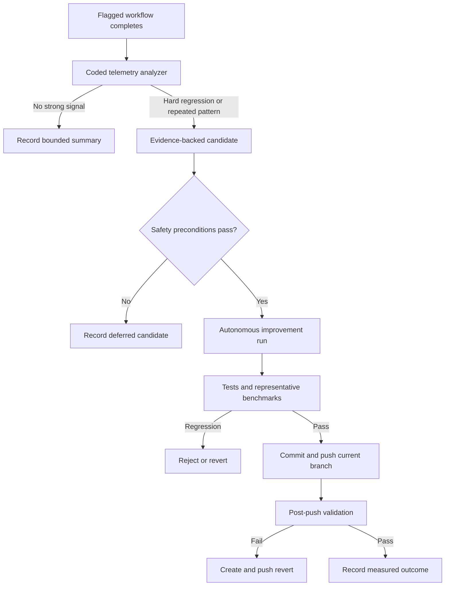

# Autonomous Workflow Improvement Requirements

## Summary

Add a post-workflow improvement loop that analyzes structured telemetry after every flagged run and autonomously improves the work extension when evidence crosses a threshold. Accepted changes may be broad and push directly to the current synchronized branch, but quality, benchmark, rollback, and recursion gates remain mandatory.

---

## Problem Frame

The work extension now records command, agent, tool, token, duration, review, failure, and self-improvement history. That data has already exposed expensive reads, redundant discovery, queued handoffs, formatter races, and telemetry gaps, but converting those signals into extension improvements still depends on a person noticing and investigating them.

Running an improvement agent after every workflow would consume much of the cost the feature is meant to save. The missing layer is a cheap coded analyzer that runs every time, accumulates evidence, and invokes expensive autonomous work only for a hard regression or a repeated pattern.

---

## Key Decisions

- **Coded analysis precedes agent reasoning.** Every eligible workflow gets deterministic post-processing; an agent starts only when a hard threshold is crossed or the same pattern appears in at least two runs.
- **The loop is fully autonomous when enabled.** It may analyze, modify, verify, commit, and push without approval.
- **Changes land on the current branch.** The loop does not create a mandatory bot branch or PR, so a clean synchronized branch is a hard precondition.
- **Broad changes are allowed behind strict verification.** Refactors and multi-file changes are permitted when package checks, representative workflow benchmarks, and post-push validation pass.
- **Quality is a hard gate; total workflow cost is the objective.** The optimizer balances tokens, latency, tool activity, output volume, retries, and errors but cannot trade away required planning, verification, review, commit, close, or push behavior.
- **The optimizer cannot optimize itself recursively.** Improvement runs are marked and excluded from triggering another improvement run.

---

## Actors

- A1. Work extension records structured telemetry and invokes post-processing for eligible workflows.
- A2. Coded analyzer detects known failure and waste patterns, deduplicates evidence, and decides whether an improvement candidate is actionable.
- A3. Autonomous improvement agent investigates one candidate, changes the extension, and supplies verification evidence.
- A4. Git repository provides the current branch, cleanliness, synchronization, commit, push, and rollback boundaries.
- A5. Verification and benchmark gates compare behavior and workflow cost before accepting a change.

---

## Requirements

**Activation and analysis**

- R1. Autonomous post-processing must be disabled by default and run only when the existing self-improving flag is enabled.
- R2. The coded analyzer must run after every completed eligible workflow without invoking a model when no actionable signal exists.
- R3. The analyzer must evaluate available failures, retries, tool calls, output volume, token usage, elapsed time, review payoff, verification outcomes, handoff outcomes, context growth, and repository cleanliness.
- R4. A single hard failure or regression may create an actionable candidate, while ordinary inefficiency must repeat across at least two runs before launching an improvement agent.
- R5. Candidates must contain bounded evidence linking the finding to source telemetry, affected workflow phase, observed cost or failure, and expected improvement.
- R6. Equivalent candidates must be deduplicated and accumulate evidence rather than launching parallel or repeated improvements.

**Autonomous change execution**

- R7. Each autonomous improvement run must address one evidence-backed candidate and must not broaden into unrelated cleanup.
- R8. The run may change prompts, agents, helpers, orchestration logic, telemetry, tests, or supporting code when the evidence justifies that scope.
- R9. The run must operate on the ce-workflow source repository rather than modifying the consumer project whose telemetry exposed the issue.
- R10. Autonomous editing must stop before mutation unless the ce-workflow working tree is clean and its current branch is synchronized with its configured upstream.
- R11. The loop must never discard unrelated work, force-push, bypass repository protections, or weaken a required quality gate to improve its score.
- R12. Only one autonomous improvement run may write to the ce-workflow checkout at a time.

**Verification, measurement, and delivery**

- R13. A candidate change must pass the repository's full package verification before commit.
- R14. A candidate change must run representative workflow checks that exercise the behavior it changes and compare relevant cost and quality signals against a recorded baseline.
- R15. A change must be rejected when verification worsens, required telemetry disappears, quality gates are skipped, or measured workflow cost regresses beyond the accepted tolerance.
- R16. A passing change must be committed and pushed to the current branch with the candidate evidence and measured result recorded in telemetry.
- R17. The loop must validate repository and workflow health after push and must create and push a normal revert commit if that validation fails.
- R18. Failed, deferred, rejected, accepted, and reverted candidates must remain distinguishable so the analyzer does not repeatedly retry unchanged evidence.

**Cost and loop control**

- R19. Improvement runs must optimize a balanced total-workflow-cost score covering tokens, latency, tool calls, tool output, retries, and errors.
- R20. Required workflow outcomes and verification quality must remain hard constraints outside the optimization score.
- R21. Improvement runs and their validation workflows must be marked as self-improvement activity and excluded from triggering another improvement cycle.
- R22. The analyzer must enforce a bounded candidate count, launch budget, and cooldown so persistent telemetry cannot create an unbounded commit loop.
- R23. When the source checkout, baseline, upstream, or verification environment is unavailable, the system must record the candidate and defer execution without changing either repository.

---

## Key Flows

- F1. Analyze an ordinary successful run
  - **Trigger:** A flagged work workflow completes.
  - **Actors:** A1, A2
  - **Steps:** A1 closes telemetry for the run, A2 derives bounded signals, merges them with prior candidate evidence, and exits without a model call when no threshold is crossed.
  - **Covered by:** R1-R6, R22

- F2. Improve from repeated evidence
  - **Trigger:** The same inefficiency appears in at least two eligible runs.
  - **Actors:** A2, A3, A4, A5
  - **Steps:** A2 creates one actionable candidate, verifies repository preconditions, A3 implements the scoped improvement, A5 runs verification and representative comparisons, and A4 commits and pushes only when every gate passes.
  - **Covered by:** R4-R16, R19, R20

- F3. Stop safely before autonomous editing
  - **Trigger:** An actionable candidate exists but the source checkout is dirty, diverged, unavailable, or already has an autonomous writer.
  - **Actors:** A2, A4
  - **Steps:** A2 records why the candidate was deferred and exits without changing the source or consumer repository.
  - **Covered by:** R10-R12, R18, R23

- F4. Recover from a bad pushed improvement
  - **Trigger:** Post-push validation detects a failure or regression.
  - **Actors:** A3, A4, A5
  - **Steps:** A5 records the failing evidence, A4 creates and pushes a normal revert commit, and A2 marks the candidate reverted so unchanged evidence does not immediately retry it.
  - **Covered by:** R17, R18, R21, R22

---

## Acceptance Examples

- AE1. **Covers R2, R4, R6.** Given one successful workflow has a moderately expensive read pattern, when post-processing runs, then the analyzer records the signal without launching an agent; when the same pattern appears in a second eligible run, then one deduplicated candidate becomes actionable.
- AE2. **Covers R4, R5.** Given a workflow loses required telemetry or leaves the repository dirty after finalization, when post-processing runs, then one run is sufficient to create a candidate with the failing event and affected phase.
- AE3. **Covers R9-R12, R23.** Given a consumer project exposes a repeated issue while ce-workflow has unrelated local changes, when the candidate becomes actionable, then neither repository is modified and the candidate is recorded as deferred.
- AE4. **Covers R13-R16, R19, R20.** Given an autonomous change reduces tool output but skips review, when comparison gates run, then the change is rejected despite its lower cost.
- AE5. **Covers R13-R16.** Given a broad multi-file refactor passes package verification and representative workflow checks while improving total workflow cost, when delivery completes, then one evidence-linked commit is pushed to the current synchronized branch.
- AE6. **Covers R17, R18.** Given a pushed improvement passes pre-push checks but fails post-push validation, when recovery runs, then a revert commit is pushed and the candidate is marked reverted.
- AE7. **Covers R21, R22.** Given an improvement run and its validation produce high telemetry costs, when post-processing sees those events, then their self-improvement marker prevents a recursive candidate or another autonomous launch.

---

## Success Criteria

- Ordinary post-processing adds negligible latency and no model cost when no threshold is crossed.
- Every autonomous change is traceable to bounded telemetry evidence and a measured expected outcome.
- Repeated workflow waste and hard regressions can produce verified extension improvements without human intervention.
- Accepted changes preserve all required workflow outcomes and do not regress representative quality checks.
- Dirty, diverged, unavailable, or concurrently written source checkouts produce deferred candidates rather than unsafe edits.
- A failed pushed improvement is reverted automatically without force-pushing or losing unrelated history.
- The system cannot trigger an unbounded chain of self-improvement runs.

---

## Scope Boundaries

- The analyzer improves ce-workflow; it does not autonomously refactor consumer projects based on their telemetry.
- The feature does not run an LLM after every workflow.
- Human approval, bot branches, and mandatory PRs are not part of the selected operating mode.
- Quality gates, review coverage, verification evidence, and repository safety cannot be disabled to improve cost metrics.
- Force-push, destructive reset, dirty-tree cleanup, and bypassing branch protections are out of scope.
- Cross-project centralized telemetry services and hosted dashboards are deferred.

---

## Dependencies / Assumptions

- The self-improving flag and structured telemetry remain available and stable enough for coded analysis.
- A writable ce-workflow source checkout and its upstream branch can be resolved from consumer-project execution context.
- The current branch permits normal commits and pushes when synchronized.
- Existing package verification and workflow simulation fixtures provide a baseline that planning can extend into representative comparison gates.
- The environment can distinguish self-improvement runs from ordinary product workflows.

---

## Outstanding Questions

### Deferred to Planning

- The exact signal thresholds, total-workflow-cost weights, regression tolerance, cooldown, and launch budget.
- How the extension resolves the authoritative ce-workflow source checkout when installed from a package rather than a linked checkout.
- Which representative workflow fixtures must run for each class of extension change.
- How candidate fingerprints age or reset after the extension changes.
- How post-push validation is bounded when external CI is unavailable or slow.
- Which branch-protection or upstream states should defer locally before attempting a push.

---

## Sources / Research

- `docs/brainstorms/2026-07-06-work-intelligence-requirements.md` establishes telemetry reuse, evidence-driven tuning, and reversible scoped settings.
- `docs/brainstorms/2026-07-02-work-orchestrator-requirements.md` establishes Beads and git authority, required workflow gates, and single-writer safety.
- `extensions/work-models.js` records structured work telemetry, self-improvement history, usage summaries, transcript reconciliation, optimization signals, and workflow lifecycle events.
- `scripts/test-work-telemetry.mjs` exercises telemetry capture and workflow handoff behavior.
- `scripts/verify-package.mjs` defines the existing package verification entry point.
