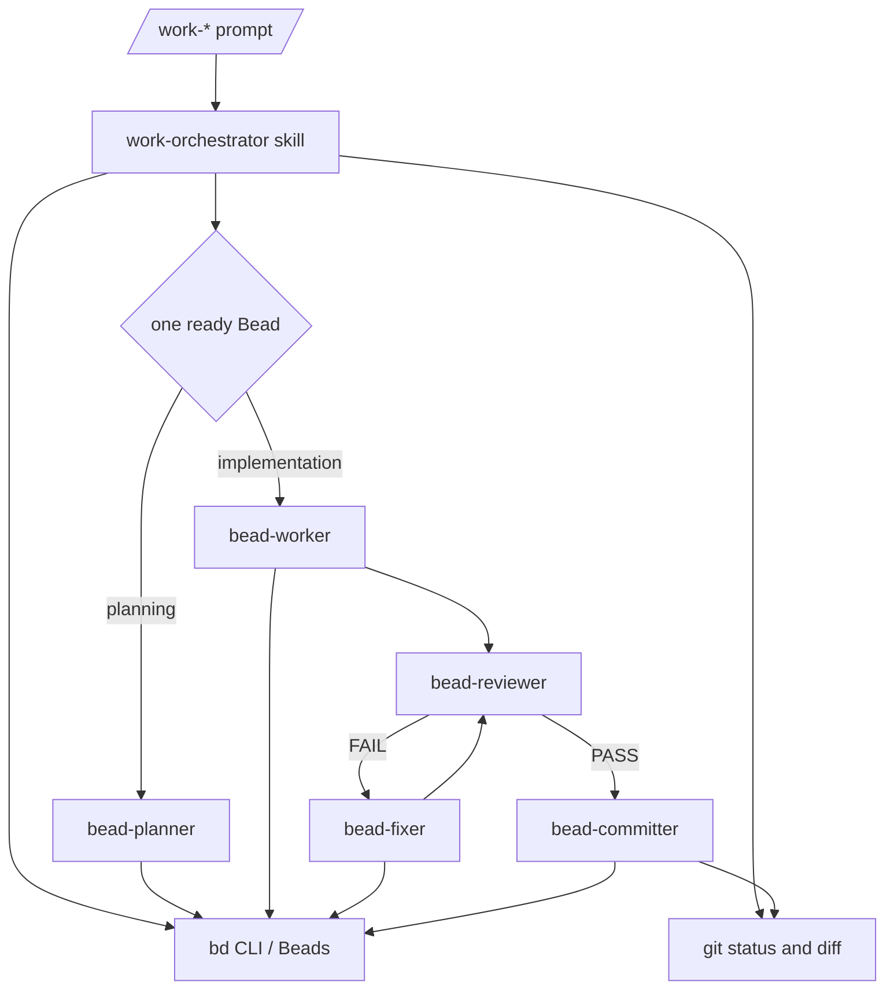

# feat: Build Beads-backed Pi work orchestrator package

## Summary

Build the MVP as a repo-local Pi package containing one shared `work-orchestrator` skill, thin `/work-*` prompt templates, five Beads role subagents, and a static verification script. The package should prove the Beads + git orchestration loop without a TypeScript extension or dashboard.

---

## Problem Frame

The requirements define a repeatable autonomous development workflow where short commands create or resume Beads-backed work, run one executable slice at a time, and finish with verification, review, commit, and Bead closure. The current repo only has the idea documents and requirements doc, so implementation starts by creating the package skeleton and encoding the workflow as durable Pi resources.

---

## Requirements

**Package shape and state authority**

- R1. The package exposes Pi resources for the work-orchestrator skill, `/work-*` prompt templates, and five role subagents, covering origin R23 and R24.
- R2. The package omits a TypeScript extension from the MVP manifest, preserving the origin decision to defer extension work.
- R3. The skill and role agents state that Beads owns work state and git owns code state, covering origin R1, R2, R3, and R4.

**Command workflows**

- R4. The prompt templates route `/work-small`, `/work-med`, `/work-big`, `/work-auto`, `/work-continue`, `/work-add`, `/work-pause`, and `/work-status` into the shared skill with the user's arguments preserved, covering origin R5 through R12.
- R5. The shared skill defines classification, Bead creation/update conventions, the continue loop, manual dirty-state handling, discovered work handling, and stop conditions, covering origin F1 through F6.
- R6. `/work-auto` asks before launching big or ambiguous work, covering origin R8 and AE2.

**Role boundaries**

- R7. `bead-planner` can mutate Beads through `bd` but must not edit source code, covering origin R13.
- R8. `bead-worker` and `bead-fixer` are the only source-writing roles and must not commit, covering origin R14 and R16.
- R9. `bead-reviewer` is source read-only and reports PASS or FAIL with evidence, covering origin R15 and AE4.
- R10. `bead-committer` gates status, diff, verification, commit, and Bead closure, covering origin R17 and AE5.

**Verification and portability**

- R11. Static verification checks the package manifest, prompt files, skill file, role-agent frontmatter, and deferred-extension invariant.
- R12. The package docs explain install, command usage, Beads expectations, and MVP limits without repo-specific behavior, covering origin R25.

---

## Key Technical Decisions

- **Use package resources only for MVP:** `package.json` should expose `pi.skills`, `pi.prompts`, and `pi.subagents.agents`; it should not expose `pi.extensions` until v2. This resolves the mismatch between the idea doc's optional extension text and its sample manifest.
- **Thin prompts, one shared skill:** Each prompt template should pass mode and user arguments into `work-orchestrator` instead of duplicating the loop. This keeps future workflow changes in one file.
- **Plain Beads conventions:** Use Beads issue type, parent, labels, dependencies, acceptance, design, and notes before custom metadata. The MVP label convention is `wo:planning`, `wo:implementation`, `wo:fix`, and `wo:decision`.
- **Static verification first:** A small Node script is enough for MVP confidence because most deliverables are package metadata and markdown resources. Disposable Beads repo testing stays as follow-up unless the prompt/agent MVP fails static checks.
- **Role permissions in both frontmatter and prose:** Agent frontmatter narrows visible tools, while role prompts still state behavioral limits because `bash` can mutate state outside tool visibility.

---

## High-Level Technical Design



The package is declarative: Pi loads the skill, prompt templates, and subagent role files; the parent agent executes the workflow using built-in tools and `pi-subagents`. Runtime state remains in Beads and git, so package files do not need their own database or cache.

---

## Output Structure

```text
.
├── package.json
├── README.md
├── .gitignore
├── agents/
│   ├── bead-planner.md
│   ├── bead-worker.md
│   ├── bead-reviewer.md
│   ├── bead-fixer.md
│   └── bead-committer.md
├── prompts/
│   ├── work-small.md
│   ├── work-med.md
│   ├── work-big.md
│   ├── work-auto.md
│   ├── work-continue.md
│   ├── work-add.md
│   ├── work-status.md
│   └── work-pause.md
├── scripts/
│   └── verify-package.mjs
└── skills/
    └── work-orchestrator/
        └── SKILL.md
```

---

## Implementation Units

### U1. Package skeleton and manifest

- **Goal:** Create the installable Pi package shell without enabling the deferred extension.
- **Requirements:** R1, R2, R12
- **Dependencies:** None
- **Files:**
  - `package.json`
  - `.gitignore`
  - `README.md`
  - `scripts/verify-package.mjs`
- **Approach:** Add a minimal package manifest with `pi.skills`, `pi.prompts`, and `pi.subagents.agents`; include peer dependencies for Pi packages and a `verify` script. Add `.pi-subagents/` to `.gitignore` so planning artifacts from delegated runs do not enter commits.
- **Patterns to follow:** Pi package manifest conventions from the package docs; package shape from `docs/orchestrator_idea.md`.
- **Test scenarios:**
  - Manifest exposes skills, prompts, and subagent agents, and the verification script reports all referenced paths exist.
  - Manifest does not expose an extension path, preserving the deferred-extension MVP boundary.
  - README documents install shape and command list without claiming push automation or dashboard support.
- **Verification:** Static package verification passes and `git status` shows only intended package files plus existing docs.

### U2. Shared work-orchestrator skill

- **Goal:** Encode the source-of-truth rules, command modes, Beads conventions, role loop, manual-change handling, and stop conditions once.
- **Requirements:** R3, R5, R6
- **Dependencies:** U1
- **Files:**
  - `skills/work-orchestrator/SKILL.md`
  - `scripts/verify-package.mjs`
- **Approach:** Write a skill with mode sections for small, medium, big, auto, continue, add, pause, and status. The skill should define the Beads label convention, require `bd prime`/workspace preflight, route one ready Bead at a time, and stop rather than guessing on dirty conflicts or human decisions.
- **Patterns to follow:** Beads workflow from the Beads skill; loop and stop conditions from `docs/orchestrator.md`; command definitions from `docs/orchestrator_idea.md`.
- **Test scenarios:**
  - Skill states Beads as work state and git as code state.
  - Skill defines the full continue loop including planning, worker, reviewer, fixer, committer, and repeat behavior.
  - Skill covers manual dirty-file classification and stop behavior for conflicts.
  - Skill makes `/work-auto` ask before big or ambiguous work.
- **Verification:** Static verification detects required mode headings, role names, stop conditions, and source-of-truth language.

### U3. Thin prompt templates

- **Goal:** Register short `/work-*` commands that route into the shared skill without duplicating workflow logic.
- **Requirements:** R4, R6
- **Dependencies:** U2
- **Files:**
  - `prompts/work-small.md`
  - `prompts/work-med.md`
  - `prompts/work-big.md`
  - `prompts/work-auto.md`
  - `prompts/work-continue.md`
  - `prompts/work-add.md`
  - `prompts/work-status.md`
  - `prompts/work-pause.md`
  - `scripts/verify-package.mjs`
- **Approach:** Give each prompt frontmatter for description and argument hints, then a compact body that instructs the agent to use `work-orchestrator` in the matching mode with `$ARGUMENTS` preserved. Avoid embedding the full orchestration loop in prompt files.
- **Patterns to follow:** Pi prompt-template frontmatter and argument substitution rules.
- **Test scenarios:**
  - Each prompt file has frontmatter with a description.
  - Each prompt names the shared skill and the intended mode.
  - Prompts that accept user text preserve `$ARGUMENTS`; status and pause handle empty arguments safely.
  - No prompt contains a copied full loop that can drift from the skill.
- **Verification:** Static verification confirms all eight prompts exist, have frontmatter, reference the skill, and preserve arguments where required.

### U4. Role subagent definitions

- **Goal:** Add the five `bead-*` role agents with narrow tool visibility and clear handoff contracts.
- **Requirements:** R7, R8, R9, R10
- **Dependencies:** U2
- **Files:**
  - `agents/bead-planner.md`
  - `agents/bead-worker.md`
  - `agents/bead-reviewer.md`
  - `agents/bead-fixer.md`
  - `agents/bead-committer.md`
  - `scripts/verify-package.mjs`
- **Approach:** Use subagent markdown frontmatter with stable names, project-context inheritance, Beads skill availability, and role-appropriate tool allowlists. Planner, reviewer, and committer omit `edit`/`write`; worker and fixer include them but forbid commits.
- **Patterns to follow:** Built-in `planner`, `worker`, and `reviewer` agent frontmatter shape; role boundaries from `docs/orchestrator_idea.md`.
- **Test scenarios:**
  - Planner allows Beads mutation via `bd` but states no source edits.
  - Worker and fixer allow source editing and state no commits.
  - Reviewer has no source mutation tools and states PASS/FAIL evidence output.
  - Committer has no source mutation tools and states commit-before-close ordering.
  - Every role says when to stop and contact the parent for a decision.
- **Verification:** Static verification confirms agent names, required role language, and forbidden tool combinations.

### U5. Verification hardening and package docs

- **Goal:** Make the MVP easy to check before installing and clear enough to use in a disposable Beads repo.
- **Requirements:** R11, R12
- **Dependencies:** U1, U2, U3, U4
- **Files:**
  - `scripts/verify-package.mjs`
  - `README.md`
  - `package.json`
- **Approach:** Finish the verification script so it validates manifest references, prompt routing, agent boundaries, and skill coverage. Finish README with install instructions, required companion packages, command table, MVP limits, and a suggested disposable-repo smoke test.
- **Patterns to follow:** Repo verification discipline in `AGENTS.md`: small named checks with actionable failures.
- **Test scenarios:**
  - Verification script prints labeled failures instead of opaque aggregate assertions.
  - README mentions `pi-subagents` as required and `pi-ask-user` as recommended.
  - README documents that Beads must be initialized in target repos.
  - README states extension, dashboard, push automation, and parallel writers are not in MVP.
- **Verification:** Package verification passes and README accurately matches implemented files.

---

## Acceptance Examples

- AE1. **Covers origin AE1.** Given only Beads and git state in a target repo, `/work-continue last` is documented to resolve active work from Beads first rather than chat memory.
- AE2. **Covers origin AE2.** Given `/work-auto` receives ambiguous work, the skill and prompt route require a confirmation before starting a big epic flow.
- AE3. **Covers origin AE3.** Given dirty git state exists before writer dispatch, the skill requires classification and stops on conflicts.
- AE4. **Covers origin AE4.** Given reviewer FAIL output, the skill routes only reviewer-identified issues to `bead-fixer` and then back to review.
- AE5. **Covers origin AE5.** Given review passes, the committer role commits before closing the Bead and scopes the commit to related files.
- AE6. **Covers origin AE6.** Given optional discovered work, the skill records it as a Bead with discovered context but does not block the active Bead unless it is a real dependency.

---

## Scope Boundaries

- No TypeScript extension in MVP.
- No custom TUI dashboard.
- No package-owned task database or markdown TODO ledger.
- No push automation by default.
- No parallel source-writing subagents in one checkout.
- No full disposable-Beads repo scenario test as part of the first package commit unless static verification exposes ambiguity that requires it.

---

## Risks & Dependencies

- **Prompt templates cannot force skill loading mechanically.** Mitigate by making each prompt explicitly instruct the parent agent to use the shared skill and by keeping the prompt bodies short.
- **Tool allowlists do not fully sandbox `bash`.** Mitigate with strict role prose, parent review, and committer gating; real enforcement can be a v2 extension or permission-system integration.
- **Static verification does not prove autonomous behavior.** Mitigate by documenting a disposable repo smoke test as the next validation step after package creation.
- **Beads schema details may differ across repos.** Mitigate by using core `bd` primitives first: types, parent, labels, deps, acceptance, design, and notes.

---

## Documentation / Operational Notes

- The README should show global local-path installation and mention that target repositories need Beads initialized.
- The README should state that users must install `pi-subagents` and should install `pi-ask-user` for better confirmation prompts.
- The package should be tested in this repo with static verification before installing globally.
- The first behavioral test should happen in a disposable Beads repo, not a real project.

---

## Sources & Research

- `docs/brainstorms/2026-07-02-work-orchestrator-requirements.md` is the origin requirements document.
- `docs/orchestrator.md` supplies the sample goal loop, source-of-truth contract, role responsibilities, and stop conditions.
- `docs/orchestrator_idea.md` supplies the package shape, command set, Beads model, role list, MVP build plan, non-goals, and open questions.
- `AGENTS.md` notes that `pi-subagents` is required for Compound Engineering subagent workflows and `pi-ask-user` is recommended.
- Pi package, skill, prompt-template, and subagent documentation shaped the manifest, resource layout, prompt frontmatter, and agent frontmatter decisions.
- Beads CLI help shaped the MVP convention around issue types, parent relationships, labels, dependencies, acceptance, design, and notes.
