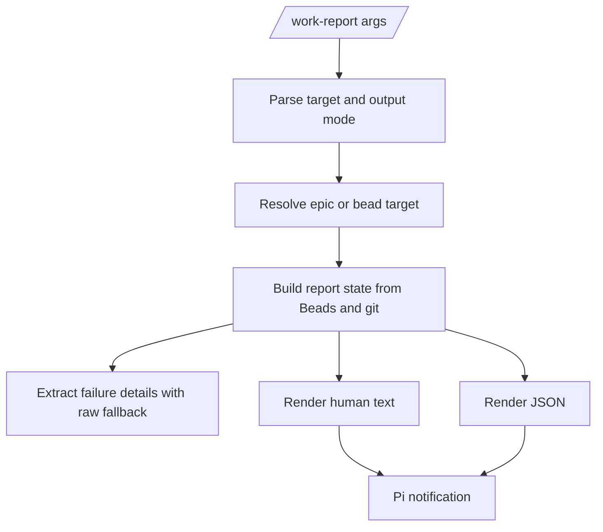

# feat: Add coded work report

## Summary

Add deterministic `/work-report` support to the Pi work-orchestrator extension. The report reads Beads and git directly, renders familiar blocker handoff text by default, and exposes optional JSON for later `/work-resume` automation.

---

## Problem Frame

`/work-status` already avoids an LLM turn for mechanical Beads/git summaries. `/work-report` still routes through prompt text even though blocker reports are mostly fixed-shape data: Bead hierarchy, dependencies, labels, notes, ready state, and git status. Moving this into code makes blocked-work handoff faster, repeatable, and cheaper in fresh sessions.

---

## Requirements

**Target resolution**

- R1. The coded report resolves explicit epic IDs, explicit non-epic Bead IDs, `last`, and empty targets without relying on chat memory. Covers origin R1-R4.
- R2. Explicit non-epic Bead IDs render focused bead reports, even when the Bead belongs to an epic. Covers origin R3 and R7.
- R3. Ambiguous default or `last` resolution returns candidate epics rather than guessing. Covers origin R2 and R4.

**Report state**

- R4. The report computes child status counts, ready work, in-progress work, blocked/debug-needed work, open decisions, and downstream blocked work from Beads JSON. Covers origin R5 and R6.
- R5. Dependency direction follows Beads semantics: the later Bead depends on the earlier Bead, so the earlier Bead blocks the later Bead. Covers origin R6, R7, and R12.
- R6. Sparse labels, dependency edges, bug Beads, decision Beads, and `wo:blocked` or `wo:debug-needed` labels are enough to surface blocked work. Covers origin R6, R7, and R12.
- R7. Git state includes branch/cleanliness from git and degrades to a warning if git is unavailable. Covers origin R5.

**Failure handoff**

- R8. Notes are parsed heuristically for common failure details such as commands, run IDs, artifacts, passed verification, blocker reason, and next action. Covers origin R8 and R10.
- R9. The report preserves raw note excerpts whenever parsing is incomplete or notes are malformed. Covers origin R8, R11, and R15.
- R10. Suggested debug commands prefer an existing linked bug/debug Bead when one exists, otherwise the failed or debug-needed Bead. Covers origin R7 and R10.

**Output modes**

- R11. Text output keeps recognizable sections: status, current blockers, downstream blocked, git, and suggested command. Covers origin R5-R8 and R16.
- R12. JSON output is produced from the same computed state as text output. Covers origin R13 and R14.
- R13. JSON output includes stable top-level fields for target, counts, blockers, downstream blocked work, open decisions, ready work, git, suggested commands, warnings, candidates, and raw note excerpts. Covers origin R13-R15.
- R14. The report is read-only and never mutates Beads or git. Covers origin R9.
- R15. Beads-unavailable and Beads-error states fail clearly in text mode and return parseable JSON errors in JSON mode. Covers origin R18.

**Package integration**

- R16. `/work-report` is registered as an extension command and becomes the primary path when the package is installed. Covers origin R17.
- R17. Documentation and verification checks reflect that report/status/context/model commands are coded extension behavior. Covers origin R16-R18.

---

## Key Technical Decisions

- **Shared state before renderers.** Build one report-state object and render text or JSON from it so the two modes cannot drift.
- **Focused bead mode for explicit non-epic targets.** A user asking for one Bead should get that Bead's blockers, dependents, notes, and suggested next action rather than an inferred epic report.
- **Heuristic notes with raw fallback.** Notes are not a schema today, so extraction is best-effort and the raw excerpt remains the source of truth when parsing fails.
- **Extension primary, prompt secondary.** The coded command should own `/work-report`; prompt documentation is retained only if Pi command precedence allows a harmless fallback, otherwise the prompt template is removed and package checks are updated.
- **Git warning, Beads failure.** Beads is mandatory for a work report; git enriches the handoff but can degrade to a visible warning like `/work-status`.

---

## High-Level Technical Design

The implementation should keep Beads reads, git reads, state construction, and rendering separated. The state object is the contract future `/work-resume` code can consume; text is only a view over that state.

---

## JSON Contract

JSON mode should emit one object with these stable top-level fields:

| Field | Purpose |
| --- | --- |
| `ok` | `true` for a complete report, `false` for parseable errors such as ambiguous or missing targets |
| `reason` | Machine-readable failure reason when `ok` is false |
| `target` | Requested target and resolved target kind |
| `epic` | Epic summary when the target belongs to an epic |
| `bead` | Focused bead summary for bead reports |
| `counts` | Child counts and blocker counts for epic reports |
| `blockers` | Current blocked/debug-needed Beads and extracted failure details |
| `downstreamBlocked` | Beads blocked by current blockers |
| `openDecisions` | Open decision Beads under the target epic |
| `readyWork` | Ready non-planning work related to the target epic |
| `git` | Branch, status text, and warnings |
| `suggestedCommands` | Suggested `/work-debug` or `/work-resume` commands |
| `rawNotes` | Raw excerpts or full note text when needed for handoff |
| `warnings` | Non-fatal issues such as git unavailable or sparse notes |
| `candidates` | Candidate epics for `ok:false` ambiguous-target responses |

Ambiguous target resolution should return `ok:false`, `reason:"ambiguous-target"`, and `candidates` with epic IDs, statuses, titles, and update dates. Beads setup failures should return `ok:false` with `reason:"beads-unavailable"` or `reason:"beads-error"` in JSON mode and a clear text error in text mode.

---

## Implementation Units

### U1. Add report target and state foundations

- **Goal:** Resolve report targets and normalize Beads/git data into a reusable state shape.
- **Requirements:** R1-R7, R14-R15
- **Dependencies:** None
- **Files:**
  - `extensions/work-models.js`
  - `scripts/verify-package.mjs`
  - `scripts/test-work-report.mjs`
- **Approach:** Extend the existing deterministic helper style used by `/work-status`. Add target parsing for text vs JSON mode, explicit epic vs focused bead detection, Beads field normalization for labels/notes/dependencies, dependency-direction helpers, stable ordering, and git warning handling.
- **Patterns to follow:** Reuse `run`, `bdJson`, `resolveEpic`, `childrenOf`, `readyIds`, and the small field-normalizer style already in `extensions/work-models.js`.
- **Test scenarios:**
  - Explicit epic ID resolves to an epic report state.
  - Explicit non-epic Bead ID resolves to focused bead report state.
  - Empty or `last` with one active epic resolves that epic.
  - Empty or `last` with no active epic falls back to latest not-completed epic candidates using Beads data.
  - Empty or `last` with multiple active or latest candidates returns candidates instead of guessing.
  - Unknown explicit target returns a parseable error.
  - No resolvable default target returns a parseable empty-state error.
  - Dependency direction identifies earlier Beads as blockers and later Beads as downstream blocked work.
  - Beads unavailable or invalid Beads JSON produces a clear text failure and JSON `ok:false` response.
  - Git unavailable adds a warning without preventing Beads-based report state.
- **Verification:** A fake-command test exercises target resolution, dependency direction, sort order, and git warning behavior without requiring a live Beads workspace.

### U2. Extract blocker and failure details from current Beads notes

- **Goal:** Summarize common blocker details while preserving raw notes as the fallback source of truth.
- **Requirements:** R6, R8-R10, R13
- **Dependencies:** U1
- **Files:**
  - `extensions/work-models.js`
  - `scripts/test-work-report.mjs`
- **Approach:** Add a small note extractor that looks for command-like text, run/artifact IDs, known failure phrases, passed verification phrases, and next-action language. Keep fixed excerpt limits for text output and preserve fuller note content in JSON where available. Do not require new structured note markers.
- **Patterns to follow:** Keep parsing boring and local. Prefer deterministic regex/string extraction plus fallback over LLM-like summarization.
- **Test scenarios:**
  - CMake compiler blocker notes extract command, reason, run IDs, passed Python verification, and next action.
  - Sparse notes still render a blocked item from labels/dependencies.
  - Malformed notes preserve a raw excerpt in text mode.
  - JSON mode includes raw note material for sparse or malformed cases.
  - Existing linked bug/debug Bead is preferred for suggested debug commands.
  - A failed/debug-needed Bead without a linked bug suggests debugging the failed Bead.
- **Verification:** Note extraction tests prove no blocker detail disappears when heuristics fail.

### U3. Render text and JSON reports from shared state

- **Goal:** Produce recognizable human reports and stable JSON without duplicate state logic.
- **Requirements:** R4-R15
- **Dependencies:** U1, U2
- **Files:**
  - `extensions/work-models.js`
  - `scripts/test-work-report.mjs`
- **Approach:** Implement `renderWorkReportText` and `renderWorkReportJson` over the same state object. Text mode should mirror current report sections. JSON mode should emit the v1 contract fields and represent ambiguity or missing targets as parseable objects.
- **Patterns to follow:** Match the deterministic string-building style of `buildWorkStatus` while keeping report-state construction separate from rendering.
- **Test scenarios:**
  - Epic text report includes status, current blockers, downstream blocked work, git, and suggested command.
  - Focused bead text report includes direct blockers, dependents, note details, and suggested command.
  - JSON and text reports are built from the same state for a blocked epic fixture.
  - Ambiguous target in JSON mode returns `ok:false`, `reason:"ambiguous-target"`, and candidates.
  - Beads-unavailable in JSON mode returns `ok:false`, `reason:"beads-unavailable"`, and a readable message.
  - Sort ties are deterministic by date, ID, and title.
- **Verification:** Snapshot-like behavior tests assert text section presence and JSON key stability.

### U4. Register `/work-report` and update package docs/checks

- **Goal:** Make coded `/work-report` the installed command path and keep package documentation honest.
- **Requirements:** R16-R17
- **Dependencies:** U3
- **Files:**
  - `extensions/work-models.js`
  - `prompts/work-report.md`
  - `README.md`
  - `skills/work-orchestrator/SKILL.md`
  - `scripts/verify-package.mjs`
  - `package.json`
- **Approach:** Register `work-report` beside `work-status`. Update docs to state that report is deterministic extension behavior. Resolve the prompt-template conflict by either removing the prompt and updating package checks, or keeping it only when verified harmless as a fallback. Extend package verification to check command registration, report builder symbols, JSON mode, raw-note fallback coverage, and execution of the fixture behavior test.
- **Patterns to follow:** `/work-status` is the closest command ownership pattern; it has extension code instead of a prompt template.
- **Test scenarios:**
  - Package verification fails if `work-report` command registration is absent.
  - Package verification covers the report builder, JSON mode, and raw-note fallback strings.
  - `npm run verify` runs the fixture behavior test or invokes it through `scripts/verify-package.mjs`.
  - Prompt-template count and README wording match the final command ownership decision.
  - `/work-report --json` argument parsing is documented and tested.
- **Verification:** `npm run verify` passes and the test script demonstrates report behavior from fixtures.

---

## Scope Boundaries

- Deterministic `/work-resume` selection and execution are deferred to follow-up work that can consume the JSON state.
- Structured failure-note markers are deferred; v1 must work with current unstructured notes.
- Active subagent coordination is deferred unless a cheap local source already exists during implementation.
- The report stays read-only and must not create, close, label, or reorder Beads.
- Role agents remain responsible for implementation, review, debugging, and commit gates.

---

## Risks & Dependencies

- **Pi command precedence may conflict with the existing prompt template.** Mitigate by verifying extension command behavior during implementation and updating the prompt/checks accordingly.
- **Beads JSON shape may vary across versions.** Mitigate with field normalization and tests covering common aliases for labels, notes, dependencies, and parent fields.
- **Heuristic note parsing can be wrong.** Mitigate by treating extracted fields as convenience and always preserving raw note fallback.
- **Dependency direction errors would create harmful handoffs.** Mitigate with explicit tests for Beads `later depends on earlier` semantics.

---

## Documentation / Operational Notes

- Update `README.md` command table and mental model so `/work-report` is described like `/work-status`: deterministic, coded, and no model turn for normal use.
- Update `skills/work-orchestrator/SKILL.md` so LLM report mode prefers the extension command and only describes fallback behavior.
- Keep user-facing examples focused on blocked-epic and focused-bead handoffs.

---

## Sources / Research

- Origin requirements: `docs/brainstorms/2026-07-03-coded-work-report-requirements.md`
- Existing deterministic command pattern: `extensions/work-models.js`
- Current report prompt: `prompts/work-report.md`
- Current report skill behavior: `skills/work-orchestrator/SKILL.md`
- Package verification: `scripts/verify-package.mjs`
- Package documentation: `README.md`
