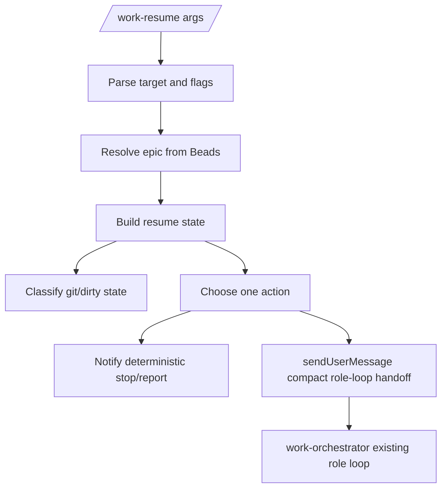

# feat: Add coded work resume resolver

## Summary

Convert the deterministic front half of `/work-resume` into extension code: target resolution, Beads/git state building, ready-Bead selection, blocker reporting, and compact handoff to the existing role loop. The coded command should make the same decision every time from Beads and git, then let the existing skill/subagent path execute the selected Bead.

---

## Problem Frame

`/work-report` now proves the package can compute blocker state without an LLM turn. `/work-resume` still asks the model to rediscover mechanical state before it can decide whether to run a worker, planner, debugger, or stop with a blocker. That wastes time and creates drift in exactly the place where the orchestrator promises fresh-session recovery from Beads and git.

This plan does not move role execution into TypeScript. The next useful conversion is smaller: code the resume resolver and action planner, then hand the chosen action to the current `work-orchestrator` skill with a compact, precomputed payload.

---

## Requirements

**Resume state**

- R1. `/work-resume [epic-id|last]` and `/work-continue [epic-id|last]` resolve explicit, empty, and `last` targets from Beads, not chat memory. Covers origin R3, R9, and R12.
- R2. Ambiguous targets return candidate epics with ID, status, created date, updated date, child counts, and one-line title instead of guessing. Covers origin R9.
- R3. The resolver computes ready, in-progress, planning, blocked/debug-needed, open decision, and closed child state from Beads JSON. Covers origin R1, R3, R9, R12, and the coded report JSON handoff.
- R4. Git status, related dirty files, and known benign instruction-file dirt are included in the resume state before any writer action is launched. Covers origin R2, R18-R20.

**Action selection**

- R5. The action planner picks exactly one non-planning ready Bead when one is available, preferring unblocking debug bugs over ordinary implementation slices. Covers origin R9, R14-R17, and current resume loop step 4.
- R6. Ready planning Beads are selected only when no executable ready Bead should run, and stale planning Beads are reported for closure when executable children already exist. Covers current resume loop steps 3, 5, and 7.
- R7. If no runnable Bead exists, blocked/debug-needed children, open decisions, or unmet dependencies produce a report-style stop rather than repeated resume attempts. Covers origin R22 and coded report requirements R6-R12.
- R8. If no runnable Bead and no blocker explains the gap, the resolver recommends or kicks the planner-slicing path rather than declaring the epic done. Covers origin R9 and current resume loop step 5.
- R9. The resolver never chooses `wo:blocked` work for normal resume; blocked/debug-needed Beads route through `/work-report` or `/work-debug` guidance. Covers current blocker lifecycle.

**Execution handoff**

- R10. The extension command emits a stable JSON-like resume state and a concise human summary before handing off to the LLM role loop. Covers origin R3 and coded report requirements R13-R15.
- R11. For safe runnable actions, the command injects a compact follow-up message that tells `work-orchestrator` which epic, Bead, role path, dirty-file classification, and precomputed state to use. Covers origin R14-R17 while keeping role agents unchanged.
- R12. For unsafe actions, such as dirty-file conflict, no Beads workspace, ambiguous target, or blocker-only state, the command stops with a deterministic message and does not launch agents. Covers origin R18-R22.
- R13. The coded resolver is read-only except for optional session message injection; it does not claim, close, create, label, stage, or commit Beads/files. Covers origin R1-R2.

**Package integration**

- R14. `/work-resume` and `/work-continue` are registered extension commands when the package is loaded, with prompt templates retained only as harmless fallbacks if command precedence permits. Covers origin R23-R25.
- R15. Package verification and fixture tests cover target resolution, action selection, dirty-gate stops, and generated handoff prompts. Covers the live/test feedback rule.

---

## Key Technical Decisions

- **Resolver first, executor later.** Code the deterministic resume state and action choice now; keep subagent execution in the existing skill path until that handoff is stable.
- **Reuse report state, do not fork a second Beads model.** The resume resolver should consume or share the same normalized issue helpers, dependency semantics, note extraction, and git report used by `/work-report`.
- **Stop on unsafe dirt.** Version one may auto-allow only clean trees and known benign instruction-file whitespace. Any other dirty state becomes a clear stop so the model does not mix unrelated work.
- **One selected action per invocation.** The extension should not loop over multiple Beads. After one role handoff or one planning boundary, stop with the next `/work-resume <epic-id>` command.
- **Message injection is a bridge.** `ctx.sendUserMessage` is the smallest way to keep `/work-resume` behavior while removing state rediscovery; direct subagent orchestration can wait.

---

## High-Level Technical Design

The extension owns the deterministic resume decision. The existing skill remains the executor for planner, worker, reviewer, fixer, debugger, and committer loops.

---

## Resume Action Contract

The coded action planner should return one object shaped for tests and future automation:

| Field | Purpose |
| --- | --- |
| `ok` | `true` when the target resolved and a deterministic action was computed |
| `reason` | Machine-readable stop reason when `ok:false` |
| `target` | Requested target plus resolved epic ID |
| `epic` | Epic summary |
| `counts` | Ready, planning, in-progress, blocked, decisions, closed, total slices |
| `git` | Branch/status text, dirty files, warnings |
| `action` | `run-debug`, `run-implementation`, `run-planner`, `close-stale-planning`, `report-blocked`, `ask-target`, `dirty-stop`, `done-candidate`, or `beads-error` |
| `selectedBead` | Bead summary for runnable actions |
| `blockers` | Report-compatible blockers when stopped |
| `handoffPrompt` | Compact prompt only for actions that should continue through the LLM skill path |
| `suggestedCommands` | Human next commands for stop states |
| `warnings` | Non-fatal state issues |

---

## Implementation Units

### U1. Factor shared Beads/git state for report and resume

- **Goal:** Make report and resume use the same issue normalization, dependency semantics, note detail extraction, and git status helpers.
- **Requirements:** R3-R4, R10, R13
- **Dependencies:** None
- **Files:**
  - `extensions/work-models.js`
  - `scripts/test-work-report.mjs`
  - `scripts/test-work-resume.mjs`
  - `scripts/verify-package.mjs`
- **Approach:** Extract small shared helpers for child summaries, open blockers, ready eligibility, planning Beads, and git status. Preserve `/work-report` output while making the resume state builder consume the same primitives.
- **Patterns to follow:** `buildWorkReportState`, `buildEpicReportState`, `labelsOf`, `depsOf`, `noteDetails`, and `gitReport` in `extensions/work-models.js`.
- **Test scenarios:**
  - Existing `/work-report` fixture behavior stays unchanged.
  - Shared dependency filtering still ignores parent-child edges.
  - Shared blocker detection still surfaces `wo:blocked`, `wo:debug-needed`, bug Beads, decisions, and unmet dependencies.
  - Git unavailable remains a warning for reports and a resume stop only when writer handoff would be unsafe.
- **Verification:** `node scripts/test-work-report.mjs` and the new resume fixture test pass before behavior is changed.

### U2. Add coded resume target resolution and state builder

- **Goal:** Resolve the target epic and compute resume-ready state without invoking the LLM.
- **Requirements:** R1-R4, R10, R12-R13
- **Dependencies:** U1
- **Files:**
  - `extensions/work-models.js`
  - `scripts/test-work-resume.mjs`
- **Approach:** Add `parseWorkResumeArgs`, `resolveResumeTarget`, and `buildWorkResumeState`. Reuse `resolveEpic` behavior where correct, but include richer candidate metadata and child counts needed by resume. Keep all Beads failures parseable as state objects.
- **Patterns to follow:** `parseWorkReportArgs`, `resolveReportTarget`, `childrenOfRequired`, and `buildWorkStatus` target behavior.
- **Test scenarios:**
  - Explicit epic ID resolves to that epic.
  - Empty target with one active epic resolves it.
  - `last` with multiple active epics returns candidates instead of guessing.
  - Latest not-completed epic with ready descendants is chosen when no in-progress epic exists.
  - No Beads workspace returns `ok:false` with `reason:"beads-unavailable"`.
  - Unknown explicit target returns `ok:false` with `reason:"unknown-target"`.
  - Candidate output includes child counts and updated dates.
- **Verification:** Fake `bd` command tests cover all target-resolution branches.

### U3. Implement deterministic resume action selection

- **Goal:** Choose exactly one safe next action from the resume state.
- **Requirements:** R5-R9, R12-R13
- **Dependencies:** U2
- **Files:**
  - `extensions/work-models.js`
  - `scripts/test-work-resume.mjs`
- **Approach:** Add a pure `planResumeAction(state)` helper. Prefer ready `wo:debug` bug Beads that unblock failed work, then ready implementation Beads, then planning Beads. If only blockers remain, return a report-blocked action with report-compatible blocker details. If no blockers explain the gap, return a planner-slicing action.
- **Patterns to follow:** Current `Mode: resume` loop in `skills/work-orchestrator/SKILL.md` and suggested command behavior from `buildWorkStatus`/`buildWorkReportState`.
- **Test scenarios:**
  - Ready debug bug is selected before ready implementation work.
  - Ready implementation slice is selected before ready planning work.
  - Ready planning Bead is selected when no executable ready Bead exists.
  - Stale planning Bead with executable children returns `close-stale-planning` guidance.
  - `wo:blocked` Bead is never selected by normal resume.
  - Open decision or unmet dependency returns `report-blocked` with suggested `/work-report` or `/work-debug` command.
  - No ready work and no blockers returns planner-slicing guidance.
  - Closed epic returns `done-candidate` rather than launching work.
- **Verification:** Unit-style fixture tests assert the action object, not just rendered text.

### U4. Add safe dirty-gate and handoff prompt generation

- **Goal:** Stop unsafe writer launches and generate compact executor prompts for safe actions.
- **Requirements:** R4, R10-R13
- **Dependencies:** U3
- **Files:**
  - `extensions/work-models.js`
  - `scripts/test-work-resume.mjs`
- **Approach:** Parse `git status --porcelain=v1 --untracked-files=all` into clean, benign instruction-file whitespace, or dirty-stop states. Generate a compact handoff prompt for `run-debug`, `run-implementation`, and `run-planner` actions that includes epic ID, selected Bead ID, action kind, acceptance/notes excerpts, dirty allowlist, and the instruction-file whitespace startup allowlist.
- **Patterns to follow:** Worktree hygiene gate text in `skills/work-orchestrator/SKILL.md` and existing `gitReport` degradation behavior.
- **Test scenarios:**
  - Clean git state allows handoff prompt generation.
  - Unknown dirty file returns `dirty-stop` and no handoff prompt.
  - Benign instruction-file whitespace can be represented as an allowlist, but is not silently staged or committed.
  - Handoff prompt includes only the selected Bead, not the whole epic notes blob.
  - Handoff prompt names the known-unrelated dirty allowlist when present.
- **Verification:** Fixture tests compare generated handoff prompts for stable key phrases and absence of unrelated Bead content.

### U5. Register coded `/work-resume` and `/work-continue`

- **Goal:** Make the extension command own resume preflight and delegate only safe actions to the existing skill loop.
- **Requirements:** R10-R15
- **Dependencies:** U4
- **Files:**
  - `extensions/work-models.js`
  - `prompts/work-resume.md`
  - `prompts/work-continue.md`
  - `README.md`
  - `skills/work-orchestrator/SKILL.md`
  - `scripts/verify-package.mjs`
- **Approach:** Register `work-resume` and `work-continue` beside `work-status` and `work-report`. The handler renders the deterministic summary for stop states. For safe runnable states, it notifies the chosen action and calls `ctx.sendUserMessage(handoffPrompt, { deliverAs: "followUp" })` so the normal skill/subagent execution continues with precomputed state. Update prompts only as fallback documentation if they remain installed.
- **Patterns to follow:** Extension command registration for `/work-report`; Pi extension docs for `ctx.sendUserMessage`; prompt fallback style in `prompts/work-resume.md`.
- **Test scenarios:**
  - Package verification fails if `registerCommand("work-resume"` or `registerCommand("work-continue"` is absent.
  - Command handler does not inject a follow-up for ambiguous, blocked, dirty-stop, or Beads-error states.
  - Command handler injects one follow-up for safe runnable actions.
  - `/work-continue` uses the same resolver and action planner as `/work-resume`.
  - README command table states that resume preflight is deterministic extension behavior while role execution still uses agents.
- **Verification:** `npm run verify` runs report and resume fixture tests and passes.

---

## Scope Boundaries

### In scope

- Deterministic resume target resolution.
- Deterministic selection of one next resume action.
- Dirty-gate stop behavior before writer handoff.
- Compact handoff prompts into the existing work-orchestrator role loop.
- Text and JSON-ish state for tests and future automation.

### Deferred to Follow-Up Work

- Direct TypeScript orchestration of subagents without an LLM handoff.
- Direct Beads mutation from the extension for claim/close/planning cleanup.
- Full automatic dirty-file classification beyond clean/benign/stop.
- Multi-Bead loops in one `/work-resume` invocation.
- Push or PR automation.

### Out of scope

- Replacing role agents.
- Replacing `ce-debug`, `ce-plan`, or `ce-compound`.
- Adding a database beyond Beads.
- Repo-specific RFLib behavior.

---

## Risks & Dependencies

- **Command precedence can hide prompt templates.** Mitigate by making the extension command complete and keeping prompts only as fallback docs when harmless.
- **Message injection could create double execution.** Mitigate by injecting follow-up only for safe runnable actions and testing stop states for no injection.
- **Dirty-file heuristics can be unsafe.** Mitigate by stopping on anything except clean or narrowly recognized instruction-file whitespace.
- **Duplicating report state can drift.** Mitigate by factoring shared helpers before adding resume behavior.
- **Planner gap detection can be too confident.** Mitigate by returning planner-slicing guidance rather than declaring completion unless the closed/done state is explicit.

---

## Documentation / Operational Notes

- Update `README.md` to explain the new split: coded resume preflight chooses the next action; existing role agents still perform implementation/review/fix/commit.
- Update `skills/work-orchestrator/SKILL.md` so resume mode honors precomputed extension state and avoids rediscovering Beads/git context.
- Keep examples focused on fresh-session resume, blocked epic stop, and one safe runnable Bead.

---

## Sources / Research

- Origin requirements: `docs/brainstorms/2026-07-02-work-orchestrator-requirements.md`
- Follow-up source: `docs/brainstorms/2026-07-03-coded-work-report-requirements.md`
- Prior conversion plan: `docs/plans/2026-07-03-001-feat-coded-work-report-plan.md`
- Current deterministic command implementation: `extensions/work-models.js`
- Current resume behavior: `skills/work-orchestrator/SKILL.md`
- Current resume prompt fallback: `prompts/work-resume.md`
- Package verification: `scripts/verify-package.mjs`
