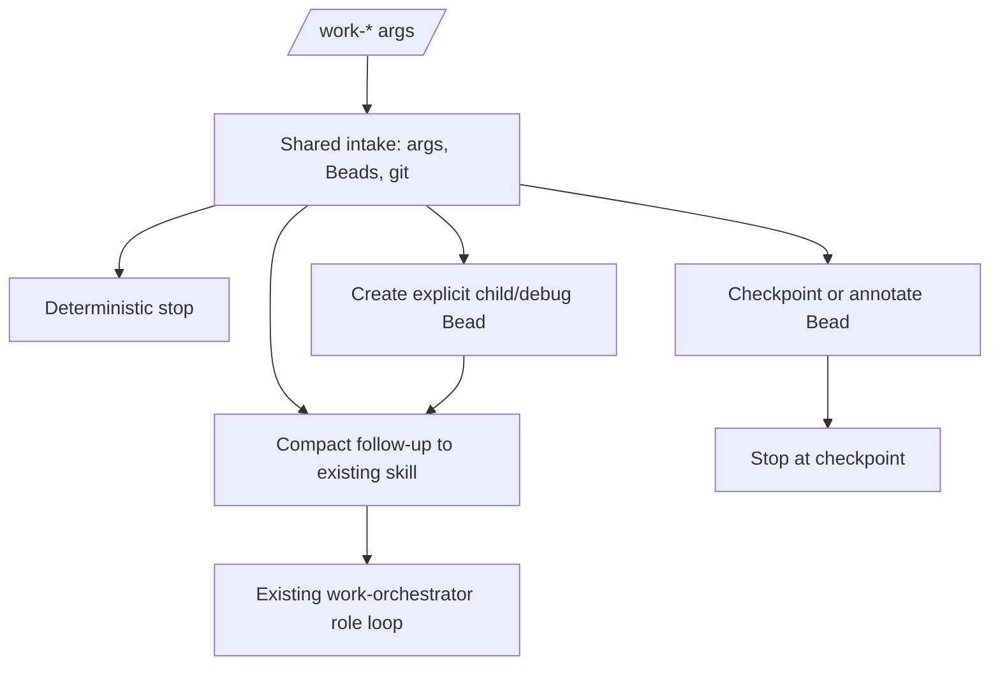

# feat: Codify workflow intake and checkpoints

## Summary

Codify the next mechanical `/work-*` steps in the Pi work-orchestrator extension: shared intake/preflight state, `/work-pause` checkpoints, `/work-debug` target normalization, safe `/work-add` intake, and conservative `/work-auto` guardrails. Role agents remain the executors; the extension only computes state, writes unambiguous Beads updates, and hands off compact prompts when safe.

---

## Problem Frame

`/work-status`, `/work-report`, `/work-resume`, and `/work-continue` now prove that fixed Beads/git decisions do not need an LLM turn. The remaining prompt-driven commands still repeat mechanical work: checking Beads availability, resolving active epics, classifying git dirt, parsing explicit Bead targets, and producing checkpoint notes.

The useful next step is not a full TypeScript orchestrator. The package should codify the parts that are deterministic and keep semantic planning, implementation, review, debugging, and committing in the current skill/subagent loop.

---

## Requirements

**Shared intake and safety**

- R1. Mechanical `/work-*` preflight must read Beads and git directly, without relying on chat memory. Covers origin R1-R3.
- R2. Writer-capable commands must classify git dirt before launching agents or mutating Beads. Covers origin R18-R20.
- R3. Unknown, staged, untracked, or substantive instruction-file dirt must stop writer handoff unless the command is read-only. Covers origin R18-R20.
- R4. Beads-unavailable, ambiguous epic, missing task text, and unsupported target states must produce deterministic stop messages. Covers origin R3, R9, R12, and R22.

**Checkpoint and debug intake**

- R5. `/work-pause [note]` must write a durable checkpoint note with current Bead/epic context, git state, changed files, last verification, failures, remaining work, optional user note, and suggested next command. Covers origin R3, R4, R11, and R22.
- R6. `/work-pause` must not create speculative work or launch role agents. Covers origin R11 and R22.
- R7. `/work-debug <bug-or-bead-id|symptom[: guidance]>` must normalize explicit Bead targets, follow existing debug-needed links when present, and avoid duplicate bug Beads when a suitable debug Bead already exists. Covers origin R4, R21, and R22.
- R8. `/work-debug` may create or annotate a bug Bead only when the target and parent epic are unambiguous. Covers origin R1, R4, R21, and R22.

**Add and auto guardrails**

- R9. `/work-add [--epic <id>] [--blocked-by <bead-id>] <task>` must create a child Bead under the resolved active or explicit epic when the task text and target epic are unambiguous. Covers origin R10 and R21.
- R10. `/work-add` must add dependencies only for explicit `--blocked-by` targets; it must not infer blocking relationships from prose. Covers origin R10 and R21.
- R11. `/work-auto <task>` must apply deterministic guardrails for empty input and explicit blocked/debug-needed Bead IDs, then hand semantic size classification to the existing skill path. Covers origin R8.
- R12. All coded command paths must remain repo-agnostic and avoid RFLib-specific behavior. Covers origin R23-R25.

**Package integration and tests**

- R13. New coded commands must follow the existing state-builder/renderer/handler pattern used by report and resume.
- R14. Fixture tests must cover happy paths, stop states, dirty gates, Beads failures, and no-handoff safety for every new coded command.
- R15. Documentation must state which part is deterministic extension behavior and which part still runs through role agents.

---

## Key Technical Decisions

- **Codify intake, not execution.** The extension owns target resolution, dirty gates, checkpoint notes, and compact handoffs; role agents still perform planning, implementation, debugging, review, fixing, and commit gates.
- **One shared preflight contract.** New commands should reuse the same Beads/git normalization and dirty-state classification instead of re-implementing it per command.
- **Mutate Beads only for unambiguous bookkeeping.** `/work-pause`, `/work-add`, and `/work-debug` may append notes or create explicit Beads, but must stop rather than guessing parents, dependencies, or work type.
- **Conservative `/work-auto`.** Semantic size classification stays with the skill. The extension only rejects empty input and routes explicit blocked/debug-needed Bead targets to the debug intake path.
- **Keep the package boring.** No dashboard, separate database, push automation, branch switching, parallel writers, or multi-Bead loop is added by this plan.

---

## High-Level Technical Design

The extension computes whether a command is safe and mechanical. If the next step needs judgment or source edits, it sends a compact follow-up into the existing `work-orchestrator` skill rather than executing the role loop itself.

---

## Implementation Units

### U1. Factor shared workflow intake state

- **Goal:** Provide one reusable intake/preflight contract for remaining coded commands.
- **Requirements:** R1-R4, R12-R14
- **Dependencies:** None
- **Files:**
  - `extensions/work-models.js`
  - `scripts/test-work-intake.mjs`
  - `scripts/test-work-resume.mjs`
  - `scripts/verify-package.mjs`
- **Approach:** Extract shared helpers for Beads availability, active epic resolution, explicit Bead lookup, child state, git dirty classification, benign instruction-file whitespace, and common stop rendering. Keep the implementation in the existing extension file unless the helper surface becomes painful to test; do not introduce a framework or state database.
- **Patterns to follow:** `buildWorkResumeState`, `resumeGitReport`, `resolveResumeTarget`, `buildEpicChildState`, and fake `bd`/`git` fixtures in `scripts/test-work-resume.mjs`.
- **Test scenarios:**
  - Clean git plus one in-progress epic returns a safe intake state.
  - No Beads workspace returns a parseable Beads-unavailable state.
  - Multiple active epics return candidates and no handoff.
  - Unknown dirty file returns an unsafe dirty-stop state.
  - Whitespace-only tracked instruction-file dirt is classified as benign; substantive, staged, or untracked instruction-file dirt is unsafe.
  - Existing `/work-resume` and `/work-report` fixture tests still pass after helper extraction.
- **Verification:** Shared intake tests pass and existing coded report/resume behavior is unchanged.

### U2. Add coded `/work-pause` checkpointing

- **Goal:** Make pause a deterministic Beads checkpoint instead of a model-written note.
- **Requirements:** R1-R6, R12-R15
- **Dependencies:** U1
- **Files:**
  - `extensions/work-models.js`
  - `scripts/test-work-pause.mjs`
  - `prompts/work-pause.md`
  - `README.md`
  - `skills/work-orchestrator/SKILL.md`
  - `scripts/verify-package.mjs`
- **Approach:** Resolve the active epic and current in-progress or selected Bead when possible. Build a compact checkpoint note from git status, changed files, optional user note, last verification, failures, remaining work, current blockers, and suggested next command. Append it to the relevant Bead when unambiguous; otherwise render the note draft and stop without mutation.
- **Patterns to follow:** `noteDetails` for note extraction style, `buildWorkStatus` for concise status text, and Beads source-of-truth rules in `skills/work-orchestrator/SKILL.md`.
- **Test scenarios:**
  - One active epic with one in-progress Bead appends a checkpoint note to that Bead.
  - Explicit user note appears in the appended checkpoint.
  - Dirty files are listed as paths, not parsed from human diff summaries.
  - Last verification, failures, remaining work, and suggested next command appear when known.
  - Ambiguous active epics render candidates and do not append a note.
  - No in-progress Bead under an otherwise clear active epic renders a checkpoint draft and does not mutate Beads.
  - Beads command failure returns a parseable stop and does not launch agents.
- **Verification:** Pause fixture tests prove note content, mutation/no-mutation branches, and no follow-up handoff for checkpoint-only states.

### U3. Add coded `/work-debug` target resolver

- **Goal:** Normalize debug targets and create or reuse debug Beads before handing off to the debugger role.
- **Requirements:** R1-R4, R7-R8, R12-R15
- **Dependencies:** U1
- **Files:**
  - `extensions/work-models.js`
  - `scripts/test-work-debug.mjs`
  - `prompts/work-debug.md`
  - `README.md`
  - `skills/work-orchestrator/SKILL.md`
  - `scripts/verify-package.mjs`
- **Approach:** Parse `<bug-or-bead-id|symptom[: guidance]>` without losing colons inside guidance. If the target is an implementation Bead with a `debug-needed:<bug-id>` marker, resolve that bug Bead. If a matching open debug bug already blocks the target, reuse it. If the user supplies a symptom without a Bead ID, create a bug Bead only when one active epic is clear; otherwise stop with candidates. Safe states hand a compact prompt to `bead-debugger` through the existing skill loop.
- **Patterns to follow:** `withHandoffPrompt`, `suggestedCommands`, and the debug lifecycle in `skills/work-orchestrator/SKILL.md`.
- **Test scenarios:**
  - Explicit bug Bead target hands that bug to the debug role.
  - Implementation Bead with `debug-needed:<bug-id>` follows the linked bug.
  - Existing open debug bug dependency is reused instead of creating a duplicate.
  - Guidance after the first colon is preserved and appended to the debug context.
  - Symptom-only debug request creates a bug under the single active epic.
  - Ambiguous epic, unknown Bead, unsafe dirty state, or Beads failure stops without creating a bug or launching a handoff.
- **Verification:** Debug fixture tests assert target choice, bug creation/reuse, guidance preservation, and no duplicate debug Beads.

### U4. Add coded `/work-add` safe intake

- **Goal:** Create explicit new work under the current epic without asking the model to rediscover parent state.
- **Requirements:** R1-R4, R9-R10, R12-R15
- **Dependencies:** U1
- **Files:**
  - `extensions/work-models.js`
  - `scripts/test-work-add.mjs`
  - `prompts/work-add.md`
  - `README.md`
  - `skills/work-orchestrator/SKILL.md`
  - `scripts/verify-package.mjs`
- **Approach:** Accept `--epic <id>`, `--blocked-by <bead-id>`, and remaining task text. Resolve the active or explicit epic. Create one child task Bead with `discovered-from` context when a current Bead is known. Add a dependency only when the user provides `--blocked-by`; otherwise leave dependency judgment to the role loop or human.
- **Patterns to follow:** Beads dependency direction rules from `skills/work-orchestrator/SKILL.md` and candidate rendering from resume/report stop states.
- **Test scenarios:**
  - Task text plus one active epic creates one child Bead under that epic.
  - Empty task text returns a deterministic usage stop.
  - `--epic <id>` is honored when active epic resolution is ambiguous.
  - `--blocked-by <bead-id>` adds a dependency in the correct direction.
  - No blocker target creates no dependency.
  - Unsafe dirty state stops before creating a Bead.
  - Beads creation failure returns the native failure text in the stop state.
- **Verification:** Add fixture tests prove created Bead arguments, dependency direction, and no mutation on unsafe states.

### U5. Add conservative coded `/work-auto` guardrails

- **Goal:** Remove empty-input and explicit-Bead prompt failures from auto mode while leaving semantic classification to the skill.
- **Requirements:** R1-R4, R11-R15
- **Dependencies:** U1, U3
- **Files:**
  - `extensions/work-models.js`
  - `scripts/test-work-auto.mjs`
  - `prompts/work-auto.md`
  - `README.md`
  - `skills/work-orchestrator/SKILL.md`
  - `scripts/verify-package.mjs`
- **Approach:** Add a coded handler that rejects empty input and routes explicit blocked/debug-needed Bead IDs through debug target normalization. All prose-only requests, including failing-test language, migration-like text, and ordinary feature text, pass to the existing `Mode: auto` skill path unchanged, optionally with a non-binding hint in the handoff payload. Do not implement size or migration classification in code.
- **Patterns to follow:** `handleWorkResumeCommand` for safe follow-up injection and `Mode: auto` classification boundaries in `skills/work-orchestrator/SKILL.md`.
- **Test scenarios:**
  - Empty auto input returns usage guidance and sends no follow-up.
  - Text containing an explicit blocked/debug-needed Bead routes through debug target normalization.
  - Failing-test or stack-trace prose without a Bead ID is handed to the existing skill path unchanged.
  - Plan/TODO/branch-source prose is handed to the existing skill path unchanged.
  - Ordinary feature text is handed to the existing skill path unchanged.
  - Unsafe dirty state blocks writer-capable auto handoffs.
- **Verification:** Auto fixture tests prove guardrails are conservative and do not over-classify normal feature text.

### U6. Wire command registration, docs, and package verification

- **Goal:** Make the new coded paths the installed command owners while keeping prompt templates as fallback documentation.
- **Requirements:** R12-R15
- **Dependencies:** U2, U3, U4, U5
- **Files:**
  - `extensions/work-models.js`
  - `scripts/verify-package.mjs`
  - `README.md`
  - `skills/work-orchestrator/SKILL.md`
  - `prompts/work-pause.md`
  - `prompts/work-debug.md`
  - `prompts/work-add.md`
  - `prompts/work-auto.md`
- **Approach:** Register `work-pause`, `work-debug`, `work-add`, and `work-auto` beside the existing coded commands. Update prompts to say they are fallbacks when extension command precedence is unavailable. Extend package verification to assert command registration, fixture execution, and documentation wording for deterministic vs. skill-executed portions.
- **Patterns to follow:** Existing registration for `/work-report` and `/work-resume`; verification style in `scripts/verify-package.mjs`.
- **Test scenarios:**
  - Package verification fails if any new command registration is missing.
  - Package verification runs intake, pause, debug, add, and auto fixture tests.
  - README command table names deterministic extension behavior for the newly coded paths.
  - Skill fallback text does not contradict extension command ownership.
  - Prompt template count and manifest checks remain stable.
- **Verification:** Full package verification passes and all new fixture tests run through the package verify script.

---

## Scope Boundaries

### In scope

- Shared Beads/git intake helpers for workflow commands.
- Deterministic `/work-pause` checkpoint note creation.
- Deterministic `/work-debug` target normalization and safe debug Bead creation/reuse.
- Deterministic `/work-add` child Bead creation for unambiguous inputs.
- Conservative `/work-auto` guardrails and handoff.
- Documentation and fixture tests for the new coded command ownership.

### Deferred to Follow-Up Work

- Full TypeScript execution of planner/worker/reviewer/fixer/debugger/committer roles.
- Full semantic `/work-auto` size classification.
- Direct coded `/work-small`, `/work-med`, `/work-big`, `/work-master`, or `/work-migrate` execution.
- Structured Beads note schema migration.
- Splitting `extensions/work-models.js` into multiple modules unless implementation proves it is needed.

### Out of scope

- Push, PR, merge, rebase, checkout, or branch switching automation.
- Custom dashboard or separate workflow database.
- Parallel source-writing subagents in one checkout.
- Repo-specific behavior such as RFLib-only command handling.

---

## System-Wide Impact

The package moves more startup and checkpoint work out of the LLM path while preserving the existing role-loop boundary. Users should see fewer repeated Beads/git rediscovery steps, but role agents still own code changes and review/commit gates. The main code risk is `extensions/work-models.js` growth; the plan limits active codification to mechanical command intake and leaves semantic execution in the skill.

---

## Risks & Dependencies

- **Beads mutations can be more dangerous than read-only reports.** Mitigate by mutating only when the target epic/Bead is unambiguous and by testing no-mutation stop states.
- **Debug duplicate detection may miss unusual note shapes.** Mitigate by reusing clear `debug-needed` and dependency markers first; if no match is clear, create at most one new bug under an unambiguous parent.
- **Auto guardrails can over-classify.** Mitigate by keeping the coded rules narrow and handing ordinary text to the existing skill unchanged.
- **Shared helper extraction can become a refactor project.** Mitigate by extracting only helpers required by the new commands and deferring module splitting.
- **Command precedence can vary by Pi installation.** Mitigate with package verification and prompt fallback wording that remains safe if prompts fire instead of extension handlers.

---

## Documentation / Operational Notes

- `README.md` should describe which commands are deterministic extension preflights and which still rely on role agents.
- `skills/work-orchestrator/SKILL.md` should treat coded command payloads as authoritative starting state, like the current resume precomputed-state path.
- Prompt templates should stay thin fallbacks; they should not duplicate the full coded behavior.
- Fixture scripts should stay standalone Node programs invoked by `scripts/verify-package.mjs`.

---

## Sources / Research

- Origin requirements: `docs/brainstorms/2026-07-02-work-orchestrator-requirements.md`
- Coded report requirements: `docs/brainstorms/2026-07-03-coded-work-report-requirements.md`
- Prior coded report plan: `docs/plans/2026-07-03-001-feat-coded-work-report-plan.md`
- Prior coded resume plan: `docs/plans/2026-07-03-002-feat-coded-work-resume-plan.md`
- Current extension patterns: `extensions/work-models.js`
- Current workflow policy: `skills/work-orchestrator/SKILL.md`
- Current package verification: `scripts/verify-package.mjs`
- Current fixture style: `scripts/test-work-report.mjs`, `scripts/test-work-resume.mjs`
