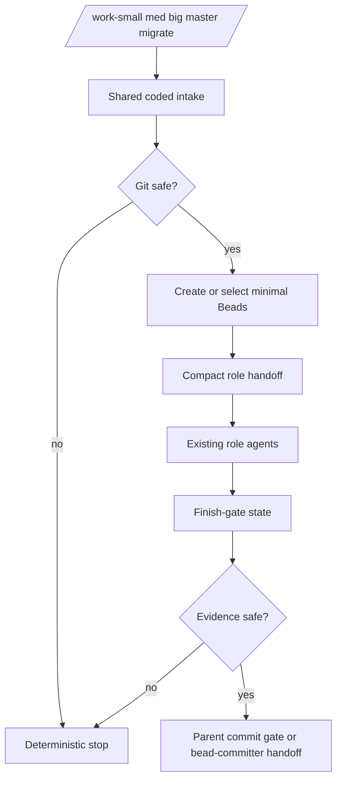

# feat: Codify work start and finish gates

## Summary

Add the next useful deterministic layer around the work-orchestrator role loop: coded start gates for `/work-small`, `/work-med`, `/work-big`, `/work-master`, and `/work-migrate`, plus a coded finish-gate state for PASS-reviewed work. The extension should still hand judgment and source edits to role agents; it only creates unambiguous Beads, checks git safety, and emits compact handoff state.

---

## Problem Frame

The package now codifies status, report, resume, pause, debug, add, and conservative auto intake. The remaining prompt-driven commands still do mechanical setup by model prompt: resolving the active epic, rejecting missing input, creating obvious Beads, copying dirty-state context, and reminding role agents not to use tiny timeouts.

The next codification should stop at the boundary where judgment starts. It should not become a full TypeScript executor. It should make the start and finish gates repeatable, then keep planner, worker, debugger, reviewer, fixer, and committer roles responsible for semantic work.

---

## Requirements

**Start-gate behavior**

- R1. Coded start gates must resolve Beads and git from the current repo, not chat memory. Covers origin requirements for Beads and git as sources of truth.
- R2. Writer-capable starts must stop on unsafe dirty state before creating or claiming work.
- R3. `/work-small`, `/work-med`, and `/work-big` must reject empty tasks and ambiguous active epics deterministically.
- R4. `/work-small`, `/work-med`, and `/work-big` may create only the minimum Beads whose parent, labels, acceptance text, and handoff target are unambiguous.
- R5. `/work-master` must distinguish existing plan/requirements inputs from raw prose and must not pretend raw prose is already a master plan.
- R6. `/work-migrate` must validate source references and hand off to the migrator role without checking out, merging, or editing source code.

**Finish-gate behavior**

- R7. The coded finish gate must inspect git state, selected Bead state, review evidence, verification evidence, and related file paths before any commit/close handoff.
- R8. Finish-gate state must stop when evidence is missing, dirty files are unrelated, or the selected Bead is not PASS-reviewed.
- R9. Finish-gate state may recommend a parent commit path only when staging, commit message, verification, and Bead closure inputs are deterministic.

**Role handoff safety**

- R10. Every coded handoff must include the selected Bead or explicit stop reason, dirty-file classification, known-unrelated allowlist, and role-agent timeout guidance.
- R11. Role handoffs must prefer no explicit timeout; if a timeout is required, planner/worker/reviewer/fixer/debugger/migrator get at least ten minutes and committer gets at least three minutes.
- R12. A role-agent timeout must be recorded as infrastructure failure evidence, not as implementation or review failure.

**Package integration**

- R13. New coded paths must follow the existing state-builder, renderer, handler, fixture-test, and verification-script pattern.
- R14. Documentation must state which commands are deterministic extension starts and which commands still execute through role agents.
- R15. The work remains repo-agnostic and must not encode RFLib-specific behavior.

---

## Key Technical Decisions

- **KTD1. Codify gates, not the role loop.** The extension should create safe input state and compact handoffs. It should not run source edits, semantic review, debugging strategy, or multi-Bead loops.
- **KTD2. Reuse the current intake model.** Existing helpers for Beads JSON, child state, git porcelain parsing, dirty safety, and handoff rendering should be extended instead of adding another workflow model.
- **KTD3. Start commands create less than the model would.** When in doubt, create one obvious Bead and hand off. Medium and big slicing still belongs to `bead-planner` unless the requested split is explicit.
- **KTD4. Finish gate is evidence classification first.** The first finish codification should compute whether a commit/close is safe; direct commit execution can remain optional until the state proves reliable.
- **KTD5. Timeout policy is data in every handoff.** The timeout lesson should be carried by generated payloads and tests, not just prose in the skill.

---

## High-Level Technical Design

The extension computes mechanical state. The existing skill remains the executor for work that needs code reading, product judgment, debugging, review, or commit policy interpretation.

---

## Implementation Units

### U1. Factor shared role-handoff envelope

- **Goal:** Make every coded command produce the same safe handoff shape.
- **Requirements:** R1-R2, R10-R13, R15
- **Dependencies:** None
- **Files:**
  - `extensions/work-models.js`
  - `scripts/work-command-fixture.mjs`
  - `scripts/test-work-resume.mjs`
  - `scripts/test-work-intake.mjs`
  - `scripts/verify-package.mjs`
- **Approach:** Add a small shared helper that builds handoff payloads with target epic, selected Bead, intended role path, dirty-file classification, known-unrelated allowlist, and timeout guidance. Convert existing resume, debug, add, and auto handoffs to use it so future command starts do not drift.
- **Patterns to follow:** `withHandoffPrompt`, `debugHandoff`, `renderWorkflowActionText`, and `resumeGitReport` in `extensions/work-models.js`.
- **Test scenarios:**
  - Existing resume/debug handoffs include selected Bead and dirty-state context.
  - Handoffs include minimum role-agent timeout guidance.
  - Unsafe dirty state produces no handoff payload.
  - Existing report, resume, intake, pause, debug, add, and auto fixture tests still pass.
- **Verification:** `npm run verify` runs the expanded fixture suite and fails if timeout guidance drops from generated handoffs.

### U2. Add coded `/work-small` start gate

- **Goal:** Turn obvious one-task starts into deterministic Bead setup plus a worker handoff.
- **Requirements:** R1-R4, R10-R15
- **Dependencies:** U1
- **Files:**
  - `extensions/work-models.js`
  - `scripts/test-work-small.mjs`
  - `prompts/work-small.md`
  - `README.md`
  - `scripts/verify-package.mjs`
- **Approach:** Parse task text, resolve one active or explicit epic, stop on unsafe dirt, create one child implementation Bead when no explicit Bead was provided, and hand off to the existing worker/reviewer/fixer/commit loop. If the task names an existing Bead, resolve it and do not create a duplicate.
- **Patterns to follow:** `buildWorkAddState` for explicit child creation, `buildWorkResumeState` for role-loop handoff, and duplicate-Bead checks in the skill text.
- **Test scenarios:**
  - Empty task returns usage guidance and creates nothing.
  - One active epic plus clean git creates one child Bead and hands off to work.
  - Explicit existing Bead target reuses that Bead.
  - Ambiguous epic returns candidates and creates nothing.
  - Unsafe dirty state stops before Beads mutation.
  - Created Bead records the original task text and parent epic.
- **Verification:** Small-command fixture tests prove creation, reuse, stop states, and no duplicate Beads.

### U3. Add coded `/work-med` and `/work-big` planning starts

- **Goal:** Make bounded and large starts deterministic without moving slicing judgment into code.
- **Requirements:** R1-R4, R10-R15
- **Dependencies:** U1
- **Files:**
  - `extensions/work-models.js`
  - `scripts/test-work-med-big.mjs`
  - `prompts/work-med.md`
  - `prompts/work-big.md`
  - `README.md`
  - `skills/work-orchestrator/SKILL.md`
  - `scripts/verify-package.mjs`
- **Approach:** Resolve the active epic, stop on unsafe dirt, create one planning Bead under that epic with the user's task text, and hand off to `bead-planner`. Medium and big differ only in the requested slicing posture: medium asks for one executable child by default, with up to three only for obvious low-risk sequences; big asks for a deeper slice plan inside the existing epic.
- **Patterns to follow:** Current resume behavior for planning Beads and stale-planning closure rules.
- **Test scenarios:**
  - Empty task returns usage guidance.
  - Clean medium start creates one planning Bead and hands off to planner.
  - Clean big start creates one planning Bead with big-work posture.
  - Existing ready implementation Beads do not get hidden by a new planning Bead unless the user explicitly asks for new work.
  - Ambiguous epic or unsafe dirty state creates nothing.
  - Planner handoff includes dependency-direction and timeout guidance.
- **Verification:** Medium/big fixture tests prove one planning Bead is created and no source-writing role starts before planning.

### U4. Add coded `/work-master` bootstrap

- **Goal:** Make epic creation from existing artifacts deterministic while preserving `ce-plan` for raw ideas.
- **Requirements:** R1-R2, R5, R10-R15
- **Dependencies:** U1
- **Files:**
  - `extensions/work-models.js`
  - `scripts/test-work-master.mjs`
  - `prompts/work-master.md`
  - `README.md`
  - `skills/work-orchestrator/SKILL.md`
  - `scripts/verify-package.mjs`
- **Approach:** Parse the argument as either an existing plan/requirements path or raw prose. Existing plan/requirements inputs can create an epic plus an initial planning Bead with repo-relative source notes. Raw prose should not create a fake master plan; it should hand off to `ce-plan` with explicit auto-accept guidance and stop after plan creation or epic bootstrap.
- **Patterns to follow:** Existing master mode prose in `skills/work-orchestrator/SKILL.md` and plan frontmatter conventions in `docs/plans/`.
- **Test scenarios:**
  - Empty input returns usage guidance.
  - Existing plan path creates one epic and one planning Bead with source path notes.
  - Existing requirements path hands off to `ce-plan` or creates an epic only when a plan artifact already exists.
  - Raw prose produces a `ce-plan` handoff and no Beads mutation before a plan exists.
  - Missing path returns a clear stop.
  - Unsafe dirty state does not block read-only plan detection but does block writer handoff after Beads mutation would begin.
- **Verification:** Master fixture tests prove artifact detection, raw-prose handoff, and no fake-plan Bead creation.

### U5. Add coded `/work-migrate` intake

- **Goal:** Normalize migration sources before the migrator role runs.
- **Requirements:** R1-R2, R6, R10-R15
- **Dependencies:** U1
- **Files:**
  - `extensions/work-models.js`
  - `scripts/test-work-migrate.mjs`
  - `prompts/work-migrate.md`
  - `README.md`
  - `skills/work-orchestrator/SKILL.md`
  - `scripts/verify-package.mjs`
- **Approach:** Parse source arguments into existing file paths, branch names, and free-text descriptions. Validate paths and list branch candidates read-only. Create no source changes and perform no checkout. When sources are valid or intentionally free-text, hand off a compact source manifest to `bead-migrator`.
- **Patterns to follow:** Migrator role constraints in `agents/bead-migrator.md` and branch-history warnings in `README.md`.
- **Test scenarios:**
  - Empty input returns usage guidance.
  - Existing plan/TODO paths are preserved as repo-relative source entries.
  - Missing paths are reported before handoff.
  - Branch-looking inputs are listed as branch sources without checkout.
  - Mixed file and prose inputs preserve all source text.
  - Handoff includes no source-edit permission and no branch mutation instruction.
- **Verification:** Migrate fixture tests prove source parsing and no git mutation commands are issued.

### U6. Add finish-gate state for PASS-reviewed work

- **Goal:** Make the final commit/close decision deterministic enough for parent commit gates.
- **Requirements:** R7-R9, R12-R15
- **Dependencies:** U1
- **Files:**
  - `extensions/work-models.js`
  - `scripts/test-work-finish.mjs`
  - `skills/work-orchestrator/SKILL.md`
  - `README.md`
  - `scripts/verify-package.mjs`
- **Approach:** Add a state builder that takes an epic or Bead target and checks Bead status, latest notes, review result, verification evidence, git status, changed files, and dependency blockers. Version one should render a commit-ready or stop state. Direct commit execution can remain in the parent skill path until tests prove the state is stable.
- **Patterns to follow:** `noteDetails` for evidence extraction, `gitReport` for status, and the committer role contract in `agents/bead-committer.md`.
- **Test scenarios:**
  - PASS-reviewed Bead with verification and related dirty files returns commit-ready state.
  - Missing review result stops.
  - Missing verification evidence stops.
  - Unrelated dirty files stop.
  - Blocked/debug-needed Bead stops with report/debug guidance.
  - Commit-ready state includes deterministic commit message seed and Bead closure target.
- **Verification:** Finish fixture tests prove commit readiness and missing-evidence stop states without creating commits.

### U7. Wire docs and verification

- **Goal:** Make the new coded starts visible and keep future regressions out.
- **Requirements:** R10-R15
- **Dependencies:** U2, U3, U4, U5, U6
- **Files:**
  - `README.md`
  - `skills/work-orchestrator/SKILL.md`
  - `scripts/verify-package.mjs`
  - `prompts/work-small.md`
  - `prompts/work-med.md`
  - `prompts/work-big.md`
  - `prompts/work-master.md`
  - `prompts/work-migrate.md`
- **Approach:** Update the command table and skill fallback text to describe deterministic extension starts. Extend package verification to assert command registration, fixture execution, prompt fallback wording, role timeout guidance, and repo-agnostic behavior.
- **Patterns to follow:** Current verification checks for coded report, resume, pause, debug, add, and auto.
- **Test scenarios:**
  - Verification fails when any new command registration is missing.
  - Verification runs small, med/big, master, migrate, and finish fixture tests.
  - README states which commands are coded starts and which still use role agents.
  - Prompt templates remain thin fallbacks and preserve `$ARGUMENTS`.
- **Verification:** `npm run verify` passes and targeted LSP diagnostics are clean for changed JavaScript files.

---

## Scope Boundaries

### In scope

- Deterministic start gates for small, medium, big, master, and migrate commands.
- Deterministic finish-gate state for commit/close readiness.
- Shared handoff payloads with dirty-state and timeout guidance.
- Fixture tests and package verification for all new coded paths.

### Deferred to Follow-Up Work

- Full TypeScript execution of planner/worker/reviewer/fixer/debugger/committer loops.
- Direct subagent orchestration from the extension if Pi exposes a stable extension API for it.
- Automatic commits from finish-gate state.
- Parallel writers or automatic worktree allocation.
- Push, PR, CI watching, or branch checkout automation.

### Out of scope

- Repo-specific rules such as RFLib-only hardware behavior.
- Semantic size classification in code.
- Replacing role-agent review, debugging, implementation, or planning judgment.
- A custom dashboard or package database.

---

## Risks And Mitigations

- **Risk: Bead creation becomes too eager.** Mitigate by creating only one obvious child or planning Bead and stopping on ambiguity.
- **Risk: master bootstrap treats prose as a durable plan.** Mitigate by routing raw prose to `ce-plan` before epic creation.
- **Risk: finish gate commits without enough evidence.** Mitigate by making version one state-only and requiring tests for missing review, missing verification, and unrelated dirt.
- **Risk: timeout guidance remains prose-only.** Mitigate by injecting it into handoff payloads and asserting it in fixture tests.
- **Risk: extension grows into a second workflow engine.** Mitigate by keeping all semantic work in role agents and deferring full role-loop execution.

---

## Sources And Research

- `docs/brainstorms/2026-07-02-work-orchestrator-requirements.md`
- `docs/plans/2026-07-02-001-feat-work-orchestrator-package-plan.md`
- `docs/plans/2026-07-03-001-feat-coded-work-report-plan.md`
- `docs/plans/2026-07-03-002-feat-coded-work-resume-plan.md`
- `docs/plans/2026-07-03-003-feat-coded-workflow-intake-plan.md`
- `extensions/work-models.js`
- `prompts/work-small.md`, `prompts/work-med.md`, `prompts/work-big.md`, `prompts/work-master.md`, `prompts/work-migrate.md`
- `agents/bead-migrator.md`, `agents/bead-committer.md`
