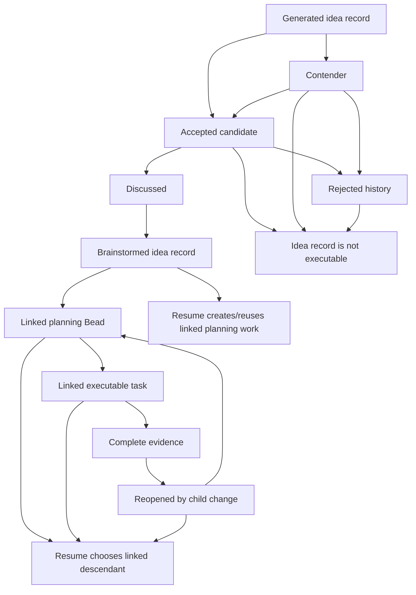
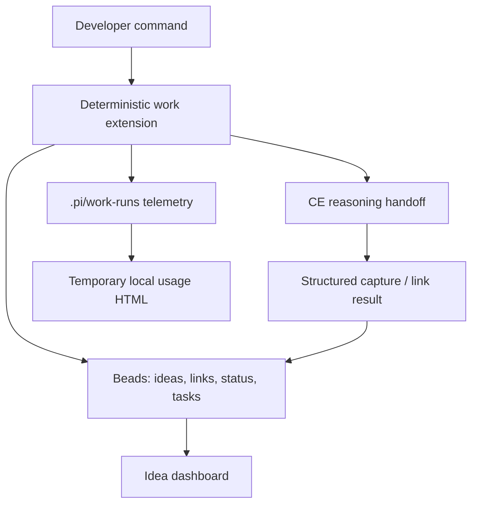
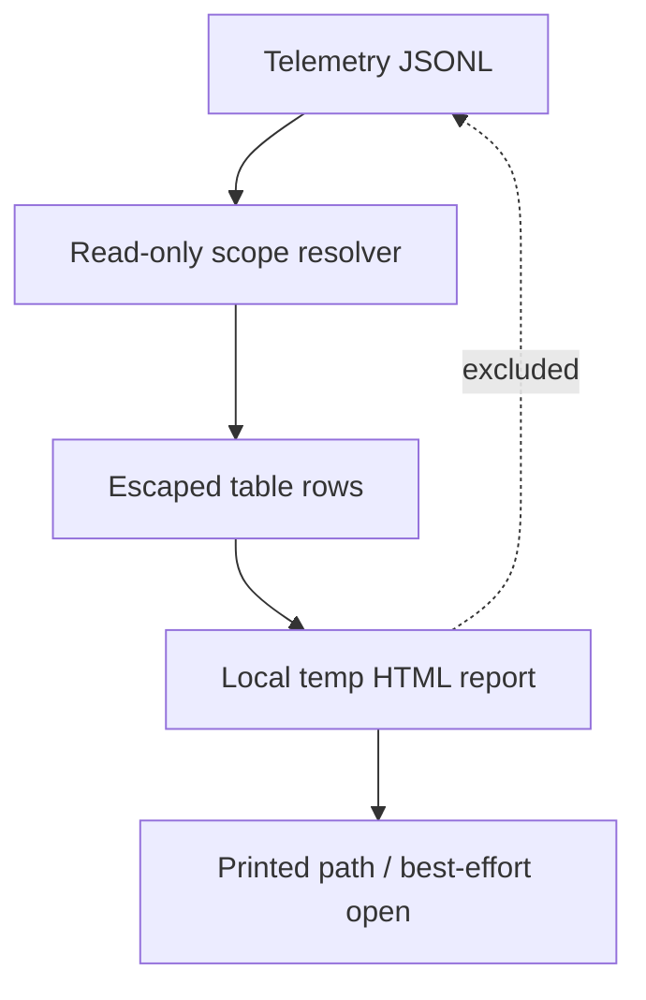

# feat: Add Beads-backed Work Intelligence

## Summary

Add a Beads-backed work intelligence layer that makes ideas, brainstorms, plans, tasks, and usage telemetry visible through `/work-*` commands. The plan starts with durable idea capture and lineage, then adds the local usage report and evidence-backed review tuning.

---

## Problem Frame

The work-orchestrator already uses Beads as durable work state and git as code state, but ideation still leaks through chat transcripts and disconnected markdown artifacts. A developer can generate many ideas, brainstorm one, complete it, and later have no clean way to see what was accepted, rejected, planned, finished, or left as a contender.

The same package already records work telemetry, but the current text summary is not enough for quick inspection of what consumed an epic. The new work should reuse that telemetry and expose the biggest costs without adding another source of truth.

---

## Requirements

**Idea state and safety**

- R1. Ideas must be stored as Beads records with workflow labels and machine-readable metadata for status, source, and lineage. *(Origin R1-R7, R12-R14)*
- R2. Raw, accepted, contender, and rejected ideas must never be selected by `/work-resume` unless they are linked to brainstormed, planned, or task-backed work. *(Origin R4, R5, R14)*
- R3. Dashboard indexes must be safe for common use and must not silently mutate a different idea when the displayed mapping is stale. *(Origin R2, R6)*
- R4. Idea status must be derived from Beads links and completion evidence first, with manual status metadata only for states the links cannot derive. *(Origin R12, R13, R19)*

**Idea commands and lineage**

- R5. `/work-ideate` must render a deterministic grouped dashboard with stable IDs, current status, lineage context, and action hints. *(Origin R1, R2)*
- R6. `/work-ideate <topic>` must save all generated ideas, mark top picks as accepted candidates, mark the rest as contenders, and preserve raw output when structured capture fails. *(Origin R3, AE1)*
- R7. `/work-ideate <target> accept|reject|discuss|inspect|import` must mutate only the resolved idea or import target and must stop on ambiguity. *(Origin R5-R8)*
- R8. `/work-brainstorm idea <target>` and `/work-brainstorm <topic>` must link brainstorm artifacts back to ideas and update derived state. *(Origin R9, R10, AE3, AE4)*
- R9. Planning or working an idea must write backlinks from plans, epics, or tasks to the idea lineage. *(Origin R11, R15-R19)*

**Usage, tuning, and workflow quality**

- R10. `/work-usage` must render a temporary local HTML report from existing work telemetry, defaulting to the current epic when one is unambiguous. *(Origin R20-R25, AE6)*
- R11. Usage rows must escape telemetry text, show missing data as unknown, and support sorting/filtering without chart dependencies. *(Origin R21-R25)*
- R12. Review tuning must be based on recorded cost and outcome fields, with settings visible, scoped, and reversible. *(Origin R29, R30, AE8)*
- R13. CE ideation, brainstorm, and plan handoffs must ask harder questions when uncertain and use temporary high or xhigh thinking without changing persistent defaults. *(Origin R26, R27)*
- R14. Review handoffs must name the current diff or current Bead slice as the default scope. *(Origin R28, AE7)*

---

## Key Technical Decisions

- **Ideas are lineage records, not executable slices.** `/work-resume` may use an idea's linked planning or task descendants to choose work, but it must never launch a worker against the `wo:idea` record itself.
- **Use a small versioned Beads schema.** Idea records use `wo:idea` labels when available, metadata for machine-readable status and links, and notes for human history; shared helpers hide label/metadata fallback details.
- **Make resume safety independent of Beads type.** An idea may be represented by a Beads type that otherwise looks executable, so the resume guard checks the idea marker before every ready-work path.
- **Use a disposable dashboard snapshot for numeric indexes.** Bead IDs are authoritative; indexes mutate only when the cached view still matches the target Bead's ID, title fingerprint, status, and update version.
- **Reject only unworked ideas directly.** Raw, accepted, contender, and discussed ideas can be rejected; brainstormed, planned, task-backed, in-progress, or completed ideas require abandon, defer, or conflict resolution so downstream work is not hidden.
- **Define status precedence in code.** Conflicted beats rejected when downstream work exists; otherwise rejected wins, then reopened or in-progress, complete, planned, brainstormed, discussed, accepted, contender, and raw.
- **Preserve malformed ideation output.** If CE ideation cannot be parsed into ideas or Beads writes partially fail, the command must create a recovery record or artifact and stop with explicit recovery guidance.
- **Keep `/work-usage` table-first and dependency-free.** Existing telemetry readers provide the core data; the new work adds an HTML renderer, escaping, filters, sparse-data messaging, and self-report exclusion.
- **Record review payoff at the handoff boundary.** Review outcome telemetry should come from structured parent/review events, not later parsing of reviewer prose.
- **Use temporary effort by handoff, not `/work-models`.** High or xhigh thinking for ideation and planning should live in handoff prompts or per-call metadata, not persistent `.pi/settings.json` defaults.

---

## High-Level Technical Design

### Idea lifecycle and resume eligibility

### Command responsibilities

The extension owns deterministic state reads, target resolution, safe mutations, telemetry rendering, and compact handoffs. CE skills own ideation, brainstorming, and planning judgment, and their outputs become Beads state through explicit capture or links.

### Usage report boundary

`/work-usage` reads existing telemetry and may record its own command event, but the generated report should exclude the current report-view event by default so viewing usage does not distort the usage being viewed.

---

## Implementation Units

### U1. Idea record model and resume guard

- **Goal:** Add the shared idea-state helpers, minimal schema contract, fixture support, and resume guard.
- **Requirements:** R1-R4, R9; origin R4, R5, R12-R14, R19.
- **Dependencies:** none.
- **Files:** `extensions/work-models.js`, `scripts/work-command-fixture.mjs`, `scripts/test-work-resume.mjs`, `scripts/test-work-ideate.mjs`.
- **Approach:** Define the smallest stable idea schema before building commands: idea marker, schema version, manual status, source artifact, brainstorm/plan/epic/task links, run/source fingerprint, and child-change link. Extend Beads helper support for labels and metadata, add fallback parsing for fixtures or older Beads behavior, and update resume filtering so `wo:idea` records are never executable work.
- **Patterns to follow:** Existing Beads normalizers and `buildEpicChildState` in `extensions/work-models.js`; fake Beads scenarios in `scripts/work-command-fixture.mjs`; assert-style resume tests.
- **Test scenarios:**
  - Covers origin AE2. Given accepted, contender, and rejected idea Beads under an epic, `/work-resume` selects none of them as ready implementation work.
  - Given a brainstormed idea has no linked executable descendant, resume creates or points at planning work instead of launching against the idea record.
  - Given a planned idea has a linked executable task, resume chooses the linked task and not the idea record.
  - Given conflicting signals such as rejected plus downstream work or complete plus open child change, derived status follows the defined precedence.
  - Given labels are absent in a fixture scenario, metadata parsing still keeps idea records out of work selection.
- **Verification:** Resume and idea model tests prove raw ideas cannot enter automation and derived status is deterministic.

### U2. Deterministic `/work-ideate` dashboard and direct actions

- **Goal:** Implement the coded idea dashboard, safe target resolution, accept/reject/discuss/inspect actions, and explicit import path.
- **Requirements:** R3, R5, R7; origin R1, R2, R5-R8.
- **Dependencies:** U1.
- **Files:** `extensions/work-models.js`, `skills/work-orchestrator/SKILL.md`, `prompts/work-ideate.md`, `README.md`, `scripts/test-work-ideate.mjs`, `scripts/work-command-fixture.mjs`, `scripts/verify-package.mjs`.
- **Approach:** Add pure `buildWorkIdeateState` and `renderWorkIdeateText` style helpers, register `/work-ideate`, and keep mutating actions explicit and unambiguous. Store a dashboard snapshot under `.pi` as disposable UI cache only, validating view ID, generated time, filter, Bead ID, title fingerprint, status, and update version before numeric-index mutation.
- **Patterns to follow:** `buildWorkStatus`, `buildWorkReportState`, `renderWorkReportText`, existing artifact helpers for path imports, and prompt-template verification.
- **Test scenarios:**
  - Given no ideas exist, `/work-ideate` prints a compact empty-state dashboard with the next command hint.
  - Given ideas in every lifecycle state, the dashboard groups them and hides empty groups.
  - Given `/work-ideate <id> reject` on a raw, accepted, contender, or discussed idea, the idea becomes rejected, remains inspectable, and is excluded from resume.
  - Given `/work-ideate <id> reject` on a brainstormed, planned, task-backed, in-progress, or completed idea, the command refuses direct rejection and reports the abandon/defer path.
  - Given a numeric index from a stale or missing snapshot, the command refuses mutation and reprints enough dashboard context to recover.
  - Given a valid requirements or plan path, explicit import creates or updates one idea linked to that source path; repeating the import is idempotent.
  - Given an outside-repo or missing path, import fails without creating a Bead.
  - Given the command is registered, tests cover both exported builder/renderer helpers and the registered handler path.
- **Verification:** The dashboard/action tests cover grouping, mutation safety, import idempotence, stale index refusal, command registration, and rejected exclusion.

### U3. `/work-ideate <topic>` CE handoff and capture

- **Goal:** Run CE ideation through the work orchestrator and persist all generated ideas with top-pick and contender state.
- **Requirements:** R6, R13; origin R3, AE1.
- **Dependencies:** U1, U2.
- **Files:** `extensions/work-models.js`, `skills/work-orchestrator/SKILL.md`, `scripts/test-work-ideate.mjs`, `scripts/work-command-fixture.mjs`.
- **Approach:** Add a handoff path that asks CE ideation for structured idea output, then captures returned ideas into Beads using a run ID and per-idea source fingerprint. If capture is malformed or partial, preserve raw output, record saved versus unsaved items, and make retries reuse existing records by run ID plus index or title hash.
- **Execution note:** Implement the parser, source-fingerprint, and capture-failure tests before wiring the handoff.
- **Patterns to follow:** `/work-plan` handoff shape in `buildWorkPlanLikeState` and deterministic recovery states in report/resume builders.
- **Test scenarios:**
  - Covers origin AE1. Given structured ideation output with 20 ideas and 7 top picks, all 20 are saved and the correct 7 are accepted candidates.
  - Given malformed CE output, one recovery record or artifact preserves the raw text and the command reports recovery guidance.
  - Given Beads creation fails after a partial save, the command records which ideas were saved and which require recovery.
  - Given the same failed ideation run is retried, existing saved ideas are reused rather than duplicated.
- **Verification:** Ideation capture tests prove no generated output is silently lost and partial retries are idempotent.

### U4. `/work-brainstorm` selected and freeform idea lineage

- **Goal:** Link brainstorm artifacts, plans, epics, tasks, and child changes back to idea records.
- **Requirements:** R4, R8, R9, R13; origin R8-R19, AE3-AE5.
- **Dependencies:** U1, U2.
- **Files:** `extensions/work-models.js`, `skills/work-orchestrator/SKILL.md`, `prompts/work-brainstorm.md`, `README.md`, `scripts/test-work-brainstorm.mjs`, `scripts/test-work-ideate.mjs`, `scripts/test-work-intake.mjs`, `scripts/test-work-add.mjs`, `scripts/test-work-start-finish.mjs`, `scripts/test-work-resume.mjs`, `scripts/verify-package.mjs`.
- **Approach:** Add selected-idea and freeform brainstorm modes. Resolve explicit IDs first, use exact normalized title matches for freeform reuse, avoid fuzzy auto-merge, and write backlink metadata when brainstorms, plans, epics, tasks, or child changes complete.
- **Patterns to follow:** `buildWorkPlanLikeState` for source artifact handling, `roleHandoffPrompt` for compact CE handoffs, and existing intake/add/finish tests for lifecycle evidence.
- **Test scenarios:**
  - Covers origin AE3. Given an accepted idea is discussed and brainstormed, the idea keeps its refinement notes and gains a brainstorm link with derived Brainstormed status.
  - Covers origin AE4. Given a freeform brainstorm topic with no exact match, the command creates a new idea and links the brainstorm artifact.
  - Given a freeform topic with an exact normalized title match, the existing idea is updated instead of duplicated.
  - Given a near-match only, the command creates a new idea and reports possible duplicates rather than merging.
  - Given a brainstormed idea is planned, the plan, epic, and initial planning Bead link back to the idea.
  - Covers origin AE5. Given a completed idea receives a meaningful child change, the original completion evidence remains and the idea shows reopened or in progress.
- **Verification:** Brainstorm lineage tests prove selected/freeform paths, duplicate handling, plan/task backlinking, and reopen behavior.

### U5. `/work-usage` telemetry state and local HTML report

- **Goal:** Render a sortable, filterable local HTML usage report from existing telemetry with read-only current-epic defaulting.
- **Requirements:** R10, R11; origin R20-R25, AE6.
- **Dependencies:** none.
- **Files:** `extensions/work-models.js`, `.gitignore`, `prompts/work-usage.md`, `README.md`, `scripts/test-work-usage.mjs`, `scripts/test-work-telemetry.mjs`, `scripts/work-command-fixture.mjs`, `scripts/verify-package.mjs`.
- **Approach:** Reuse telemetry readers and aggregation, add a usage-specific state builder that only discovers candidates and never creates work, and write an escaped HTML report under a runtime path such as `.pi/work-runs/usage/usage-<timestamp>.html`. Print the path every time and attempt browser open only as best effort.
- **Patterns to follow:** `readTelemetryEvents`, `parseTelemetryArgs`, `matchesTelemetryScope`, `buildWorkTelemetryState`, `renderWorkTelemetryText`, and report target ambiguity handling.
- **Test scenarios:**
  - Covers origin AE6. Given telemetry for one active epic, `/work-usage` writes an HTML report with task, agent, phase, duration, token, context, tool, and slowest-event rows.
  - Given multiple active epics and no explicit target, the command lists candidates and does not render a blended report.
  - Given explicit `today`, `all`, `epic`, or `bead` scope, the report uses that scope rather than resume selection.
  - Given missing token, cost, context, or tool fields, the report shows `unknown` or unavailable messaging rather than zero-based conclusions.
  - Given telemetry text contains markup-like input, the rendered HTML escapes it.
  - Given browser opening is unavailable, the command still succeeds and prints the report path.
  - Given report generation runs in the repo, generated HTML stays in the intended runtime path and does not dirty tracked source files.
- **Verification:** Usage tests prove scope resolution, HTML generation, escaping, sparse-field behavior, runtime artifact placement, and path fallback.

### U6. Review scope and payoff telemetry

- **Goal:** Add structured review outcome telemetry and enforce current-diff/current-Bead review scope in handoffs.
- **Requirements:** R12, R14; origin R28-R30, AE7, AE8.
- **Dependencies:** U5.
- **Files:** `extensions/work-models.js`, `skills/work-orchestrator/SKILL.md`, `agents/bead-reviewer.md`, `scripts/test-work-telemetry.mjs`, `scripts/test-work-usage.mjs`, `scripts/verify-package.mjs`.
- **Approach:** Record minimal review outcome fields at the parent/review boundary, such as scoped Bead or diff, outcome, finding count, fixer triggered, and rerun relationship. Surface those fields in usage output and preserve backward compatibility by rendering unknown payoff for older telemetry.
- **Patterns to follow:** `withCommandTelemetry`, Pi agent event hooks in `workModelsExtension`, `roleHandoffPrompt`, and `bead-reviewer` read-only prompt style.
- **Test scenarios:**
  - Covers origin AE7. Given a reviewer handoff is built, it names the current diff or selected Bead slice and does not request whole-repo review by default.
  - Given review telemetry is recorded, generic telemetry tests preserve the new outcome fields without breaking old event aggregation.
  - Covers origin AE8. Given review telemetry includes high cost and low finding count, usage output shows the evidence but does not silently change settings.
  - Given review outcome fields are absent in older telemetry, `/work-usage` reports unknown payoff instead of inferring value.
- **Verification:** Telemetry, usage, and verifier tests prove review scope language, outcome recording, and backward-compatible payoff rendering.

### U7. Package docs, verifier, and settings visibility

- **Goal:** Keep package invariants, prompt templates, README, verification, and review tuning settings coherent after the new commands land.
- **Requirements:** R5-R14; origin all command-surface requirements.
- **Dependencies:** U2, U3, U4, U5, U6.
- **Files:** `README.md`, `skills/work-orchestrator/SKILL.md`, `prompts/work-ideate.md`, `prompts/work-brainstorm.md`, `prompts/work-usage.md`, `scripts/verify-package.mjs`, `scripts/test-work-models.mjs`.
- **Approach:** Finalize the command table and mode docs, ensure every new assert script is run by package verification, and add visible/resettable review-tuning settings only after usage evidence exists. This unit should polish and enforce invariants, not introduce the first command registration for a feature.
- **Patterns to follow:** Existing `prompts/work-*.md` templates, prompt checks in `scripts/verify-package.mjs`, and `/work-models` settings behavior.
- **Test scenarios:**
  - Given the new prompts are present, `scripts/verify-package.mjs` accepts their frontmatter, mode names, shared-skill route, argument preservation, and thinness.
  - Given new assert scripts exist, package verification runs `scripts/test-work-ideate.mjs`, `scripts/test-work-brainstorm.mjs`, `scripts/test-work-usage.mjs`, and any settings test.
  - Given README command tables are scanned by verification, the documented command list includes `/work-ideate`, `/work-brainstorm`, and `/work-usage` without stale template counts.
  - Given skill text is verified, it defines modes for ideate, brainstorm, and usage and preserves Beads/git source-of-truth language.
  - Given a review setting is changed, `/work-models` or the relevant status surface shows it and reset clears it.
- **Verification:** Package verification covers prompt, docs, skill, extension, settings, and command registration drift.

---

## Scope Boundaries

- **Deferred to follow-up work:** Rich charts, hosted dashboards, automatic old-doc discovery, fuzzy idea merge, automatic review disabling, and extracting helper modules if the first implementation remains manageable inside the existing extension file.
- **Out of scope:** A new database, a markdown TODO ledger, broad whole-repo review by default, persistent global xhigh effort defaults, and parsing reviewer prose to infer payoff.
- **Implementation-time details:** Exact non-safety metadata key names, HTML styling polish, and final CE output section names may adjust during implementation while preserving the plan's state and safety contracts.

---

## System-Wide Impact

The highest-risk integration point is `/work-resume`: idea records must not become executable merely because they are open Beads. Idea records are lineage state; linked planning and task descendants are executable work.

Command registration, prompt templates, skill modes, README docs, and package verification are coupled in this repository. Each command unit should keep its package surface coherent enough that `npm run verify` can pass at the end of that slice.

Telemetry changes affect only the existing `.pi/work-runs` stream and local report rendering. Usage reports should exclude their own current report-view event by default and should not mutate Beads or git.

---

## Risks & Dependencies

| Risk | Mitigation |
|---|---|
| Raw ideas become ready work | Add idea markers before command capture and update resume filtering in the first unit. |
| Rejection hides active downstream work | Refuse direct rejection once an idea has brainstormed, planned, task-backed, in-progress, or completed descendants. |
| Numeric dashboard indexes mutate the wrong idea | Treat Bead IDs as authoritative and validate snapshot mappings before mutation. |
| CE ideation output is hard to parse | Request structured sections, preserve raw output on parse failure, and key retries by run fingerprint. |
| Usage report overstates review payoff | Show unknown for missing fields and add minimal outcome telemetry before recommendations. |
| Viewing usage distorts usage | Exclude the current report-view event from the generated report by default. |
| Persistent model settings drift | Keep xhigh/high effort temporary by handoff and avoid changing `.pi/settings.json` for CE thinking. |
| Extension file grows harder to maintain | Keep new logic as small pure helpers; extract internal modules only if helper sprawl blocks readability or testing. |
| Package verification fails mid-slice | Update command registration, prompt, skill, README, verifier, and tests with the command unit that introduces the surface. |

---

## Sources & Research

- `docs/brainstorms/2026-07-06-work-intelligence-requirements.md` defines the product scope, lifecycle, usage report, and tuning goals.
- `docs/brainstorms/2026-07-02-work-orchestrator-requirements.md` establishes Beads as durable work state and CE as the reasoning layer.
- `docs/brainstorms/2026-07-03-coded-work-report-requirements.md` establishes deterministic report-state patterns.
- `extensions/work-models.js` contains the extension command registry, Beads helpers, resume filtering, telemetry state builders, model settings, and handoff prompts.
- `skills/work-orchestrator/SKILL.md` defines current `/work-*` modes, Beads conventions, verification policy, and cost/model policy.
- `agents/bead-reviewer.md` defines the read-only reviewer role that should stay scoped to the current diff or Bead.
- `scripts/verify-package.mjs` enforces prompt, skill, agent, extension, README, and test-script invariants.
- `scripts/work-command-fixture.mjs`, `scripts/test-work-telemetry.mjs`, `scripts/test-work-report.mjs`, and `scripts/test-work-resume.mjs` show the fixture and assert-test style to extend.

---

## Open Questions

### Deferred to Implementation

- Exact non-safety metadata key names for display-only fields after U1 defines the safety-critical schema markers.
- Whether labels alone are enough for all supported Beads versions or whether metadata fallback is needed in real installations, not just fixtures.
- Exact CE ideation output headings to request and parse.
- Whether `/work-usage` attempts browser open on Windows, macOS, and Linux or only prints the file path in the first implementation.
- Exact threshold language for recommending review downshift versus only reporting cost.
