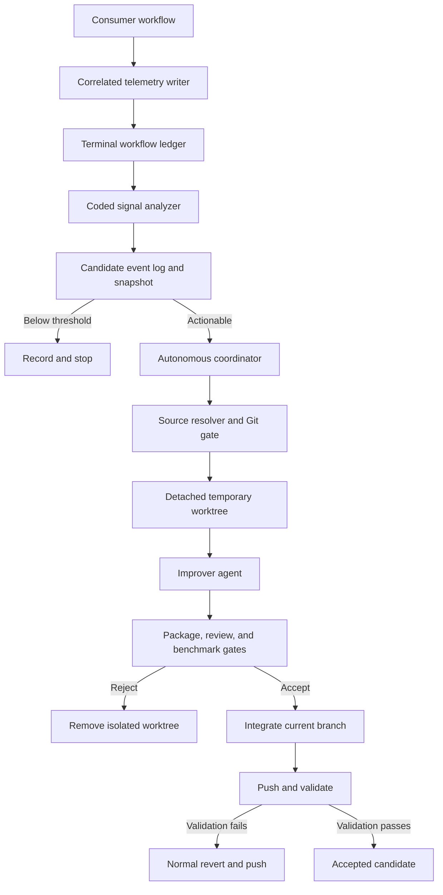
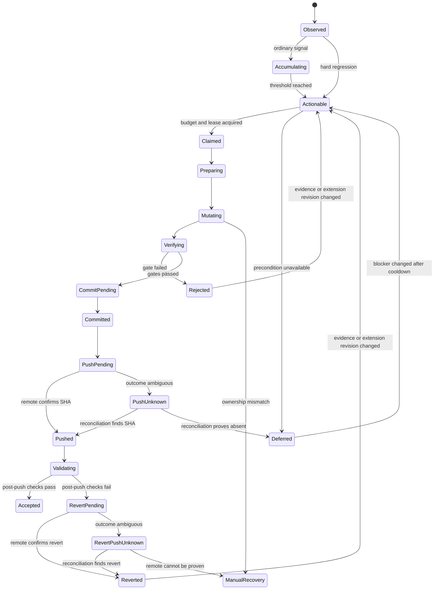
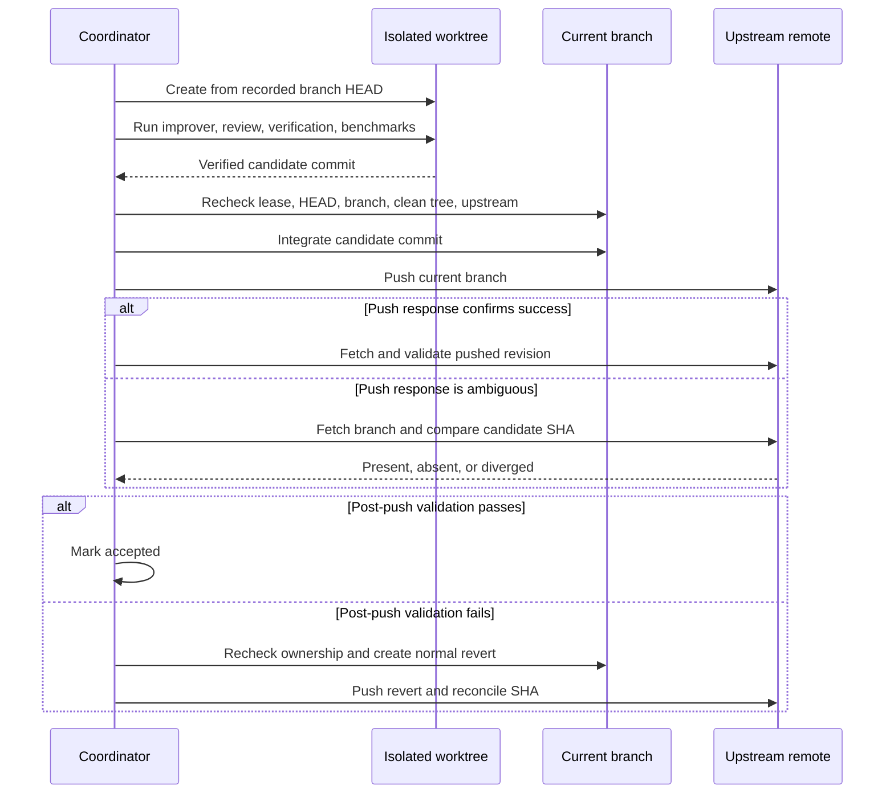

# feat: Add autonomous workflow improvement

## Summary

Add an opt-in loop that correlates completed workflows, detects repeated waste or hard regressions, and autonomously improves ce-workflow from an isolated temporary worktree. A coded coordinator accepts only independently reviewed changes that preserve quality gates, improve representative workflow cost, and can be pushed or reverted safely on the current synchronized branch.

---

## Problem Frame

The extension already records enough structured telemetry to expose expensive reads, repeated commands, failed handoffs, review payoff, token use, latency, and dirty finalization. Turning those findings into extension changes still depends on manual analysis, while launching an agent after every run would recreate the cost being removed.

Autonomous delivery also crosses a trust boundary. Telemetry originates in a consumer repository, but changes belong in the ce-workflow source checkout. The current package root may be an installed copy without Git metadata, direct subagents complete outside the parent turn, and normal push outcomes can be ambiguous after a timeout. The implementation therefore needs durable workflow correlation, a crash-recoverable candidate lifecycle, explicit source resolution, isolated mutation, strict Git reconciliation, and hard quality gates before autonomy is enabled.

---

## Requirements

**Activation and evidence**

- R1. Post-processing remains disabled unless the existing self-improving setting is true.
- R2. Every eligible completed workflow receives one coded analysis pass without a model call below threshold.
- R3. Analysis covers failures, retries, tools, output, tokens, latency, review payoff, verification, handoffs, context growth, and final repository state when those fields exist.
- R4. Hard regressions become actionable after one run; ordinary inefficiency requires two distinct correlated runs.
- R5. Every candidate stores bounded source evidence, affected phase, observed cost or failure, expected improvement, analyzer version, and extension revision.
- R6. Equivalent evidence accumulates under one candidate fingerprint and cannot launch duplicate writers.

**Autonomous execution**

- R7. One autonomous attempt addresses one candidate without unrelated cleanup.
- R8. Evidence may justify broad changes across prompts, agents, helpers, orchestration, telemetry, tests, and documentation.
- R9. Mutation targets a validated ce-workflow source checkout, never the consumer repository.
- R10. Mutation requires a clean symbolic current branch at the expected HEAD with a configured synchronized upstream.
- R11. Automation never discards unrelated work, force-pushes, bypasses branch protection, or weakens a required gate.
- R12. An atomic lease permits one autonomous source writer at a time and survives process restarts.

**Verification and delivery**

- R13. Every attempted change passes full package verification and independent scoped review before integration.
- R14. Every attempted change runs representative quality and cost scenarios selected from its affected surface.
- R15. Missing required metrics, quality loss, telemetry loss, error growth, or unacceptable cost regression rejects the change.
- R16. A passing change is integrated onto and pushed from the current branch with candidate evidence and measured results recorded.
- R17. Post-push validation runs from the pushed revision and creates a normal revert commit when the pushed improvement fails.
- R18. Deferred, rejected, failed, accepted, reverted, ambiguous, and manual-recovery outcomes remain durable and suppress unchanged retries.

**Cost and loop control**

- R19. Acceptance optimizes a balanced score over tokens, latency, tool calls, tool output, and retries, with errors treated as a non-regression gate.
- R20. Required workflow outcomes, verification, review, commit, close, and push behavior remain hard constraints outside the score.
- R21. Improvement, benchmark, validation, and revert activity carries a durable marker excluded from future signal generation.
- R22. The coordinator enforces one active attempt, bounded launches, per-fingerprint attempts, and cooldowns.
- R23. Missing source, upstream, baseline, lock, or verification capability defers the candidate without modifying either repository.

---

## Key Technical Decisions

| ID | Decision | Rationale |
|---|---|---|
| KTD1 | Add a focused improvement module beside the main extension. | Pure correlation, detector, candidate, and persistence logic stays testable without further expanding the large extension entry point. |
| KTD2 | Correlate every command, inline turn, and direct async role with one `workflowRunId`. | Candidate evidence and exactly-once analysis cannot rely on unrelated command, agent, or Bead IDs. |
| KTD3 | Persist append-only transition events plus a derived candidate snapshot. | Intent-before-side-effect transitions make crashes reconcilable while retaining an auditable history. |
| KTD4 | Resolve the source checkout by explicit setting, environment override, then package root only when it is a valid Git worktree. | Fuzzy filesystem search or treating an installed package copy as source would cross the wrong trust boundary. |
| KTD5 | Mutate in a temporary detached worktree based on the current branch HEAD, then integrate the verified commit onto that same branch. | The final commit lands on the selected current branch while failed or partial agent edits never dirty the authoritative checkout. |
| KTD6 | Keep agent work semantic and delivery coded. | The improver edits and explains; deterministic code owns preflight, leases, verification, review dispatch, commit integration, push reconciliation, and revert. |
| KTD7 | Apply boolean quality gates before calculating workflow cost. | Lower tokens or latency cannot compensate for skipped verification, missing telemetry, new errors, or weaker workflow outcomes. |
| KTD8 | Persist a side-effect intent state before mutation, integration, push, validation, or revert. | Recovery can distinguish an operation that never started from one whose local or remote outcome is unknown. |
| KTD9 | Reconcile ambiguous pushes by fetching and comparing recorded SHAs before retrying. | A timeout may occur after the remote accepted a commit; blind retries or reverts are unsafe. |
| KTD10 | Enable observation and candidate accumulation before autonomous mutation. | Dark-launch evidence validates fingerprints, thresholds, and budgets before the flag can write or push. |

Initial policy defaults are constants rather than a new settings surface: two distinct runs for ordinary patterns, one active attempt, three launches per rolling 24 hours, two attempts per fingerprint and extension revision, and a 30-minute fingerprint cooldown. Agent-backed cost scenarios use the median of three samples; deterministic scenarios run once. Acceptance requires all quality gates, no error increase, at least one material improvement, a total-cost improvement of at least 5%, and no individual cost dimension worsening by more than 10%. Planning may tune these values during implementation only when fixture evidence shows the defaults are unstable.

---

## High-Level Technical Design

### Component and data flow

Consumer telemetry remains under the consumer repository. Candidate state, leases, patches, measurements, and recovery records live under the resolved ce-workflow checkout's ignored runtime directory so multiple consumer projects deduplicate against the same source revision.

### Candidate lifecycle

Every transition records candidate ID, attempt ID, workflow IDs, analyzer version, source revision, owner, timestamps, and relevant SHAs before the next side effect. Unchanged terminal evidence does not relaunch.

### Delivery and ambiguous-outcome reconciliation

A failed local attempt is cleaned by removing its isolated worktree. The coordinator never restores arbitrary paths in the authoritative checkout. Any unexpected authoritative checkout change transitions to deferred or manual recovery instead of attempting cleanup.

---

## Implementation Units

### U1. Correlated workflow completion

- **Goal:** Give every eligible command and agent-backed action one durable identity and one terminal completion event.
- **Requirements:** R1-R3, R5, R18, R21; F1; AE1, AE2, AE7.
- **Dependencies:** None.
- **Files:**
  - `extensions/work-models.js`
  - `scripts/test-work-telemetry.mjs`
  - `scripts/work-command-fixture.mjs`
- **Approach:** Create `workflowRunId` at command intake, carry it through compact prompt metadata and direct-role payloads, and include it in command, agent, tool-summary, and self-improvement records. Define one terminal record for no-handoff commands and agent-completed work. Track direct async role launches durably and reconcile their completion from pi-subagents metadata while the session is alive and again on session start.
- **Execution note:** Add correlation and exactly-once characterization tests before changing lifecycle hooks.
- **Patterns to follow:** `withCommandTelemetry`, `parseWorkPromptMeta`, `recordWorkTelemetry`, tolerant JSONL readers, and transcript reconciliation in `extensions/work-models.js`.
- **Test scenarios:**
  1. Covers AE1. A successful inline `/work-small` produces command and agent records with one shared workflow ID and one terminal event.
  2. A command that stops before handoff produces one terminal event without waiting for an agent.
  3. A direct async role records a pending run, later reconciles its child metadata, and emits one terminal event after completion.
  4. Restarting before a direct role completes reconciles the durable pending run on the next session without duplicating completion.
  5. Replaying the same terminal event under the same analyzer version remains idempotent.
  6. Covers AE7. Improvement, benchmark, validation, and revert markers survive prompt parsing, child payloads, and restart reconciliation.
- **Verification:** All workflow types expose a complete correlated record, and existing telemetry/report fixtures retain their prior summaries.

### U2. Signal analyzer and candidate state store

- **Goal:** Convert terminal workflow telemetry into bounded, deduplicated, crash-recoverable candidates without model work below threshold.
- **Requirements:** R2-R6, R18, R19-R23; F1; AE1, AE2, AE7.
- **Dependencies:** U1.
- **Files:**
  - `extensions/work-improvement.js` (new)
  - `extensions/work-models.js`
  - `scripts/test-work-improvement-analyzer.mjs` (new)
  - `scripts/verify-package.mjs`
- **Approach:** Implement a versioned detector registry for hard workflow failures and ordinary waste signals, beginning with existing optimization telemetry, failed or empty subagents, missing terminal telemetry, failed handoffs, required-gate loss, dirty final state, repeated commands, full task reads, oversized output, and cost outliers against role/phase baselines. Persist append-only candidate transitions and derive a compact snapshot keyed by detector, phase, normalized signature, analyzer version, and extension revision. Analyze exactly once per `(workflowRunId, analyzerVersion)` and exclude durable self-improvement activity before detection.
- **Patterns to follow:** `optimizationTelemetry`, `readTelemetryEvents`, `recordWorkTelemetry`, `telemetryFingerprint`, bounded artifacts, and malformed-line tolerance in `extensions/work-models.js`.
- **Test scenarios:**
  1. Covers AE1. One ordinary large-output signal remains accumulating; the same fingerprint from a second distinct workflow becomes actionable.
  2. Reprocessing one workflow ID does not increase evidence count.
  3. Covers AE2. A terminal failed gate or dirty final state becomes actionable after one workflow.
  4. Equivalent signatures across consumer projects merge under one source candidate when the extension revision matches.
  5. Accepted, rejected, and reverted candidates do not relaunch from unchanged evidence.
  6. Deferred candidates retry only after cooldown and a changed blocking precondition.
  7. Changed analyzer or extension revisions age fingerprints without erasing history.
  8. Malformed or missing optional telemetry fields produce bounded unknown values rather than invented conclusions.
  9. Covers AE7. Self-improvement activity is excluded from detectors and launch budgets.
  10. Queue, daily launch, attempt, and cooldown limits select at most one actionable candidate.
- **Verification:** Synthetic telemetry deterministically produces the expected candidate transitions, fingerprints, budgets, and bounded evidence with no model invocation.

### U3. Source resolution, lease, and Git preflight

- **Goal:** Resolve the authoritative ce-workflow checkout and prove it is safe for one autonomous attempt.
- **Requirements:** R9-R12, R18, R22, R23; F3; AE3.
- **Dependencies:** U2.
- **Files:**
  - `extensions/work-improvement.js`
  - `scripts/work-improvement-runner.mjs` (new)
  - `scripts/test-work-improvement-git.mjs` (new)
  - `scripts/verify-package.mjs`
- **Approach:** Resolve a canonical source path by project setting, environment override, then package root only when it is a Git worktree with the expected package identity and extension files. Preflight a symbolic branch, clean tracked and untracked state, configured upstream, refreshed `0 ahead / 0 behind` relationship, absent merge/rebase/cherry-pick state, and writable runtime area. Acquire an atomic lease containing host, PID, session, candidate, attempt, branch, HEAD, heartbeat, and expiry. Permit stale takeover only when the lease expired and no live owner can be confirmed.
- **Patterns to follow:** `readSettings`, `WORKFLOW_REPO_DIR`, `gitSnapshot`, `runBounded`, temporary-repository fixtures, and explicit stop states instead of silent fallback.
- **Test scenarios:**
  1. Covers AE3. An explicit valid source checkout wins over environment and package-root fallbacks.
  2. An environment override is used when no project setting exists.
  3. An installed package root without Git metadata defers as source unavailable.
  4. A path with the wrong package identity, missing extension, or non-canonical mismatch is rejected.
  5. Dirty, untracked, detached, no-upstream, ahead, behind, diverged, and in-progress Git operation states each defer before mutation.
  6. Two concurrent attempts allow one atomic lease owner and defer the other.
  7. An expired lease with a live owner is not stolen; an expired lease with no live owner is recoverable.
  8. Changing branch, HEAD, upstream, cleanliness, or lease ownership between preflight and a mutation boundary stops the attempt.
- **Verification:** The runner cannot create a worktree or launch an agent unless source identity, synchronization, operation state, and exclusive lease all pass.

### U4. Representative quality and workflow-cost benchmark gate

- **Goal:** Map candidate scope to reproducible quality and cost checks that decide acceptance independently of agent claims.
- **Requirements:** R13-R15, R19, R20, R23; F2; AE4, AE5.
- **Dependencies:** U2.
- **Files:**
  - `scripts/work-improvement-benchmark.mjs` (new)
  - `scripts/work-improvement-runner.mjs`
  - `scripts/test-work-improvement-benchmark.mjs` (new)
  - `scripts/test-work-optimization-helpers.mjs`
  - `scripts/test-work-telemetry.mjs`
  - `scripts/verify-package.mjs`
- **Approach:** Define a conservative manifest that maps changed surfaces to existing command fixtures and disposable agent-backed small, medium, large, goal, review, and finalization scenarios. Store baseline source SHA, fixture IDs, environment fingerprint, sample count, hard quality outcomes, and cost dimensions. Run package verification for every candidate; run mapped deterministic scenarios once and agent-backed scenarios three times using medians. Apply hard quality and error non-regression before the balanced cost policy in KTD7.
- **Patterns to follow:** Existing assert-style scripts, `scripts/work-command-fixture.mjs`, telemetry aggregation, and bounded temporary-repository simulations.
- **Test scenarios:**
  1. A telemetry-only change maps to telemetry, usage, and lifecycle fixtures without unrelated browser or UI work.
  2. A prompt or agent change maps to disposable agent-backed workflow scenarios.
  3. An orchestration or finalization change maps to small, medium, large, resume, and finish coverage as appropriate.
  4. Covers AE4. Lower output with a skipped review or verification gate is rejected before scoring.
  5. Missing required metrics or fixture output rejects rather than assuming improvement.
  6. Three noisy samples use the median and retain raw bounded evidence.
  7. A result improving total cost by at least 5% with no dimension beyond the 10% regression tolerance passes.
  8. A result with lower total cost but more errors or one excessive cost regression fails.
  9. A baseline from a different source SHA or environment is not silently compared.
- **Verification:** The same fixture evidence yields the same decision, quality failures always dominate cost, and candidate records retain baseline and candidate measurements.

### U5. Isolated autonomous improvement and review

- **Goal:** Let one semantic agent implement a candidate in isolation while coded gates retain control of scope and delivery.
- **Requirements:** R7-R15, R20-R23; F2, F3; AE3-AE5, AE7.
- **Dependencies:** U3, U4.
- **Files:**
  - `agents/workflow-improver.md` (new)
  - `agents/workflow-improvement-reviewer.md` (new)
  - `extensions/work-models.js`
  - `scripts/work-improvement-runner.mjs`
  - `scripts/test-work-improvement-lifecycle.mjs` (new)
  - `scripts/verify-package.mjs`
- **Approach:** Create a detached temporary worktree from the recorded current-branch HEAD and launch the improver through pi-subagents with that cwd, one candidate, bounded evidence, hard constraints, and no commit or push permission. Record attempt-owned paths from the isolated diff. Run full and mapped verification, then launch one read-only improvement reviewer against the candidate, origin constraints, diff, and benchmark evidence. Only the coded coordinator may create the candidate commit after both gates pass.
- **Execution note:** Build lifecycle tests around a fake improver and reviewer before enabling real subagent dispatch.
- **Patterns to follow:** Direct-role RPC with explicit cwd, fresh context, file-only artifacts, scoped role Markdown, one-writer policy, and acceptance disabled in favor of coded gates.
- **Test scenarios:**
  1. Covers AE5. A broad multi-file candidate remains confined to the detached worktree until verification and review pass.
  2. An improver that edits outside candidate scope is rejected with its worktree removed and the source checkout unchanged.
  3. Agent failure, empty output, timeout, or verification failure marks the attempt failed or rejected without dirtying the source checkout.
  4. Reviewer FAIL prevents commit even when benchmarks improve.
  5. Package and benchmark PASS plus reviewer PASS creates one candidate commit in the isolated worktree.
  6. Source HEAD or lease changes while the agent runs prevent integration and preserve a bounded patch artifact for evidence.
  7. Covers AE7. Improver and reviewer payloads carry activity, candidate, attempt, and validation markers that survive restarts.
- **Verification:** No semantic agent can commit, push, revert, mutate the consumer project, or bypass coded package, review, benchmark, and source-recheck gates.

### U6. Current-branch integration, push reconciliation, and rollback

- **Goal:** Integrate a verified candidate onto the selected current branch and recover safely from local, remote, or post-push failures.
- **Requirements:** R10-R18, R20-R23; F2-F4; AE3, AE5, AE6.
- **Dependencies:** U5.
- **Files:**
  - `scripts/work-improvement-runner.mjs`
  - `scripts/test-work-improvement-delivery.mjs` (new)
  - `scripts/verify-package.mjs`
- **Approach:** Persist intent before integrating the isolated commit, then recheck canonical checkout, lease, branch, HEAD, cleanliness, operation state, and upstream equality. Integrate onto the current branch, record resulting SHA, and push normally. On ambiguous push, fetch and compare recorded local and remote SHAs before deciding success, safe retry, divergence, or manual recovery. Validate from a clean detached worktree at the remote revision. On failure, recheck ownership and ancestry, create a normal revert of the exact candidate commit, push normally, and reconcile ambiguous revert pushes the same way.
- **Patterns to follow:** Existing coded finish gates, normal Git commits, bounded command output, and explicit failure states; do not copy the current helper behavior that reports overall PASS after push failure.
- **Test scenarios:**
  1. Covers AE5. A verified isolated commit integrates onto the unchanged clean current branch and pushes to its upstream.
  2. Current HEAD, branch, tree, operation state, upstream, or lease changing before integration or push defers without overwriting work.
  3. A push timeout where the remote already contains the recorded commit reconciles to pushed without a duplicate push.
  4. A push timeout where the remote lacks the commit remains push-unknown until fetch proves whether retry is safe.
  5. Remote divergence transitions to manual recovery and never force-pushes.
  6. Covers AE6. Failed post-push validation creates and pushes one normal revert commit for the exact candidate.
  7. A revert push timeout reconciles the recorded revert SHA before retry.
  8. Dirty or unrelated local work discovered before revert stops in manual recovery rather than cleaning it.
  9. Process restart in each intent state reconciles local and remote SHAs and resumes or stops exactly once.
- **Verification:** Delivery never retries an unknown remote outcome blindly, never force-pushes, and leaves an auditable accepted, reverted, deferred, or manual-recovery terminal state.

### U7. Lifecycle wiring, settings, documentation, and end-to-end enablement

- **Goal:** Connect completed workflows to the autonomous coordinator behind the existing opt-in flag and document the operational contract.
- **Requirements:** R1-R23; F1-F4; AE1-AE7.
- **Dependencies:** U1-U6.
- **Files:**
  - `extensions/work-models.js`
  - `extensions/work-improvement.js`
  - `scripts/work-improvement-runner.mjs`
  - `scripts/test-work-settings.mjs`
  - `scripts/test-work-improvement-lifecycle.mjs`
  - `scripts/verify-package.mjs`
  - `skills/work-orchestrator/SKILL.md`
  - `README.md`
  - `package.json`
- **Approach:** Invoke coded post-processing only after a correlated terminal event and only when self-improvement is enabled. Start with observe-only candidate accumulation, expose bounded status in existing telemetry/usage surfaces, then allow actionable candidates to launch the coordinator when source and budget gates pass. Register all new fixtures in package verification and qualify the existing no-push documentation with the explicit opt-in autonomous exception.
- **Execution note:** Keep autonomous launch disabled until all prior unit fixtures pass together in a disposable source and consumer repository pair.
- **Patterns to follow:** `workResumeSettings`, extension lifecycle registration, existing settings UI, `npm run verify:quiet`, and repository-owned temporary fixtures.
- **Test scenarios:**
  1. Flag off records normal telemetry without candidate analysis, model launch, source lookup, or mutation.
  2. Flag on runs coded analysis after each terminal workflow but launches no agent below threshold.
  3. Covers AE1. A repeated ordinary pattern launches exactly one candidate after its second distinct workflow.
  4. Covers AE2. A hard regression launches after one terminal workflow when budgets and source gates pass.
  5. Covers AE3. Missing or dirty source records a deferred candidate while the consumer remains unchanged.
  6. Covers AE5. A passing end-to-end candidate is reviewed, benchmarked, integrated, pushed, validated, and marked accepted.
  7. Covers AE6. A post-push failure produces a pushed revert and a reverted candidate.
  8. Covers AE7. Improvement and validation telemetry never trigger a nested candidate.
  9. Restart during pending direct-role completion, active attempt, push-unknown, and revert-pending reconciles without duplicate work.
  10. README and settings output state that autonomy is off by default, direct current-branch push is opt-in, and unsafe preconditions defer.
- **Verification:** Full package verification passes; paired disposable repositories prove observe-only, accepted, deferred, rejected, crash-recovered, push-ambiguous, and reverted outcomes without consumer-project mutation.

---

## System-Wide Impact

- **Telemetry compatibility:** Records remain versioned and tolerant of missing fields so older consumer telemetry can be analyzed as partial evidence without fabricating required signals.
- **Process lifecycle:** Direct async child completion and autonomous attempts become durable across Pi session shutdown and restart.
- **Repository safety:** The current source branch gains opt-in normal commit, push, and revert automation; all mutation remains behind source identity, lease, synchronization, and recheck gates.
- **Cost posture:** Ordinary runs pay only coded analysis and bounded file I/O. Model and benchmark costs occur only for actionable candidates within launch budgets.
- **Packaging:** New extension modules, agents, and scripts must remain included by the existing package file globs and operate with Node built-ins plus declared peers.
- **Consumer isolation:** Consumer projects contribute telemetry but never receive autonomous source edits from this feature.

---

## Risks and Mitigations

| Risk | Mitigation |
|---|---|
| Installed package path is mistaken for source. | Require canonical Git root, package identity, expected files, branch/upstream validation, and explicit resolution precedence. |
| Two consumers trigger the same improvement. | Central candidate fingerprinting in the source checkout plus an atomic lease and launch budget. |
| Human edits race an autonomous attempt. | Isolate agent edits, recheck source identity and cleanliness at every mutation boundary, and stop on unexpected change. |
| A crash strands an attempt or lock. | Persist intent transitions, owner metadata, heartbeat, expiry, and reconciliation rules before side effects. |
| A push succeeds but reports failure. | Fetch and compare recorded SHAs before retrying, reverting, or classifying failure. |
| Benchmarks are noisy or overfit fixtures. | Separate hard quality gates, use medians for agent-backed scenarios, fingerprint environments, retain raw samples, and periodically compare with real telemetry. |
| Optimizer removes quality to reduce cost. | Keep errors and required workflow outcomes as boolean non-regression gates outside the weighted score. |
| Self-improvement recursively triggers itself. | Propagate durable activity markers through child processes and exclude those events before detection and budgeting. |
| Revert collides with later work. | Hold and revalidate the lease, revert only the recorded commit with normal Git, and enter manual recovery on dirty or divergent state. |
| Broad changes exceed one candidate's evidence. | Scope prompt, changed-path audit, independent review, and one-candidate-per-attempt rule reject unrelated cleanup. |

---

## Scope Boundaries

- Autonomous analysis and mutation target ce-workflow only, not consumer project code.
- The feature does not launch a model after every workflow.
- Final commits land on the current branch; persistent bot branches and mandatory PRs are not introduced.
- The implementation uses temporary detached worktrees for isolation but does not change the selected delivery branch.
- Force-push, destructive reset, arbitrary dirty-tree cleanup, and branch-protection bypass remain forbidden.
- Quality, review, verification, close, and push gates cannot be disabled to improve cost.

### Deferred to Follow-Up Work

- Cross-machine or hosted candidate aggregation.
- A hosted telemetry dashboard or remote scheduler.
- Automatic improvement of consumer repositories.
- Adaptive model selection based on long-term candidate payoff.

---

## Documentation and Operational Notes

- Document source-checkout resolution precedence and the behavior when no writable checkout is available.
- Document observe-only versus autonomous behavior under the self-improving flag.
- Surface the current candidate, attempt, terminal state, evidence count, measured result, and manual-recovery reason through existing telemetry reporting rather than a new dashboard.
- State that normal no-push behavior remains the default; autonomous push and revert apply only to flagged self-improvement attempts that pass all gates.
- Preserve raw benchmark, review, push, validation, and revert evidence as ignored bounded artifacts referenced by candidate records.

---

## Sources and Research

- `docs/brainstorms/2026-07-11-autonomous-workflow-improvement-requirements.md` is the product and safety source of truth.
- `docs/brainstorms/2026-07-06-work-intelligence-requirements.md` establishes telemetry reuse and evidence-driven tuning.
- `extensions/work-models.js` provides lifecycle hooks, structured telemetry, optimization summaries, direct-role RPC, settings, and existing self-improvement history.
- `scripts/work-helper.mjs` provides the current coded verification, commit, close, and push precedent; its permissive push result must not be reused for autonomous delivery.
- `scripts/test-work-telemetry.mjs` and `scripts/work-command-fixture.mjs` provide temporary-repository and assert-style telemetry fixtures.
- `scripts/verify-package.mjs` is the full package verification gate and registration point for new fixtures.
- `agents/bead-worker.md` and `agents/bead-reviewer.md` provide scoped writer and read-only reviewer conventions to adapt for improvement-specific roles.
- No applicable `docs/solutions/` institutional learnings exist yet.
- External research was skipped because the implementation extends established local Node, Pi lifecycle, telemetry, subagent, Git, and fixture patterns without adding an unsettled external technology.
