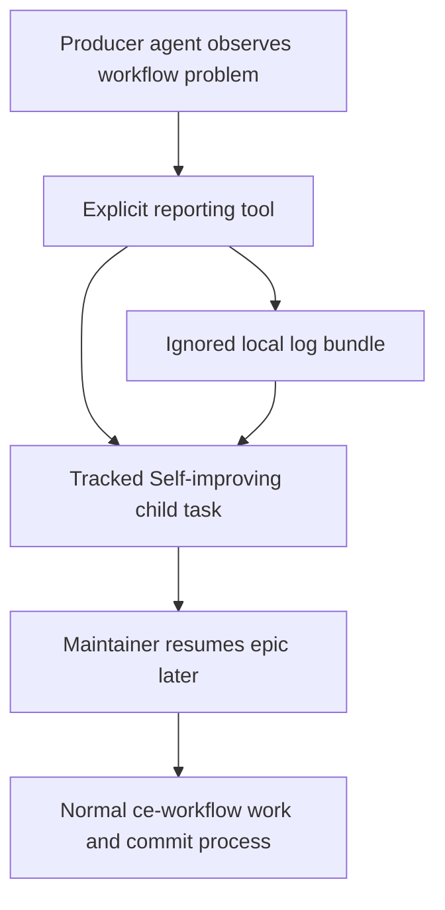
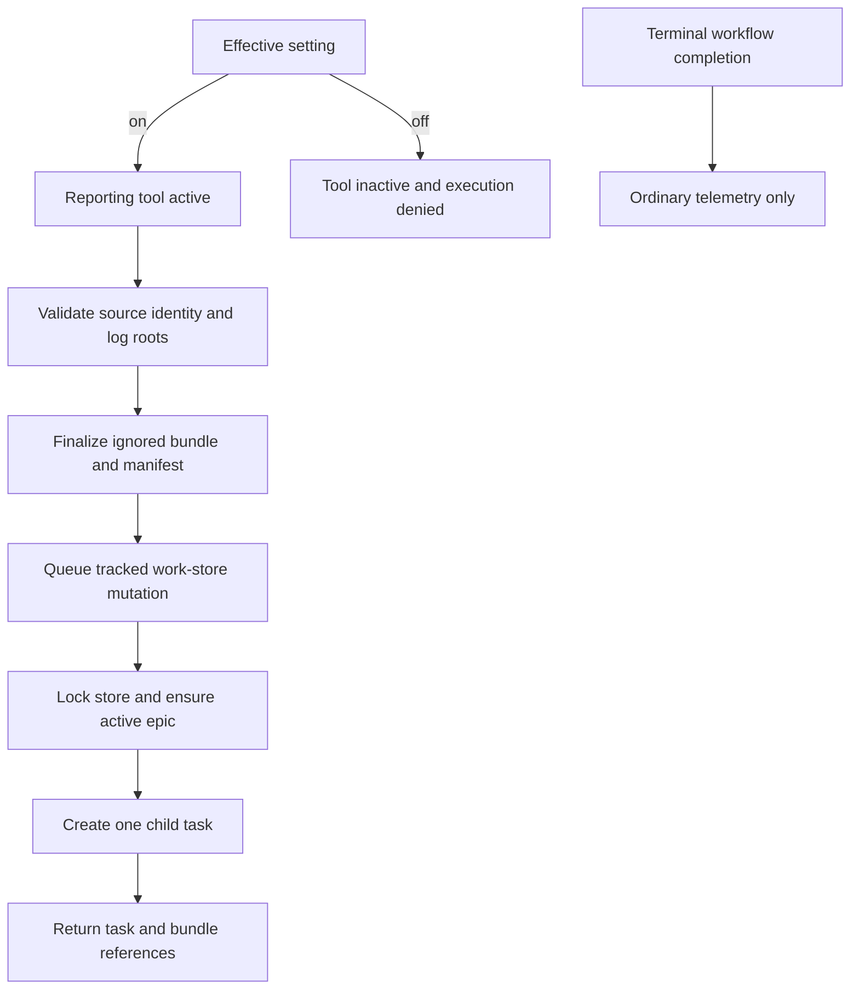

# Self-improvement Reporting - Plan

## Goal Capsule

- **Objective:** Let running projects report ce-workflow problems without changing ce-workflow source, then process those reports later through the existing work-item workflow.
- **Authority:** The Product Contract controls behavior and scope; the Planning Contract controls implementation; repository instructions and existing safety gates control execution.
- **Stop conditions:** Stop rather than guess if intake cannot prove the source checkout identity, ignored evidence destination, complete bundle, or durable task result.
- **Execution profile:** Implement the units in dependency order with focused characterization before removing the autonomous path.
- **Tail ownership:** The final unit owns package verification, documentation consistency, and removal of abandoned autonomous code.
- **Open blockers:** None.

---

## Product Contract

### Summary

Add an opt-in reporting tool that turns an agent-observed ce-workflow problem into one child task under a central `Self-improving` epic.
The report preserves full local logs outside Git; only a compact task record enters the tracked work store.

### Problem Frame

Self-improvement currently attempts to analyze and modify ce-workflow while consumer projects are running.
That couples unrelated projects to the source checkout's cleanliness, branch, active writers, verification, and delivery state.
Several projects may discover useful improvements concurrently, but none should need to coordinate with ce-workflow Git state or become responsible for changing the package.

The useful boundary is evidence intake.
Producer sessions are well placed to recognize friction and retain the logs that explain it; a dedicated ce-workflow maintenance session is better placed to diagnose, group, implement, verify, and commit improvements.

### Key Decisions

- **Reporting is explicit rather than terminal-triggered.** An agent reports a concrete discovery through the tool; completed workflows do not automatically create candidates or invoke models.
- **Reports become work items immediately.** The existing locked work store and epic workflow remain the only durable task system; no inbox or import lifecycle is added.
- **Each report creates a separate task.** Intake preserves every observation instead of attempting semantic deduplication; maintenance may merge or close duplicates later.
- **Observations are required and fixes are optional.** Reporters describe what happened, what should have happened, and why it matters without needing to diagnose ce-workflow internals.
- **Large evidence stays outside Git.** Full accepted logs are copied into ignored runtime storage, while the tracked task contains only bounded metadata and artifact references.

### Actors

- A1. **Producer agent:** Runs in a consumer project, observes a ce-workflow problem, and submits evidence when reporting is enabled.
- A2. **Reporting tool:** Validates and preserves the report, then creates the central epic and child task when needed.
- A3. **Maintainer:** Resumes the `Self-improving` epic in the ce-workflow checkout and handles its tasks through the normal plan, work, review, verification, and commit flow.

### Key Flow

- F1. **Submit a report**
  - **Trigger:** A1 identifies a concrete ce-workflow failure, friction point, or avoidable cost while the effective self-improving setting is enabled.
  - **Actors:** A1, A2
  - **Steps:** A1 supplies the observation and log locations; A2 validates and copies the logs, ensures the central epic exists, and creates one child task with compact provenance.
  - **Outcome:** The producer continues without inspecting or changing ce-workflow Git state.
  - **Covered by:** R1-R12
- F2. **Process reported improvements**
  - **Trigger:** A3 chooses to resume the `Self-improving` epic.
  - **Actors:** A3
  - **Steps:** A3 reviews the report and local evidence, groups duplicates when useful, then follows the existing maintenance workflow.
  - **Outcome:** Improvements are diagnosed, changed, verified, reviewed, and committed only from the ce-workflow maintenance context.
  - **Covered by:** R13-R15

### Requirements

**Activation and reporting**

- R1. The reporting tool is available only when the effective self-improving setting is enabled for the producer project.
- R2. Only an explicit tool call creates a report; terminal workflow completion alone performs no self-improvement analysis or task creation.
- R3. A report requires an observed problem, expected behavior, impact, and at least one log location.
- R4. A report may include a suggested improvement, but intake must not require or treat it as an authoritative diagnosis.
- R5. A successful tool call creates exactly one report task and returns its stable task identifier and evidence location.
- R6. A failed tool call reports the failure clearly and must not claim that a task or complete evidence bundle was created.

**Task and evidence storage**

- R7. The tool resolves a writable ce-workflow source checkout without requiring its Git tree to be clean.
- R8. The tool creates the `Self-improving` epic when no active matching epic exists and creates every report as its child.
- R9. Concurrent producer projects must not lose, overwrite, or reuse one another's report tasks.
- R10. Each task stores bounded non-sensitive provenance including a safe producer label, opaque workflow or session identity when available, extension revision, copied bundle reference, and submission time; absolute source paths remain only in the ignored manifest.
- R11. Full accepted logs are copied to ce-workflow's ignored runtime storage and are never embedded in the tracked work-item record.
- R12. Intake creates one task per report without semantic merging; exact duplicate handling is deferred to maintenance.

**Maintenance boundary**

- R13. Producer sessions never launch an improver, modify ce-workflow source, benchmark a candidate, commit, push, revert, or wait for a clean source tree.
- R14. Resuming the `Self-improving` epic uses the existing ce-workflow work-item process; reporting adds no separate queue or task lifecycle.
- R15. Report tasks and their compact status changes remain normal tracked work state, while copied logs and generated analysis artifacts remain ignored runtime state.

**Safety and retention**

- R16. The tool accepts only regular log files from approved current-project, Pi session, subagent, or ce-workflow telemetry roots and rejects path escapes, symlinks, and unrelated local files.
- R17. Evidence limits must reject an oversized bundle clearly rather than silently truncating logs or creating a task that claims complete evidence.
- R18. Raw log content must not be copied into task titles, descriptions, notes, or other tracked fields.
- R19. Work-store initialization continues to ensure `.pi/` and `.pi-subagents/` are ignored in each project so runtime evidence does not become repository content.
- R20. Evidence uses owner-only local access where supported, remains available while its report task is open, and is removed after the task reaches a terminal state; stale unreferenced bundles are removed after a fixed grace period.

### Acceptance Examples

- AE1. **Covers R1-R2.** Given self-improving mode is off, the reporting tool is absent and terminal workflow completion creates no report.
- AE2. **Covers R3-R5, R7-R11, R20.** Given self-improving mode is on and valid logs are supplied, one call creates or reuses the `Self-improving` epic, creates one child task, copies the complete accepted logs to protected ignored storage, and returns both references.
- AE3. **Covers R7, R13.** Given the ce-workflow checkout has unrelated uncommitted changes, a valid report still succeeds without inspecting, staging, or changing source files.
- AE4. **Covers R9, R12.** Given several projects submit similar reports concurrently, each receives a distinct child task and all evidence bundles remain intact.
- AE5. **Covers R6, R16-R18.** Given a missing, unsafe, symlinked, unrelated, or oversized log path, the tool fails clearly without a successful task that claims complete evidence.
- AE6. **Covers R13-R15.** Given report tasks exist, no implementation work starts until a maintainer resumes the epic; subsequent work follows the normal tracked workflow.

### Scope Boundaries

- Autonomous candidate analysis, source mutation, benchmarking, review dispatch, commit, push, post-push validation, and revert are removed from producer-project self-improvement.
- Automatic semantic grouping and model-assisted deduplication are not part of intake.
- Log bundles and raw transcripts are not committed to Git.
- Reporting improves ce-workflow only; it does not create improvement tasks for consumer-project product code.
- Remote aggregation, hosted dashboards, and cross-machine synchronization are deferred.

### Dependencies / Assumptions

- Each producer can resolve the intended ce-workflow source checkout through the existing configured source path, environment override, or valid package checkout.
- The native work store remains the durable task authority and its lock remains the concurrency boundary for report creation.
- `.pi/` and `.pi-subagents/` remain ignored runtime roots; task records may safely reference local artifacts there without embedding their contents.
- A maintainer may commit one snapshot of tracked work state while later submissions remain unstaged for a subsequent commit.

### Sources / Research

- `README.md` defines tracked work state versus ignored runtime artifacts.
- `extensions/work-store.js` provides durable locked work-item mutation, parent epics, notes, and evidence references.
- `extensions/work-models.js` provides the effective self-improving setting, source-checkout resolution, Git-ignore initialization, telemetry paths, and native work-item creation.
- `extensions/work-improvement.js` contains the current automatic analyzer and candidate persistence that this Product Contract supersedes for producer-project runs.
- `scripts/work-improvement-runner.mjs` contains the autonomous mutation and delivery behavior that moves outside producer-project execution.

---

## Planning Contract

Product Contract changed: R10 and R20 tighten tracked provenance and local evidence retention after security review without changing the reporting flow.

### Key Technical Decisions

- KTD1. **Put intake in a focused reporting module.** Keep source resolution, evidence validation, bundle finalization, and task creation out of the already large extension entry point while reusing the native work store.
- KTD2. **Register once and control visibility with Pi's active-tool set.** Synchronize the reporting tool on session start and when settings change; recheck the effective setting during execution so a stale call fails closed.
- KTD3. **Resolve source identity without Git delivery preflight.** Preserve explicit-setting, environment, then package-root precedence and package identity checks, but do not inspect cleanliness, fetch, require an upstream, or enter the old lease/worktree path.
- KTD4. **Finalize evidence before publishing the task.** Read and hash each source through one no-follow handle, reject pre/post identity or mutation-metadata changes, then atomically rename the complete manifest-backed bundle before task creation.
- KTD5. **Use both mutation boundaries already available.** Wrap the absolute tracked store path with Pi's `withFileMutationQueue`, then call the native store's process-locked durable mutation inside that callback so in-session and cross-process writers cannot overwrite one another.
- KTD6. **Delete autonomous delivery while preserving shared benchmark primitives.** Remove analyzer, lifecycle, writer, review, Git delivery, and recovery code; retain the benchmark scoring used by workflow evaluation by moving its small execution helper into the benchmark module.
- KTD7. **Do not migrate ignored candidate history.** Existing candidate, lease, patch, and benchmark artifacts remain inert local history; no report tasks are synthesized from them.

### High-Level Technical Design

The evidence and task writes form an ordered durability boundary rather than a filesystem transaction.
A copy failure creates no task; a store failure returns an error and may leave only an ignored orphan bundle that later intake can clean by age.

### Assumptions

- Pi's documented `registerTool` and `setActiveTools` behavior is available in supported hosts; invocation-time gating remains authoritative when visibility is stale.
- One successful tool call is one report; a caller that deliberately retries after an unknown response may create another task because semantic and retry deduplication are outside the confirmed scope.
- The existing single-host native work-store lock is sufficient; network-filesystem and cross-machine writers remain out of scope.
- Evidence bundles are local maintenance artifacts; normal task closure removes referenced bundles, while a 24-hour grace period protects active work before stale unreferenced bundle cleanup.
- Empty regular files are valid evidence, but every accepted bundle must contain at least one file and remain within fixed file-count, per-file, and total-byte limits.

### Sequencing

1. Add the reporting module and characterize its trust and durability boundaries.
2. Wire the active tool and detach every terminal/startup autonomous trigger.
3. Delete dead autonomous components while preserving independent workflow evaluation behavior.
4. Align settings, package verification, documentation, and end-to-end tests.

### System-Wide Impact

- **Agent surface:** The effective self-improving setting controls a primitive reporting tool rather than an autonomous workflow writer.
- **Tracked state:** Concurrent reports update the central native store; work-item dirt remains tolerated by normal workflow gates.
- **Runtime state:** Complete log bundles and manifests stay under ignored `.pi/` storage and are referenced, never embedded, by tasks.
- **Telemetry:** Normal workflow telemetry remains available, but terminal completion and startup recovery stop producing improvement candidates or launching agents.
- **Evaluation:** Generic workflow benchmark scoring remains available to the standalone evaluation harness after autonomous delivery code is removed.

### Risks and Mitigations

| Risk | Mitigation |
| --- | --- |
| A crafted path copies unrelated or changing local data. | Restrict canonical roots, reject symlinks and non-regular files, copy and hash through one no-follow handle, and reject pre/post identity or mutation-metadata changes. |
| Evidence finalizes but task persistence fails. | Return failure without a task claim; keep only an ignored uniquely named orphan and clean stale unreferenced bundles safely. |
| Concurrent reporters create duplicate epics or overwrite children. | Find or create the exact active epic and create its child in one mutation protected by Pi's mutation queue and the native store lock. |
| Dynamic settings leave a stale visible or hidden tool. | Refresh the active set on session start and settings writes, and always enforce the effective setting inside execution. |
| Removing the autonomous runner breaks workflow evaluation. | Move the small benchmark execution primitive before deleting runner imports and retain focused benchmark tests. |
| Raw logs or secrets enter Git or persist indefinitely. | Keep absolute paths and raw content in owner-only ignored bundles, store only sanitized bounded task provenance, remove bundles after task closure, and age out stale unreferenced bundles. |

---

## Implementation Units

### U1. Safe report intake and evidence bundle

- **Goal:** Add a dependency-free reporting service that validates a submission, resolves the central checkout, finalizes complete ignored evidence, and creates one durable child task.
- **Requirements:** R3-R12, R15-R20; F1; AE2-AE5; KTD1, KTD3-KTD5.
- **Dependencies:** None.
- **Files:** `extensions/work-improvement-reporting.js` (new), `extensions/work-store.js`, `scripts/test-work-improvement-reporting.mjs` (new).
- **Approach:** Define bounded structured report fields and approved evidence roots; use the existing source identity precedence without delivery preflight; copy and hash accepted files through stable no-follow handles into an owner-only ignored bundle; finalize its manifest; then use `withFileMutationQueue` around one native locked mutation that ensures the exact active `Self-improving` epic and creates one child task with sanitized provenance.
- **Execution note:** Start with failing characterization for unsafe paths, incomplete bundles, and concurrent epic creation before implementing the copy and mutation flow.
- **Patterns to follow:** Durable `mutateStore` replacement in `extensions/work-store.js`; bounded regular-file and no-follow checks currently in `scripts/work-improvement-runner.mjs`; runtime artifact conventions in `extensions/work-models.js`.
- **Test scenarios:**
  1. Covers AE2. A valid report with one or several files creates one finalized bundle, manifest, active epic, and child task whose returned IDs resolve from the central store.
  2. Covers AE3. A valid dirty source checkout succeeds without Git status, fetch, staging, branch, or upstream checks.
  3. Covers AE4. Parallel submissions with no existing epic create one active epic and distinct children with independent intact bundles.
  4. Covers AE5. Missing, directory, symlinked, path-escaped, unrelated-root, unreadable, growing, same-size rewritten, and oversized inputs fail before a successful task claim.
  5. Injected copy, rename, lock, validation, and store-replacement failures never leave a task pointing at incomplete evidence or return a success ID.
  6. Task fields contain sanitized bounded provenance but no absolute source paths or raw logs; the manifest retains full source provenance only inside the ignored bundle.
  7. Owner-only protection applies where supported, task closure removes its bundle, and stale unreferenced bundles are removed only after the 24-hour grace period.
- **Verification:** Focused tests prove complete-bundle and durable-task outcomes, trust-boundary rejection, concurrent child creation, and bounded tracked data.

### U2. Setting-gated tool and producer lifecycle replacement

- **Goal:** Expose explicit reporting only while enabled and remove automatic improvement work from workflow completion and startup.
- **Requirements:** R1-R6, R13-R14; F1-F2; AE1-AE3, AE6; KTD2, KTD7.
- **Dependencies:** U1.
- **Files:** `extensions/work-models.js`, `scripts/test-work-improvement-reporting.mjs`, `scripts/test-work-settings.mjs`, `scripts/test-work-telemetry.mjs`, `scripts/test-work-start-finish.mjs`.
- **Approach:** Register the primitive reporting tool with structured arguments and bounded success details; activate or deactivate it from effective settings through Pi's active-tool API; recheck the setting during execution; detach terminal claims, coded analysis, startup recovery, active-run bookkeeping, dirty-source confirmation, and autonomous status from producer workflows while retaining normal telemetry.
- **Patterns to follow:** Existing `pi.registerTool` result shapes, `workResumeSettings`, settings-loop updates, work-item wrappers, and ordinary telemetry completion in `extensions/work-models.js`; Pi's documented dynamic-tool activation pattern.
- **Test scenarios:**
  1. Covers AE1. Disabled sessions exclude the tool from the active set, reject a stale direct invocation, and create no terminal or startup report.
  2. Enabling and disabling through global defaults and project overrides updates the active set without dropping unrelated tools.
  3. Covers AE2. A real tool call validates structured fields and returns task ID, epic ID, source identity, and finalized bundle references.
  4. Invalid input and intake failures are tool errors with bounded messages and no false success details.
  5. Covers AE6. Terminal completion, restart recovery, and old improvement telemetry produce only normal telemetry and never create tasks or launch subagents.
  6. Print, JSON, RPC, and TUI modes preserve the same non-interactive reporting boundary without UI confirmation.
- **Verification:** Extension fixtures prove dynamic visibility, invocation-time gating, stable tool responses, and complete removal of automatic producer triggers.

### U3. Remove autonomous pipeline and preserve evaluation primitives

- **Goal:** Delete the superseded autonomous analyzer and delivery surface without regressing the standalone workflow evaluation harness.
- **Requirements:** R2, R12-R15; AE1, AE6; KTD6-KTD7.
- **Dependencies:** U2.
- **Files:** `extensions/work-improvement.js` (delete), `scripts/work-improvement-runner.mjs` (delete), `agents/workflow-improver.md` (delete), `agents/workflow-improvement-reviewer.md` (delete), `scripts/test-work-improvement-analyzer.mjs` (delete), `scripts/test-work-improvement-delivery.mjs` (delete), `scripts/test-work-improvement-git.mjs` (delete), `scripts/test-work-improvement-lifecycle.mjs` (delete), `scripts/work-improvement-benchmark.mjs`, `scripts/test-work-improvement-benchmark.mjs`, `scripts/workflow-evaluation-score.mjs`.
- **Approach:** Move the small benchmark gate executor into the benchmark module, confirm evaluation imports remain standalone, then remove candidate detection, state transitions, leases, worktrees, improver/reviewer dispatch, benchmark orchestration, commit/push/revert, and recovery code plus their exclusive tests and agents.
- **Execution note:** Delete only after U2 tests prove no production call sites remain; use reference search to prevent leaving dynamic imports or package assertions behind.
- **Patterns to follow:** Existing pure benchmark scoring functions and assert-style benchmark tests in `scripts/work-improvement-benchmark.mjs` and `scripts/test-work-improvement-benchmark.mjs`.
- **Test scenarios:**
  1. Benchmark quality gates and cost scoring return the same decisions after the helper relocation.
  2. Workflow evaluation scoring imports benchmark primitives without loading an autonomous runner.
  3. No extension, script, agent registration, or package verification path references deleted analyzer or delivery files.
  4. Existing ignored candidate artifacts are not read, migrated, converted to tasks, or treated as blockers.
- **Verification:** Reference search is clean, benchmark/evaluation tests pass, and the package contains no autonomous writer, reviewer, delivery, or recovery surface.

### U4. Package contract and operational documentation

- **Goal:** Make the new reporting boundary authoritative across settings, package checks, docs, and the full deterministic suite.
- **Requirements:** R1-R20; F1-F2; AE1-AE6.
- **Dependencies:** U1-U3.
- **Files:** `scripts/verify-package.mjs`, `README.md`, `skills/work-orchestrator/SKILL.md`, `skills/work-orchestrator/references/full-policy.md`, `.gitignore`, `docs/plans/2026-07-15-001-feat-ce-workflow-evaluation-harness-plan.md`, `package.json` when package assertions require it.
- **Approach:** Register the focused reporter test, remove deleted autonomous file expectations, rename settings/status copy from autonomous delivery to explicit reporting, document tracked task versus ignored evidence behavior, and update stale references in the evaluation plan while retaining its benchmark rationale.
- **Patterns to follow:** Existing package-surface assertions and sequential script registry in `scripts/verify-package.mjs`; tracked/runtime state wording in `README.md`; work-store initialization's Git-ignore writer.
- **Test scenarios:**
  1. Package verification executes the reporting, settings, telemetry, start/finish, benchmark, and evaluation fixtures required by the affected surface.
  2. Packed package contents include the reporting module and exclude deleted autonomous agents/scripts/modules.
  3. Settings and policy output describe explicit reporting and maintainer processing without promising terminal analysis or autonomous source delivery.
  4. `.pi/` and `.pi-subagents/` initialization remains idempotent and copied report bundles never appear in Git status.
- **Verification:** Full package verification and package dry-run pass with documentation and shipped files matching the new behavior.

---

## Verification Contract

| Gate | Applies to | Required outcome |
| --- | --- | --- |
| `node scripts/test-work-improvement-reporting.mjs` | U1, U2 | Tool, evidence, concurrency, failure, and lifecycle replacement scenarios pass. |
| `node scripts/test-work-settings.mjs` | U2, U4 | Effective setting precedence and active-tool synchronization pass. |
| `node scripts/test-work-telemetry.mjs` | U2 | Ordinary telemetry remains complete without candidate or autonomous launch side effects. |
| `node scripts/test-work-start-finish.mjs` | U2 | Workflow completion and restart paths remain functional without improvement claims. |
| `node scripts/test-work-improvement-benchmark.mjs` | U3 | Benchmark scoring and gate execution survive runner removal. |
| `node scripts/test-work-native-smoke.mjs` | U1, U4 | Native store and ignored-runtime initialization remain compatible. |
| `npm run verify:quiet` | U1-U4 | The full package suite, source assertions, and shipped surface pass. |
| `npm pack --dry-run` | U4 | The package includes required reporting artifacts and excludes removed autonomous files. |

Browser testing is not applicable because the change adds no browser-facing UI.
Behavioral acceptance requires invoking the real tool in a disposable consumer/source pair and proving the returned task and evidence are readable through normal maintainer work-item access.

---

## Definition of Done

- U1 is done when accepted logs produce one complete ignored bundle and one durable child task, while all unsafe or partial inputs fail without a false success claim.
- U2 is done when the tool follows effective settings in the active tool set and every terminal/startup autonomous trigger is absent.
- U3 is done when autonomous analyzer/delivery code and exclusive agents/tests are removed and workflow evaluation remains green.
- U4 is done when settings, policy, documentation, package assertions, and packed contents describe and ship only the explicit reporting process.
- Every Product Contract acceptance example is covered by a focused or package-level executable check.
- No raw logs, absolute producer paths, temporary bundles, candidate history, generated reports, or abandoned autonomous implementation remain in the tracked diff.
- No required gate is weakened, skipped, or replaced with an assertion that only checks source text.
- The final diff contains no dead imports, stale references, experimental code, or unrelated cleanup.
