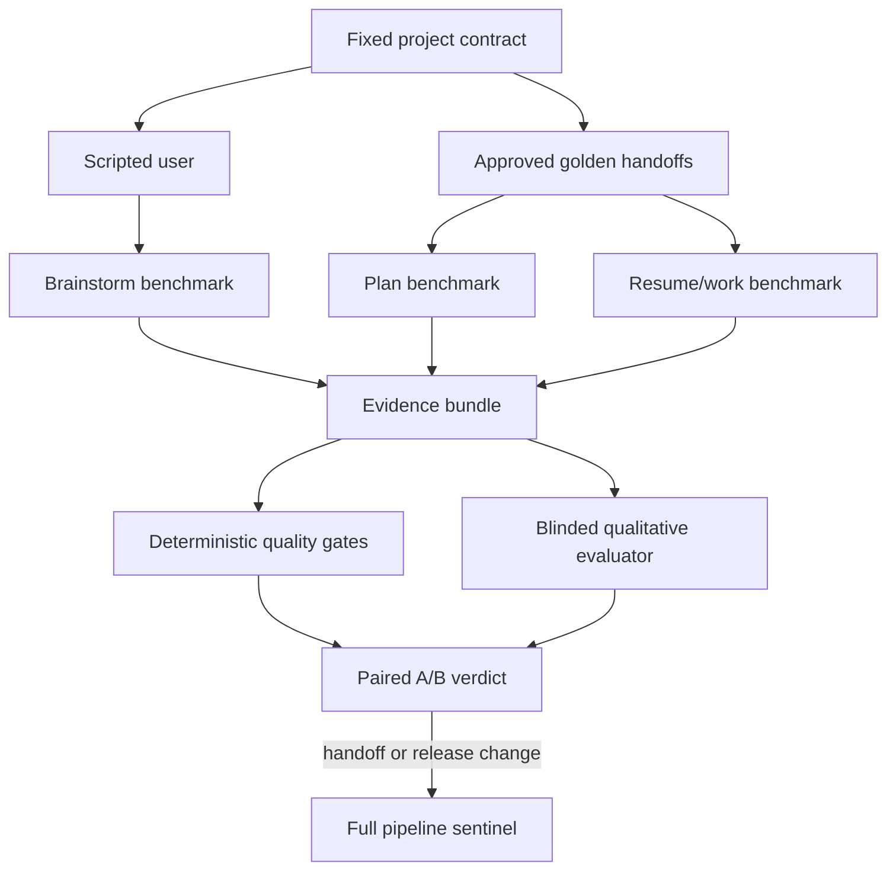
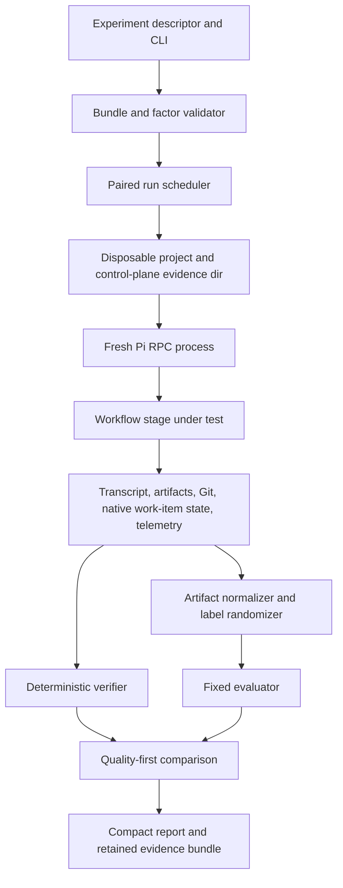
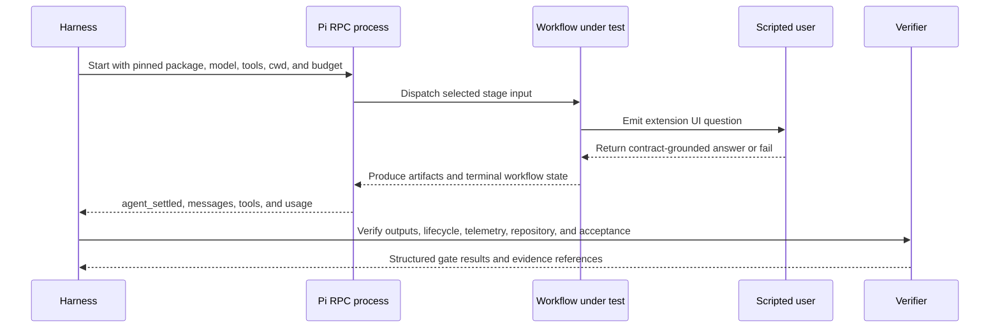
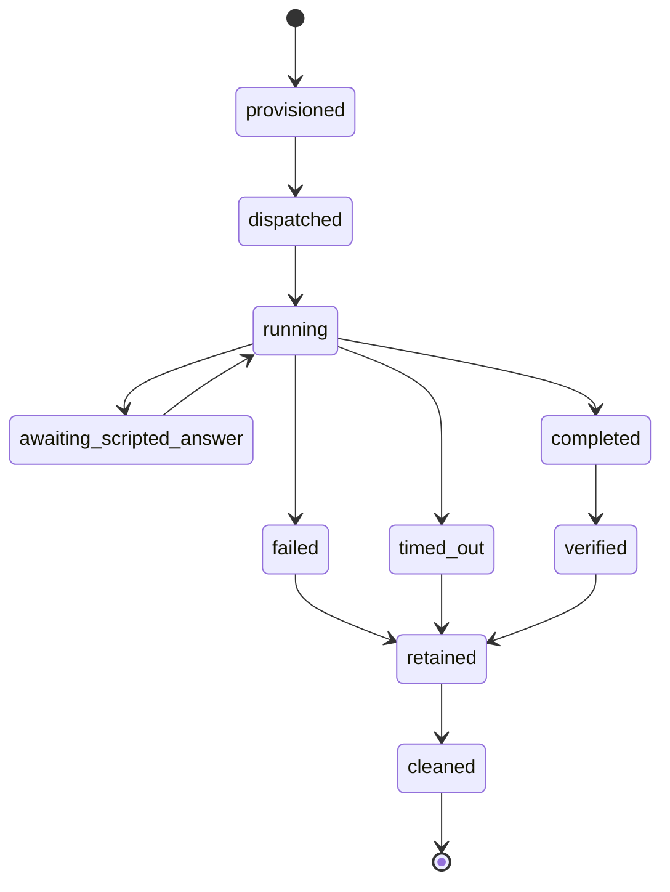
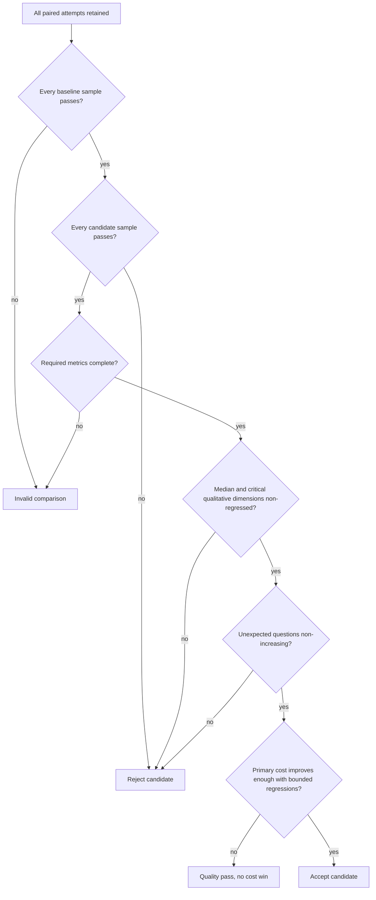

# CE Workflow Evaluation Harness - Plan

## Goal Capsule

- **Objective:** Make ce-workflow optimization measurable through repeatable quality, reliability, token, and runtime comparisons.
- **Product authority:** The versioned benchmark project contracts, approved golden handoffs, acceptance suites, and scoring rubrics define expected behavior.
- **Open blockers:** None for implementation; decision-grade use still requires one-time human approval of each generated golden brainstorm and plan.
- **Execution profile:** Deep, dependency-ordered implementation with deterministic fixtures before credentialed provider or browser runs.
- **Stop conditions:** Stop rather than weaken hidden-contract isolation, quality gates, telemetry completeness, or one-factor comparability; unavailable credentials or browser capability block only the affected live evidence gate.
- **Tail ownership:** The executor owns code, fixtures, evidence, and verification; a human owns golden approval and any benchmark-contract change.

---

## Product Contract

**Product Contract preservation:** unchanged.

### Summary

Build a local paired A/B evaluation harness around two fixed projects.
Routine experiments isolate brainstorm, plan, or resume/work against stable golden handoffs, while occasional full pipelines verify that the stages still compose.

### Problem Frame

ce-workflow changes can reduce tokens or simplify orchestration without proving that the resulting questions, plans, implementations, and reviews remain reliable.
The current repository has deterministic fixtures and named agent scenarios, but its agent-backed benchmark delegates existing test scripts to a wrapper agent rather than completing representative projects.
Maintainers therefore lack a stable way to compare role agents, reviewer strategies, effort levels, prompts, and workflow changes without model variance and upstream-stage noise obscuring the result.

### Key Decisions

- **Isolate stages by default.** Each stage receives the same approved input so a brainstorm experiment does not contaminate plan or execution comparisons.
- **Keep a tiered integration check.** Full pipelines run only for release-critical changes or handoff-contract changes because isolated stages cannot detect every composition regression.
- **Use two complementary projects.** A browser-tested themed calculator covers UI behavior, while a CSV expense analyzer covers logic, validation, and file-based output.
- **Compare one factor at a time.** A candidate changes one mode, role, reviewer strategy, effort setting, prompt, or workflow behavior relative to a fixed baseline.
- **Treat quality as a gate.** Lower cost cannot compensate for failed behavior, bugs, incomplete artifacts, unapproved interruptions, or a meaningful qualitative regression.
- **Use stable qualitative judgment.** One fixed, blinded, high-effort evaluator scores both sides with the same versioned rubric and cannot see which artifact is baseline or candidate.

### Actors

- A1. **ce-workflow maintainer** selects the baseline, candidate override, project, stage, and run depth, then uses the comparison to make an optimization decision.
- A2. **scripted benchmark user** supplies fixed project answers, records unexpected questions, and continues from the hidden project contract when an answer is available.
- A3. **workflow under test** performs the selected brainstorm, plan, or resume/work stage in a disposable project environment.
- A4. **blinded evaluator** grades qualitative artifacts without knowing their configuration labels.
- A5. **deterministic verifier** checks project behavior, artifact contracts, lifecycle gates, telemetry completeness, and repository state.

### Evaluation Model



### Requirements

**Benchmark projects and contracts**

- R1. The suite must contain a fixed themed-calculator project with a versioned acceptance matrix for calculations, theme behavior and persistence, keyboard and accessibility basics, browser interaction, and fixed-viewport screenshot evidence.
- R2. The suite must contain a fixed CSV expense analyzer project with a versioned acceptance matrix for accepted input, malformed-row behavior, category aggregation, deterministic report output, and failure cases.
- R3. Each project must bundle one immutable version of its hidden product contract, scripted answer bank, fresh seed repository, executable acceptance checks, qualitative rubric, approved golden brainstorm, and approved golden plan.
- R4. The workflow under test must see only the selected stage input and scripted answers; hidden contracts, acceptance matrices, goldens not used as stage inputs, and evaluator labels must remain unavailable to it.
- R5. Each project must require at least two execution slices so resume/work evaluation exercises planning, handoff, continuation, and finalization rather than a one-step task.
- R6. Golden brainstorms and plans must be generated once, human-approved against exact bundle versions and passing checks, and changed only through an explicit benchmark-contract update with retained approval evidence.

**Stage-isolated evaluation**

- R7. A brainstorm benchmark must start every configuration from the same project request and scripted user state, then evaluate the questions, interaction path, requirements artifact, review option, and measured cost.
- R8. A plan benchmark must start every configuration from the same approved golden brainstorm, then evaluate requirement preservation, decisions, slicing readiness, verification coverage, review option, and measured cost.
- R9. A resume/work benchmark must start every configuration from the same approved golden plan and fresh seed repository, continue through all planned slices without routine human intervention, and verify the finished product.
- R10. The scripted user must answer expected questions from fixed responses, answer unexpected questions from the hidden project contract when possible, and record every unexpected question as a critical comparison metric.
- R11. An unexpected question with no contract-grounded answer must fail the run rather than invent or silently default a product decision.
- R12. Routine comparisons must run one selected stage only; simplify and compound are not part of the first benchmark contract.

**Comparison and scoring**

- R13. Every experiment must fingerprint and match all non-factor inputs: ce-workflow revision, project bundle, resolved role settings, provider and model identity, effort, evaluator, runtime, dependencies, browser, operating environment, and rubric version.
- R14. V1 may vary one declared factor among workflow mode, role agent, reviewer presence or strategy, role effort, prompt revision, or ce-workflow revision; no-op, undeclared, or multi-factor deltas invalidate the comparison unless predeclared as an interaction test.
- R15. A smoke comparison must run once per side for fast failure detection and must not be presented as decision-grade evidence.
- R16. A decision comparison must run three fresh paired samples per side, alternate baseline/candidate order, retain every attempt, and report raw paired deltas, medians, and min/max spread.
- R17. A confirmed infrastructure failure may replace its paired sample once; a second failure at that pair index or any selective retry invalidates the decision verdict.
- R18. Every raw baseline and candidate sample must pass its stage and project hard gates; a baseline failure invalidates the comparison, while a candidate failure rejects the candidate.
- R19. Deterministic gates must cover required product behavior, bugs, artifact validity, required workflow gates, completion state, telemetry presence, unexpected interruptions, and clean repository finalization.
- R20. Each versioned stage rubric must define anchored scores, critical dimensions, unexpected-question treatment, ties, aggregation, and evaluator-failure handling before it can produce a verdict.
- R21. The blinded evaluator must score question quality, requirement coverage, plan quality, plan adherence, implementation quality, and unnecessary work using the approved stage rubric.
- R22. A candidate must fail when its median qualitative score falls below the baseline, any critical rubric dimension regresses, or its unexpected-question count increases.
- R23. Workflow cost must cover only the selected stage from dispatch to terminal state; harness setup, deterministic verification, and evaluator cost must be reported separately.
- R24. A cost verdict requires complete tokens, wall time, tool and subagent calls, tool output, retries, context growth, and question-count measurements for both sides.
- R25. After quality passes, a cost win requires at least 5% improvement in the declared primary metric or equal-weight aggregate, at least one improved dimension, and no required dimension more than 10% worse; unchanged-run calibration may raise but not lower these thresholds.
- R26. Every project-stage bundle must set approved wall-time and token ceilings for smoke, decision, and sentinel depths from baseline calibration; exceeding a ceiling stops the run and prevents a passing verdict.

**Integration and evidence**

- R27. A full brainstorm-to-plan-to-resume sentinel must run for both projects before accepting a change to stage input/output contracts, artifact semantics, cross-stage routing, completion/finalization behavior, or default ce-workflow behavior.
- R28. Full-pipeline runs must pass each stage's hard gates and the finished product's acceptance checks without substituting golden artifacts between stages.
- R29. Every comparison must produce a compact report plus an evidence bundle containing configuration fingerprints, declared factor delta, prompts, scripted exchanges, artifacts, plans, diffs, telemetry, evaluator results, test output, screenshots where applicable, bugs, all failed attempts, and final verdict.
- R30. Reports must distinguish deterministic facts, evaluator judgments, workflow cost, harness and evaluator cost, infrastructure failures, invalid comparisons, and benchmark-contract changes.
- R31. The harness must run locally from one command in fresh disposable directories and contexts, and it must not modify the ce-workflow checkout or retained project bundles during a comparison.

### Key Flows

- F1. **Stage smoke comparison**
  - **Trigger:** A1 wants fast feedback on one ce-workflow change.
  - **Actors:** A1, A2, A3, A4, A5
  - **Steps:** Select one project and stage, run baseline and candidate once from the same fixed input, apply gates and rubric, then preserve a diagnostic report.
  - **Outcome:** Obvious failures stop cheaply; the result is labeled non-decision-grade.
  - **Covered by:** R7-R15, R18-R26, R29-R31

- F2. **Decision-grade comparison**
  - **Trigger:** A smoke result is promising or a maintainer needs evidence for a configuration choice.
  - **Actors:** A1, A2, A3, A4, A5
  - **Steps:** Run three paired samples per side, blind the evaluator labels, aggregate quality and cost evidence, enforce quality gates, and issue a comparison verdict.
  - **Outcome:** The report shows whether the single candidate factor improves cost without reducing reliability or output quality.
  - **Covered by:** R13-R26, R29-R31

- F3. **Full-pipeline sentinel**
  - **Trigger:** A change covered by the mandatory sentinel conditions passes relevant isolated checks.
  - **Actors:** A1, A2, A3, A4, A5
  - **Steps:** Start from each original project request, carry actual outputs through brainstorm, plan, and resume/work, then verify the finished products and every handoff.
  - **Outcome:** Integration regressions that goldens would mask are caught before the change is trusted.
  - **Covered by:** R27-R31

- F4. **Golden contract update**
  - **Trigger:** The intended benchmark project or ce-workflow artifact contract changes.
  - **Actors:** A1, A4, A5
  - **Steps:** Generate candidate goldens, review them against the hidden project contract, approve the contract change, and retain before/after evidence.
  - **Outcome:** Goldens evolve deliberately without silently moving the baseline during an experiment.
  - **Covered by:** R3-R6, R13, R29-R30

### Acceptance Examples

- AE1. **Covers R7, R10, R20-R22.** Given the same calculator request and scripted answers, when two brainstorm configurations run, then both are graded on whether they ask necessary, non-duplicate questions and produce a complete requirements artifact rather than on matching exact wording.
- AE2. **Covers R8, R13-R14.** Given one approved CSV-analyzer brainstorm, when only the planner effort changes from medium to high, then both plans receive identical non-factor settings and the report attributes the delta to that declared factor.
- AE3. **Covers R9, R18-R19, R22.** Given an approved calculator plan with at least two slices, when a cheaper worker configuration completes with fewer tokens but the theme fails to persist in browser verification, then the candidate fails before cost is considered.
- AE4. **Covers R10-R11, R22.** Given a workflow asks an unanticipated preference question, when the hidden contract contains the answer, then the scripted user answers, records the critical metric, and continues; when the contract has no answer, the run fails as an autonomy regression.
- AE5. **Covers R15-R17.** Given one successful smoke pair, when a maintainer requests decision-grade evidence, then each side runs three fresh paired samples and the report exposes all attempts, medians, and spread rather than promoting or selectively retrying the smoke result.
- AE6. **Covers R20-R25.** Given blinded artifacts labeled without configuration identity, when the candidate saves time but its median plan-quality score or a critical traceability dimension is lower, then the candidate is not accepted.
- AE7. **Covers R27-R28.** Given isolated stages pass after a handoff-contract change, when the mandatory full sentinel runs, then actual brainstorm output feeds actual planning output and actual execution for both projects without golden substitution.
- AE8. **Covers R17, R29-R30.** Given a provider timeout interrupts one sample, when one replacement also fails at that pair index, then the comparison is invalid and both failures remain in the evidence bundle rather than becoming a product-quality verdict.
- AE9. **Covers R18, R24-R25.** Given baseline and candidate both omit a required metric or both fail the same hard gate, when results are aggregated, then the comparison is invalid rather than accepting equal failure.
- AE10. **Covers R26.** Given a stage exceeds its approved smoke token or wall-time ceiling, when the limit is reached, then the run stops, preserves evidence, and cannot report a passing smoke result.

### Success Criteria

- Maintainers can compare medium versus high effort, alternative reviewers, reviewer presence, role agents, prompts, or workflow behavior without changing more than one factor per experiment.
- Every decision-grade verdict is reproducible from retained inputs, fingerprints, all attempts, raw measurements, deterministic results, and blinded rubric evidence.
- The two execution projects complete from fresh seeds, pass their versioned acceptance matrices, and expose product bugs as hard failures.
- Routine stage comparisons stay within approved per-stage budgets, while mandatory sentinel runs catch real handoff regressions.
- Re-running an unchanged baseline establishes thresholds and budgets that reject normal platform variance as an optimization claim.

### Scope Boundaries

- Defer simplify and compound stage evaluation until the core three stages produce trustworthy comparisons.
- Defer CI and pull-request gating until local runs are stable, bounded, and operationally affordable.
- Defer a local or hosted dashboard; reports and evidence bundles are the first interface.
- Defer full configuration matrices and automatic multi-factor search; explicit one-factor experiments are the default.
- Exclude exact-text golden matching, self-evaluation by the workflow under test, and cost wins that waive product-quality gates.

### Dependencies / Assumptions

- Real Pi sessions can expose enough usage and timing telemetry to measure the selected cost dimensions; unavailable fields must be reported as missing rather than estimated.
- Browser automation and fixed-viewport screenshot capture are available for the calculator project.
- The fixed evaluator model and settings remain available during each paired comparison; a changed evaluator fingerprint invalidates the pair.
- Initial unchanged-run calibration must approve stage budgets and may only raise the existing 5% improvement and 10% per-dimension regression thresholds; it cannot weaken the no-quality-regression rule.

### Sources / Research

- `scripts/work-improvement-benchmark.mjs` defines the current benchmark manifest, cost dimensions, sampling, and quality-first acceptance policy.
- `scripts/work-improvement-runner.mjs` shows that current named agent scenarios delegate existing test scripts rather than complete representative projects.
- `agents/workflow-benchmark.md` defines the current read-only benchmark runner boundary.
- `README.md` documents the staged workflow, role and effort configuration, review levels, telemetry, browser gate, simplify gate, and resume behavior this harness must evaluate.
- `docs/plans/2026-07-11-001-feat-autonomous-workflow-improvement-plan.md` established the earlier requirement for representative quality and workflow-cost scenarios.

---

## Planning Contract

### Key Technical Decisions

- KTD1. **Ship a standalone Node.js harness before adding another `/work-*` command.** `node scripts/workflow-evaluation.mjs` is the single local entry point; extension UI integration is deferred until the standalone path is reliable.
- KTD2. **Store immutable benchmark inputs under one versioned control-plane root.** `benchmarks/workflow-evaluation/v1/` contains project contracts, answer banks, acceptance checks, rubrics, seed repositories, goldens, and approval records; tested agents receive only copied stage inputs inside disposable projects.
- KTD3. **Run every sample in a fresh Pi RPC subprocess.** RPC provides process isolation, exact model/thinking configuration, lifecycle events, tool events, token statistics, and an extension-UI protocol that can answer `ask_user` prompts from the scripted answer bank. The client uses strict LF-delimited JSONL parsing rather than Node `readline`.
- KTD4. **Load and verify the exact ce-workflow revision for each side.** Each RPC process loads the selected local package checkout, records command/resource provenance, and fails before dispatch when the resolved workflow resources do not fingerprint to that checkout or when baseline and candidate differ outside the declared factor.
- KTD5. **Keep the harness control plane outside tested working directories.** Hidden contracts, acceptance checks, non-input goldens, side labels, evaluator identity, and retained evidence never enter agent-visible context; filesystem audits reject writes to the source checkout, bundle root, or sibling sample directories.
- KTD6. **Model each sample as a durable, idempotent lifecycle.** State transitions and evidence are append-only so interruption can be reconciled without selective retry; completion requires structured RPC settlement plus artifact, Git, native work-item state, telemetry, and acceptance evidence rather than an assistant prose claim.
- KTD7. **Reuse quality-first scoring policy without forcing the old synthetic evidence shape onto representative runs.** The new scorer imports the existing 5% improvement and 10% per-dimension regression thresholds, but owns paired order, raw samples, spread, unexpected questions, rubric judgments, retry classification, and the larger required metric set.
- KTD8. **Separate deterministic gates from blinded qualitative judgment.** Acceptance behavior, artifact validity, lifecycle state, telemetry, repository finalization, and forbidden writes are coded gates; a fixed `workflow-evaluator` role sees normalized, randomly labeled artifacts and a versioned rubric only after deterministic gates pass.
- KTD9. **Treat browser execution as a capability adapter, not a hidden dependency.** Calculator acceptance declares a fixed viewport and screenshot contract behind an injected browser runner; an unavailable or mismatched runner produces an explicit invalid live run, while deterministic tests use a fake adapter.
- KTD10. **Calibrate before permitting decision verdicts.** Unchanged baseline pairs establish stage/project budgets and noise floors; calibration may raise the Product Contract thresholds but never lower them or waive quality gates.
- KTD11. **Treat evaluated package revisions as trusted code, not sandboxed input.** Pi extensions run with the user's system permissions, so path guards protect against accidental agent/tool leakage but not a malicious extension. V1 refuses untrusted revisions unless the operator supplies an external OS/container sandbox; reports name the trust posture.

### High-Level Technical Design

#### Component and data-flow topology



#### One sample protocol



#### Sample lifecycle



#### Quality-first verdict flow



#### Run-depth matrix

| Depth | Samples | Inputs | Purpose | Decision authority |
| --- | ---: | --- | --- | --- |
| Smoke | One fresh pair | One project and one stage | Fast failure detection | Diagnostic only |
| Decision | Three fresh alternating pairs | One project and one stage | Quality and cost comparison | Candidate verdict |
| Sentinel | One fresh run per side and project | Actual brainstorm to plan to work handoffs | Composition regression detection | Required for trigger classes in R27 |
| Calibration | Three unchanged fresh pairs | Same revision and configuration on both sides | Noise floor and budgets | Enables later decision verdicts |

### Output Structure

```text
benchmarks/workflow-evaluation/v1/
├── manifest.json
└── projects/
    ├── calculator/
    │   ├── project.json
    │   ├── product-contract.md
    │   ├── answers.json
    │   ├── rubric.json
    │   ├── acceptance/
    │   ├── goldens/
    │   └── seed/
    └── csv-expenses/
        ├── project.json
        ├── product-contract.md
        ├── answers.json
        ├── rubric.json
        ├── acceptance/
        ├── goldens/
        └── seed/
scripts/
├── workflow-evaluation-contract.mjs
├── workflow-evaluation-rpc.mjs
├── workflow-evaluation-score.mjs
└── workflow-evaluation.mjs
```

Runtime workspaces and evidence live under the operating system temporary directory, never under this tracked structure.

### Sequencing

1. Establish the versioned contract and deterministic bundle validators.
2. Make each project independently executable and verifiable from a copied seed.
3. Prove RPC question handling, isolation, telemetry, and completion with fake protocol fixtures.
4. Add smoke lifecycle and retained evidence before comparison scoring.
5. Add blinded evaluation, decision sampling, calibration, and sentinels only after one-sample behavior is trustworthy.
6. Wire package verification and documentation last so the existing package gate covers the finished surface.

### Implementation Constraints

- Use Node.js built-ins and existing peer packages; add no runtime dependency unless the browser capability probe proves the host cannot satisfy R1 and the user approves the dependency.
- Bound transcript, tool-output, patch, and evaluator payload sizes; retain full raw files outside model context and place references in reports.
- Use strict JSON parsing and explicit schema checks at every trust boundary; malformed bundle, RPC, telemetry, evaluator, or acceptance data invalidates the affected run.
- Do not expose credentials in experiment descriptors, fingerprints, reports, or retained evidence.
- Do not mutate the Product Contract, benchmark bundles, or source checkouts during ordinary comparisons.
- Keep the existing `workflow-benchmark` role and synthetic benchmark operational as the fast package-surface gate; representative evidence comes only from this harness.

### Deferred Implementation Notes

- Exact helper names and internal JSON field ordering may change during implementation as long as the versioned artifact contracts and evidence semantics remain stable.
- The browser adapter may bind to an existing host capability or an approved dependency after capability probing; the fixed viewport, screenshot evidence, and fail-closed behavior are not deferred.
- Provider-specific transient-error classifiers should begin with documented RPC retry events and bounded known patterns, then expand only from retained infrastructure failures.

### System-Wide Impact

- **Package resources:** RPC runs must disable ambient ce-workflow resources and load an explicit allowlist containing the selected package revision plus pinned dependency packages. Command, skill, prompt, extension, and role provenance becomes comparison evidence; duplicate ownership is a preflight failure.
- **Credentials and trust:** Provider credentials remain outside evidence but are available to the Pi process. Only maintainer-trusted revisions may run without an external sandbox, and the report must state whether isolation is path-level or OS-level.
- **Telemetry:** Session usage and `.pi/work-runs` events share one sample identity. Reconciliation must exclude harness/evaluator activity, prevent duplicate terminal accounting, and preserve workflow, harness, and evaluator cost as separate totals.
- **Git and native work-item state:** Each work sample owns an independent repository and `.ce-workflow/work-items.json` store. Full sentinels share these only across sequential stages of the same sample; no state crosses sides, pairs, replacements, or projects.
- **Published package:** Adding benchmark bundles increases package contents and verification time. Runtime evidence, screenshots, temporary settings, copied credentials, and disposable repositories remain excluded from the package and Git.
- **Existing improvement loop:** The synthetic `workflow-benchmark` gate remains unchanged. The representative harness can become a later gate only after local calibration proves its cost and reliability.
- **Cross-platform execution:** Process-tree termination, path containment, file permissions, line endings, and browser discovery must be verified on Windows and one POSIX environment before results are considered portable.

### Risks & Dependencies

- **Full-permission candidate code — high:** A malicious extension can read credentials or files outside the disposable cwd despite tool guards. Restrict V1 to trusted revisions, surface the trust posture, and require an external sandbox for untrusted code.
- **Hidden-contract leakage — high:** Paths, errors, transcripts, environment variables, or evaluator packaging can reveal authority data. Use opaque control-plane identifiers, content redaction, symlink-aware containment checks, and negative leakage fixtures over every retained artifact.
- **Ambient resource drift — high:** Global packages, project settings, context files, or duplicate commands can silently change behavior. Build an explicit resource allowlist, record provenance and hashes, and fail preflight on missing, extra, or ambiguous workflow resources.
- **Incorrect stage cost attribution — high:** Retries, compaction, subagents, queued continuations, evaluator work, or duplicate terminal events can contaminate selected-stage metrics. Correlate all events to one sample identity and invalidate incomplete or multiply-accounted telemetry.
- **Evaluator instability — high:** Model drift, label clues, malformed scoring, or rubric ambiguity can change verdicts. Pin evaluator identity/settings, normalize artifacts, version anchors and tie rules, and invalidate rather than retry selectively.
- **Provider and browser flakiness — medium:** Rate limits, unavailable credentials, process crashes, viewport drift, or missing screenshot support can dominate small samples. Classify infrastructure failures narrowly, retain attempts, calibrate ceilings, and allow only the Product Contract's symmetric single replacement.
- **Runaway cost — medium:** Decision and sentinel modes multiply agent and evaluator usage. Enforce pre-dispatch token/wall budgets, abort full process trees at ceilings, and require successful smoke before expensive depths.
- **Cross-platform cleanup — medium:** Windows process trees, reserved paths, locks, and CRLF handling can leave stale samples or corrupt RPC framing. Reuse existing Windows process/native-store handling, test strict LF framing, and make cleanup recoverable and idempotent.
- **Browser adapter availability — medium:** No browser dependency is currently declared. Capability discovery and one real fixed-viewport smoke must pass before calculator evidence is authoritative; dependency adoption requires explicit approval.
- **Human approval dependency — medium:** Generated goldens cannot become decision inputs automatically. Decision and sentinel commands stop with a clear approval requirement until exact artifact and bundle SHAs have durable human approval.

---

## Implementation Units

### U1. Versioned benchmark contract and validation

- **Goal:** Establish the immutable V1 bundle, experiment descriptor, fingerprint, approval, and evidence contracts before any live execution.
- **Requirements:** R3-R6, R13-R14, R20, R24-R26, R29-R31; F4; AE2, AE9-AE10.
- **Dependencies:** None.
- **Files:** `benchmarks/workflow-evaluation/v1/manifest.json`, `scripts/workflow-evaluation-contract.mjs`, `scripts/test-workflow-evaluation-contract.mjs`, `package.json`.
- **Approach:** Validate bundle versions, project inventory, selected stage inputs, SHA-bound golden approvals, rubric anchors and critical dimensions, run-depth budgets, declared factor paths, complete non-factor fingerprints, and evidence references. Reject undeclared, multi-factor, and no-op deltas before provisioning.
- **Execution note:** Start with failing contract fixtures for malformed and leaking bundles; no provider or browser is needed.
- **Patterns to follow:** `benchmarkEnvironment()` and canonical fingerprinting in `scripts/work-improvement-benchmark.mjs`; standalone assert-based fixtures in `scripts/test-work-improvement-benchmark.mjs`.
- **Test scenarios:**
  1. A complete V1 manifest with both project bundles and matching approval SHAs validates and yields a stable fingerprint independent of object key order.
  2. A changed non-factor model setting, bundle version, evaluator, browser, runtime, dependency, or rubric invalidates a pair.
  3. A declared factor that changes zero or multiple allowed fields is rejected unless the descriptor explicitly marks an interaction test.
  4. Missing metric definitions, rubric anchors, critical dimensions, depth budgets, golden approvals, or required hidden-resource declarations fail validation.
  5. A stage input that references a hidden contract, unrelated golden, evaluator label, or path outside the bundle fails the leakage audit.
- **Verification:** Contract fixtures prove valid bundles are stable and every malformed, ambiguous, or leaking case fails closed.

### U2. CSV expense analyzer benchmark project

- **Goal:** Add a deterministic logic-heavy project whose seed requires at least two execution slices and whose verifier can independently prove behavior.
- **Requirements:** R2-R6, R9, R19-R20, R28-R29; F1-F4; AE2, AE4-AE5, AE8-AE10.
- **Dependencies:** U1.
- **Files:** `benchmarks/workflow-evaluation/v1/projects/csv-expenses/project.json`, `benchmarks/workflow-evaluation/v1/projects/csv-expenses/product-contract.md`, `benchmarks/workflow-evaluation/v1/projects/csv-expenses/answers.json`, `benchmarks/workflow-evaluation/v1/projects/csv-expenses/rubric.json`, `benchmarks/workflow-evaluation/v1/projects/csv-expenses/goldens/brainstorm.md`, `benchmarks/workflow-evaluation/v1/projects/csv-expenses/goldens/plan.md`, `benchmarks/workflow-evaluation/v1/projects/csv-expenses/goldens/approval.json`, `benchmarks/workflow-evaluation/v1/projects/csv-expenses/seed/package.json`, `benchmarks/workflow-evaluation/v1/projects/csv-expenses/seed/src/analyze.mjs`, `benchmarks/workflow-evaluation/v1/projects/csv-expenses/seed/test/analyze.test.mjs`, `benchmarks/workflow-evaluation/v1/projects/csv-expenses/acceptance/verify.mjs`, `benchmarks/workflow-evaluation/v1/projects/csv-expenses/acceptance/fixtures/valid.csv`, `benchmarks/workflow-evaluation/v1/projects/csv-expenses/acceptance/fixtures/malformed.csv`, `benchmarks/workflow-evaluation/v1/projects/csv-expenses/acceptance/fixtures/expected-report.txt`, `scripts/test-workflow-evaluation-csv.mjs`.
- **Approach:** Keep product authority and acceptance checks outside the copied seed. The seed exposes a small Node CLI skeleton and tests without revealing expected aggregation logic; the hidden verifier checks accepted rows, malformed-row policy, deterministic category totals, output ordering, exit behavior, and clean repository finalization.
- **Execution note:** Prove the hidden acceptance runner against known good and intentionally broken local implementations before using an agent.
- **Patterns to follow:** Node ESM and assert-style fixture scripts used throughout `scripts/`; no dependency install required.
- **Test scenarios:**
  1. Valid rows with repeated categories produce exact totals and stable report ordering.
  2. Empty input, header-only input, decimal values, and category whitespace follow the product contract.
  3. A malformed row follows the declared continue-or-fail policy and produces the required diagnostic and exit status.
  4. Missing files, unreadable input, invalid amounts, and unsupported columns fail deterministically without partial output.
  5. Mutating the seed, hidden contract, expected report, or acceptance runner outside the disposable project is detected.
  6. The approved plan describes at least two executable slices and its recorded SHA matches the bundle.
- **Verification:** The fixture verifier distinguishes known good and broken implementations and emits structured hard-gate evidence without exposing expected answers to the tested workflow.

### U3. Themed calculator benchmark project and browser adapter

- **Goal:** Add a UI-heavy project with deterministic calculations, theme persistence, accessibility basics, fixed-viewport browser interaction, and screenshot evidence.
- **Requirements:** R1, R3-R6, R9, R19-R20, R26, R28-R29; F1-F4; AE1, AE3-AE5, AE7-AE10.
- **Dependencies:** U1.
- **Files:** `benchmarks/workflow-evaluation/v1/projects/calculator/project.json`, `benchmarks/workflow-evaluation/v1/projects/calculator/product-contract.md`, `benchmarks/workflow-evaluation/v1/projects/calculator/answers.json`, `benchmarks/workflow-evaluation/v1/projects/calculator/rubric.json`, `benchmarks/workflow-evaluation/v1/projects/calculator/goldens/brainstorm.md`, `benchmarks/workflow-evaluation/v1/projects/calculator/goldens/plan.md`, `benchmarks/workflow-evaluation/v1/projects/calculator/goldens/approval.json`, `benchmarks/workflow-evaluation/v1/projects/calculator/seed/index.html`, `benchmarks/workflow-evaluation/v1/projects/calculator/seed/app.js`, `benchmarks/workflow-evaluation/v1/projects/calculator/seed/styles.css`, `benchmarks/workflow-evaluation/v1/projects/calculator/acceptance/verify.mjs`, `scripts/test-workflow-evaluation-calculator.mjs`.
- **Approach:** Define browser operations as an injected adapter with capability and version fingerprints. Acceptance checks cover arithmetic state, keyboard input, focus and labels, theme toggle and reload persistence, fixed viewport, console errors, and retained screenshots; deterministic fixtures use a fake adapter and live runs fail invalid when required browser evidence is unavailable.
- **Execution note:** Build the adapter contract and deterministic fake first; a real browser smoke is the final proof for this unit.
- **Patterns to follow:** Existing conditional browser-gate policy in `extensions/work-models.js`; injected execution seams and bounded timeouts in `scripts/work-improvement-runner.mjs`.
- **Test scenarios:**
  1. Pointer and keyboard input perform the required arithmetic, clear, decimal, sign, and chained-operation behavior.
  2. Division by zero and invalid operation sequences enter the specified recoverable display state without uncaught errors.
  3. Theme selection changes the required UI tokens, persists across reload, and produces screenshots at the exact viewport.
  4. Interactive controls have accessible names, visible focus, keyboard activation, and no critical browser-console errors.
  5. Missing browser capability, wrong viewport, missing screenshot, timeout, or browser version mismatch invalidates rather than passes the run.
  6. The hidden acceptance runner detects intentional calculation, persistence, accessibility, and screenshot omissions.
- **Verification:** Fake-adapter fixtures cover protocol and failure classification; one real local browser run captures and validates the required screenshot evidence.

### U4. Isolated Pi RPC stage adapter and scripted user

- **Goal:** Execute brainstorm, plan, and resume/work through the real package resources while preserving strict stage inputs, fresh contexts, and complete raw evidence.
- **Requirements:** R4, R7-R12, R23-R24, R26, R29-R31; A2-A3; F1-F3; AE1-AE4, AE8, AE10.
- **Dependencies:** U1.
- **Files:** `scripts/workflow-evaluation-rpc.mjs`, `scripts/test-workflow-evaluation-rpc.mjs`.
- **Approach:** Spawn one RPC process per sample with the selected package checkout, cwd, provider/model/thinking, tool allowlist, offline startup, and explicit budget. Parse strict JSONL events, answer extension UI requests from the fixed answer bank, record unexpected questions, wait for `agent_settled`, request session statistics, and reconcile `.pi/work-runs` by workflow identity. Prove command provenance before dispatch and terminate the full process tree on timeout.
- **Execution note:** Use a fake RPC child to characterize framing, dialogs, retries, settlement, abort, and malformed output before starting a paid model run.
- **Patterns to follow:** `spawnSubagentRpc()`/`dispatchWorkflowImprovementAgent()` lifecycle handling in `extensions/work-models.js`; correlated and exactly-once telemetry behavior in `scripts/test-work-telemetry.mjs`; Pi RPC `extension_ui_request`, `agent_settled`, and session-stat contracts.
- **Test scenarios:**
  1. Fragmented LF-delimited JSON, CRLF input tolerance, and Unicode line separators inside JSON strings are parsed without record corruption.
  2. Expected select, confirm, input, and editor requests receive the exact fixed response and are recorded once.
  3. An unexpected but contract-grounded question is answered and increments the critical metric; an unanswerable question aborts and fails the sample.
  4. Resource provenance mismatch, duplicate/ambiguous command ownership, missing package revision, or changed tool allowlist fails before stage dispatch.
  5. `agent_end` followed by retry or compaction does not finalize early; only `agent_settled` plus structured workflow evidence can complete the sample.
  6. Timeout, abort, process exit, malformed RPC, extension error, missing usage, and duplicate terminal telemetry yield distinct retained failure classifications.
  7. Tool writes outside the disposable root, source checkout, or bundle root are blocked or detected and fail the sample.
  8. Ambient global/project resources, duplicate command ownership, or unpinned dependency packages fail provenance preflight.
  9. A run marked untrusted is refused without an external sandbox, and evidence distinguishes path-level from OS-level isolation.
- **Verification:** Fake-process fixtures prove deterministic protocol handling; one credentialed brainstorm smoke proves the selected package revision, scripted answer, telemetry, and artifact capture path end to end.

### U5. Disposable lifecycle, smoke runner, and evidence bundle

- **Goal:** Provide the one-command smoke path that provisions clean projects, executes one fresh pair, verifies each sample, and retains reproducible evidence.
- **Requirements:** R7-R15, R18-R19, R23-R26, R29-R31; F1; AE1-AE4, AE9-AE10.
- **Dependencies:** U2-U4.
- **Files:** `scripts/workflow-evaluation.mjs`, `scripts/test-workflow-evaluation-runner.mjs`.
- **Approach:** Read one experiment descriptor, create control-plane and disposable directories, copy and initialize the chosen seed, materialize only the stage input, run baseline/candidate in alternating configured order, apply project and stage gates, fingerprint all inputs, and emit a compact non-decision-grade report plus bounded evidence references. Use append-only lifecycle events and cleanup only after retained evidence is durable.
- **Execution note:** Make a complete single-pair smoke work before adding three-pair aggregation or evaluator cost.
- **Patterns to follow:** Authoritative source preflight, leases, bounded evidence, worktree cleanup, and cancellation in `scripts/work-improvement-runner.mjs`; generated runtime files remain ignored like `.pi/work-runs/`.
- **Test scenarios:**
  1. A passing fake baseline/candidate pair receives separate fresh roots and produces a diagnostic smoke report labeled non-decision-grade.
  2. Baseline failure invalidates the comparison; candidate failure rejects the candidate before cost analysis.
  3. Stage timeout or token ceiling aborts the process, retains partial evidence, and cannot pass.
  4. Evidence contains fingerprints, prompts, exchanges, artifacts, diffs, telemetry, verifier output, screenshots when applicable, failed attempts, and final disposition without secrets or hidden contract contents.
  5. Cleanup removes disposable workspaces only after evidence durability and recovers stale workspaces without touching live samples.
  6. Running from the ce-workflow checkout leaves its tracked and untracked state unchanged.
- **Verification:** Deterministic runner fixtures prove lifecycle, gate ordering, cleanup, evidence completeness, and source-checkout immutability; one smoke per stage proves live adapters incrementally.

### U6. Blinded evaluator and decision-grade paired scoring

- **Goal:** Add stable qualitative judgment and three-pair quality-first cost verdicts without selective retries or label leakage.
- **Requirements:** R13-R26, R29-R30; A4-A5; F2; AE1-AE6, AE8-AE10.
- **Dependencies:** U5.
- **Files:** `agents/workflow-evaluator.md`, `scripts/workflow-evaluation-score.mjs`, `scripts/test-workflow-evaluation-score.mjs`, `scripts/workflow-evaluation.mjs`.
- **Approach:** Normalize artifacts, randomize side labels with a retained control-plane mapping, run one fixed evaluator configuration against both sides and the versioned rubric, validate structured scores, then aggregate three alternating fresh pairs. Preserve every attempt, allow one symmetric replacement only for confirmed infrastructure failure, and apply hard gates, qualitative medians/critical dimensions, unexpected-question counts, and cost thresholds in that order.
- **Execution note:** Characterize all verdict branches with synthetic evidence before paying for evaluator runs.
- **Patterns to follow:** `mandatoryQuality()` and `evaluateBenchmarkEvidence()` ordering and thresholds in `scripts/work-improvement-benchmark.mjs`; bounded role artifacts in `dispatchWorkflowImprovementAgent()`.
- **Test scenarios:**
  1. Randomized evaluator labels cannot be derived from filenames, metadata, prompts, ordering, timestamps, or project paths.
  2. Malformed scores, evaluator timeout, changed evaluator fingerprint, ties not handled by the rubric, or missing critical dimensions invalidate the comparison.
  3. Lower candidate median, any critical-dimension regression, or increased unexpected questions rejects the candidate regardless of cost.
  4. A 5% primary or equal-weight aggregate improvement passes only when at least one dimension improves and no required dimension regresses by more than 10%.
  5. Three pair order alternates, raw deltas and min/median/max are retained, and the smoke result is never included in decision aggregation.
  6. One confirmed infrastructure failure replaces its whole pair once; a second failure or selective side retry invalidates the verdict.
  7. Missing metrics, equal baseline/candidate hard failure, baseline product failure, and candidate product failure produce the distinct Product Contract outcomes.
- **Verification:** Score fixtures cover every verdict and invalidation branch; one blinded live smoke confirms evaluator packaging and label isolation before a full decision run.

### U7. Calibration, golden approval, and full-pipeline sentinels

- **Goal:** Make budgets, goldens, and cross-stage composition governed evidence rather than mutable setup details.
- **Requirements:** R3-R6, R16-R17, R26-R30; F3-F4; AE5, AE7-AE10.
- **Dependencies:** U2-U6.
- **Files:** `scripts/workflow-evaluation.mjs`, `scripts/test-workflow-evaluation-sentinel.mjs`, `benchmarks/workflow-evaluation/v1/projects/calculator/goldens/approval.json`, `benchmarks/workflow-evaluation/v1/projects/csv-expenses/goldens/approval.json`.
- **Approach:** Add unchanged-pair calibration, approval-record generation, and sentinel mode. Golden updates require exact bundle/artifact SHAs, acceptance results, reviewer identity, timestamp, and retained evidence. Sentinel runs pass actual brainstorm output to planning and actual planning output through all work slices for both projects; trigger classification is coded from changed paths and declared change type.
- **Execution note:** Run sentinels only after isolated smoke paths pass; preserve actual handoffs for review rather than substituting goldens.
- **Patterns to follow:** Changed-path manifest expansion in `buildBenchmarkPlan()` and conservative unknown-path handling; source revision validation in the autonomous improvement runner.
- **Test scenarios:**
  1. Unchanged three-pair calibration derives per-project/stage/depth ceilings and may raise but never lower the fixed threshold floors.
  2. Unapproved, stale-SHA, failed-acceptance, or silently changed goldens cannot start plan/work decision runs.
  3. A golden update retains before/after artifacts and approval evidence and increments the bundle version when contract semantics change.
  4. Handoff, artifact, routing, finalization, or default-behavior changes require both project sentinels; unrelated narrow changes do not.
  5. Sentinel evidence proves actual outputs crossed each stage boundary and detects any golden substitution.
  6. A failure at any stage or final acceptance gate fails the sentinel and preserves the partial pipeline.
- **Verification:** Deterministic sentinel fixtures exercise trigger classification, actual-handoff identity, approval freshness, and partial failure; credentialed sentinels for both projects provide the final integration proof.

### U8. Package gate, documentation, and operational acceptance

- **Goal:** Make the harness discoverable, package-verified, bounded, and ready for repeatable maintainer use.
- **Requirements:** R15-R16, R23-R31; F1-F4; all Success Criteria.
- **Dependencies:** U1-U7.
- **Files:** `scripts/verify-package.mjs`, `package.json`, `README.md`, `scripts/workflow-evaluation.mjs`.
- **Approach:** Add benchmark bundles to the published package, register every deterministic test in the package verifier, document experiment descriptors, depth labels, evidence/report locations, calibration and golden approval, mandatory sentinel triggers, and failure classifications. Keep CI gating and dashboards deferred.
- **Execution note:** Finish with package verification, one smoke for every project-stage combination, and both full sentinels when credentials and browser capability are available.
- **Patterns to follow:** Explicit fixture inventory in `scripts/verify-package.mjs`; concise command and telemetry guidance in `README.md`.
- **Test scenarios:**
  1. The published package inventory includes all bundle inputs but excludes generated workspaces, evidence, credentials, and runtime state.
  2. `npm run verify:quiet` runs every new deterministic fixture and fails when a required bundle file or test registration is removed.
  3. Help and invalid-descriptor output explain smoke versus decision authority, required calibration/approval, and evidence location without exposing secrets.
  4. Documentation examples resolve to valid descriptors and never imply that smoke evidence is decision-grade.
  5. A complete operational acceptance run leaves the source checkout and retained bundles unchanged and produces reproducible report/evidence links.
  6. Security documentation states that candidate extensions have full process permissions and refuses to describe path guards as a hostile-code sandbox.
  7. Windows and POSIX smoke fixtures prove process termination, path containment, RPC framing, and cleanup semantics.
  8. Windows-reserved filenames such as `NUL` cannot persist as child-run artifacts after evidence capture and cleanup.
- **Verification:** Package verification passes from a clean checkout; documented deterministic examples work offline; live acceptance evidence records any unavailable credential/browser gate explicitly.

---

## Verification Contract

| Gate | Command or evidence | Applies to | Pass signal |
| --- | --- | --- | --- |
| Bundle contract | `node scripts/test-workflow-evaluation-contract.mjs` | U1 | Valid contracts fingerprint stably; malformed, stale, or leaking contracts fail closed |
| CSV project | `node scripts/test-workflow-evaluation-csv.mjs` | U2 | Known-good behavior passes and seeded defects fail the hidden verifier |
| Calculator project | `node scripts/test-workflow-evaluation-calculator.mjs` | U3 | Fake browser protocol and intentional UI defects are distinguished |
| RPC adapter | `node scripts/test-workflow-evaluation-rpc.mjs` | U4 | Framing, scripted dialogs, settlement, failure classes, and path isolation pass |
| Smoke lifecycle | `node scripts/test-workflow-evaluation-runner.mjs` | U5 | Fresh roots, hard-gate ordering, evidence retention, cleanup, and source immutability pass |
| Decision scorer | `node scripts/test-workflow-evaluation-score.mjs` | U6 | Every quality, retry, evaluator, metric, and cost verdict branch passes |
| Sentinel lifecycle | `node scripts/test-workflow-evaluation-sentinel.mjs` | U7 | Trigger rules, approval freshness, and actual handoff identity pass |
| Package regression | `npm run verify:quiet` | U1-U8 | Existing and new package checks pass from a clean checkout |
| Live stage acceptance | Retained smoke evidence for both projects across brainstorm, plan, and work | U3-U5 | Each sample passes stage gates, project acceptance, telemetry, and source immutability |
| Decision calibration | Three unchanged pairs for each project-stage bundle | U6-U7 | Noise and approved budgets are recorded without weakening fixed quality/cost floors |
| Full integration | Retained calculator and CSV sentinel evidence | U7-U8 | Actual brainstorm, plan, and work outputs compose and final products pass acceptance |

A live gate may be recorded as unavailable only when credentials, evaluator, or browser capability is genuinely absent; unavailable evidence never becomes a passing comparison or sentinel.

---

## Definition of Done

- The Product Contract remains unchanged and every implementation-affecting R/F/AE is traced to at least one implementation unit and verification gate.
- The V1 package contains both immutable project bundles, hidden acceptance contracts, answer banks, versioned rubrics, two-slice seed projects, golden artifacts, and SHA-bound approval records.
- One local command can run smoke, decision, calibration, golden-update, and sentinel modes in fresh disposable roots without modifying the source checkout or retained bundles.
- Every sample proves exact package/resource provenance, fresh context and workspace isolation, scripted question handling, structured completion, complete telemetry, project acceptance, Git/native-work-item finalization, and forbidden-write absence.
- Smoke results are visibly non-decision-grade; decision results retain three alternating fresh pairs, all attempts, raw deltas, median and spread, blinded evaluator evidence, and quality-first verdicts.
- Mandatory sentinel trigger classes run both projects through actual brainstorm-to-plan-to-work handoffs without golden substitution.
- `npm run verify:quiet` includes and passes every new deterministic fixture while all pre-existing checks remain green.
- Credentialed live evidence passes for each project-stage combination and both full sentinels, or the missing external capability is reported as a genuine blocker rather than waived.
- Generated goldens receive human approval against exact bundle versions before any decision verdict is trusted.
- Reports and evidence contain no credentials, hidden contract files, authority data beyond answers shown to the tested workflow, unselected goldens, evaluator labels, or undeclared environment differences.
- Documentation states the operational commands, authority of each run depth, calibration/approval requirements, evidence layout, and deferred scope.
- Abandoned experiments, stale workspaces, dead code, temporary debug hooks, and generated runtime artifacts are removed before completion; retained evidence remains outside the tracked source tree.
