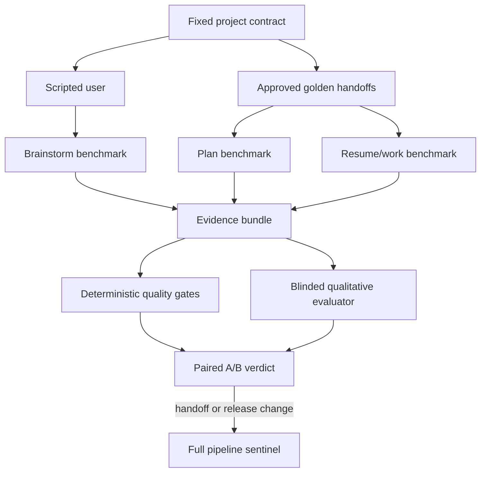

# CE Workflow Evaluation Harness - Plan

## Goal Capsule

- **Objective:** Make ce-workflow optimization measurable through repeatable quality, reliability, token, and runtime comparisons.
- **Product authority:** The versioned benchmark project contracts, approved golden handoffs, acceptance suites, and scoring rubrics define expected behavior.
- **Open blockers:** None for planning; the first decision-capable run depends on one-time human approval of the generated golden brainstorms and plans.

---

## Product Contract

### Summary

Build a local paired A/B evaluation harness around two fixed projects.
Routine experiments isolate brainstorm, plan, or resume/work against stable golden handoffs, while occasional full pipelines verify that the stages still compose.

### Problem Frame

ce-workflow changes can reduce tokens or simplify orchestration without proving that the resulting questions, plans, implementations, and reviews remain reliable.
The current repository has deterministic fixtures and named agent scenarios, but its agent-backed benchmark delegates existing test scripts to a wrapper agent rather than completing representative projects.
Maintainers therefore lack a stable way to compare role agents, reviewer strategies, effort levels, prompts, and workflow changes without model variance and upstream-stage noise obscuring the result.

### Key Decisions

- **Isolate stages by default.** Each stage receives the same approved input so a brainstorm experiment does not contaminate plan or execution comparisons.
- **Keep a tiered integration check.** Full pipelines run only for release-critical changes or handoff-contract changes because isolated stages cannot detect every composition regression.
- **Use two complementary projects.** A browser-tested themed calculator covers UI behavior, while a CSV expense analyzer covers logic, validation, and file-based output.
- **Compare one factor at a time.** A candidate changes one mode, role, reviewer strategy, effort setting, prompt, or workflow behavior relative to a fixed baseline.
- **Treat quality as a gate.** Lower cost cannot compensate for failed behavior, bugs, incomplete artifacts, unapproved interruptions, or a meaningful qualitative regression.
- **Use stable qualitative judgment.** One fixed, blinded, high-effort evaluator scores both sides with the same versioned rubric and cannot see which artifact is baseline or candidate.

### Actors

- A1. **ce-workflow maintainer** selects the baseline, candidate override, project, stage, and run depth, then uses the comparison to make an optimization decision.
- A2. **scripted benchmark user** supplies fixed project answers, records unexpected questions, and continues from the hidden project contract when an answer is available.
- A3. **workflow under test** performs the selected brainstorm, plan, or resume/work stage in a disposable project environment.
- A4. **blinded evaluator** grades qualitative artifacts without knowing their configuration labels.
- A5. **deterministic verifier** checks project behavior, artifact contracts, lifecycle gates, telemetry completeness, and repository state.

### Evaluation Model

### Requirements

**Benchmark projects and contracts**

- R1. The suite must contain a fixed themed-calculator project with a versioned acceptance matrix for calculations, theme behavior and persistence, keyboard and accessibility basics, browser interaction, and fixed-viewport screenshot evidence.
- R2. The suite must contain a fixed CSV expense analyzer project with a versioned acceptance matrix for accepted input, malformed-row behavior, category aggregation, deterministic report output, and failure cases.
- R3. Each project must bundle one immutable version of its hidden product contract, scripted answer bank, fresh seed repository, executable acceptance checks, qualitative rubric, approved golden brainstorm, and approved golden plan.
- R4. The workflow under test must see only the selected stage input and scripted answers; hidden contracts, acceptance matrices, goldens not used as stage inputs, and evaluator labels must remain unavailable to it.
- R5. Each project must require at least two execution slices so resume/work evaluation exercises planning, handoff, continuation, and finalization rather than a one-step task.
- R6. Golden brainstorms and plans must be generated once, human-approved against exact bundle versions and passing checks, and changed only through an explicit benchmark-contract update with retained approval evidence.

**Stage-isolated evaluation**

- R7. A brainstorm benchmark must start every configuration from the same project request and scripted user state, then evaluate the questions, interaction path, requirements artifact, review option, and measured cost.
- R8. A plan benchmark must start every configuration from the same approved golden brainstorm, then evaluate requirement preservation, decisions, slicing readiness, verification coverage, review option, and measured cost.
- R9. A resume/work benchmark must start every configuration from the same approved golden plan and fresh seed repository, continue through all planned slices without routine human intervention, and verify the finished product.
- R10. The scripted user must answer expected questions from fixed responses, answer unexpected questions from the hidden project contract when possible, and record every unexpected question as a critical comparison metric.
- R11. An unexpected question with no contract-grounded answer must fail the run rather than invent or silently default a product decision.
- R12. Routine comparisons must run one selected stage only; simplify and compound are not part of the first benchmark contract.

**Comparison and scoring**

- R13. Every experiment must fingerprint and match all non-factor inputs: ce-workflow revision, project bundle, resolved role settings, provider and model identity, effort, evaluator, runtime, dependencies, browser, operating environment, and rubric version.
- R14. V1 may vary one declared factor among workflow mode, role agent, reviewer presence or strategy, role effort, prompt revision, or ce-workflow revision; no-op, undeclared, or multi-factor deltas invalidate the comparison unless predeclared as an interaction test.
- R15. A smoke comparison must run once per side for fast failure detection and must not be presented as decision-grade evidence.
- R16. A decision comparison must run three fresh paired samples per side, alternate baseline/candidate order, retain every attempt, and report raw paired deltas, medians, and min/max spread.
- R17. A confirmed infrastructure failure may replace its paired sample once; a second failure at that pair index or any selective retry invalidates the decision verdict.
- R18. Every raw baseline and candidate sample must pass its stage and project hard gates; a baseline failure invalidates the comparison, while a candidate failure rejects the candidate.
- R19. Deterministic gates must cover required product behavior, bugs, artifact validity, required workflow gates, completion state, telemetry presence, unexpected interruptions, and clean repository finalization.
- R20. Each versioned stage rubric must define anchored scores, critical dimensions, unexpected-question treatment, ties, aggregation, and evaluator-failure handling before it can produce a verdict.
- R21. The blinded evaluator must score question quality, requirement coverage, plan quality, plan adherence, implementation quality, and unnecessary work using the approved stage rubric.
- R22. A candidate must fail when its median qualitative score falls below the baseline, any critical rubric dimension regresses, or its unexpected-question count increases.
- R23. Workflow cost must cover only the selected stage from dispatch to terminal state; harness setup, deterministic verification, and evaluator cost must be reported separately.
- R24. A cost verdict requires complete tokens, wall time, tool and subagent calls, tool output, retries, context growth, and question-count measurements for both sides.
- R25. After quality passes, a cost win requires at least 5% improvement in the declared primary metric or equal-weight aggregate, at least one improved dimension, and no required dimension more than 10% worse; unchanged-run calibration may raise but not lower these thresholds.
- R26. Every project-stage bundle must set approved wall-time and token ceilings for smoke, decision, and sentinel depths from baseline calibration; exceeding a ceiling stops the run and prevents a passing verdict.

**Integration and evidence**

- R27. A full brainstorm-to-plan-to-resume sentinel must run for both projects before accepting a change to stage input/output contracts, artifact semantics, cross-stage routing, completion/finalization behavior, or default ce-workflow behavior.
- R28. Full-pipeline runs must pass each stage's hard gates and the finished product's acceptance checks without substituting golden artifacts between stages.
- R29. Every comparison must produce a compact report plus an evidence bundle containing configuration fingerprints, declared factor delta, prompts, scripted exchanges, artifacts, plans, diffs, telemetry, evaluator results, test output, screenshots where applicable, bugs, all failed attempts, and final verdict.
- R30. Reports must distinguish deterministic facts, evaluator judgments, workflow cost, harness and evaluator cost, infrastructure failures, invalid comparisons, and benchmark-contract changes.
- R31. The harness must run locally from one command in fresh disposable directories and contexts, and it must not modify the ce-workflow checkout or retained project bundles during a comparison.

### Key Flows

- F1. **Stage smoke comparison**
  - **Trigger:** A1 wants fast feedback on one ce-workflow change.
  - **Actors:** A1, A2, A3, A4, A5
  - **Steps:** Select one project and stage, run baseline and candidate once from the same fixed input, apply gates and rubric, then preserve a diagnostic report.
  - **Outcome:** Obvious failures stop cheaply; the result is labeled non-decision-grade.
  - **Covered by:** R7-R15, R18-R26, R29-R31

- F2. **Decision-grade comparison**
  - **Trigger:** A smoke result is promising or a maintainer needs evidence for a configuration choice.
  - **Actors:** A1, A2, A3, A4, A5
  - **Steps:** Run three paired samples per side, blind the evaluator labels, aggregate quality and cost evidence, enforce quality gates, and issue a comparison verdict.
  - **Outcome:** The report shows whether the single candidate factor improves cost without reducing reliability or output quality.
  - **Covered by:** R13-R26, R29-R31

- F3. **Full-pipeline sentinel**
  - **Trigger:** A change covered by the mandatory sentinel conditions passes relevant isolated checks.
  - **Actors:** A1, A2, A3, A4, A5
  - **Steps:** Start from each original project request, carry actual outputs through brainstorm, plan, and resume/work, then verify the finished products and every handoff.
  - **Outcome:** Integration regressions that goldens would mask are caught before the change is trusted.
  - **Covered by:** R27-R31

- F4. **Golden contract update**
  - **Trigger:** The intended benchmark project or ce-workflow artifact contract changes.
  - **Actors:** A1, A4, A5
  - **Steps:** Generate candidate goldens, review them against the hidden project contract, approve the contract change, and retain before/after evidence.
  - **Outcome:** Goldens evolve deliberately without silently moving the baseline during an experiment.
  - **Covered by:** R3-R6, R13, R29-R30

### Acceptance Examples

- AE1. **Covers R7, R10, R20-R22.** Given the same calculator request and scripted answers, when two brainstorm configurations run, then both are graded on whether they ask necessary, non-duplicate questions and produce a complete requirements artifact rather than on matching exact wording.
- AE2. **Covers R8, R13-R14.** Given one approved CSV-analyzer brainstorm, when only the planner effort changes from medium to high, then both plans receive identical non-factor settings and the report attributes the delta to that declared factor.
- AE3. **Covers R9, R18-R19, R22.** Given an approved calculator plan with at least two slices, when a cheaper worker configuration completes with fewer tokens but the theme fails to persist in browser verification, then the candidate fails before cost is considered.
- AE4. **Covers R10-R11, R22.** Given a workflow asks an unanticipated preference question, when the hidden contract contains the answer, then the scripted user answers, records the critical metric, and continues; when the contract has no answer, the run fails as an autonomy regression.
- AE5. **Covers R15-R17.** Given one successful smoke pair, when a maintainer requests decision-grade evidence, then each side runs three fresh paired samples and the report exposes all attempts, medians, and spread rather than promoting or selectively retrying the smoke result.
- AE6. **Covers R20-R25.** Given blinded artifacts labeled without configuration identity, when the candidate saves time but its median plan-quality score or a critical traceability dimension is lower, then the candidate is not accepted.
- AE7. **Covers R27-R28.** Given isolated stages pass after a handoff-contract change, when the mandatory full sentinel runs, then actual brainstorm output feeds actual planning output and actual execution for both projects without golden substitution.
- AE8. **Covers R17, R29-R30.** Given a provider timeout interrupts one sample, when one replacement also fails at that pair index, then the comparison is invalid and both failures remain in the evidence bundle rather than becoming a product-quality verdict.
- AE9. **Covers R18, R24-R25.** Given baseline and candidate both omit a required metric or both fail the same hard gate, when results are aggregated, then the comparison is invalid rather than accepting equal failure.
- AE10. **Covers R26.** Given a stage exceeds its approved smoke token or wall-time ceiling, when the limit is reached, then the run stops, preserves evidence, and cannot report a passing smoke result.

### Success Criteria

- Maintainers can compare medium versus high effort, alternative reviewers, reviewer presence, role agents, prompts, or workflow behavior without changing more than one factor per experiment.
- Every decision-grade verdict is reproducible from retained inputs, fingerprints, all attempts, raw measurements, deterministic results, and blinded rubric evidence.
- The two execution projects complete from fresh seeds, pass their versioned acceptance matrices, and expose product bugs as hard failures.
- Routine stage comparisons stay within approved per-stage budgets, while mandatory sentinel runs catch real handoff regressions.
- Re-running an unchanged baseline establishes thresholds and budgets that reject normal platform variance as an optimization claim.

### Scope Boundaries

- Defer simplify and compound stage evaluation until the core three stages produce trustworthy comparisons.
- Defer CI and pull-request gating until local runs are stable, bounded, and operationally affordable.
- Defer a local or hosted dashboard; reports and evidence bundles are the first interface.
- Defer full configuration matrices and automatic multi-factor search; explicit one-factor experiments are the default.
- Exclude exact-text golden matching, self-evaluation by the workflow under test, and cost wins that waive product-quality gates.

### Dependencies / Assumptions

- Real Pi sessions can expose enough usage and timing telemetry to measure the selected cost dimensions; unavailable fields must be reported as missing rather than estimated.
- Browser automation and fixed-viewport screenshot capture are available for the calculator project.
- The fixed evaluator model and settings remain available during each paired comparison; a changed evaluator fingerprint invalidates the pair.
- Initial unchanged-run calibration must approve stage budgets and may only raise the existing 5% improvement and 10% per-dimension regression thresholds; it cannot weaken the no-quality-regression rule.

### Sources / Research

- `scripts/work-improvement-benchmark.mjs` defines the current benchmark manifest, cost dimensions, sampling, and quality-first acceptance policy.
- `scripts/work-improvement-runner.mjs` shows that current named agent scenarios delegate existing test scripts rather than complete representative projects.
- `agents/workflow-benchmark.md` defines the current read-only benchmark runner boundary.
- `README.md` documents the staged workflow, role and effort configuration, review levels, telemetry, browser gate, simplify gate, and resume behavior this harness must evaluate.
- `docs/plans/2026-07-11-001-feat-autonomous-workflow-improvement-plan.md` established the earlier requirement for representative quality and workflow-cost scenarios.
