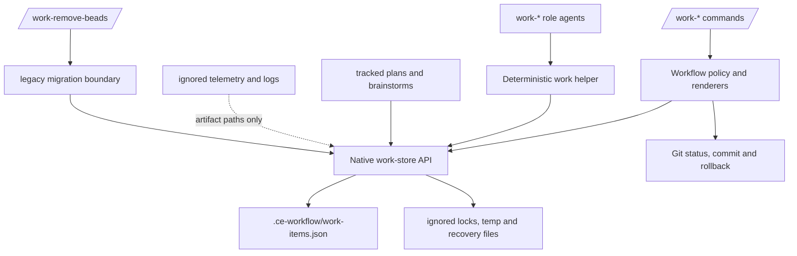
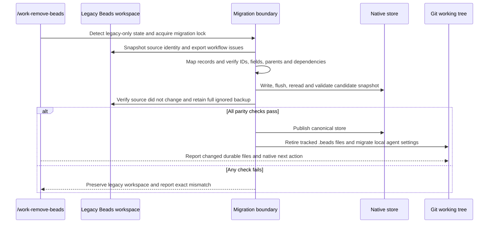
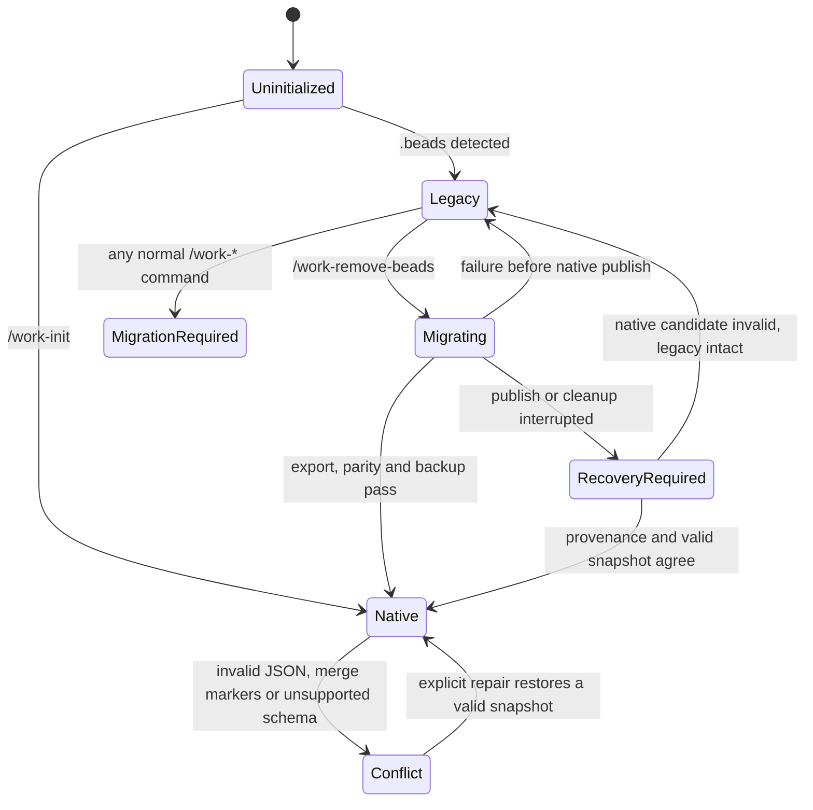

# Native Git-Tracked Work Store - Plan

## Goal Capsule

| Field | Contract |
| --- | --- |
| Objective | Remove Beads from normal ce-workflow operation and replace it with a faster, dependency-free, Git-tracked work store without changing `/work-*` behavior. |
| Authority | The confirmed scope in this plan governs; existing command behavior and tests define compatibility; Git-tracked plans and brainstorms remain canonical documents. |
| Execution profile | Deep refactor and persistent-state migration. Build and verify the native path before migrating the source repository. |
| Stop conditions | Stop rather than overwrite when export parity fails, the native store conflicts with legacy state, the schema is newer than the package, a concurrent writer owns the lock, or preserving behavior requires an unapproved product change. |
| Tail ownership | The work is done only after the source repository migrates successfully, full package verification and disposable migration smoke tests pass, and normal runtime paths cannot invoke `bd`. |

---

## Product Contract

### Summary

Replace the Beads-backed work graph with a versioned `.ce-workflow/work-items.json` snapshot tracked by Git. Preserve epics, tasks, ideas, dependencies, acceptance, completion state, concise evidence, and artifact lineage while keeping runtime logs, telemetry, caches, locks, and migration backups ignored under `.pi/`.

### Problem Frame

ce-workflow depends on Beads for a data model it largely interprets itself. `extensions/work-models.js` already computes readiness, blockers, progress, routing, idea state, and finish policy after repeatedly spawning the `bd` CLI. On the current Windows repository, representative Beads reads take roughly 0.6–1.2 seconds each and a resume-state build takes roughly three seconds.

The dependency also weakens the stated durability contract. The embedded Dolt database is ignored by Git, and ce-workflow does not push or pull the configured Dolt remote. Installation adds a large platform binary and has required Windows shim fixes, while `bd doctor` is unavailable in embedded mode. The requested replacement must retain the useful work graph and workflow behavior without copying runtime exhaust into Git or building a general-purpose issue tracker.

### Actors

- A1. **Developer** — uses `/work-*` commands, reviews Git diffs, and expects interrupted work to resume from repository state.
- A2. **Workflow extension and role agents** — query and mutate the same work graph through deterministic primitives rather than raw files or shelling out to a tracker.
- A3. **Git** — versions code, plans, brainstorms, and durable work state; it does not version telemetry, transcripts, locks, caches, or full verification logs.

### Requirements

**Durable work state**

- R1. The repository must track one versioned canonical work-store snapshot containing epics, work items, ideas, parent relationships, dependencies, acceptance, statuses, timestamps, concise notes, and the evidence needed to know what is done.
- R2. Brainstorm and plan bodies must remain canonical in their existing Git-tracked documents; the work store records lineage and paths without duplicating document content.
- R3. New runtime logs, telemetry, transcripts, caches, locks, temporary files, full command output, and migration backups must remain ignored and must never be copied into the canonical work store; legacy comments and notes remain durable work data, while their referenced full artifacts stay outside the store.
- R4. The store must preserve existing IDs during migration and generate new IDs compatible with current full-ID and numeric-suffix command targeting.
- R5. Work-store writes must be deterministic, schema-validated, recoverable after interruption, and protected against concurrent local writers.

**Migration and detection**

- R6. `/work-remove-beads` must be available whenever a legacy Beads workspace is detected, and normal `/work-*` commands must return a migration-required result instead of querying Beads.
- R7. Migration must preserve every exported workflow issue, including closed work, parent links, dependency edges, type, status, priority, owner, description, design or document references, acceptance, labels, comments, notes, timestamps, and close evidence.
- R8. Migration must retain and validate a recoverable ignored copy of the persistent legacy workspace before cleanup because Beads JSONL export is an interoperability export rather than a full Dolt backup; sockets, locks, and other runtime-only files are excluded.
- R9. Migration must validate source/export stability and field-level parity before publishing the native store or removing `.beads`; any mismatch leaves the legacy workspace intact and reports the exact blocker.
- R10. Migration must be idempotent: an already migrated repository is a no-op, an interrupted migration can resume safely, and a mixed native/legacy state is reconciled only when provenance proves both sides match.
- R11. Migration must translate existing role-model overrides from `bead-*` agent keys to their `work-*` replacements without changing selected models or effort.
- R19. Migration must tolerate unrelated pre-existing Git dirt without staging, reverting, or rewriting it, while refusing concurrent changes to `.beads`, the candidate native store, or migration-owned settings.

**Behavioral parity and detachment**

- R12. `/work-init`, plan/bootstrap, ideate, brainstorm, status, report, roadmap, resume, add, pause, debug, auto, small, medium, big, finish, helper summaries, and project-goal progress must read and mutate the native store in-process.
- R13. Existing command names, target syntax, state transitions, ordering, stop conditions, human-visible output, and documented machine-readable semantics must remain compatible.
- R14. The coded finish transaction must include native work-state evidence and closure in the related Git commit, restore the previous store on failure, and continue excluding workflow state from implementation-file scope counts.
- R15. Tracked work-state dirt must be tolerated by intake and resume safety gates but must not be treated as disposable runtime dirt, auto-ignored, or silently deleted.
- R16. All shipped skills, role-agent names and descriptions, prompts, settings labels, helper commands, package metadata, current documentation, and verification checks must use native work-item vocabulary and native primitives.
- R17. Normal runtime code must have no Beads installation requirement and must never spawn `bd`; legacy Beads access is confined to the one-way migration boundary.
- R18. Native status and resume-state queries must show a substantial measured latency reduction and remain bounded on a fixture with at least 1,000 work items.

### Key Flows

- F1. **Initialize a new repository**
  - **Trigger:** A1 runs `/work-init` where neither native nor legacy state exists.
  - **Actors:** A1, A2, A3.
  - **Steps:** The extension creates a validated empty native store, keeps runtime paths ignored, reports the tracked file, and points to `/work-plan`.
  - **Outcome:** The repository can use every `/work-*` command without Beads installed.

- F2. **Migrate a legacy Beads repository**
  - **Trigger:** A2 detects `.beads` without a native store and A1 runs `/work-remove-beads`.
  - **Actors:** A1, A2, A3.
  - **Steps:** The migration boundary snapshots the legacy source, exports workflow issues, maps and validates them, writes and rereads a candidate native store, verifies parity, backs up the full legacy workspace under ignored runtime storage, migrates role settings, and only then retires `.beads`.
  - **Outcome:** Git shows the new canonical work file and legacy tracked-file removals; normal commands use only native state.

- F3. **Resume and finish native work**
  - **Trigger:** A1 starts or resumes a work item and later runs the coded finish path.
  - **Actors:** A1, A2, A3.
  - **Steps:** The extension resolves ready work in-process, records bounded verification/review evidence, commits implementation plus work-state changes, closes the item, and amends the same commit.
  - **Outcome:** A fresh session or clone can derive the same current work state from Git without chat or tracker state.

- F4. **Recover from invalid or interrupted state**
  - **Trigger:** A write is interrupted, JSON contains a merge conflict, the schema is unsupported, parity fails, or a second writer collides.
  - **Actors:** A1, A2.
  - **Steps:** The store refuses mutation, selects a provably valid recovery copy when one exists, and reports the conflicting paths or validation errors without overwriting either source.
  - **Outcome:** No task data is silently lost or guessed.

### Acceptance Examples

- AE1. **Complete migration:** Given a legacy workspace containing open, in-progress, closed, blocked, idea, bug, and decision records, when `/work-remove-beads` succeeds, then native reads return the same IDs, content, statuses, parents, dependency edges, lineage, and completion evidence.
- AE2. **Migration required:** Given `.beads` exists and no native store exists, when `/work-status` or `/work-resume` runs, then it performs no `bd` query and reports `/work-remove-beads` as the next action.
- AE3. **Safe failure:** Given an export changes during migration or a mapped dependency is missing, when parity validation runs, then no native store is published and `.beads` remains usable.
- AE4. **Idempotent retry:** Given a completed migration with matching provenance, when `/work-remove-beads` runs again, then it reports already migrated and changes no files.
- AE5. **Git separation:** Given a normal workflow emits telemetry and command logs, when Git status is inspected, then only durable work state and intended product files are trackable; runtime exhaust remains ignored.
- AE6. **Finish rollback:** Given a native item passes verification but commit, closure, or amend fails, when finalization unwinds, then the Git head and canonical store return to their pre-finalization state and the item remains resumable.
- AE7. **Agent parity:** Given a planner, worker, reviewer, fixer, debugger, advisor, committer, or migrator handoff, when it reads or changes work state, then it uses native helper primitives and never needs raw JSON or `bd` help.
- AE8. **Performance:** Given a 1,000-item native fixture, when status and resume-state builders run repeatedly in one process, then they spawn no tracker subprocess and stay within the performance threshold recorded in the Verification Contract.

### Scope Boundaries

**In scope**

- A dependency-free native store tailored to ce-workflow's existing work graph.
- One-way migration from a detected Beads workspace with full issue export and full local backup.
- Current `/work-*`, helper, agent, prompt, settings, documentation, and test behavior.
- Git-tracked task state and Git-tracked links to existing plan and brainstorm documents.

**Deferred to Follow-Up Work**

- A graphical work-store viewer or integrations with external issue trackers.
- Automated schema upgrades beyond the first native schema version; the loader must still reject unsupported future versions safely.

**Outside this product's identity**

- Arbitrary direct `bd` command compatibility, Dolt history, Dolt remote synchronization, memories, infrastructure records, and templates.
- General multi-machine concurrent issue editing or conflict-free replicated state; the confirmed single-writer policy remains authoritative.
- Rewriting point-in-time files under `docs/plans/` and `docs/brainstorms/` to erase historical Beads decisions.
- Automatic state-only Git commits from every intake command; durable state joins the next normal workflow commit, matching existing Git behavior without history noise.

---

## Planning Contract

### Key Technical Decisions

- KTD1. **Use one deterministic tracked snapshot.** `.ce-workflow/work-items.json` is the canonical store. A keyed, stable-order snapshot is easier to diff, recover, validate, and clone than an event log, and Git already supplies history.
- KTD2. **Keep runtime state separate.** Locks, candidate writes, recovery copies, migration exports, and full legacy backups live below ignored `.pi/work-store/` or `.pi/work-migrations/`; only the canonical work graph is tracked.
- KTD3. **Create a pure native store boundary.** `extensions/work-store.js` owns schema validation, deterministic serialization, IDs, CRUD, parent/dependency queries, readiness, locking, and recovery. `extensions/work-models.js` owns workflow policy and consumes those primitives.
- KTD4. **Isolate legacy access and prefer live truth.** `extensions/legacy-beads-migration.js` is the only production module allowed to locate or invoke `bd`. When an embedded database exists, a fresh official export is authoritative; an existing JSONL file is accepted without `bd` only when it was explicitly supplied as the migration source or no database exists. The boundary is unreachable after a workspace is native.
- KTD5. **Model machine-used data as fields, preserve human history as notes.** Status, type, parent, dependencies, labels, document links, idea lineage, execution mode, review result, verification summary, and close evidence become typed native fields. Existing notes and comments are preserved without copying full logs; source fields with no native equivalent remain under a migration-only `legacy` namespace so they are not lost or used by runtime policy.
- KTD6. **Treat file replacement as recoverable, not perfectly atomic.** Candidate content is written in the target directory, flushed, reread, and validated before replacement; a last-known-good copy and exclusive local lock cover platform-specific rename behavior and interrupted writes.
- KTD7. **Preserve public behavior at the boundary.** Internal code and model-facing content use `workItem` vocabulary. Existing documented machine-readable keys remain stable through one explicit serializer allowlist; they are compatibility labels, not storage fields, agent vocabulary, or a tracker dependency.
- KTD8. **Do not dual-write.** A repository is uninitialized, legacy, migrating, native, or recovery-required. No released state writes both Beads and the native store.
- KTD9. **Keep state mutations user-visible in Git.** Intake commands may leave the canonical store modified, as they currently leave work state modified. Resume tolerates that file; finalization stages it deliberately with related work rather than hiding or auto-committing it.
- KTD10. **Rename roles and migrate settings once.** Shipped `bead-*` agents become `work-*` agents. `/work-remove-beads` rewrites matching local `subagents.agentOverrides` keys so model and effort choices survive without shipping permanent aliases.
- KTD11. **Read once per operation before adding caches or indexes.** A command loads one validated snapshot and reuses it for all queries or one locked transaction. The confirmed single-writer workload does not justify cache invalidation machinery or a secondary index until telemetry shows the 1,000-item contract is insufficient.

### Sequencing

Execute the dependency order `U1 → U2 → U3 → U4 → U6 → U5 → U7`. Role names and settings consumers move to native vocabulary before the source repository migrates its live settings and work graph; no hybrid checkpoint is releasable.

### High-Level Technical Design

#### Runtime component flow



#### Migration protocol



#### Workspace lifecycle



### Output Structure

```text
.ce-workflow/
└── work-items.json              # tracked canonical work graph
.pi/
├── work-store/                  # ignored locks and recovery files
└── work-migrations/             # ignored exports and full legacy backups
extensions/
├── work-store.js                # native schema and operations
└── legacy-beads-migration.js    # one-way legacy boundary
prompts/
└── work-remove-beads.md         # fallback command prompt
scripts/
├── test-work-store.mjs
├── test-work-remove-beads.mjs
└── test-work-store-performance.mjs
```

### System-Wide Impact

- **Data lifecycle:** Work state changes from a local ignored database to a tracked snapshot. Git conflict markers, unsupported versions, and partial writes become explicit fail-closed states.
- **Git behavior:** The canonical store is workflow-owned but not disposable. Dirty-state classifiers, untracked hygiene, implementation-file limits, staging, amend, rollback, and push checks must distinguish it from `.pi/` runtime files.
- **Agent/tool parity:** Every role uses the same native helper primitives as the extension. No role parses raw store JSON or invokes tracker help.
- **Packaging:** Global Beads installation and Windows runtime shims disappear from normal setup. The legacy exporter remains available only to migrate old repositories.
- **Performance:** Status, resume, roadmap, and report avoid repeated process startup and duplicate JSON normalization.
- **Documentation:** Current docs describe the native work graph and migration. Historical plans and brainstorms remain unchanged as point-in-time evidence.

### Risks and Mitigations

| Risk | Mitigation |
| --- | --- |
| Free-form Beads notes encode machine state that a typed mapper misses. | Preserve original notes/comments, parse every currently recognized marker into typed fields, and compare native projections against existing command outputs before cutover. |
| Beads export omits Dolt history and non-issue tables. | Use issue JSONL only for canonical workflow data; create and verify a file manifest for the ignored persistent `.beads` backup before cleanup, excluding locks and sockets. |
| A tracked snapshot increases Git conflict exposure. | Keep the confirmed single-writer rule, deterministic key ordering, narrow writes, exclusive local mutation locks, and fail closed on merge markers. |
| Windows replacement semantics or process interruption leaves temp files. | Validate candidate and recovery copies, write in the target directory, and test interruption at every replacement boundary on Windows-compatible filesystem semantics. |
| The finish gate commits code but loses work-state closure. | Snapshot the previous store and Git head, stage native evidence deliberately, amend closure, and restore both on any failure. |
| Renaming agents loses customized model overrides. | Migrate matching override keys during `/work-remove-beads` and test preservation of all model/thinking fields. |
| The source repository becomes unusable between runtime cutover and self-migration. | Ship the migration command and native store first, block normal commands with a precise migration-required state, and do not release or merge a hybrid checkpoint. |
| A large rewrite weakens established workflow behavior. | Preserve state-builder boundaries, convert fixtures to the native store, and require the full existing package suite plus end-to-end migration and performance checks. |

### Sources and Research

- `extensions/work-models.js` — current Beads subprocess boundary, field normalization, readiness computation, command state builders, finish logic, agent routing, and command registration.
- `scripts/work-helper.mjs` — compact task helpers and coded verify/commit/close rollback transaction.
- `scripts/work-command-fixture.mjs` — current fake-Beads behavioral fixture to replace with native-store fixtures.
- `scripts/work-hygiene.mjs` — workflow-managed versus runtime/implementation file classification.
- `scripts/verify-package.mjs` — package-wide contracts for skills, agents, prompts, commands, and tests.
- `docs/plans/2026-07-02-001-feat-work-orchestrator-package-plan.md` — original role and work-state authority decisions.
- `docs/plans/2026-07-03-004-feat-coded-start-finish-gates-plan.md` — established state-builder, renderer, handler, fixture, and finish-gate patterns.
- `docs/plans/2026-07-06-001-feat-work-intelligence-plan.md` — idea lineage, non-executable idea guards, and telemetry separation requirements.
- [Beads export reference](https://github.com/gastownhall/beads/blob/main/website/versioned_docs/version-1.0.4/cli-reference/export.md) — JSONL export is intended for issue migration/interoperability and includes issue labels, dependencies, and comments, but is not a full database backup.
- [Beads recovery guidance](https://github.com/gastownhall/beads/blob/main/docs/RECOVERY.md) — export issue data before destructive reinitialization.
- [Node.js filesystem reference](https://github.com/nodejs/node/blob/main/doc/api/fs.md) — `fsync` and rename durability/atomicity remain operating-system-specific, requiring explicit validation and recovery tests.

---

## Implementation Units

### U1. Native work-store core

- **Goal:** Add the dependency-free canonical schema and safe in-process operations without changing command callers yet.
- **Requirements:** R1-R5, R18; F1, F4; AE5, AE8.
- **Dependencies:** None.
- **Files:** Create `extensions/work-store.js` and `scripts/test-work-store.mjs`; modify `scripts/work-hygiene.mjs` and `.gitignore`.
- **Approach:** Define schema version 1 around keyed work items and workspace metadata. Implement validated load/init, deterministic serialization, compatible ID generation, CRUD, typed note/evidence updates, parent/dependency queries, readiness, exclusive local mutation locking, candidate/recovery writes, and explicit error categories for missing, conflicted, corrupt, locked, or unsupported stores. Keep temporary/recovery files ignored while treating `.ce-workflow/work-items.json` as tracked workflow data.
- **Patterns to follow:** Reuse the dependency-free JSON helpers and deterministic state-builder style in `extensions/work-models.js`; follow the lease and recovery posture in `extensions/work-improvement.js` without copying its event-log design.
- **Test scenarios:**
  1. Initialize an empty repository and assert a valid deterministic schema with no runtime log fields.
  2. Create epic, task, bug, decision, and idea records; reload and assert all typed fields and Unicode/newline notes survive.
  3. Add sequential dependencies and assert only the earliest open executable item is ready; closing it unblocks the next item.
  4. Add an idea record that otherwise resembles a task and assert it never enters executable readiness.
  5. Preserve imported IDs and generate new root/child IDs whose numeric suffix targeting remains unambiguous.
  6. Write the same logical state in different insertion orders and assert byte-identical canonical output.
  7. Hold the mutation lock from one process and assert a second writer fails without changing the store; release it and assert retry succeeds.
  8. Interrupt candidate replacement at each boundary and assert reload chooses only a validated canonical or recovery copy.
  9. Load merge markers, malformed JSON, duplicate IDs, invalid parent/dependency references, and a future schema version; assert fail-closed diagnostics and no rewrite.
- **Verification:** The native-store test proves schema, graph semantics, deterministic bytes, locks, and recovery independently of `extensions/work-models.js`.

### U2. Verified `/work-remove-beads` migration boundary

- **Goal:** Add the one-way migration command before removing the legacy runtime path.
- **Requirements:** R6-R11, R17, R19; F2, F4; AE1-AE4.
- **Dependencies:** U1.
- **Files:** Create `extensions/legacy-beads-migration.js`, `prompts/work-remove-beads.md`, and `scripts/test-work-remove-beads.mjs`; rename or replace `scripts/test-windows-bd-shim.mjs` with `scripts/test-work-remove-beads-windows.mjs`; modify `extensions/work-models.js`, `skills/work-orchestrator/SKILL.md`, and `scripts/verify-package.mjs`.
- **Approach:** Add workspace-state detection and a deterministic `/work-remove-beads` handler. Use a fresh official issue export whenever an embedded database exists; accept a named JSONL source without `bd` only when it is explicit or no database remains. Capture source identity, map every workflow field and recognized marker, preserve notes/comments and unmodeled source fields, validate field/edge/count parity, retain a verified ignored persistent-workspace backup, migrate role override keys, publish native state, then retire `.beads`. The command never commits and never deletes the only valid copy.
- **Execution note:** Build migration fixtures from a sanitized real Beads export and prove failure recovery before allowing source-repository migration.
- **Patterns to follow:** Follow `bootstrapPlanEpic` for deterministic command state, `buildWorkMigrateState` for source normalization, and the intent-before-side-effect recovery pattern in `extensions/work-improvement.js`.
- **Test scenarios:**
  1. Migrate an export containing open, in-progress, closed, blocked, bug, decision, idea, and epic records; assert exact IDs, fields, parents, dependencies, notes/comments, document links, and close evidence.
  2. Migrate from an explicitly supplied JSONL export with no database and no `bd` binary and assert success without a subprocess; add an embedded database beside the same export and assert migration requires a fresh export instead of trusting a possibly stale file.
  3. Migrate an embedded workspace through the isolated exporter and assert the Windows npm shim resolves only inside the migration boundary.
  4. Remove `bd` while leaving only an embedded database and assert an actionable safe stop with `.beads` untouched.
  5. Change the source fingerprint between export and publish and assert parity failure leaves no canonical store.
  6. Inject a missing parent, missing dependency, duplicate ID, malformed record, and unsupported record type; assert the offending record is identified and no source is deleted.
  7. Interrupt after export, candidate write, native publish, backup, settings migration, and legacy cleanup; assert rerun reaches one valid terminal state without duplication.
  8. Run against matching native provenance and assert a no-op; run against divergent native plus legacy state and assert recovery-required without overwrite.
  9. Migrate `subagents.agentOverrides` entries with model, fallback, and thinking fields and assert only role keys change.
  10. Corrupt or truncate the copied legacy backup and assert cleanup does not begin until its file manifest and readable export are verified.
  11. Start with unrelated modified and untracked product files and assert migration preserves them byte-for-byte and unstaged while rejecting concurrent changes to migration-owned paths.
  12. Inspect Git status after success and assert only the native store, intended settings when tracked, legacy tracked-file removals, and pre-existing user dirt appear; backup/export files remain ignored.
- **Verification:** Migration tests prove parity and idempotency without altering this repository's live `.beads` workspace.

### U3. Native query and routing cutover

- **Goal:** Replace every normal Beads read with native store queries while preserving status, selection, and handoff semantics.
- **Requirements:** R4, R6, R12-R13, R17-R18; F1, F3; AE2, AE7, AE8.
- **Dependencies:** U1, U2.
- **Files:** Create `scripts/test-work-status.mjs`; modify `extensions/work-models.js`, `scripts/work-helper.mjs`, `scripts/work-command-fixture.mjs`, `scripts/test-work-report.mjs`, `scripts/test-work-resume.mjs`, `scripts/test-work-roadmap.mjs`, `scripts/test-work-intake.mjs`, `scripts/test-work-ideate.mjs`, `scripts/test-work-brainstorm.mjs`, `scripts/test-work-goal.mjs`, and `scripts/test-work-optimization-helpers.mjs`.
- **Approach:** Remove tracker subprocess caches, Windows runtime resolution, `bdJson*` reads, Beads error classification, and multi-version issue normalization from normal workflow code. Route status, report, roadmap, resume, current-epic resolution, numeric shorthand, idea lineage, blocker search, project progress, and helper summaries through typed store queries. Keep public command ordering and JSON semantics stable at render boundaries. Legacy-only repositories return `migration-required` before any query.
- **Patterns to follow:** Preserve the existing state-builder → renderer → handler boundary and the coded `buildEpicChildState`/`planResumeAction` policy; change storage, not workflow decisions.
- **Test scenarios:**
  1. Render empty, one-active, multiple-active, closed, ambiguous numeric, ready, in-progress, planned, blocked, decision, and complete epic states and compare with current expected outputs.
  2. Resolve a full legacy ID and numeric child suffix against native items and assert the same ambiguity rules.
  3. Query a legacy-only fixture with a fail-if-called fake `bd` binary and assert every normal read returns migration-required without invoking it.
  4. Query a native fixture with the same fail-if-called binary and assert status, report, roadmap, resume, helper summaries, and goal progress pass.
  5. Confirm ideas remain excluded from executable slices while linked brainstorm, plan, and task lineage remains visible.
  6. Confirm documented machine-readable report fields and recommended `/work-*` actions remain compatible.
  7. Load a conflicted or unsupported store and assert every reader reports recovery-required rather than returning empty state.
- **Verification:** Read-path fixture suites pass with no tracker process available and preserve prior expected command outcomes.

### U4. Native mutation and finish transaction cutover

- **Goal:** Replace every normal Beads mutation and the coded finalizer with native store transactions.
- **Requirements:** R5, R12-R15, R17; F1, F3, F4; AE5-AE7.
- **Dependencies:** U1, U3.
- **Files:** Modify `extensions/work-models.js`, `scripts/work-helper.mjs`, `scripts/work-hygiene.mjs`, `scripts/work-command-fixture.mjs`, `scripts/test-work-start-finish.mjs`, `scripts/test-work-add.mjs`, `scripts/test-work-pause.mjs`, `scripts/test-work-debug.mjs`, `scripts/test-work-auto.mjs`, `scripts/test-work-plan-open-questions.mjs`, `scripts/test-work-ideate.mjs`, `scripts/test-work-brainstorm.mjs`, `scripts/test-work-dirt-tolerance.mjs`, and `scripts/test-work-untracked-hygiene.mjs`.
- **Approach:** Convert init, plan/bootstrap, idea capture/actions, brainstorm links, add, pause, debug/blocker creation, dependency changes, claim, labels, notes, close/reopen, roadmap mutations, small/medium/big starts, and finish operations to native primitives. Rename helper operations to work-item vocabulary. Treat the canonical store as allowed workflow dirt but include it explicitly in staging and rollback. Snapshot both Git head and canonical bytes before finalization; restore both if commit, close, amend, or cleanliness checks fail.
- **Execution note:** Characterize current start/finish behavior first; the storage swap must not weaken dirty-state, review, verification, hardware, file-count, or push gates.
- **Patterns to follow:** Keep `finishTask` and `executeWorkFinishState` as the coded transaction owners and reuse `tidyUntrackedFiles` for build/runtime hygiene without classifying canonical state as disposable.
- **Test scenarios:**
  1. Initialize a new repo, bootstrap an epic from a tracked plan, and assert the native epic and planning item link to the plan without embedding its body.
  2. Create, claim, annotate, block, unblock, close, and reopen work through each command path and assert one deterministic store mutation per action.
  3. Pause one active item and assert the concise checkpoint survives reload while full logs remain outside the store.
  4. Record PASS and FAIL verification and review evidence and assert finish gates make the same decisions as before.
  5. Finish a bounded implementation and assert code plus native evidence and closure land in one commit while the work file is excluded from implementation-file counts.
  6. Fail verification, commit, native close, amend, push, and post-close cleanliness separately; assert Git and store rollback preserve a resumable item.
  7. Present unrelated dirty files plus native state dirt and assert unrelated files block while native state alone does not.
  8. Present an untracked native store and assert hygiene recognizes it as intended canonical source rather than auto-ignoring or deleting it.
  9. Run all mutating paths with a fail-if-called `bd` binary and assert no invocation.
- **Verification:** Start/finish and mutation fixtures pass against the real native store module, not a command-emulating tracker fake.

### U5. Migrate this repository and prove end-to-end continuity

- **Goal:** Cut the source repository from its live Beads workspace to the tracked native store only after native reads and writes are proven.
- **Requirements:** R6-R10, R12-R15, R17-R19; F2-F4; AE1-AE6, AE8.
- **Dependencies:** U2, U4, U6.
- **Files:** Create `.ce-workflow/work-items.json` and `scripts/test-work-store-performance.mjs`; remove tracked `.beads/` files after verified backup; modify `.gitignore`, `scripts/test-work-remove-beads.mjs`, `scripts/test-work-resume.mjs`, and `scripts/test-work-start-finish.mjs` as needed for source-repository smoke coverage.
- **Approach:** Run the same public migration path against the current workspace, preserving whatever records exist at execution time rather than hardcoding today's count. Review the native diff and migration parity report, verify active work remains selectable, then exercise status, resume selection, add/pause, and finish in disposable clones based on the migrated snapshot. Retain the full legacy backup only under ignored runtime storage.
- **Test scenarios:**
  1. Compare the live export and native snapshot by ID, type, status, parent, dependency, content, timestamps, and artifact links; assert no workflow record is lost.
  2. Reload the extension after migration and assert current epic, active item, ready items, progress, ideas, plans, and brainstorm links match the pre-migration report.
  3. Clone a committed migrated fixture without `.beads` or `bd` and assert `/work-status`, `/work-resume`, `/work-add`, `/work-pause`, and finish behavior work.
  4. Assert Git tracks `.ce-workflow/work-items.json` and `.beads` deletion while `.pi/work-migrations/` and `.pi/work-store/` remain ignored.
  5. Generate a 1,000-item fixture and assert repeated status/resume builders meet the recorded latency ceiling with zero child-process calls.
- **Verification:** The source repo and a fresh disposable clone operate entirely from native Git state, with migration parity and performance evidence retained outside the canonical store.

### U6. Rename role agents, prompts, settings, and model-facing contracts

- **Goal:** Remove Beads vocabulary and primitives from every active agent/model-facing surface while preserving role boundaries.
- **Requirements:** R11-R13, R16-R17; AE7.
- **Dependencies:** U3, U4.
- **Files:** Rename the nine role files to `agents/work-advisor.md`, `agents/work-advisor-backup.md`, `agents/work-committer.md`, `agents/work-debugger.md`, `agents/work-fixer.md`, `agents/work-migrator.md`, `agents/work-planner.md`, `agents/work-reviewer.md`, and `agents/work-worker.md`; remove their matching `agents/bead-*.md` paths; modify `skills/work-orchestrator/SKILL.md`, `skills/work-orchestrator/references/full-policy.md`, `prompts/`, `extensions/work-models.js`, `scripts/work-helper.mjs`, `scripts/test-work-settings.mjs`, `scripts/test-work-resume.mjs`, `scripts/verify-package.mjs`, and `package.json`.
- **Approach:** Rename role identities, direct-role routing, model slots, settings descriptions, helper names, handoff fields, closure rules, and source-of-truth language to work-item terminology. Give agents compact native helper primitives for summary, children, ready, claim, note, label, and blocker operations; prohibit raw store reads when a helper supplies the needed projection. Remove old packaged agent aliases after migration settings coverage passes.
- **Patterns to follow:** Preserve every existing agent tool boundary, thinking default, fresh-context policy, one-writer rule, review/commit separation, and supervisor fallback enforced by `scripts/verify-package.mjs`.
- **Test scenarios:**
  1. Discover the package agents and assert only `work-*` role names are shipped and direct routing selects each expected role.
  2. Apply existing role override settings, migrate them, and assert model, fallback, and thinking selections appear under new names.
  3. Generate planner, worker, reviewer, fixer, debugger, committer, advisor, and migrator handoffs and assert each uses native helper vocabulary with no normal-path `bd` instruction.
  4. Verify read-only and writer tool boundaries, no-commit/no-close rules, review PASS/FAIL rules, and timeout guidance remain unchanged.
  5. Run the package verifier against every prompt and role frontmatter and assert prompt arguments and modes are preserved, including `remove-beads`.
- **Verification:** Role discovery, settings, handoff, and package-contract tests pass after old packaged agent files are removed.

### U7. Documentation, conformance, and final dependency removal

- **Goal:** Make the native architecture the only current documented and verified system and prove no accidental Beads runtime dependency remains.
- **Requirements:** R2-R3, R13, R16-R18; all acceptance examples.
- **Dependencies:** U5, U6.
- **Files:** Modify `README.md`, `docs/orchestrator.md`, `docs/orchestrator_idea.md`, `.gitignore`, `package.json`, `scripts/verify-package.mjs`, and the affected `scripts/test-work-*.mjs`; preserve historical `docs/plans/` and `docs/brainstorms/` files unchanged.
- **Approach:** Replace installation, architecture, command, role, helper, status, pause/resume, migration, source-of-truth, and smoke-test documentation. Remove Beads metadata and setup from the package. Extend verification with an allowlist that permits legacy terms only in the migration boundary, migration tests, historical documents, and the migration guide. Delete obsolete shim/runtime code and fake tracker fixtures rather than leaving dormant compatibility paths.
- **Test scenarios:**
  1. Install the package in a clean disposable repo without Beads and assert `/work-init` through a small verified finish succeeds.
  2. Install over a legacy fixture and assert normal commands point to `/work-remove-beads`, migration succeeds, and the same workflow then resumes natively.
  3. Scan active runtime, skills, agents, prompts, package metadata, and current docs and assert no `bd` commands or `bead-*` roles remain outside the explicit legacy-migration allowlist.
  4. Run all existing behavior fixtures and assert no expected safety gate, command mode, telemetry field needed for current runs, or evaluation contract regresses.
  5. Inspect the final diff and assert no migration backup, export, lock, temp file, full log, or telemetry artifact is tracked.
- **Verification:** Full package verification, native performance checks, disposable new-repo smoke, and disposable legacy-migration smoke all pass; abandoned adapter and shim code is removed.

---

## Verification Contract

| Gate | Applies to | Required outcome |
| --- | --- | --- |
| `node scripts/test-work-store.mjs` | U1, U3, U4 | Schema, graph, deterministic write, lock, corruption, and recovery scenarios pass. |
| `node scripts/test-work-remove-beads.mjs` | U2, U5 | Export mapping, parity, backup, settings migration, idempotency, and interruption scenarios pass. |
| `node scripts/test-work-remove-beads-windows.mjs` | U2 | The legacy exporter resolves Windows installation shapes only inside migration code and leaves source intact on failure. |
| `node scripts/test-work-store-performance.mjs` | U3, U5, U7 | A 1,000-item fixture performs native status/resume builds with zero tracker subprocesses and an absolute median below 250 ms on the reference Windows bench; the report also records the relative improvement against the captured legacy baseline without making cross-machine ratios a flaky CI gate. |
| Existing focused `scripts/test-work-*.mjs` fixtures | U3, U4, U6 | Command selection, mutation, gates, roles, settings, telemetry separation, and finish rollback retain prior outcomes against native state. |
| `npm run verify:quiet` | Every unit before handoff | Package manifest, skill, prompt, role, command, migration, fixture, and evaluation contracts pass with compact output. |
| `npm run verify` | U7 final gate | The full local log reports all package checks passed. |
| Disposable clean-repo smoke | U7 | Install and complete a small workflow with no `bd` executable or `.beads` directory. |
| Disposable legacy-repo smoke | U5, U7 | Detect, migrate, reload, resume, finish, and clone from Git with exact durable-state parity and no tracked runtime exhaust. |

---

## Definition of Done

- `.ce-workflow/work-items.json` is the only tracked work-state authority, and this repository has migrated all live workflow records into it.
- Plans and brainstorms remain tracked as documents and are linked, not duplicated, by native work items.
- Runtime logs, telemetry, locks, temporary/recovery files, exports, and full legacy backups remain ignored.
- Every normal `/work-*` and helper path uses `extensions/work-store.js` in-process and cannot invoke `bd`.
- `/work-remove-beads` is idempotent, preserves full backup and issue parity, and is the sole production legacy boundary.
- Existing IDs, targeting, ready/blocker semantics, command behavior, finish safety, and machine-readable compatibility are preserved.
- `work-*` role agents replace all shipped `bead-*` agents, and migrated settings retain model/effort choices.
- The source repository and disposable fresh clone pass native status, resume, mutation, and finish flows without Beads installed.
- The performance contract passes on the 1,000-item fixture and demonstrates the measured improvement.
- Full package verification and both disposable smoke paths pass.
- Historical point-in-time plans and brainstorms remain intact; current docs and package metadata describe only the native architecture plus the explicit legacy migration path.
- No abandoned dual-write adapter, shim, fake tracker, dead fallback, migration temp file, or experimental code remains in the final diff.
