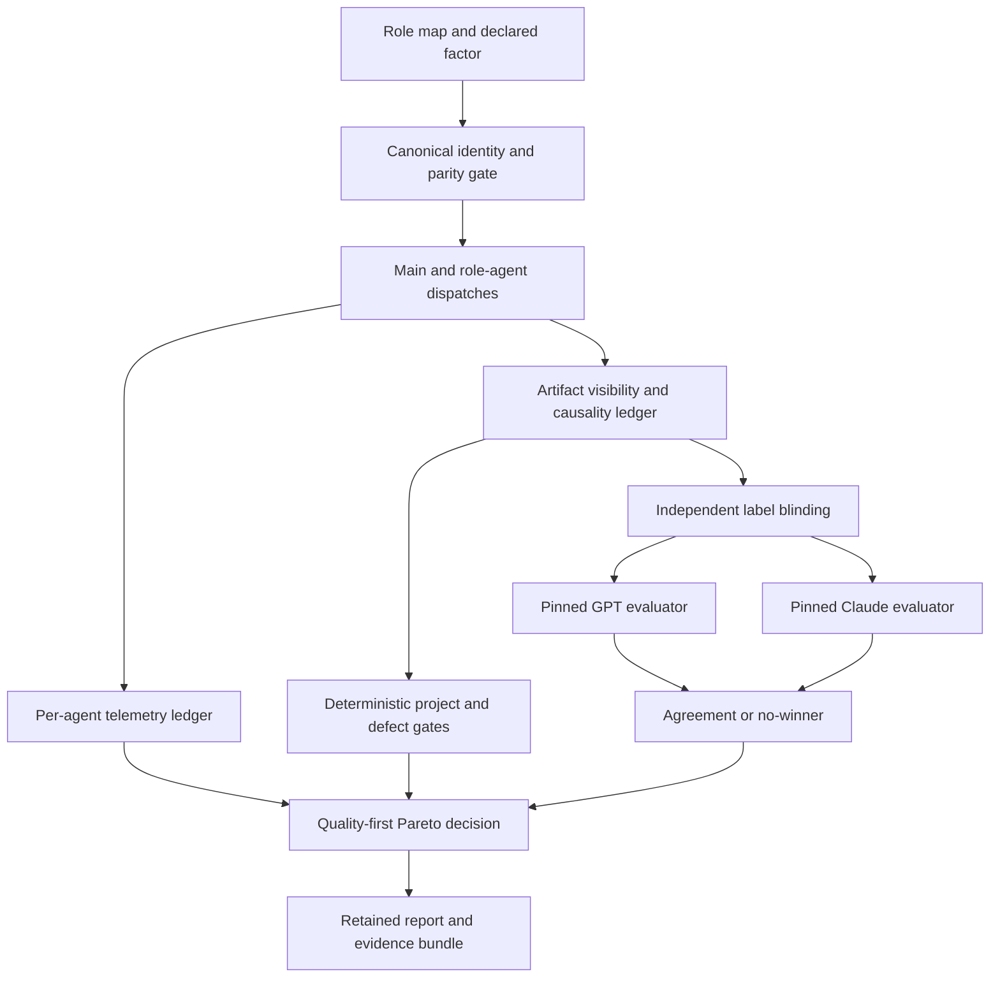
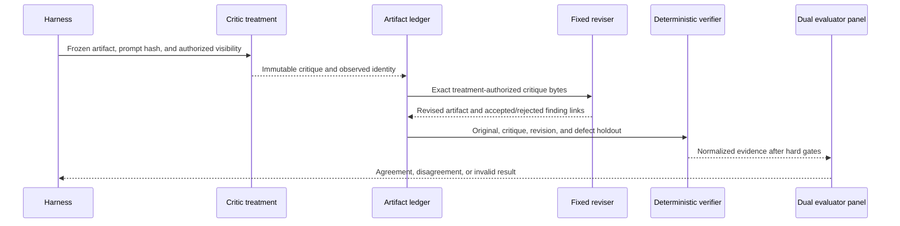
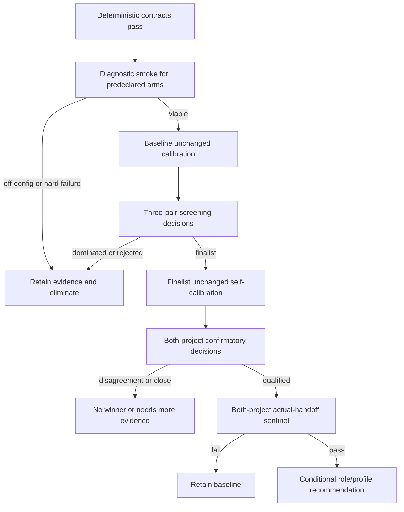
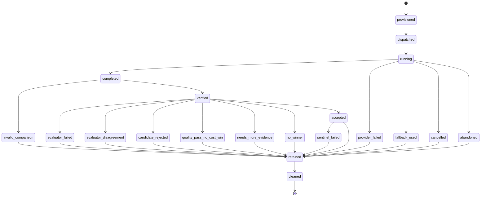

# Model Role Evaluation Roadmap - Plan

## Goal Capsule

- **Objective:** Extend the workflow evaluation harness, then use it to produce evidence-backed model and effort recommendations for each ce-workflow role and for same-family versus cross-family critique.
- **Authority hierarchy:** This plan governs the roadmap; the existing V1 benchmark contract and approved project bundles govern unchanged harness behavior; retained experiment evidence governs recommendations; current code patterns govern implementation details when they do not conflict.
- **Execution profile:** Deep, dependency-ordered work. Implement deterministic contracts before paid runs, then progress through smoke, calibration, decision, and sentinel evidence.
- **Stop conditions:** Stop rather than accept undeclared configuration drift, incomplete role telemetry, hidden-resource leakage, silent model fallback, evaluator disagreement, failed hard gates, stale calibration, or missing provider capability as evidence of a winner.
- **Tail ownership:** The executor owns code, fixtures, descriptors, experiment runs, evidence, and documentation. A maintainer owns provider access, benchmark-contract approval, rubric correction followed by fresh blinded reruns, and adoption of a provider-specific recommendation; maintainers cannot adjudicate a winner in place.

---

## Product Contract

### Summary

Extend the existing quality-first paired harness so it can isolate model and effort assignments by role, account for each agent's cost and behavior, replay seeded critique cases, and obtain independent GPT and Claude judgments.
Use the extended harness in a bounded tournament that starts with smoke, calibrates noise, runs confirmatory decisions, and promotes only supported finalists to full sentinels.

### Problem Frame

The existing harness can compare effort and workflow revisions, but its factor allowlist cannot validly compare top-level models or nested role overrides.
Its reports aggregate most workflow cost at sample level, so they cannot show which role consumed time and tokens or whether critique shifted work into another role.
A single evaluator can also bias a GPT-versus-Claude contest, and live end-to-end runs cannot isolate whether critique quality or generator variance caused an outcome.

The roadmap must therefore improve the measurement system before it asks that system to recommend GPT-5.6 Sol, Terra, Luna, or Claude Opus 4.8 for a role.
It must produce conditional, role-specific recommendations and honest no-winner outcomes rather than a universal ranking or an exhaustive Cartesian search.

### Actors

- A1. **Maintainer** predeclares the tournament, supplies provider capability, approves rubric corrections and fresh blinded reruns when disagreement exposes ambiguity, and decides whether to adopt an evidence-qualified recommendation; the maintainer cannot overturn evaluator disagreement in place.
- A2. **Workflow role** is one observed main-session or role-agent execution whose requested and actual provider, model, effort, context, tools, and artifacts are measured.
- A3. **Critic** reviews a frozen brainstorm, plan, task, or diff under a declared treatment arm without seeing seeded answers or side labels.
- A4. **Reviser** receives only the treatment-authorized critique bytes and produces the artifact used to measure downstream effect.
- A5. **Blinded evaluator panel** consists of one pinned GPT judge and one pinned Claude judge operating independently on the same normalized evidence under separate label permutations.
- A6. **Deterministic verifier** enforces project behavior, configuration parity, artifact visibility, lifecycle completeness, telemetry, and repository isolation.

### Requirements

#### Experiment identity and factor control

- R1. Experiment descriptors must support canonical top-level and role-scoped `modelAssignment` factors that bind provider plus exact model identity as one controlled factor, alongside independently testable effort factors, for every ce-workflow role under test.
- R2. The suitability inventory must cover the main brainstorm session and configurable `work-planner`, `work-migrator`, `work-worker`, `work-fixer`, `work-debugger`, `work-reviewer`, `work-advisor`, and `work-advisor-backup` roles. `work-committer` remains a deterministic safety control until it has a configurable slot; no committer model recommendation is in scope. Recommendations may claim only roles exercised by a representative case.
- R3. Every role cell must declare provider, canonical model identity, thinking/effort, prompt revision, tools, context/compaction policy, fallback policy, and applicable runtime capability limits.
- R4. Factor validation must permit one exact role-scoped `modelAssignment` or effort change while rejecting no-op changes, partial provider/model changes outside the compound assignment, ambient overrides, aliases that resolve differently, unsupported role keys, and multi-factor changes not declared as interaction experiments.
- R5. Requested and observed provider/model/effort identities must match at every dispatch; fallback or model substitution is off-config evidence and cannot support the requested model recommendation.
- R6. Existing V1 one-factor comparability, hidden-resource isolation, fresh-pair ordering, retry limits, quality-first gates, golden approvals, and source immutability must not regress.

#### Per-agent telemetry and causal evidence

- R7. Every main-session and role-agent execution must carry sample, pair, attempt, parent-agent, agent, role, treatment, and artifact identities from dispatch through terminal evidence.
- R8. Per-agent core telemetry must report observed provider/model/effort, provider-reported total input/output tokens, start/end/wall time, tool calls and output bytes, subagent calls, retries, questions, and terminal reason. Reasoning/cache token splits, queue/provider latency, context growth/compaction, and monetary cost are capability-conditional fields recorded as unavailable when the provider cannot supply them; missing core fields are invalid, not zero.
- R9. Workflow-role, critic, reviser, harness, and evaluator costs must remain separately attributable and must reconcile exactly once to the sample total.
- R10. An append-only artifact ledger must record producer, allowed consumers, visibility class, prompt/resource hashes, content hash, and critique receipt/accept/reject/application events.
- R11. Reports must distinguish critique cost from downstream rework saved or created so moving equivalent work between roles cannot be called an improvement.

#### Critique replay and independent judgment

- R12. The benchmark must include versioned frozen cases for brainstorm, plan, implementation diff, fixer, debugger, migrator, advisor backup, and deterministic committer/review-gate behavior, with seeded defects or expected invariants stored outside agent-visible context.
- R13. Critique cases must include clean controls, seeded training cases, and holdout cases; defect identifiers, expected fixes, hidden contracts, evaluator labels, and authority paths must not leak through prompts, paths, errors, diffs, telemetry, or normalized artifacts.
- R14. Critique replay must freeze input bytes, prompt/resource revision, defect order, delivery timing, and randomization seed; the same fixed reviser and equivalent budget must consume each authorized critique when isolating critic effect.
- R15. Critique diversity must use a bounded high-effort 2 × 3 factorial: Sol-high and Opus-high generators each pair with an explicit empty-critique control, Sol-high critique, and Opus 4.8 high critique. Sol-xhigh and Opus-xhigh are predeclared effort contrasts within each generator, producing four additional cells rather than post-hoc escalation.
- R16. The six shared-high-effort generator × critic cells identify generator quality, critic quality, and same-family versus cross-family interaction without an effort confound; the four xhigh cells estimate critic-effort effects separately. A dual-critic arm with Sol and Opus in randomized order may run only after both single-critic arms pass; it is a separate interaction and cannot be folded into a one-factor verdict.
- R17. Critique value must be measured by valid unique findings, false positives, accepted findings, verified fixes, regressions, downstream artifact uplift, rework, tokens, and wall time rather than finding count or prose quality alone.
- R18. One pinned GPT evaluator and one pinned Claude evaluator must independently score the same normalized evidence under separate random label mappings; neither sees the other's result, and Opus must never be the sole judge of an Opus treatment.
- R19. Evaluator timeout, malformed output, or identity drift yields invalid evidence; critical-dimension disagreement or opposite valid winners yields `evaluator-disagreement-no-winner`. Scores are not averaged, cost never breaks qualitative disagreement, and a maintainer cannot overturn it. Objective hard evidence may settle only the objective seeded-defect outcome; subjective disagreement requires a rubric correction followed by a fresh blinded run or more evidence.

#### Recommended progression and bounded tournament

- R20. All live work must follow the authority progression: diagnostic smoke, unchanged-run calibration, three-pair decision, then full actual-handoff sentinel.
- R21. The campaign must use a predeclared successive-halving schedule rather than every model × role × effort combination; eliminated and failed attempts remain in evidence.
- R22. The first campaign must evaluate only ce-workflow's main session and named work roles from R2; unrelated generic Pi roles and a hosted dashboard remain out of scope.
- R23. Brainstorm and planner lanes must run the predeclared Sol-high, Sol-xhigh, and Terra-high arms so default, high, and max claims do not depend on withholding a stronger candidate.
- R24. Worker/fixer lanes must run Terra-medium, Terra-high, and Sol-high; debugger runs Terra-high, Sol-high, and Sol-xhigh; reviewer runs Terra-high, Sol-high, Opus-high, and Opus-xhigh.
- R25. Migrator and advisor-backup lanes must run Luna-medium, Terra-medium, and Sol-high. Committer behavior remains a deterministic control with the current configured role; model comparisons are deferred until a configurable committer slot creates an adoption path.
- R26. Advisor lanes must run the R15 shared-high factorial, including both no-critic controls and same-family cells, before making a diversity claim; Sol-xhigh and Opus-xhigh are evaluated as separate declared critic-effort contrasts.
- R27. Smoke may block a lane only for deterministic wiring, capability, off-config, provenance, or harness hard-gate failure and is always labeled non-decision-grade. Role-quality observations from smoke cannot eliminate or rank a candidate.
- R28. Baseline calibration is required before screening decisions; every finalist model/role cell must also complete unchanged self-calibration before a final recommendation, with the conservative maximum noise floor applied to the contrast.
- R29. A confirmatory role recommendation requires complete three-pair evidence on both calculator and CSV project classes when the role applies, or an explicit scope label when only one class can exercise the role. Direction must agree in at least two of three paired deltas per applicable project, cost improvement must exceed the conservative calibrated noise floor when cost is the claim, and paired range plus noise must be reported; close or cross-project-inconsistent results become `needs-more-evidence`.
- R30. Both-project sentinels must carry actual brainstorm, plan, critique, work, review/fix, and finalization artifacts through declared handoffs, assert observed role identities per stage, and use no golden substitution.

#### Selection, reporting, and adoption

- R31. Results must preserve quality as a hard gate and report the Pareto frontier for quality, tokens, wall time, tool use, retries, context growth, questions, rework, critique marginal value, and normalized billed cost when the comparison crosses providers. Cross-provider cost uses a frozen provider price table covering input, output, reasoning, and cache categories with its own version fingerprint; without complete comparable pricing, the report may compare quality, time, and tokens but cannot claim a lower-cost provider.
- R32. Recommendations must be conditional by role and profile: the default/medium profile chooses the lowest normalized billed-cost quality-qualified point for cross-provider lanes or the lowest-token point within a common provider accounting regime; high chooses the strongest quality-qualified point within calibrated cost/time regression bounds; max chooses the highest supported quality point while still passing hard gates.
- R33. Valid terminal outcomes are `accepted`, `quality-pass-no-cost-win`, `candidate-rejected`, `invalid-comparison`, `provider-failed`, `fallback-used-off-config`, `evaluator-failed`, `evaluator-disagreement-no-winner`, `sentinel-failed`, `no-winner`, `needs-more-evidence`, `cancelled`, and `abandoned`; no outcome is coerced into a total ranking.
- R34. Each published recommendation must carry an active validity check over canonical model/provider revision, role prompt, tools, rubric, benchmark seed, price table, and runtime contract. When immutable provider revision metadata is unavailable, the recommendation expires 30 days after its evidence date or immediately on a provider release notice; a stale recommendation is disabled in favor of the provider-neutral baseline until revalidated.
- R35. Provider-neutral package defaults must remain portable. Evidence may update thinking profiles, documentation, and optional recommendation presets only after the adoption gate; unavailable Claude access retains the current or previously dual-qualified baseline and cannot create a new GPT-only winner.
- R36. Compact reports must retain exact configuration fingerprints, uncertainty, paired deltas, both evaluator judgments, defect-level outcomes, all retries/failures, evidence references, and whether each claim is exploratory or confirmatory.

#### Security, provider egress, and retention

- R37. Live credentials must come only from host-approved provider authentication or an approved secret source and must never be serialized into descriptors, temporary settings, prompts, ledgers, transcripts, reports, or retained evidence. Provider scopes and environments use least privilege where supported, failures are redacted, and suspected compromise triggers revocation/rotation.
- R38. Raw evidence must live in an authority-only scratch root that tested agents and sibling samples cannot access, with authority material separated from ordinary run evidence, user-only access controls where the platform supports them, and a declared 30-day expiry for this campaign. At expiry, raw artifacts are removed while the minimum compact report and cryptographic hashes remain.
- R39. Every outbound model request must use an approved authenticated endpoint and a provider-specific visibility allowlist. Credentials, hidden contracts, seeded answers, evaluator controls, and unrelated workspace data never leave the authority boundary; role tool/network/filesystem allowlists exclude credential and evidence roots and are tested against denied access and prompt-injection attempts.

### Key Flows

- F1. **Measurement-system hardening:** Extend factors, observed configuration, telemetry, artifact visibility, critique replay, and evaluator agreement; deterministic fixtures must pass before paid experiments.
- F2. **Bounded role tournament:** Smoke predeclared arms, calibrate baselines, run equal-budget decisions, self-calibrate finalists, and confirm role recommendations across applicable project classes.
- F3. **Critique causality:** Replay frozen cases, compare no/same-family/cross-family arms with a fixed reviser, trace findings to verified changes, and run the symmetry and optional dual-critic interactions separately.
- F4. **Adoption:** Run both full sentinels, apply the terminal-outcome policy, retain the baseline when evidence is ambiguous, and publish conditional role/profile recommendations without forcing provider-specific defaults.

### Acceptance Examples

- AE1. Given identical context and role maps, when only `work-worker.model` changes, then validation reports exactly that observed field delta and rejects any other role, prompt, tool, or runtime drift.
- AE2. Given a requested Opus critic, when the runtime silently falls back to another model, then the sample is `fallback-used-off-config`, retains provider evidence, and contributes to no Opus verdict.
- AE3. Given the main orchestrator dispatches worker, reviewer, and fixer as sibling role agents, when telemetry settles, then every agent's tokens, active wall interval, tools, retries, parent identity, and artifact hashes reconcile exactly once while sample wall time remains the dispatch-to-terminal critical path rather than the sum of overlapping agents.
- AE4. Given a seeded plan omission, when the critic finds it without seeing its defect ID and the fixed reviser applies the finding, then the finding receives credit only after the revised artifact passes the matching hard or dual-evaluator proof.
- AE5. Given a verbose critique with no unique accepted finding or verified downstream improvement, when scored, then it records cost and no demonstrated value rather than a win.
- AE6. Given Sol and Opus judges choose opposite qualitative winners, when cost favors one side, then the result is `evaluator-disagreement-no-winner`; cost does not adjudicate quality.
- AE7. Given Sol-high and Sol-xhigh brainstorms both pass quality, when xhigh's uplift remains within calibrated noise while costing more, then the default recommendation retains Sol-high and records no demonstrated xhigh value.
- AE8. Given Terra-medium worker fails calculator persistence but Terra-high passes, when both are cheaper than Sol-high, then medium is rejected and high may advance; no cost metric waives the product failure.
- AE9. Given the same generator, when Sol-high and Opus-high critics run on frozen cases, then each sees identical authorized bytes and differs only by compound model assignment; separate Sol-xhigh and Opus-xhigh contrasts measure effort effects while the evaluator panel measures valid unique findings, false positives, fixes, regressions, and marginal cost.
- AE10. Given a role finalist passes isolated decisions but its integrated mapping fails a calculator or CSV sentinel, then adoption fails and the prior baseline remains active.
- AE11. Given no candidate clears the quality and evaluator-agreement gates, when the tournament ends, then `no-winner` is a valid completed result with retained evidence and no default change.
- AE12. Given a candidate wins only one project class, when reporting, then the recommendation is scoped to that class or marked `needs-more-evidence`; it is not generalized to every workflow.
- AE13. Given a cross-provider candidate uses fewer raw tokens but its frozen price-table calculation costs more, when the default profile is selected, then normalized billed cost governs the cost claim and both raw token totals remain visible.
- AE14. Given a recommendation is older than 30 days without immutable provider revision metadata, when settings guidance is rendered, then it is marked stale and the provider-neutral baseline remains active until a fresh qualifying run.
- AE15. Given a role or prompt-injected artifact tries to read credentials, hidden answers, evaluator controls, or a sibling evidence root, when the tool executes, then access is denied, the sample fails, and retained diagnostics contain no secret or authority content.

### Success Criteria

- Every role/model/effort claim is backed by requested-versus-observed identity, complete per-agent telemetry, one-factor parity, role-specific quality evidence, and retained attempts.
- Seeded critique replay can distinguish valid findings, duplicates, false positives, unconsumed advice, verified fixes, and regressions without leaking answer keys.
- GPT and Claude evaluator outputs are independently blinded and a disagreement cannot silently become a candidate win.
- The campaign produces conditional Pareto recommendations or explicit no-winner outcomes for every role lane it exercises.
- Final adopted mappings pass both project sentinels with actual handoffs and leave the source checkout and approved benchmark bundles unchanged.

### Scope Boundaries

#### Deferred to Follow-Up Work

- Automatic adaptive routing from live task complexity after static role recommendations are trustworthy.
- CI/PR gating, scheduled re-benchmarking, a hosted dashboard, and automatic provider-price ingestion.
- Generic Pi roles that are not invoked by the ce-workflow scenarios in R2.
- More benchmark projects, languages, or domains after the calculator and CSV projects expose a measured coverage gap.

#### Outside This Roadmap

- An exhaustive Cartesian model × role × effort search.
- Exact-text critique or artifact matching.
- A universal best-model claim independent of role, profile, workload, prompt, provider revision, and cost posture.
- Allowing self-evaluation, smoke evidence, silent fallback, or missing telemetry to authorize adoption.

---

## Planning Contract

### Key Technical Decisions

- KTD1. **Extend the V1 harness rather than create a second benchmark system.** Existing stage isolation, project bundles, approvals, scoring order, and sentinels remain authoritative.
- KTD2. **Represent assignments as a canonical role map.** A `modelAssignment` binds provider and exact model as one factor under a named role, effort remains separately testable, and the full resolved map is fingerprinted for parity.
- KTD3. **Treat observed configuration as truth.** Requested aliases are retained for diagnosis, but verdicts use the canonical provider/model/effort reported by each actual dispatch; undeclared fallback fails closed.
- KTD4. **Add an append-only per-agent and artifact ledger.** Lifecycle identity connects role cost, critique visibility, artifact consumption, accepted findings, revisions, and verification without inferring causality from prose.
- KTD5. **Use a sibling frozen role-case corpus and holdouts.** Seeded brainstorm, plan, diff, fixer, debugger, migrator, and advisor-backup cases live outside approved project bundle directories so they cannot stale golden approvals; deterministic committer cases preserve finalization safety without claiming model suitability.
- KTD6. **Use a dual evaluator panel without arithmetic consensus.** GPT and Claude judge the same normalized evidence under independent A/B permutations; agreement is required for subjective conclusions, deterministic project/defect evidence governs objective outcomes, and human review may repair the rubric but never overturn disagreement in place.
- KTD7. **Select profiles from a Pareto frontier.** The roadmap does not collapse quality, time, tokens, and normalized billed cost into one universal scalar; default, high, and max profiles apply the policy in R32.
- KTD8. **Use predeclared successive halving.** Broad smoke is cheap and diagnostic; calibration and decisions are spent only on viable arms; sentinels are reserved for complete finalist mappings.
- KTD9. **Calibrate both sides before final adoption.** Screening may reuse a matching baseline calibration, but final contrasts use the conservative noise and ceiling values from unchanged runs of both finalist cells.
- KTD10. **Keep provider-specific adoption optional.** The package remains usable without Anthropic access; results may supply documented or opt-in recommendations, never a silent vendor dependency.
- KTD11. **Resolve exact model IDs at capability preflight.** GPT lanes use `openai-codex/gpt-5.6-sol`, `openai-codex/gpt-5.6-terra`, and `openai-codex/gpt-5.6-luna`. Claude Opus 4.8 must resolve to the exact available Pi registry identity before descriptors are frozen; a missing or changed identity blocks only its lane.
- KTD12. **Keep raw evidence outside the tracked source tree.** Tracked descriptors, schemas, fixtures, tests, and concise documentation are package resources; prompts, transcripts, evaluator controls, screenshots, and run evidence remain in authority-only scratch storage with a declared expiry.
- KTD13. **Normalize billed cost only from frozen prices.** Raw tokens remain first-class efficiency evidence, but cross-provider cost claims require a versioned price table and complete comparable categories; otherwise the lane makes no lower-cost claim.
- KTD14. **Treat providers and model output as external trust boundaries.** Host authentication, outbound visibility allowlists, endpoint identity, role capability allowlists, evidence isolation, and retention are coded contracts rather than prompt-only promises.

### Assumptions

- Dual GPT/Claude judging is the chosen independent-evaluation design; a third judge is not required for V1.
- The existing calculator and CSV projects are sufficient for the first conditional recommendations, with targeted role-case sentinels and explicit class scoping when a conditional role cannot appear in both ordinary pipelines.
- Three alternating pairs per project remain the minimum decision unit. Finalist confirmation spans both project classes where applicable and uses paired direction, range, and conservative calibration noise as descriptive uncertainty rather than claiming universal statistical significance.
- Provider temperature or seed controls are pinned when supported and recorded as unsupported otherwise; unsupported controls are visible treatment characteristics.
- Model recommendations do not alter user-selected models automatically. Adoption changes defaults or presets only when the coded gate passes and the maintainer accepts provider availability.

### Role Measurement Contract

Core totals reconcile by metric rather than one generic sum:

- Tokens, tool calls, tool-output bytes, subagent calls, retries, and questions sum across uniquely identified agents after deduplication.
- Sample wall time is dispatch-to-terminal critical-path elapsed time. Per-agent active intervals and overlap are reported separately and are never summed into sample wall time.
- Context growth and compaction remain per agent; the report does not sum incomparable context windows.
- Capability-conditional metrics use an explicit unavailable marker. A comparison may report them descriptively but cannot use a field unavailable on either side as a selection metric.
- The main orchestrator owns sibling role dispatches. Role agents remain non-orchestrators unless an explicit benchmark case declares and verifies a child-safe exception.

### Predeclared Campaign Matrix

Within one provider accounting regime, tokens are the primary efficiency metric. Cross-provider lanes use normalized billed cost from the frozen price table as their primary cost metric; without complete prices they make quality/time/token observations but no lower-cost claim. Wall time is a required secondary metric with calibrated non-regression bounds. Every role also retains all metrics from R31.

| Role or treatment | Setting/trigger | Representative evidence | Predeclared candidates | Critical quality dimensions | Adoption scope |
| --- | --- | --- | --- | --- | --- |
| Main brainstorm | Top-level session model | Calculator and CSV requests with fixed answers | Sol-high, Sol-xhigh, Terra-high | Question quality, requirements, scope, unexpected questions | Default/high/max main-session guidance |
| `work-planner` | `plan` slot, `/work-plan` planner handoff | Both approved brainstorms | Sol-high, Sol-xhigh, Terra-high | Requirements, traceability, slicing, verification | Planner mapping |
| `work-migrator` | `plan` slot, migration handoff | Legacy plan/TODO/native-store holdout | Luna-medium, Terra-medium, Sol-high | Fidelity, no invention, relationships, no source edits | Shared plan-slot change only with planner evidence |
| `work-worker` | `work` slot, implementation handoff | Both approved plans | Terra-medium, Terra-high, Sol-high | Behavior, plan adherence, implementation quality, unnecessary work | Worker mapping |
| `work-fixer` | `work` slot after review failure | Seeded calculator and CSV review/fix loops | Terra-medium, Terra-high, Sol-high | Requested-fix precision, regression absence, minimal diff | Shared work-slot change only with worker evidence |
| `work-debugger` | `debug` slot, seeded bug handoff | Root-cause holdouts in both projects | Terra-high, Sol-high, Sol-xhigh | Diagnosis, shared-root fix, characterization, no speculation | Debug mapping |
| `work-reviewer` | `review` slot, read-only review | Seeded and holdout diffs | Terra-high, Sol-high, Opus-high, Opus-xhigh | Defect recall, precision, severity, verified-fix yield | Review mapping |
| `work-committer` control | Direct role, finish gate | Staging/review/verification/commit safety cases | Current configured role only | Safety-gate completeness and zero unsafe commit | Deterministic control; model comparison deferred |
| `work-advisor` | `advisor` slot and critic gate | R15 factorial over frozen brainstorms/plans plus fixed reviser | Empty control, Sol-high/xhigh, and Opus-high/xhigh critics with Sol/Opus generators | Unique valid findings, precision, verified uplift, no harm | Advisor recommendation or no critic |
| `work-advisor-backup` | `advisorBackup` slot after declared primary unavailability | Frozen critic holdouts | Luna-medium, Terra-medium, Sol-high | Minimum valid-finding floor, no critical miss, no harm | Backup mapping only |

The matrix is frozen before U6 live smoke. A new candidate, metric, rubric dimension, role case, price table, or advancement rule requires a new campaign revision and cannot be added after results are visible.

### Predeclared Halving Schedule

The incumbent is the exact resolved current role assignment captured before smoke, not whichever candidate appears first in the matrix.

| Round | Inputs and comparisons | Advancement and terminal rule |
| --- | --- | --- |
| 0. Capability smoke | One diagnostic pair for every exact candidate identity and role trigger | Never rank by role quality. Wiring, capability, provenance, off-config, or harness failure blocks that arm until fixed; unavailable evidence does not promote competitors. |
| 1. Baseline calibration | The incumbent runs three unchanged pairs for every project/stage or role-case lane under the frozen evaluator and price-table fingerprints | Missing, stale, or unstable baseline calibration blocks screening. Calibration may raise but never lower fixed quality/cost floors. |
| 2. Screening decision | Each challenger runs three alternating pairs against the calibrated incumbent on CSV for main/planner/worker, seeded partitions for conditional roles, and seeded cases from both projects for advisor/reviewer | Hard-gate or agreed critical-quality regression rejects the challenger. For each profile, advance the incumbent plus at most one Pareto challenger: default selects the largest cost improvement beyond noise with quality preserved; high selects the largest agreed quality gain within cost/time bounds; max selects the largest agreed quality gain that passes hard gates. Ties inside noise retain the incumbent. The union is capped at incumbent plus three profile finalists. |
| 3. Finalist calibration | Every advanced challenger runs three unchanged pairs under its exact role, evaluator, price-table, prompt, tool, and runtime fingerprint | Missing, stale, or unstable calibration yields `needs-more-evidence`. Apply the conservative maximum noise and ceiling values from incumbent and challenger. |
| 4. Holdout confirmation | Each advanced challenger runs three alternating pairs against the incumbent on calculator for main/planner/worker and on disjoint holdouts for conditional roles; critic cells use the complete shared-high factorial before xhigh effort contrasts | A recommendation requires hard gates, evaluator agreement, the R29 direction rule, and a profile-specific win beyond noise. Cross-project conflict, tie, disagreement, or invalid evidence retains the incumbent and returns `no-winner` or `needs-more-evidence`. |
| 5. Integration | One finalist mapping per supported profile runs both actual-handoff project sentinels plus targeted sentinels for conditional roles that ordinary pipelines did not trigger | Both project and targeted sentinels must pass before adoption. Failure retains the current baseline. |

Candidate order and incumbent/challenger pairings are serialized in a versioned campaign descriptor before Round 0. No post-hoc candidate, primary metric, profile rule, tie-break, or survivor count is permitted.

### High-Level Technical Design

#### Components and evidence flow

#### Critique treatment sequence

#### Experiment progression and halving

#### Sample lifecycle and report outcomes

Report labels map directly to R33: `provider_failed` → `provider-failed`, `fallback_used` → `fallback-used-off-config`, `invalid_comparison` → `invalid-comparison`, `evaluator_failed` → `evaluator-failed`, `evaluator_disagreement` → `evaluator-disagreement-no-winner`, `candidate_rejected` → `candidate-rejected`, `quality_pass_no_cost_win` → `quality-pass-no-cost-win`, `needs_more_evidence` → `needs-more-evidence`, `no_winner` → `no-winner`, and `sentinel_failed` → `sentinel-failed`.

### Phased Delivery

| Phase | Outcome | Units |
| --- | --- | --- |
| 1. Measurement contracts | Model/role factors, observed identity, telemetry, critique replay, and dual judging are deterministic and fail closed | U1-U5 |
| 2. Smoke readiness | Package fixtures pass and every selected provider/model lane proves availability and provenance without claiming a winner | U6 |
| 3. Calibration | Current baselines and advancing finalist cells have approved, fingerprint-bound noise and ceilings | U7 |
| 4. Role decisions | Planning, execution, review, support, and critique lanes produce role-scoped Pareto evidence | U8-U10 |
| 5. Integration and adoption | Actual handoffs pass both sentinels and conditional recommendations are published or the baseline is retained | U11 |

### Dependencies / Prerequisites

- Provider credentials and exact registry access for the selected GPT-5.6 and Claude Opus 4.8 identities are required only for their live lanes; unavailable access is blocked evidence, not a substituted model.
- The existing approved calculator and CSV bundle SHAs remain unchanged unless a separate golden-update flow receives human approval.
- At plan creation, `scripts/workflow-evaluation.mjs` has a pre-existing uncommitted change. This roadmap does not absorb, revert, stage, or commit that diff; native epic bootstrap and writer execution remain blocked until its owner chooses to commit, stash, or discard it and path-specific Git status is empty.

### Risk Analysis & Mitigation

- **Provider confounding:** Prompt, tools, context, endpoint, and model revisions can masquerade as model quality. U1-U3 fingerprint declarations and observations and fail on unexplained drift.
- **Critique contamination:** Seeded answers or side labels can leak through paths and errors. U4 adds visibility classes, canaries, holdouts, and negative leakage fixtures.
- **Evaluator self-preference:** A model family may favor itself. U5 requires two independently blinded families and no-winner on disagreement.
- **False critique value:** Advice may sound useful while creating rework. U3-U5 link findings to accepted changes, verified outcomes, regressions, and marginal cost.
- **Multiple comparisons:** A broad tournament can manufacture a winner. U6-U10 predeclare contrasts, halving, stopping rules, confirmation scope, and uncertainty.
- **Cost explosion:** Paid samples multiply rapidly. U6 eliminates wiring failures cheaply; U7 calibrates only baselines and finalists; U11 runs sentinels only for qualified integrated mappings.
- **Shared-slot overclaim:** Planner/migrator and worker/fixer can share settings but perform different work. U4 and U8-U9 require representative evidence for each named role before changing a shared recommendation.
- **Fallback drift:** Provider failure may silently switch models. U1-U3 classify observed fallback as off-config and prohibit it from recommendations.
- **Dirty checkout:** Existing source dirt blocks safe native-store mutation. Epic bootstrap must report the blocker and wait for explicit owner resolution rather than hiding or absorbing it.

---

## Implementation Units

| U-ID | Title | Key files | Depends on |
| --- | --- | --- | --- |
| U1 | Model and role factor contract | evaluation contract and descriptors | None |
| U2 | Effective role configuration and provenance | runner, RPC, work settings | U1 |
| U3 | Per-agent telemetry and artifact ledger | extension telemetry, RPC, reports | U1-U2 |
| U4 | Frozen role and critique replay corpus | benchmark cases and replay runner | U1-U3 |
| U5 | Dual evaluator and Pareto scoring | evaluator, scorer, reports | U1, U3-U4 |
| U6 | Deterministic gate and smoke campaign | package verifier, examples, README | U1-U5 |
| U7 | Baseline and finalist calibration | calibration runner and approvals | U5-U6 |
| U8 | Brainstorm, planner, migrator, and support decisions | retained descriptors/evidence | U6-U7 |
| U9 | Worker, fixer, debugger, and reviewer decisions | retained descriptors/evidence | U6-U8 |
| U10 | Critic topology and revision-loop decisions | retained critique evidence | U6-U9 |
| U11 | Integrated sentinels and adoption | sentinel, settings/docs, final report | U7-U10 |

### U1. Model and role factor contract

- **Goal:** Make compound provider/model assignments, effort, and one exact role assignment valid, canonical, fingerprinted experiment factors.
- **Requirements:** R1-R6, R20-R22; AE1-AE2.
- **Dependencies:** None.
- **Files:** `scripts/workflow-evaluation-contract.mjs`, `scripts/workflow-evaluation.mjs`, `benchmarks/workflow-evaluation/v1/experiments/smoke.example.json`, `benchmarks/workflow-evaluation/v1/experiments/decision.example.json`, `scripts/test-workflow-evaluation-contract.mjs`.
- **Approach:** Extend the factor allowlist and resolved-pair schema with a complete canonical role map, compound `modelAssignment` values, and role-scoped factor paths. Preserve interaction-test declarations and fail preflight on partial provider/model deltas, aliases, ambient settings, unsupported roles, fallback policy drift, or more than the declared delta.
- **Execution note:** Add failing contract fixtures before changing live descriptor handling.
- **Patterns to follow:** Recursive changed-path validation and canonical fingerprints in `scripts/workflow-evaluation-contract.mjs`; existing `subagents.agentOverrides` shape in `extensions/work-models.js`.
- **Test scenarios:**
  1. A top-level or one-role `modelAssignment` delta may change its provider and exact model together while reporting one logical factor.
  2. Provider or model changes outside a declared compound assignment fail as partial or undeclared deltas; effort plus assignment still requires an interaction experiment.
  3. Unknown roles, incomplete role cells, ambient overrides, no-op aliases, unsupported effort, and undeclared fallback fail before provisioning.
  4. Key-order differences do not change the role-map fingerprint.
  5. Existing workflowRevision, effort, prompt, mode, and reviewer descriptors remain compatible.
- **Verification:** Contract fixtures prove valid one-factor model assignments pass and every ambiguous or multi-factor configuration fails closed.

### U2. Effective role configuration and provenance

- **Goal:** Apply each side's complete role map through existing settings and prove the requested identity was observed at every dispatch.
- **Requirements:** R2-R7, R34, R37, R39; AE1-AE3, AE15.
- **Dependencies:** U1.
- **Files:** `scripts/workflow-evaluation.mjs`, `scripts/workflow-evaluation-rpc.mjs`, `extensions/work-models.js`, `scripts/test-workflow-evaluation-rpc.mjs`, `scripts/test-workflow-evaluation-runner.mjs`.
- **Approach:** Materialize isolated `.pi/settings.json` overrides using the existing agent override schema, keep the top-level model as main-session fallback, and record requested versus observed provider/model/effort plus prompt/tools/context hashes. Do not add a second runtime settings format.
- **Test scenarios:**
  1. Main brainstorm and nested role dispatches report the exact declared canonical identities.
  2. A runtime identity mismatch, silent fallback, inherited ambient override, missing role, or wrong effort invalidates the sample.
  3. A model-not-found, authentication failure, quota failure, timeout, refusal, malformed response, and RPC crash receive distinct infrastructure classifications.
  4. One symmetric infrastructure replacement retains the failed pair and reruns both sides; a second failure invalidates the comparison.
  5. Source, bundle, sibling workspace, credential root, and evidence root access protections remain unchanged; serialized settings and failures contain no credential canary.
  6. Provider-bound payload snapshots contain only the role's declared visibility class and use the approved endpoint identity despite prompt-injected requests for hidden data.
- **Verification:** Fake RPC and runner fixtures prove configuration precedence, observed identity, failure classification, and unchanged isolation gates.

### U3. Per-agent telemetry and artifact ledger

- **Goal:** Attribute cost and causal handoffs to each role and artifact without double counting.
- **Requirements:** R7-R11, R17, R31, R36, R38; AE3-AE5.
- **Dependencies:** U1-U2.
- **Files:** `extensions/work-models.js`, `scripts/workflow-evaluation-rpc.mjs`, `scripts/workflow-evaluation.mjs`, `scripts/test-work-telemetry.mjs`, `scripts/test-workflow-evaluation-rpc.mjs`, `scripts/test-workflow-evaluation-runner.mjs`.
- **Approach:** Extend existing work-run and subagent transcript reconciliation with stable agent/parent/treatment/artifact IDs, requested and observed configuration, per-agent metrics, and append-only artifact visibility/consumption events. Version new evidence fields without breaking ordinary work telemetry consumers.
- **Test scenarios:**
  1. A main session with planner, reviewer, and fixer events reconciles every token, duration, tool, retry, and artifact exactly once.
  2. Orphan, duplicate, missing-terminal, wrong-parent, overlapping, or missing-required-metric events invalidate the sample.
  3. Provider-reported token categories remain distinct and unsupported fields are marked unavailable rather than estimated or zero.
  4. Critic receipt, reviser receipt, accepted/rejected finding, revision, verification, and regression events share stable IDs and valid hashes.
  5. Harness and evaluator usage never appears in workflow-role totals.
  6. Evidence roots enforce authority-only and sibling denial, record their expiry, retain compact hashes after raw deletion, and never delete before evidence durability.
- **Verification:** Telemetry fixtures prove exact reconciliation, backward-compatible ordinary reports, and fail-closed causal ledgers.

### U4. Frozen role and critique replay corpus

- **Goal:** Add representative, leakage-safe cases that isolate each named role and cross-model critique before integrated runs.
- **Requirements:** R2, R12-R17, R22-R26, R39; AE4-AE5, AE9, AE15.
- **Dependencies:** U1-U3.
- **Files:** `benchmarks/workflow-evaluation/v1/role-cases/calculator/`, `benchmarks/workflow-evaluation/v1/role-cases/csv-expenses/`, `scripts/workflow-evaluation.mjs`, `scripts/test-workflow-evaluation-critique.mjs`, `scripts/verify-package.mjs`.
- **Approach:** Create versioned clean, seeded, and holdout cases for brainstorm/plan critique, diff review, fixer, debugger, migrator, committer, and advisor backup. Keep answer keys and acceptance checks outside visible workspaces. Freeze prompt, input, order, delivery, seed, and reviser identity for causal arms. Always run the same reviser: no-critic cells receive a signed empty-critique envelope with the same schema and the same context, output, wall, and truncation limits; critique bytes are the declared treatment difference.
- **Test scenarios:**
  1. Each seeded case is independently verifiable, while its clean control passes and one intentional defect fails.
  2. Canary defect IDs, expected fixes, hidden paths, goldens, and side labels cannot be found in agent-visible files, prompts, errors, telemetry, or normalized payloads.
  3. Replaying the same seed produces identical visible input bytes, ordering, prompt hash, and treatment timing.
  4. A critique delivered to the wrong arm, modified in transit, ignored, duplicated, or applied without verification receives no causal credit.
  5. Training and holdout partitions are disjoint and selection results cannot mutate either corpus.
- **Verification:** The critique fixture proves corpus integrity, leak resistance, deterministic replay, treatment isolation, and role-case acceptance.

### U5. Dual evaluator and Pareto scoring

- **Goal:** Add independent GPT/Claude judgments, role-specific outcome scoring, and no-winner/Pareto decisions.
- **Requirements:** R17-R19, R28-R36; AE5-AE7, AE11-AE14.
- **Dependencies:** U1, U3-U4.
- **Files:** `agents/workflow-evaluator.md`, `benchmarks/workflow-evaluation/v1/pricing.example.json`, `scripts/workflow-evaluation-score.mjs`, `scripts/workflow-evaluation.mjs`, `scripts/test-workflow-evaluation-score.mjs`, `scripts/test-workflow-evaluation-panel.mjs`.
- **Approach:** Generalize evaluator configuration to two pinned identities, blind each independently, validate both outputs, retain both controls, and require agreement for subjective claims. Add role-specific dimensions, critique defect matching, paired uncertainty, Pareto reporting, terminal outcomes, and conservative two-sided calibration inputs without weakening existing quality-first thresholds.
- **Test scenarios:**
  1. Both valid agreeing evaluators permit scoring; opposite winners, critical-dimension disagreement, malformed output, timeout, or identity drift produce no winner or invalid evidence.
  2. Neither evaluator input reveals side labels, paths, timestamps, configuration identity, the other evaluator's result, or hidden resources.
  3. A seeded objective outcome may resolve only its matching defect evidence; subjective disagreement requires a rubric correction and fresh blinded run or more evidence, never in-place adjudication.
  4. Pareto output preserves quality, tokens, normalized billed cost where comparable, wall time, tools, retries, questions, rework, and critic overhead without inventing a universal scalar.
  5. Existing single-evaluator fixture compatibility remains available for historical evidence, but new model recommendations require the panel.
  6. Cross-provider cost claims require complete category prices and a matching price-table fingerprint; missing prices preserve token/time observations but suppress lower-cost selection.
- **Verification:** Score and panel fixtures cover every agreement, disagreement, invalidation, role-quality, Pareto, and terminal-outcome branch.

### U6. Deterministic gate and smoke campaign

- **Goal:** Prove the extended harness is safe and every selected model lane is wired before paying for calibration or decisions.
- **Requirements:** R6, R20-R27, R33-R39; F1-F2; AE13-AE15.
- **Dependencies:** U1-U5.
- **Files:** `scripts/verify-package.mjs`, `package.json`, `README.md`, `benchmarks/workflow-evaluation/v1/experiments/model-role-campaign.example.json`, `benchmarks/workflow-evaluation/v1/experiments/role-smoke.example.json`, `scripts/test-workflow-evaluation-runner.mjs`, `scripts/test-workflow-evaluation-sentinel.mjs`.
- **Approach:** Register every deterministic fixture and freeze the campaign, price, credential, egress, evidence-retention, and stopping-rule contracts before running one diagnostic pair for each selected role lane and exact model identity. Smoke blocks only deterministic wiring, capability, provenance, off-config, or harness-failing arms and never ranks viable candidates.
- **Test scenarios:**
  1. Package verification includes every new schema, role case, evaluator, and telemetry fixture and excludes generated evidence.
  2. Every smoke report is visibly non-decision-grade and retains requested/observed configuration plus both evaluator capability checks.
  3. Provider or evaluator unavailability blocks only that lane and cannot promote another model by absence.
  4. Different seeds, budgets, retry policies, or project inputs cannot enter the same halving round.
  5. Cancellation and evidence-durability failures terminate safely without deleting retained attempts.
  6. Campaign, price, credential-source, outbound-visibility, role-capability, and 30-day evidence-expiry declarations are frozen and fingerprinted before the first live sample.
- **Verification:** `npm run verify:quiet` passes, then retained smoke evidence proves provenance and hard-gate wiring for each selected lane without claiming a winner.

### U7. Baseline and finalist calibration

- **Goal:** Establish approved noise, budgets, and conservative thresholds for every contrast that may support a recommendation.
- **Requirements:** R20-R21, R27-R29, R31-R34; AE7.
- **Dependencies:** U5-U6.
- **Files:** `scripts/workflow-evaluation.mjs`, `scripts/test-workflow-evaluation-sentinel.mjs`, `benchmarks/workflow-evaluation/v1/experiments/role-calibration.example.json`.
- **Approach:** Run three unchanged pairs for the pinned current baseline in each applicable project/stage/role lane. After screening, self-calibrate every finalist cell and bind both calibration artifacts to project bundle, role map, evaluator panel, prompt/tools, and runtime fingerprints; use the more conservative noise and ceiling values.
- **Test scenarios:**
  1. Baseline and candidate calibration paths must match their respective exact fingerprints and approved bundle SHAs.
  2. Calibration may raise but never lower fixed quality/cost floors or waive evaluator agreement.
  3. Stale model, prompt, rubric, seed, provider endpoint, browser, or role-map changes invalidate calibration reuse.
  4. Missing or unstable candidate calibration yields `needs-more-evidence`, not adoption.
  5. Smoke and calibration samples never enter decision aggregation.
- **Verification:** Deterministic fixtures reject stale/tampered calibrations; retained unchanged runs establish approved two-sided thresholds for all finalists.

### U8. Brainstorm, planner, migrator, and support decisions

- **Goal:** Produce confirmatory model/effort evidence for high-judgment planning roles and bounded support roles.
- **Requirements:** R20-R25, R27-R36; AE1, AE7, AE11-AE12.
- **Dependencies:** U6-U7.
- **Files:** `benchmarks/workflow-evaluation/v1/experiments/role-decisions/`, retained evidence outside the source tree, `README.md`.
- **Approach:** Run the fixed campaign matrix: main brainstorm and planner use Sol-high, Sol-xhigh, and Terra-high; migrator and advisor-backup use Luna-medium, Terra-medium, and Sol-high. Keep committer as a deterministic finalization control until a configurable slot creates an adoption path. Use both projects where applicable, targeted role-case sentinels for conditional roles, and preserve no-winner outcomes.
- **Test scenarios:**
  1. Brainstorm comparisons score question quality, requirements, scope, unexpected questions, downstream plan readiness, and cost from identical requests and answers.
  2. Planner comparisons score requirement preservation, traceability, slicing, verification, downstream work success, and cost from identical approved brainstorms.
  3. Migrator cases preserve source artifacts, native-store relationships, and decisions without source edits or invented work.
  4. Advisor-backup cases meet the minimum valid-finding and no-harm floor at lower cost; unavailable primary-advisor behavior remains a separate declared treatment.
  5. Deterministic committer cases enforce staged-file, verification, review, commit, and close gates without spending model-comparison samples that cannot change a setting.
- **Verification:** Three-pair, dual-evaluator, both-project or role-case evidence yields conditional Pareto outcomes for each exercised role without changing defaults yet.

### U9. Worker, fixer, debugger, and reviewer decisions

- **Goal:** Produce confirmatory evidence for implementation, correction, diagnosis, and review roles while consuming U8's committer evidence as the finalization gate.
- **Requirements:** R20-R25, R27-R36; AE3, AE5, AE8, AE10-AE12.
- **Dependencies:** U6-U8.
- **Files:** `benchmarks/workflow-evaluation/v1/experiments/role-decisions/`, retained evidence outside the source tree, `README.md`.
- **Approach:** Run Terra-medium, Terra-high, and Sol-high for worker/fixer. Run Terra-high, Sol-high, and Sol-xhigh for debugger. Run Terra-high, Sol-high, Opus-high, and Opus-xhigh for reviewer. Use approved plans for workers, seeded review/fix loops for fixers, seeded root-cause cases for debugger, and holdout diffs for reviewer; reuse the committer result from U8 as finalization evidence rather than rerunning it inside every lane.
- **Test scenarios:**
  1. Workers pass product behavior, plan adherence, implementation quality, unnecessary-work, clean finalization, and first-pass verification gates.
  2. Fixers apply only reviewer-requested corrections, remove the seeded regression, introduce no unrelated diff, and reduce total rework rather than shift it.
  3. Debuggers identify the seeded root cause, fix the shared path rather than one symptom, retain characterization evidence, and avoid speculative refactors.
  4. Reviewers receive credit for unique valid defects that lead to verified fixes; duplicates, false positives, missed critical defects, and unconsumed findings are explicit.
  5. A candidate that saves tokens but fails calculator persistence, CSV malformed-row behavior, verification, or repository finalization is rejected before cost scoring.
- **Verification:** Role-specific decisions produce per-agent Pareto evidence and uncertainty across applicable calculator/CSV lanes and holdout cases.

### U10. Critic topology and revision-loop decisions

- **Goal:** Determine whether critique helps, whether Opus critique beats same-family GPT critique, and whether diversity or Opus quality causes the effect.
- **Requirements:** R12-R19, R20-R21, R26-R36; AE4-AE7, AE9-AE12.
- **Dependencies:** U6-U9.
- **Files:** `benchmarks/workflow-evaluation/v1/experiments/critique-decisions/`, retained evidence outside the source tree, `README.md`.
- **Approach:** Run the shared-high R15 factorial: Sol-high and Opus-high generators each receive an empty-critique control, Sol-high critique, and Opus-high critique. Then run Sol-xhigh and Opus-xhigh effort contrasts within both generator cells. The same reviser consumes every signed envelope under fixed limits. Only after both single critics pass may a balanced randomized dual-critic interaction run.
- **Test scenarios:**
  1. Within each generator, empty control versus the same critic measures critique value with all non-treatment inputs identical.
  2. Within each generator, Sol-high versus Opus-high measures critic-model effect at shared effort; Sol-high/xhigh and Opus-high/xhigh measure effort effects separately.
  3. Comparing high-effort Sol/Sol and Opus/Opus same-family cells against Sol/Opus and Opus/Sol cross-family cells estimates the diversity interaction without conflating generator, critic, or effort main effects.
  4. Dual critics run in balanced randomized order, retain duplicate/contradictory findings, and cannot be analyzed as a one-factor arm.
  5. Final scores include accepted unique findings, false positives, verified fixes, regressions, artifact uplift, rework, critic/reviser tokens, and wall time.
  6. Evaluator disagreement, cross-arm leakage, altered critique bytes, or missing consumption events yields no winner or invalid evidence.
- **Verification:** Seeded and holdout replay plus three-pair revision-loop decisions support a conditional same-family/cross-family conclusion or an explicit no-winner result.

### U11. Integrated sentinels and adoption

- **Goal:** Confirm that qualified role mappings and critic topology compose, then apply only evidence-authorized recommendations.
- **Requirements:** R20-R39; F4; AE10-AE15.
- **Dependencies:** U7-U10.
- **Files:** `scripts/workflow-evaluation.mjs`, `scripts/test-workflow-evaluation-sentinel.mjs`, `extensions/work-models.js`, `README.md`, retained evidence outside the source tree.
- **Approach:** Build one integrated finalist mapping per supported profile, run calculator and CSV actual-handoff sentinels, verify each observed role identity and artifact transition, then apply the adoption outcome. Update thinking defaults, settings UI guidance, or opt-in recommendation presets only where evidence covers every affected shared role; otherwise retain current provider-neutral behavior and document the scoped result.
- **Test scenarios:**
  1. Actual brainstorm output feeds planning, actual critique feeds only its authorized reviser, actual plan feeds work, and actual review/fix/finalization completes without golden substitution.
  2. Both project acceptance suites, screenshots, accessibility/persistence checks, CSV exact output, native-store completion, and source immutability pass.
  3. Every stage records the intended observed role/model/effort; missing, fallback, or unexpected roles fail the sentinel.
  4. A shared-slot recommendation changes only when every named role affected by that slot has qualifying evidence.
  5. `quality-pass-no-cost-win`, disagreement, sentinel failure, provider absence, or close evidence retains the current baseline and publishes the exact limitation.
  6. Recommendation documentation names scope, fingerprints, evidence date, 30-day or immutable-revision expiry, price-table version, evidence paths, uncertainty, and provider-neutral fallback; a validity check disables stale presets.
- **Verification:** Both live sentinels and package regression pass; the adoption ledger proves why each default/preset changed or why the baseline remained.

---

## Verification Contract

### Acceptance Contracts

| Contract | Source | Must match | Must not regress | Proof and approver |
| --- | --- | --- | --- | --- |
| AC1. V1 harness compatibility | `docs/plans/2026-07-15-001-feat-ce-workflow-evaluation-harness-plan.md`, current V1 manifest and tests | Stage isolation, hidden contracts, approved goldens, fresh pairs, one-factor declarations, quality-first gates, retries, retained evidence, sentinels | Source mutation, golden leakage/substitution, smoke promotion, quality waivers, selective retries | Existing deterministic fixtures plus package gate; deterministic verifier approves |
| AC2. Role configuration | `extensions/work-models.js` slot/profile and `subagents.agentOverrides` behavior | Descriptor role map resolves through the existing settings shape and requested/observed identities agree | Ambient override, alias drift, unsupported role, silent effort/model downgrade, undeclared fallback | Contract/RPC fixtures and live smoke provenance; deterministic verifier approves |
| AC3. Per-agent telemetry | Work-run JSONL, RPC session usage, subagent result/transcript evidence | Agent/parent/treatment IDs, complete metrics, exactly-once reconciliation, separate workflow/harness/evaluator totals | Missing-as-zero, duplicate terminal accounting, role inference without raw agent identity, shifted-work wins | Telemetry/RPC/runner fixtures and retained sample ledger; deterministic verifier approves |
| AC4. Critique replay | Versioned role-case manifests, seeded acceptance keys, frozen prompt/artifact hashes | Exact input/order/timing/hash replay, hidden answer separation, fixed reviser, finding-to-fix causality, holdout confirmation | Defect-ID leakage, cross-arm critique, regenerated treatment, prose-only credit, training/holdout overlap, in-place subjective match adjudication | Critique fixture, leakage canaries, project acceptance, and dual semantic matching; verifier approves objective proof, while unresolved matches remain unknown or require a revised matcher and fresh run |
| AC5. Evaluator panel | `agents/workflow-evaluator.md`, project rubrics, pinned evaluator descriptors | Independent blinding, stable identities/prompts, same rubric/evidence, agreement for subjective claims | Opus as sole Opus judge, evaluator cross-talk, score averaging over disagreement, cost tie-break on quality, in-place human winner adjudication | Score/panel fixtures and retained raw judgments; both evaluators approve only by agreement, while a maintainer may approve only a rubric correction and fresh blinded rerun |
| AC6. Campaign authority | Existing smoke/calibration/decision/sentinel definitions, campaign matrix, and halving schedule | Smoke diagnostic, frozen advancement rules, two-sided finalist calibration, three alternating pairs, holdout confirmation, actual-handoff sentinel | Cartesian search, post-hoc contrasts, stale calibration, changed tie-breaks, forced winner, overgeneralized role claim | Descriptor audit, retained lifecycle/evidence, both sentinels; deterministic verifier and maintainer adoption approval |
| AC7. Credential handling | Host provider authentication and R37 | Secrets enter only provider clients, use least privilege where supported, and remain absent from all serialized artifacts | Credentials in descriptors/settings/prompts/logs/evidence, unredacted provider failures, continued use after suspected compromise | Redaction/serialization fixtures and secret canaries; deterministic verifier approves, maintainer owns revocation |
| AC8. Evidence storage | R38 and the campaign descriptor | Authority-only root, separated authority material, user-only access where supported, agent/sibling denial, declared expiry, compact hashes retained | Tested-agent access, indefinite raw retention, deletion before evidence durability, secret/authority leakage | Filesystem containment/permission/expiry fixtures and evidence manifest; deterministic verifier approves |
| AC9. Provider egress | R39 and per-role visibility/tool declarations | Approved endpoints, minimum authorized outbound fields, no secrets/hidden authority, denied credential/evidence roots | Unclassified artifact egress, prompt-directed authority reads, unrestricted network/filesystem/tool access | Outbound payload snapshots, prompt-injection and denied-access fixtures; deterministic verifier approves |

### Gates

| Gate | Command or evidence | Applies to | Pass signal |
| --- | --- | --- | --- |
| Factor contract | `node scripts/test-workflow-evaluation-contract.mjs` | U1 | Canonical one-factor model/role descriptors pass; ambiguity and drift fail closed |
| RPC/provenance | `node scripts/test-workflow-evaluation-rpc.mjs` | U2-U3 | Requested and observed role identities, failures, retries, and isolation reconcile correctly |
| Work telemetry | `node scripts/test-work-telemetry.mjs` | U3 | Per-agent metrics and artifact lifecycle reconcile exactly once without breaking ordinary telemetry |
| Critique replay | `node scripts/test-workflow-evaluation-critique.mjs` | U4, U10 | Frozen replay, seeded cases, holdouts, canaries, treatment isolation, and causality pass |
| Scoring panel | `node scripts/test-workflow-evaluation-score.mjs` and `node scripts/test-workflow-evaluation-panel.mjs` | U5 | Agreement, disagreement, invalidation, Pareto, uncertainty, and no-winner branches pass |
| Runner lifecycle | `node scripts/test-workflow-evaluation-runner.mjs` | U1-U7 | Settings, credentials, evidence permissions/expiry, egress controls, budgets, failures, cleanup, and source immutability pass |
| Sentinels | `node scripts/test-workflow-evaluation-sentinel.mjs` | U7, U11 | Triggering, actual handoffs, role identities, calibrations, and terminal outcomes pass |
| Project contracts | `node scripts/test-workflow-evaluation-calculator.mjs` and `node scripts/test-workflow-evaluation-csv.mjs` | U4, U8-U11 | Known-good cases pass and intentional product/role defects fail |
| Package regression | `npm run verify:quiet` | U1-U11 | All existing and new deterministic checks pass |
| Smoke evidence | Retained exact-model diagnostic pairs for every selected lane | U6 | Provider/model/effort provenance and hard gates pass; reports remain non-decision-grade |
| Calibration evidence | Approved unchanged baseline and finalist pairs | U7 | Fingerprints match, both-side noise is bounded, and thresholds do not weaken quality floors |
| Decision evidence | Three alternating pairs per confirmatory contrast and project/class scope | U8-U10 | Hard gates, panel agreement, complete telemetry, paired uncertainty, and role-specific outcomes are retained |
| Full integration | Retained calculator and CSV actual-handoff sentinels plus targeted conditional-role sentinels | U11 | Final mappings compose, conditional roles are actually triggered, products pass, identities match, no goldens substitute handoffs, and source remains clean |
| Pre-bootstrap cleanliness | `git status --short -- scripts/workflow-evaluation.mjs` | Epic bootstrap prerequisite | No output before native work-item mutation |

A live provider, browser, critic, or evaluator capability may be recorded as unavailable, but unavailable evidence never becomes a pass or recommendation.

---

## Definition of Done

- The V1 harness accepts canonical top-level and role-scoped provider/model/effort factors while preserving every existing safety, quality, retry, isolation, and evidence invariant.
- Requested and observed configuration match for every main and role-agent dispatch; fallback and ambient drift fail closed.
- Per-agent telemetry and the artifact ledger attribute all role, critic, reviser, harness, and evaluator cost and lifecycle events exactly once.
- Versioned clean, seeded, and holdout role cases live outside approved project bundle roots and cover every configurable role for which the final report makes a suitability claim; committer remains a deterministic safety control.
- Critique replay proves input equality, answer-key secrecy, treatment isolation, fixed-reviser consumption, finding validity, verified fixes, regressions, and marginal cost.
- GPT and Claude evaluators remain independently blinded; disagreement produces no winner and Opus is never its own sole judge.
- The candidate schedule, contrasts, stopping rules, project/class scope, primary metrics, and adoption policy are declared before live decisions.
- Smoke, baseline and finalist calibration, confirmatory decisions, and both full sentinels complete in authority order with all attempts retained.
- Final reports follow the frozen campaign and halving schedule and provide role/profile Pareto recommendations, normalized billed cost when comparable, paired direction/range/noise, enforced validity expiry, exact fingerprints, and valid no-winner outcomes without claiming a universal best model.
- Provider-neutral behavior remains available; defaults or recommendation presets change only where complete role evidence and sentinels authorize them.
- `npm run verify:quiet` and all focused fixtures pass; credentials never serialize, outbound payloads respect provider visibility contracts, and live evidence is retained in authority-only scratch storage for the declared period.
- The source checkout and approved bundles remain unchanged by experiments; abandoned cases, stale workspaces, debug hooks, and generated tracked artifacts are removed.
- The pre-existing `scripts/workflow-evaluation.mjs` diff is resolved by its owner before epic bootstrap or writer execution and is never silently absorbed by this roadmap.

---

## Appendix

### Source Decision Trace

| Source decision or constraint | Canonical destination |
| --- | --- |
| Use smoke → calibration → decision → sentinel as the confidence progression | R20 |
| Add model and role-specific model/effort factors before the tournament | R1 |
| Add per-agent token, wall, tool-call, and retry telemetry | R8 |
| Add seeded critique replay | R12 |
| Use an independent evaluator or dual GPT/Claude judges; Opus cannot solely judge Opus | R18 |
| Test Sol high versus xhigh for brainstorm and planning | R23 |
| Test Terra medium/high workers before Sol | R24 |
| Determine whether Opus catches different conceptual gaps than GPT | R26 |
| Separate critique ability from generator variance with frozen artifacts and a fixed reviser | R14 |
| Test no critic, same-family critic, cross-family critic, symmetry, then optional dual critics | R15 |
| Report quality, time, tokens, tools, rework, and no-winner outcomes instead of one scalar | R31 |
| Avoid a full Cartesian matrix; use successive halving | R21 |
| Confirm finalists on both projects and through actual handoffs | R29 |
| Keep dashboards, CI gating, adaptive routing, and unrelated generic roles out of scope | Scope Boundaries |
| Treat exact Opus 4.8 registry identity and provider capability as preflight evidence | KTD11 |
| Preserve the existing V1 harness instead of replacing it | R6 |
| Do not force provider-specific defaults after experimentation | R35 |
| Dirty checkout is unsafe for native epic mutation | Dependencies / Prerequisites |

### Research Breadcrumbs

- `docs/plans/2026-07-15-001-feat-ce-workflow-evaluation-harness-plan.md` defines the existing V1 Product and Planning Contracts.
- `scripts/workflow-evaluation-contract.mjs` contains the current factor allowlist and recursive changed-path validation.
- `scripts/workflow-evaluation.mjs` owns descriptor resolution, stage execution, evidence, evaluator invocation, calibration, decisions, smoke, and sentinels.
- `scripts/workflow-evaluation-rpc.mjs` owns RPC provenance, isolation, question handling, and workflow telemetry reconciliation.
- `scripts/workflow-evaluation-score.mjs` owns blinding and quality-first decision scoring.
- `extensions/work-models.js` defines role slots, effort profiles, `subagents.agentOverrides`, advisor gates, and ordinary workflow telemetry.
- `agents/workflow-evaluator.md` defines the current single blinded evaluator contract.
- `benchmarks/workflow-evaluation/v1/manifest.json` and project rubrics define approved projects, dimensions, hard resources, budgets, and approvals.
- No `docs/solutions/` corpus exists, so no institutional solution learning was available for this roadmap.
- External research was not load-bearing: provider/model performance is intentionally established by observed local experiments rather than vendor claims.
