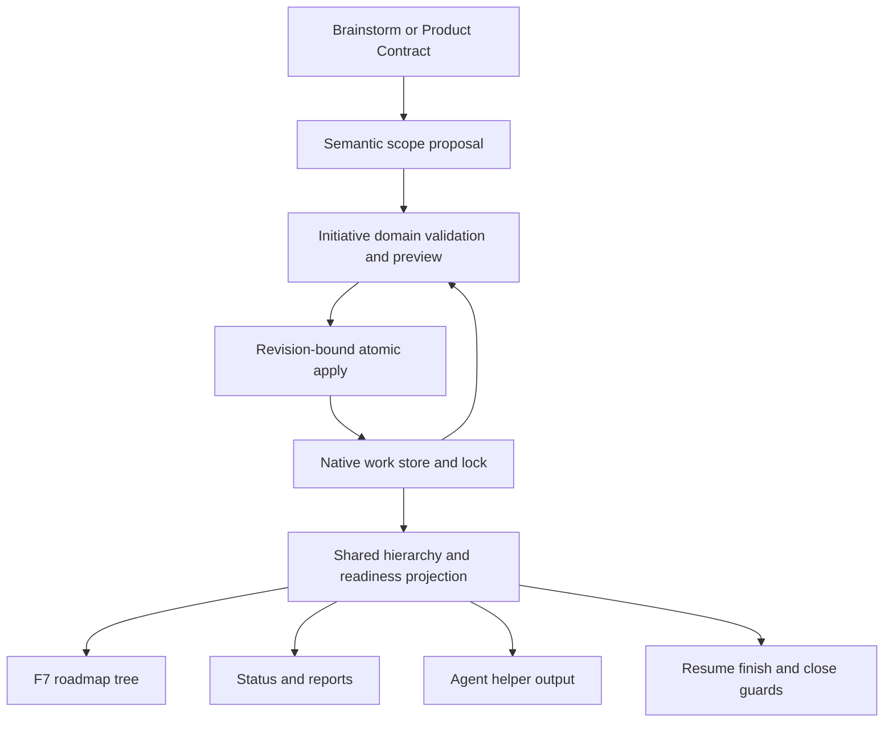
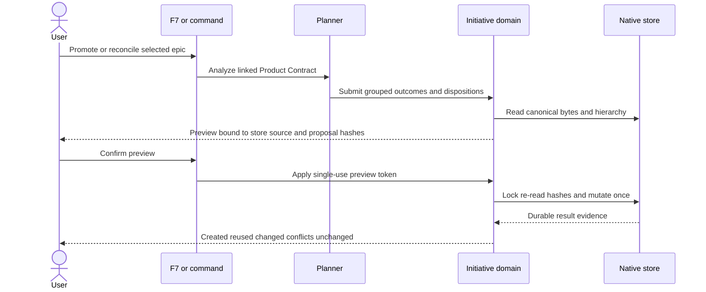
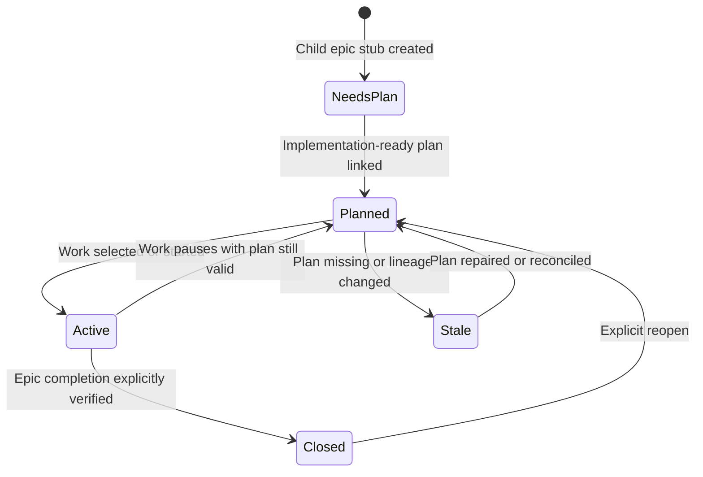

# Initiative Roadmap Hierarchy - Plan

## Goal Capsule

- **Objective:** Preserve broad brainstorm intent as a durable initiative above independently completable child epics while keeping standalone epics unchanged.
- **Authority:** Confirmed initiative and just-in-time planning decisions from the user; this plan resolves implementation boundaries.
- **Execution profile:** Add one hierarchy level, a coded coverage ledger, previewed reconciliation, tree navigation, and shared UI/agent projections without introducing automatic multi-epic execution.
- **Stop conditions:** Stop on ambiguous lineage, stale previews, uncovered accepted outcomes, invalid hierarchy, or any proposed mutation that would rename existing IDs or artifact paths.
- **Tail ownership:** The coded workflow owns validation, mutation, readiness, and closure gates; planners supply semantic outcome grouping but never mutate raw store JSON.

---

## Product Contract

### Summary

Add optional initiatives above epics so a broad brainstorm remains visible until all accepted outcomes are completed or explicitly removed from scope.
Standalone epics retain their current behavior, while initiative child epics are planned and executed one at a time.

### Problem Frame

The current brainstorm-to-plan flow upgrades the brainstorm epic into the first implementation epic.
Accepted outcomes outside that first plan can survive only as prose under deferred scope, so the roadmap has no durable parent that remains open, exposes successor work, or blocks premature completion.
The flat F7 roadmap list also cannot distinguish a broad initiative from an executable epic or show whether an epic has an implementation-ready plan.

### Actors

- A1. **Roadmap user:** Browses initiatives and standalone epics, previews promotion, selects a child epic, and chooses its legal action.
- A2. **Planner:** Converts brainstorm outcomes into grouped delivery scopes and plans one selected epic without expanding every successor up front.
- A3. **Workflow agent:** Reads the same hierarchy, readiness reasons, and action availability as F7 through compact coded helpers.
- A4. **Existing project maintainer:** Promotes a brainstorm-backed top-level epic without losing IDs, plans, evidence, or task history.

### Requirements

#### Hierarchy and compatibility

- R1. An initiative is represented by an epic carrying reserved initiative metadata and label; no new work-item type is introduced.
- R2. The supported hierarchy is initiative → child epic → the child epic's existing tasks, bugs, and decisions; initiatives cannot nest.
- R3. A top-level epic without initiative metadata remains a standalone epic with unchanged planning, resume, finish, report, close, and reopen behavior.
- R4. Native validation rejects cycles, invalid initiative children, nested initiatives, malformed initiative metadata, and missing mapped records before persistence.

#### Outcome coverage and planning

- R5. Every accepted brainstorm outcome has a stable coverage record mapped to exactly one child epic; multiple outcomes may map to the same delivery epic.
- R6. Rejected or non-goal outcomes remain visible as explicit dispositions and do not require child epics.
- R7. Semantic grouping comes from a planner-produced proposal grounded in the Product Contract; coded logic validates and stores the proposal rather than guessing from headings or titles.
- R8. Reconciliation creates successor epic stubs with enough scope and provenance for a later `ce-plan` run but does not create their implementation tasks or plans.
- R9. A child epic is planned just in time; completing or selecting one epic never automatically plans or executes its siblings.
- R10. Plan readiness is distinct from work status and reports at least needs-plan, planned, and stale/missing-plan states with a reason.

#### Promotion and reconciliation

- R11. Promotion first produces a side-effect-free preview containing the proposed initiative, existing epic attachment, successor stubs, outcome mappings, dispositions, and conflicts.
- R12. Applying promotion requires explicit confirmation of that preview and one revision-bound, locked native-store mutation.
- R13. Apply preserves all existing work-item IDs, child relationships below the promoted epic, document links, artifact paths, evidence, notes, and completion history.
- R14. Re-running reconciliation with unchanged lineage is a no-op; changed, stale, missing, or ambiguous lineage fails closed without partial writes.
- R15. Existing manually edited successor stubs and explicit dispositions are retained unless the confirmed proposal intentionally changes them.

#### Navigation, actions, and lifecycle

- R16. F7 renders top-level standalone epics and initiatives in one tree, with initiative children indented beneath their parent.
- R17. Tree rows show work status separately from plan readiness and identify the current executable epic without implying that an initiative is executable.
- R18. Initiative actions are limited to inspect/report, preview or apply promotion/reconciliation, plan or select a child epic, and guarded close/reopen.
- R19. Child and standalone epic actions retain plan, resume, tasks, report, close, and reopen where legal; task actions remain task-local.
- R20. Initiative close is blocked without force override while any accepted outcome is uncovered, any mapped child epic is unresolved, or coverage/lineage is stale or ambiguous.
- R21. Closing or finishing a child record never closes its initiative or starts sibling work; aggregate progress is recomputed from durable state on read.

#### Agent parity and safety

- R22. F7, status/report, and agents consume one coded hierarchy/readiness projection rather than implementing separate interpretations.
- R23. Compact helper operations expose hierarchy, readiness reasons, preview, apply, and conflict results without requiring raw work-store reads or writes.
- R24. Preview is safe for agents to run; apply and disposition changes require the same explicit approval and stale-state checks as the interactive UI.
- R25. Promotion and reconciliation produce durable evidence identifying created, reused, reparented, dispositioned, conflicted, and unchanged records.

### Key Flows

- F1. **New broad brainstorm:** Planning identifies multiple independently completable accepted scopes, preserves the brainstorm epic as an initiative, previews grouped child epics, and applies the approved hierarchy; only the selected child is implementation-planned.
- F2. **New bounded plan:** Planning identifies one delivery scope and retains the existing standalone epic flow with no initiative wrapper.
- F3. **Promote existing work:** The user selects a top-level brainstorm-backed epic, receives a proposed parent initiative plus successor scopes, confirms, and the coded apply path attaches the existing epic while preserving its identity and descendants.
- F4. **Reconcile changed intent:** A later brainstorm or plan analysis proposes coverage changes; unchanged mappings remain stable, explicit edits are shown, and ambiguous or stale proposals stop before mutation.
- F5. **Navigate and act:** F7 displays the hierarchy, the user selects an initiative or epic, and only actions legal for that level and readiness are offered.
- F6. **Agent planning:** A planner reads the compact initiative projection, selects one needs-plan child, creates or strengthens only that child's plan, then returns control without cascading.

### Acceptance Examples

- AE1. **Covers R1-R4.** Given a store containing a standalone epic and an initiative with a child epic and task, validation accepts both; an initiative child task, nested initiative, or ancestor cycle is rejected without changing the store.
- AE2. **Covers R5-R10.** Given a broad Product Contract, an approved proposal may group several outcomes into one child epic and create additional needs-plan stubs; it does not create implementation tasks under those stubs.
- AE3. **Covers R11-R15.** Given an existing brainstorm-backed epic, preview leaves store bytes unchanged, apply reparents the epic without changing its ID or links, and a repeated apply reports no changes.
- AE4. **Covers R14-R15.** Given the store or source lineage changes after preview, apply rejects the stale token and preserves all current state.
- AE5. **Covers R16-R19.** Given mixed top-level records, F7 shows standalone epics beside an initiative tree, gives initiatives aggregate actions, and gives executable epics their existing actions.
- AE6. **Covers R20-R21.** Given one unfinished mapped child or uncovered accepted outcome, initiative close remains blocked even with force; closing the final child only updates aggregate progress until the user explicitly closes the initiative.
- AE7. **Covers R22-R25.** Given the same store, F7 state and compact helper output agree on hierarchy, readiness, conflicts, and legal actions; apply requires approval in either path.

### Success Criteria

- Broad brainstorm commitments no longer disappear into deferred prose after the first epic is planned.
- A user can distinguish initiative, standalone epic, planned child, and needs-plan child from F7 without opening each plan.
- Existing standalone workflows and work-item IDs remain compatible.
- Promotion and reconciliation are previewable, atomic, idempotent, and fail closed on stale or ambiguous state.
- Agents and interactive users act on the same hierarchy and readiness model.

### Scope Boundaries

#### Deferred to Follow-Up Work

- Rich initiative analytics, timelines, portfolio scoring, and cross-initiative dependencies.
- Automatic prioritization among several valid successor epics.
- Bulk planning or autonomous scheduling across multiple child epics.

#### Outside This Product's Identity

- Fully planning every successor epic when the initiative is created.
- Automatically executing sibling epics after one child completes.
- Arbitrary-depth initiatives, initiatives containing initiatives, or generic graph visualization.
- Renaming existing work-item IDs or moving source artifacts during promotion.
- Making raw `.ce-workflow/work-items.json` mutation an agent workflow.

### Dependencies and Assumptions

- Product Contracts continue to carry stable requirement IDs when available; legacy prose receives stable coverage IDs when first accepted into the initiative ledger.
- The native work store remains the sole durable workflow-state authority, while brainstorms and plans remain linked document authorities.
- Existing store locking, candidate validation, and recovery snapshots remain the publication boundary.
- The initiative label is the canonical discriminator; malformed associated metadata fails closed with repair guidance.
- Valid schema-v1 standalone stores remain unchanged. A pre-existing cyclic or structurally invalid parent graph is diagnosed as corruption: reads may report repair details, but mutation is blocked until an explicit repair path produces a valid candidate; invalid topology is never grandfathered or silently rewritten.

---

## Planning Contract

### Key Technical Decisions

- KTD1. **Use epic plus a versioned optional `initiative` field and reserved label.** The field carries source, coverage, and evidence metadata; label/metadata disagreement is invalid. Existing schema-v1 standalone records remain valid, unknown non-reserved fields survive round trips, and all store CRUD paths preserve or validate the optional field.
- KTD2. **Add one cohesive initiative domain module with one-way dependencies.** `extensions/work-initiatives.js` owns pure hierarchy, normalized proposal, coverage, preview, and projection logic and never imports `work-models.js`; adapters supply normalized document-readiness facts and render the returned versioned projection.
- KTD3. **Store a bidirectional coverage ledger on the initiative.** Stable outcome IDs, source provenance, content identity, disposition, and mapped epic identity are durable state. Every accepted outcome maps once to a direct child epic, and every direct child epic covers at least one outcome; titles and free-form notes are display inputs, not reconciliation keys.
- KTD4. **Separate semantic proposal from coded mutation through a canonical proposal contract.** A planner emits versioned grouped outcomes and dispositions; the domain normalizes ordering, validates total coverage, assigns deterministic preview identities, and computes store changes without accepting raw patches.
- KTD5. **Use one versioned shared projection.** Initiative aggregate state, local epic state, plan readiness, conflicts, and legal actions are computed once and consumed by F7, status/report, resume/finish guards, and helper output.
- KTD6. **Keep initiative aggregate and epic execution separate.** An initiative is selectable for inspection and reconciliation but never enters ready-slice selection or direct implementation dispatch.
- KTD7. **Bind apply to immutable preview inputs.** The opaque confirmation token covers canonical store content, normalized source paths and content hashes, canonical proposal hash/schema, target identity, and expected before-state. Apply re-reads all sources and compares these inputs under the store lock; a confirmed no-op returns without invoking persistence.
- KTD8. **Forbid force-close on initiatives.** Explicit non-goal/rejected dispositions are the escape hatch for removed scope; force must not erase accepted commitments.

### Canonical Domain Contracts

- **Initiative metadata:** Carries a schema version, normalized source references, coverage records, last-confirmed identity, and operation evidence. The reserved label and metadata must agree.
- **Coverage record:** Carries a stable outcome ID, source ID or immutable provenance, content identity, accepted/rejected/non-goal disposition, mapped direct-child epic for accepted outcomes, and generated-field ownership identity where reconciliation manages stub content.
- **Semantic proposal:** Carries its schema version, target identity, normalized source hashes, the complete canonically ordered outcome set, delivery-scope grouping, mapped existing epic IDs, and explicit dispositions. It cannot contain raw store patches.
- **Preview result:** Carries the canonical store hash, source hashes, proposal hash, expected protected before-state, proposed operations, conflicts, and an opaque single-use confirmation token.
- **Shared projection:** Carries a projection version and, per node, hierarchy role, parent, work status, plan readiness with reason, aggregate/local progress, conflicts, and legal actions.
- **Validation outcomes:** Invalid structure, incomplete coverage, ambiguous lineage, stale inputs, protected-field conflict, and approval failure are distinct coded outcomes shared by F7 and helper adapters.

Canonicalization sorts equivalent records before hashing, preserves unknown non-reserved fields, and validates total coverage before a preview can be confirmed.

### High-Level Technical Design

#### Component boundaries

#### Promotion and reconciliation flow

#### Lifecycle and readiness

Initiative progress is an aggregate over child epic status and coverage dispositions, not a state transition that dispatches work.

### Outcome Identity and Reconciliation Rules

- Existing Product Contract IDs are preferred provenance anchors, but the ledger also retains content identity so reuse of an ID for different intent becomes a conflict.
- Legacy outcomes receive deterministic IDs during preview from immutable source provenance; title or array position alone never defines identity, and ambiguous provenance blocks confirmation.
- The canonical proposal orders equivalent inputs identically before hashing and names every accepted, rejected, and non-goal outcome exactly once.
- One accepted outcome maps to one direct child epic, and every direct child epic covers one or more outcomes; several outcomes may share an epic.
- A changed or deleted source excerpt without a stable match is a conflict for preview, not an automatic delete, replacement, or rejected disposition.
- Generated fields retain their last-confirmed identity so manually edited scope is reported as a field conflict; apply changes only the explicitly confirmed diff and preserves unknown fields.
- Reconciliation mutates only the native store. Product Contracts and plans are re-read for hash verification but are not part of the store transaction.

### Readiness and Action Rules

- **Needs plan:** No implementation-ready design artifact is linked.
- **Planned:** A linked artifact declares implementation readiness and passes the existing open-question gate.
- **Stale:** The linked plan is missing, no longer implementation-ready, or conflicts with recorded lineage.
- Work status remains open, in progress, blocked, deferred, or closed and is rendered separately.
- Initiative actions never include direct resume or finish; those actions target a selected child epic.
- Standalone epic actions remain unchanged.

### Sequencing

1. Establish store invariants and initiative metadata before any UI or planner integration.
2. Build the pure projection and reconciliation engine with byte-preservation and stale-preview tests.
3. Branch brainstorm/plan bootstrap into standalone or initiative flows using the same engine.
4. Make F7, status/report, and execution guards consume the shared projection.
5. Add compact agent operations and update orchestration guidance after coded behavior is stable.
6. Run compatibility and package gates only after all consumers use the shared model.

### System-Wide Impact

- **Persistence:** Adds structured optional initiative metadata while preserving schema-v1 compatibility for old stores; candidate validation checks the complete parent graph and ledger before publication and during recovery.
- **Selection:** Current-roadmap memory must point to an executable child or standalone epic, never implicitly to an initiative.
- **Planning:** Brainstorm and plan handoffs gain initiative proposal/reconciliation behavior without changing `ce-plan` itself into a multi-epic executor.
- **Reporting:** Initiative summaries aggregate child epics while epic reports remain local to their direct executable children.
- **Safety:** Reparenting and disposition changes become approval-bound durable mutations. The store lock cannot make source documents transactional, so apply re-hashes them under the lock and rejects drift before changing store state.
- **Agent parity:** Planner and workflow agents receive the same compact state and legal actions shown by F7.

### Risks and Mitigations

- **Flat-epic assumptions leak into one consumer.** Centralize executable-target, close-blocker, legal-action, and projection predicates, then compare all consumers against one parity fixture.
- **Recursive aggregation double-counts work.** Keep initiative aggregate summaries separate from child epic local summaries and never flatten grandchildren into ready-slice selection.
- **Semantic proposal invents or drops outcomes.** Require canonical provenance and complete bidirectional coverage in preview; unresolved extraction remains a conflict requiring user correction.
- **Preview becomes stale before apply.** Bind apply to canonical store bytes, source hashes, proposal hash, and expected before-state; compare under the lock and reject rather than merge.
- **Source documents change during apply.** Re-read every authoritative source under the store lock and abort before store mutation when any hash differs; never claim cross-file atomicity.
- **Independent edits break ledger integrity.** Validate the complete graph after create, update, delete, recovery, and reconciliation so mapped children cannot be removed, reparented, or retyped behind the ledger.
- **Manual stub edits are overwritten.** Track generated-field identity, expose field conflicts in preview, and apply only confirmed changes while preserving user-owned and unknown fields.
- **Promotion corrupts history or partially publishes.** Reparent existing records without changing protected fields and inject failures around candidate publication to prove recovery yields the complete old or complete new graph.
- **The feature creates a dependency cycle or bloats `work-models.js`.** Keep the domain module independent of `work-models.js`, inject normalized readiness inputs, and keep integration adapters thin.

### Alternative Approaches Considered

- **New `initiative` work-item type:** Rejected because it expands store type compatibility and every type switch while an epic role label provides the needed distinction.
- **Plan every epic up front:** Rejected because later plans would age before execution and duplicate current one-slice planning discipline.
- **One rolling mega-epic:** Rejected because deferred scope and completion remain ambiguous.
- **Regex extraction directly from brainstorm prose:** Rejected because semantic grouping and explicit dispositions require planner judgment; coded logic should validate, not pretend to understand arbitrary prose.
- **A second initiative state file:** Rejected because it would create dual authority and reconciliation bugs.

---

## Implementation Units

### U1. Native hierarchy and initiative metadata

- **Goal:** Extend the native store with backward-compatible initiative metadata and enforce the supported hierarchy at the persistence boundary.
- **Requirements:** R1-R4, R13, R25; AE1.
- **Dependencies:** None.
- **Files:** `extensions/work-store.js`, `scripts/test-work-store.mjs`.
- **Approach:** Add the reserved initiative discriminator and versioned metadata cloning/validation; validate the complete parent graph and bidirectional ledger during load, CRUD, candidate publication, and recovery while leaving unlabeled epics and their existing children valid.
- **Patterns to follow:** `validateStore`, `createWorkItem`, `updateWorkItem`, `deleteWorkItem`, and candidate validation in `saveStore`.
- **Test scenarios:**
  1. A valid old store with standalone epic children loads and round-trips unchanged through generic update/save.
  2. A legacy cyclic or structurally invalid graph remains byte-preserved for diagnosis, exposes deterministic repair guidance, and rejects mutation until repaired.
  3. A valid initiative → epic → task tree validates and preserves metadata plus unknown non-reserved fields.
  4. Initiative nesting, a task directly under an initiative, malformed metadata, duplicate outcome provenance, missing ledger mappings, and ancestor cycles each fail before publication.
  5. Updating, deleting, retyping, or reparenting a mapped child is rejected when it would break ledger or hierarchy invariants.
  6. Updating an existing epic's `parentId` through the reconciliation candidate preserves its ID, descendants, dependencies, links, notes, and evidence.
- **Verification:** Store tests prove legacy compatibility, complete graph rejection, metadata preservation, and stable identity through reparenting.

### U2. Shared hierarchy and readiness projection

- **Goal:** Compute initiative trees, local epic state, aggregate progress, plan readiness, conflicts, and legal actions once.
- **Requirements:** R3, R10, R16-R24; AE5-AE7.
- **Dependencies:** U1.
- **Files:** `extensions/work-initiatives.js`, `extensions/work-models.js`, `scripts/test-work-initiative.mjs`, `scripts/test-work-status.mjs`.
- **Approach:** Introduce focused initiative predicates and a versioned projection DTO; distinguish aggregate from local state and accept normalized plan/readiness facts from adapters so the domain module never imports `work-models.js` or reads UI policy.
- **Patterns to follow:** `issueSummary`, `buildEpicChildState`, `statusIcon`, `statusLabel`, and compact state builders.
- **Test scenarios:**
  1. A mixed store projects standalone epics and one initiative tree in stable order without duplicate descendants.
  2. Needs-plan, planned, and stale plan states each include a deterministic reason independent of work status.
  3. Initiative aggregate progress reflects child epics and dispositions but never exposes grandchildren as initiative-ready work.
  4. Legal actions differ for initiative, child epic, standalone epic, and task while legacy standalone output fields and action ordering remain compatible.
  5. Package/import checks prove `work-initiatives.js` does not import `work-models.js`, and all consumers receive the same projection version.
- **Verification:** Focused projection and cross-consumer parity tests agree on hierarchy, readiness, progress, target resolution, and action availability.

### U3. Outcome coverage and atomic reconciliation

- **Goal:** Turn a planner-produced outcome proposal into a complete preview and one safe, idempotent apply operation.
- **Requirements:** R5-R8, R11-R15, R20, R24-R25; AE2-AE4, AE6-AE7.
- **Dependencies:** U1, U2.
- **Files:** `extensions/work-initiatives.js`, `extensions/work-models.js`, `scripts/work-helper.mjs`, `scripts/test-work-initiative.mjs`.
- **Approach:** Normalize the versioned proposal, derive deterministic preview outcome IDs, and bind an opaque single-use token to canonical store bytes, source hashes, proposal hash, target, and expected protected fields; under the lock, re-read all inputs and either return a true no-op without saving or publish one validated candidate with matching evidence.
- **Execution note:** Start with characterization of store bytes, source hashes, and existing epic lineage before adding mutation behavior.
- **Patterns to follow:** Native migration candidate validation, `mutateStore`, plan source ambiguity stops, and `bootstrapPlanEpic` ID/link preservation.
- **Test scenarios:**
  1. Preview of an existing epic plus successor scopes leaves canonical store bytes unchanged and deterministically assigns the same legacy outcome IDs across retries and source line movement.
  2. Confirmed apply creates the initiative and stubs, reparents the existing epic, and preserves every existing ID/path/dependency/evidence field.
  3. Reapplying the same proposal reports no changes, does not invoke persistence, leaves exact store bytes unchanged, and creates no duplicate epic or planning task.
  4. Store-only, source-only, proposal-only, token-replay, duplicate-provenance, manual-field, and ambiguous-mapping drift each reject without partial mutation.
  5. Several accepted outcomes may map to one epic; uncovered accepted outcomes block apply and close; rejected/non-goal outcomes remain durable.
  6. Failure injection after lock acquisition and before candidate publication recovers to the complete old or complete new graph with matching operation evidence.
- **Verification:** Reconciliation tests prove preview purity, deterministic identity, true no-op behavior, atomic publication/recovery, stale rejection, complete coverage, and audit evidence.

### U4. Brainstorm and plan bootstrap branching

- **Goal:** Infer standalone versus initiative shape from confirmed delivery-scope mapping and preserve just-in-time child planning.
- **Requirements:** R5-R10, R14-R15; F1-F4, F6; AE2-AE4.
- **Dependencies:** U3.
- **Files:** `extensions/work-models.js`, `scripts/test-work-brainstorm.mjs`, `scripts/test-work-plan-open-questions.mjs`, `skills/work-orchestrator/SKILL.md`, `skills/work-orchestrator/references/full-policy.md`.
- **Approach:** Keep one-scope plans on the current standalone bootstrap path; route multi-scope Product Contracts through proposal, preview, and confirmed initiative apply; create only child epic stubs and one planning item for the selected child.
- **Patterns to follow:** `planEpicFields`, `bootstrapPlanEpic`, source-alignment review, open-question gate, and current idea-lineage backlinks.
- **Test scenarios:**
  1. A bounded brainstorm upgrades to one standalone epic exactly as before.
  2. A multi-scope brainstorm preserves its brainstorm epic as initiative and creates grouped child stubs after confirmation.
  3. Existing linked ideas, brainstorm artifacts, and plan paths retain backlinks and are not duplicated on rerun.
  4. Open questions, incomplete coverage, empty extraction without explicit no-commitment confirmation, and ambiguous lineage stop before bootstrap mutation.
  5. Only the selected child receives a planning task; successor stubs remain needs-plan and contain no implementation children.
- **Verification:** Brainstorm and open-question fixtures prove both lifecycle shapes, complete traceability, and no planning cascade.

### U5. F7 initiative tree and context-sensitive actions

- **Goal:** Make initiatives, child epics, standalone epics, status, and plan readiness understandable and actionable from F7.
- **Requirements:** R10, R16-R21; F5; AE5-AE6.
- **Dependencies:** U2, U3, U4.
- **Files:** `extensions/work-models.js`, `scripts/test-work-roadmap.mjs`, `scripts/test-work-initiative.mjs`, `README.md`.
- **Approach:** Replace the flat selection projection with a stable indented tree while preserving existing list fields; render concise initiative and readiness markers and derive operation menus from shared legal actions.
- **Patterns to follow:** `handleWorkRoadmapCommand`, `handleRoadmapTasksMenu`, `renderWorkRoadmapText`, and existing choose/notify flows.
- **Test scenarios:**
  1. F7 displays standalone epics as roots and initiative child epics indented beneath their parent with separate status/readiness markers.
  2. Selecting an initiative offers inspect, reconcile/promote, plan/select child, guarded close, and reopen but never resume/finish.
  3. Selecting child or standalone epics retains their existing plan, resume, tasks, report, close, and reopen paths.
  4. Promotion displays the full proposed hierarchy/coverage before approval; cancel performs no mutation.
  5. Initiative close remains blocked for uncovered outcomes, stale coverage, or unresolved child epics even when force is requested.
- **Verification:** Roadmap interaction fixtures prove tree rendering, legal action menus, cancellation safety, and unchanged standalone navigation.

### U6. Status, report, resume, and finish integration

- **Goal:** Apply hierarchy semantics to non-F7 commands without turning initiatives into executable roadmaps.
- **Requirements:** R17, R20-R23; F5-F6; AE6-AE7.
- **Dependencies:** U2, U5.
- **Files:** `extensions/work-models.js`, `scripts/test-work-status.mjs`, `scripts/test-work-report.mjs`, `scripts/test-work-resume.mjs`, `scripts/test-work-start-finish.mjs`.
- **Approach:** Use the shared projection for aggregate initiative reports and target resolution; require resume/finish to resolve to an executable child or standalone epic, and recompute parent progress without cascading.
- **Patterns to follow:** `currentRoadmap`, `planResumeAction`, `buildWorkFinishState`, `buildWorkReportState`, and existing dirty/verification gates.
- **Test scenarios:**
  1. Status/report show initiative aggregate and child-local progress without double counting.
  2. Current-roadmap fallback never silently chooses an initiative when several child epics are candidates.
  3. Resume on an initiative asks for or selects one eligible child but launches no sibling work; resume on standalone remains unchanged.
  4. Finishing a task or child epic mutates only that target and leaves initiative closure explicit.
  5. Blocked, deferred, stale-plan, and no-ready-child states produce deterministic next actions.
- **Verification:** Existing command fixtures plus initiative cases prove targeting, aggregation, no cascade, and standalone compatibility.

### U7. Agent helper parity and package contract

- **Goal:** Give planners and workflow agents compact coded access to the same hierarchy, readiness, preview, and apply contracts.
- **Requirements:** R22-R25; F6; AE7.
- **Dependencies:** U2-U6.
- **Files:** `scripts/work-helper.mjs`, `agents/work-planner.md`, `prompts/work-plan.md`, `prompts/work-master.md`, `skills/work-orchestrator/SKILL.md`, `skills/work-orchestrator/references/full-policy.md`, `README.md`, `scripts/test-work-initiative.mjs`, `scripts/verify-package.mjs`.
- **Approach:** Add compact hierarchy and reconciliation helper operations, document approval boundaries, and update planner guidance to plan one child epic while prohibiting raw-store mutation and tree-wide execution.
- **Patterns to follow:** Existing compact helper projections, one-slice planner contract, command usage validation, and package file checks.
- **Test scenarios:**
  1. Helper hierarchy output matches F7 projection for IDs, parentage, status, readiness, conflicts, and legal actions.
  2. Preview is read-only; apply rejects missing approval/revision identity and succeeds once with the confirmed preview.
  3. Planner guidance selects one needs-plan child and cannot interpret the initiative itself as executable work.
  4. Helper usage errors, stale previews, and ambiguous mappings return structured failures without store mutation.
  5. Package verification includes the new module, tests, prompts, and helper behavior.
- **Verification:** Helper parity tests and `npm run verify:quiet` pass with no tracked runtime artifacts or package omissions.

---

## Verification Contract

| Gate | Applies to | Evidence |
| --- | --- | --- |
| Native store validation | U1 | `node scripts/test-work-store.mjs` passes hierarchy, cycle, compatibility, and identity cases. |
| Initiative domain behavior | U2-U5, U7 | `node scripts/test-work-initiative.mjs` passes projection, coverage, preview/apply, source/store/proposal drift, true no-op, recovery, close, and cross-consumer parity cases. |
| Brainstorm and plan lineage | U4 | `node scripts/test-work-brainstorm.mjs` and `node scripts/test-work-plan-open-questions.mjs` pass standalone and initiative branches. |
| Roadmap interaction | U5 | `node scripts/test-work-roadmap.mjs` passes tree, marker, action, confirmation, and legacy navigation cases. |
| Command integration | U6 | `node scripts/test-work-status.mjs`, `node scripts/test-work-report.mjs`, `node scripts/test-work-resume.mjs`, and `node scripts/test-work-start-finish.mjs` pass aggregate/local targeting and no-cascade cases. |
| Package regression | All | `npm run verify:quiet` passes once after production and package-surface changes are complete. |
| Static integrity | All | `git diff --check` passes and diagnostics report no blocking errors in changed source/test files. |

The focused initiative test is the primary cross-component regression check; existing command tests protect compatibility at each public entry point.

---

## Definition of Done

- Initiative metadata and hierarchy validation preserve valid standalone stores; previously tolerated invalid graphs remain byte-preserved for diagnosis and reject mutation until explicitly repaired.
- Every accepted outcome in an initiative has a durable child-epic mapping, while rejected/non-goal dispositions remain explicit.
- Promotion and reconciliation provide a complete preview, require confirmation, bind store/source/proposal identities, preserve IDs/artifacts/history, reject stale or ambiguous state, publish one complete candidate under the native lock, and return true byte-preserving no-ops.
- New broad brainstorms can create initiatives with needs-plan successor stubs; bounded brainstorms still create standalone epics.
- F7 renders a stable initiative tree with separate work status and plan readiness and exposes only level-appropriate actions.
- Status, report, resume, finish, and current-roadmap selection distinguish initiative aggregates from executable epics and never cascade across siblings.
- Compact helper output matches F7 semantics, and agents use coded preview/apply operations rather than raw work-store mutation.
- Initiative close cannot bypass uncovered outcomes or unresolved child epics; standalone force-close behavior remains unchanged.
- Focused and package verification gates pass, diagnostics are clean, and no runtime proposal/preview artifacts are tracked.
- Dead-end implementations, duplicate hierarchy logic, temporary migration shims, and abandoned parsing experiments are removed from the final diff.
