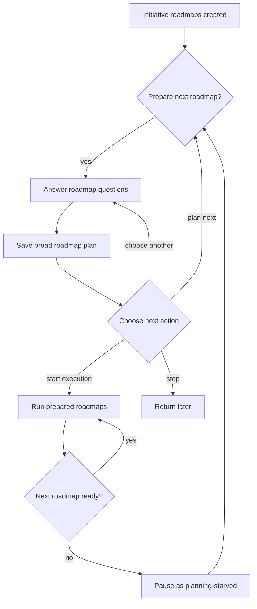
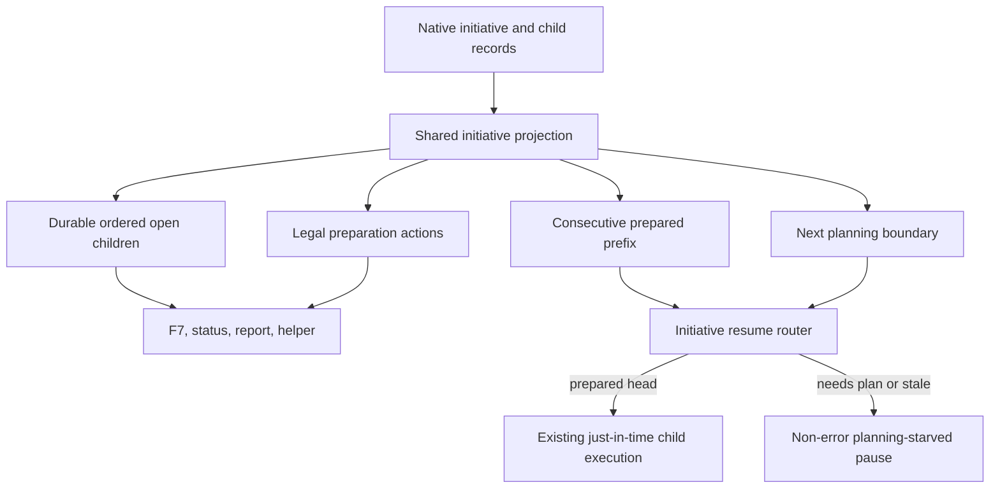

# Initiative Roadmap Preparation Loop - Plan

## Goal Capsule

- **Objective:** Let a user prepare enough initiative roadmap plans for autonomous execution without allowing planning to silently start implementation.
- **Authority:** The Product Contract governs behavior; the Planning Contract governs implementation; existing native-store and coded-state invariants govern details left open.
- **Stop conditions:** Stop rather than guess if implementation would change roadmap ordering, standalone behavior, or the explicit execution-approval boundary.
- **Execution profile:** Code change with focused initiative/F7 tests, package verification, independent review, and PR delivery.
- **Tail ownership:** The executor removes abandoned attempts, resolves review findings, and owns CI through green.
- **Open blockers:** None.

---

## Product Contract

### Summary

Add an initiative-only preparation loop that keeps a soft buffer of broad roadmap plans ready while leaving slice planning just in time.
Initiative execution may consume a partial buffer and pauses safely when it reaches an unplanned roadmap.

### Problem Frame

Initiatives can contain several roadmap stubs that still require the user's decisions.
The current just-in-time flow plans one child at a time, so later questions may surface after the user's context has faded or while unattended execution is waiting.
Planning a roadmap also feels coupled to starting work, which makes it awkward to prepare several roadmaps and stop before implementation.

### Key Decisions

- **Prepare a rolling buffer, not the whole initiative by default.** The workflow encourages the current roadmap plus two roadmap plans ahead, while allowing the user to plan more when useful.
- **Separate initiative planning from implementation.** Finishing an initiative roadmap plan always returns control to the user instead of starting product work.
- **Keep roadmap planning broad and slice planning just in time.** Human decisions and durable roadmap intent are captured early; low-level execution details are created or refreshed near execution.
- **Permit bounded autonomy.** Initiative execution can start before every child is planned and pauses when its prepared queue is exhausted.
- **Preserve standalone behavior.** The new planning gate applies only to roadmaps inside an initiative.

### Actors

- A1. **Initiative owner:** Answers roadmap-level questions, chooses how much work to prepare, and explicitly starts execution.
- A2. **Planner:** Produces a durable roadmap plan without implementing it.
- A3. **Initiative executor:** Runs ready roadmap work in order and pauses at readiness boundaries.

### Requirements

**Preparation loop**

- R1. After an initiative and its child roadmaps are created, the workflow must offer to plan the next suggested unplanned roadmap.
- R2. After any initiative roadmap plan is completed, the workflow must return to a choice between planning the next suggestion, choosing another roadmap, starting execution, or stopping.
- R3. Completing an initiative roadmap plan must not automatically start implementation.
- R4. The workflow should encourage keeping the active roadmap plus two roadmap plans ahead ready for execution.
- R5. The rolling buffer is guidance rather than a cap, so the owner may continue planning additional roadmaps.
- R6. Selecting an unplanned initiative roadmap from F7 must offer planning and return to the initiative choices after the plan is created.

**Plan readiness**

- R7. A decision-ready roadmap must have a durable broad plan with its known human decisions resolved.
- R8. Detailed slice planning remains just in time rather than being generated for every initiative roadmap upfront.
- R9. Before a prepared roadmap begins execution, the workflow must check whether earlier work materially invalidated its plan and reopen planning only when needed.

**Initiative execution**

- R10. The owner must explicitly choose to start initiative execution.
- R11. Initiative execution may start when only part of the initiative is decision-ready.
- R12. Execution must run prepared roadmaps until the next required roadmap lacks a usable plan, then pause without treating starvation as failure.
- R13. A starvation pause must identify the next roadmap that needs planning and offer a direct path back into the preparation loop.
- R14. Standalone roadmap planning and execution behavior must remain unchanged.

### Key Flows

- F1. **Prepare after creation**
  - **Trigger:** An initiative hierarchy has been created from a brainstorm or plan.
  - **Actors:** A1, A2
  - **Steps:** The workflow suggests the next roadmap; the owner answers its questions; the planner stores the roadmap plan; the owner chooses whether to continue planning, execute, or stop.
  - **Outcome:** Roadmap context is captured without implementation starting.
  - **Covered by:** R1-R5, R7-R8, R10

- F2. **Prepare from F7**
  - **Trigger:** The owner selects an unplanned child of an existing initiative.
  - **Actors:** A1, A2
  - **Steps:** F7 offers roadmap planning; the planner creates the plan; control returns to the initiative choices.
  - **Outcome:** The owner can prepare several roadmaps in one session and leave execution stopped.
  - **Covered by:** R2-R3, R5-R8

- F3. **Execute a partial buffer**
  - **Trigger:** The owner starts initiative execution with some later roadmaps still unplanned.
  - **Actors:** A1, A3
  - **Steps:** The executor revalidates and runs prepared roadmaps; when the next roadmap is not ready, it pauses and identifies that roadmap.
  - **Outcome:** Unattended work consumes the available buffer without crossing an unanswered product decision.
  - **Covered by:** R9-R13

### Acceptance Examples

- AE1. **Covers R1-R5, R10.** Given a new initiative with four unplanned roadmaps, when the first roadmap plan is completed, then no implementation starts and the owner is offered plan-next, choose-another, start-execution, and stop choices.
- AE2. **Covers R4-R5.** Given the active roadmap and two following roadmaps are decision-ready, when the preparation menu appears, then it indicates the suggested buffer is ready but still permits planning another roadmap.
- AE3. **Covers R6.** Given an existing initiative has an unplanned child, when the owner selects that child in F7 and finishes its plan, then the child becomes decision-ready and the workflow returns to initiative choices.
- AE4. **Covers R9, R11-R13.** Given two roadmaps are prepared and a third is not, when initiative execution starts, then the prepared work runs and execution pauses at the third roadmap with a planning action rather than failing.
- AE5. **Covers R9.** Given earlier implementation materially invalidates a prepared roadmap assumption, when that roadmap reaches execution, then it returns to planning instead of executing the stale plan.
- AE6. **Covers R14.** Given a standalone roadmap, when its plan is completed, then its existing plan-and-run behavior is unchanged.

### Scope Boundaries

- No requirement to prepare every initiative roadmap before execution starts.
- No upfront generation of detailed slices for all roadmap plans.
- No automatic implementation after planning an initiative roadmap.
- No change to standalone roadmap behavior.
- No new hard configuration for buffer size; two roadmaps ahead is the initial product guidance.

### Dependencies / Assumptions

- Initiative child ordering and readiness remain the authority for choosing the next roadmap.
- A broad roadmap plan can remain useful across earlier implementation changes, with revalidation covering material drift.
- Execution must never invent answers for unresolved roadmap-level product decisions merely to avoid starvation.

### Sources / Research

- `prompts/work-plan.md` and `prompts/work-master.md` define the current one-child, just-in-time planning behavior.
- `agents/work-planner.md` separates planner responsibilities from product-code implementation.
- `extensions/work-models.js` contains initiative bootstrap, roadmap actions, readiness projection, and resume handoffs.
- `docs/plans/2026-07-19-001-feat-initiative-roadmap-hierarchy-plan.md` defines the existing initiative hierarchy and F7 action model.

---

## Planning Contract

**Product Contract preservation:** Product Contract unchanged.

### Key Technical Decisions

- **KTD-1 — Store-owned delivery order.** Capture each proposal group's input-array ordinal before canonical ID sorting, include that ordinal in deterministic proposal hashing, and persist the resulting child order across reconciliation; legacy initiatives fall back to existing durable coverage order, never mutable update timestamps.
- **KTD-2 — One preparation projection.** Extend the shared initiative hierarchy projection with the ordered open children, prepared prefix, next planning boundary, two-ahead guidance, startability, and legal owner actions so every UI and agent surface consumes one contract.
- **KTD-3 — Broad readiness stays separate from slices.** A linked, usable roadmap plan makes an initiative child prepared; executable slice tasks remain just-in-time and do not affect the preparation buffer.
- **KTD-4 — Initiative planning has an explicit stop boundary.** Attaching or completing an initiative child plan returns preparation actions and dispatches no implementation; standalone planning retains its current handoff.
- **KTD-5 — Starvation is derived, not stored.** Initiative execution recomputes the ordered prepared prefix before each child and returns a non-error `planning_starved` result at the first unusable child.
- **KTD-6 — Revalidation reuses representable readiness facts.** Existing linked-plan, open-question, lineage, and stale-source signals gate execution; the change does not invent semantic fingerprints or a second assumptions registry.

### High-Level Technical Design

### Implementation Constraints

- Keep `.ce-workflow/work-items.json` and linked plan artifacts authoritative; do not persist chat-session loop state.
- Preserve proposal reconciliation idempotency and backward readability for initiatives created before durable order exists.
- Route the feature only through child roadmaps whose parent is an initiative.
- Preserve existing user cancellation and model/planner failure behavior: no successful plan link means no readiness transition.
- Update prompts to consume coded preparation state rather than duplicate ordering or readiness policy in prose.

### Sequencing

U1 establishes durable order and the shared projection.
U2 routes read surfaces through that projection.
U3 separates plan completion from execution.
U4 adds ordered partial execution and starvation handling.
U5 closes the contract with focused regressions and final verification.

### Risks and Assumptions

- **Legacy order:** Existing initiatives need a deterministic fallback; use accepted coverage order already stored with the initiative and persist explicit order on later reconciliation.
- **Semantic drift:** Code can detect representable stale state but cannot infer arbitrary product-assumption changes; broader revalidation remains planner judgment at the coded planning boundary.
- **Continuation:** Preserve initiative identity across child completion so a later resume cannot jump to unrelated standalone work.
- **Buffer meaning:** “Current plus two ahead” means three consecutive usable roadmaps from the current execution boundary, not a hard cap or setting.

---

## Implementation Units

### U1. Durable initiative order and preparation projection

- **Goal:** Make initiative child order and preparation readiness deterministic and shared.
- **Requirements:** R4, R5, R7, R8; AE2.
- **Dependencies:** None.
- **Files:** `extensions/work-initiatives.js`, `extensions/work-store.js`, `scripts/test-work-initiative.mjs`.
- **Approach:** Record each proposal group's semantic input ordinal before the existing canonical ID sort so deterministic hashing retains delivery order, then persist ordered child IDs in initiative metadata. Validate unique direct-child coverage and use a deterministic legacy fallback. Extend the hierarchy projection with ordered open children, consecutive prepared prefix, first planning boundary, three-roadmap guidance target, startability, and legal actions.
- **Patterns to follow:** Existing proposal normalization/reconciliation in `extensions/work-initiatives.js`; native metadata validation in `extensions/work-store.js`; projection fixtures in `scripts/test-work-initiative.mjs`.
- **Test scenarios:**
  - Changing a child timestamp leaves delivery order unchanged.
  - Non-lexical group IDs retain input delivery order through normalization, hashing, preview, apply, and idempotent re-apply.
  - Reapplying reconciliation preserves order and does not duplicate IDs.
  - A legacy initiative derives deterministic order without mutation on read.
  - A prepared later child behind an unplanned earlier child is excluded from the prepared prefix.
  - Covers AE2: three consecutive usable roadmaps satisfy guidance while planning another remains legal.
- **Verification:** Domain projection tests prove order, fallback, prefix, and guidance without relying on UI text.

### U2. Shared preparation state across user and agent surfaces

- **Goal:** Make F7, status, report, resume, and helper output agree on the next roadmap and legal actions.
- **Requirements:** R1, R2, R4-R6, R10; AE1-AE3.
- **Dependencies:** U1.
- **Files:** `extensions/work-models.js`, `scripts/work-helper.mjs`, `scripts/test-work-initiative.mjs`, `scripts/test-work-roadmap.mjs`.
- **Approach:** Adapt the domain preparation projection once in `buildInitiativeProjection` and remove independent next-child calculations from command states. Expose the same compact preparation block through `initiative-summary`; edit the helper only if its existing delegation strips fields.
- **Patterns to follow:** Existing hierarchy adapter and coded operation labels in `extensions/work-models.js`; helper delegation in `scripts/work-helper.mjs`.
- **Test scenarios:**
  - F7, status, report, resume, and helper identify the same next child after timestamp perturbation.
  - An unplanned child offers planning while a prepared child offers execution-legal actions.
  - Cancellation returns without changing preparation state.
- **Verification:** Focused tests compare the shared preparation fields rather than duplicating expected algorithms per surface.

### U3. Initiative plan-completion boundary

- **Goal:** Return control after broad initiative roadmap planning without dispatching implementation.
- **Requirements:** R1-R3, R6-R8, R10, R14; AE1, AE3, AE6.
- **Dependencies:** U1, U2.
- **Files:** `extensions/work-models.js`, `prompts/work-plan.md`, `prompts/work-master.md`, `agents/work-planner.md`, `scripts/test-work-roadmap.mjs`.
- **Approach:** Branch plan bootstrap by parent initiative. Attach the broad plan and return coded plan-next, choose-another, start-execution, and stop actions without creating slice work or issuing a resume handoff. Keep the standalone branch unchanged and make prompts obey returned coded state.
- **Patterns to follow:** Existing initiative target handling in plan bootstrap; current standalone `run-planner` regression.
- **Test scenarios:**
  - Covers AE1: completing a new initiative child plan returns all four actions with no implementation handoff.
  - Covers AE3: F7-selected child planning returns to its parent initiative choices.
  - Planner cancellation or failure leaves the child unprepared and preserves the prior menu state.
  - Covers AE6: standalone plan completion retains its current plan-and-run handoff.
- **Verification:** No implementation/slice WorkItem or worker dispatch exists after initiative broad-plan completion; standalone assertions remain byte-for-byte stable where practical.

### U4. Ordered partial execution and safe starvation

- **Goal:** Execute only the prepared ordered prefix and pause cleanly at the first planning boundary.
- **Requirements:** R9-R13; AE4, AE5.
- **Dependencies:** U1-U3.
- **Files:** `extensions/work-models.js`, `prompts/work-resume.md`, `agents/work-planner.md`, `scripts/test-work-initiative.mjs`.
- **Approach:** Treat explicit initiative resume/start as execution approval, re-read the shared projection, and select only the first open child in durable order when its broad plan is usable. Route direct resume and F7 resume of an initiative child through its parent projection so a later child cannot bypass an earlier boundary. Return `{ ok: true, action: "planning_starved" }` with the blocked child and direct plan action when the head needs planning or representable revalidation.
- **Patterns to follow:** Existing `resolveResumeTarget`, child lineage facts, and coded error/action states in `extensions/work-models.js`.
- **Test scenarios:**
  - Covers AE4: two prepared children advance in order and the third unplanned child yields non-error starvation naming that child.
  - Initiative-root resume never selects a prepared later child across an earlier unplanned child.
  - Direct resume or F7 resume of that later child redirects to the same parent starvation boundary.
  - Restarting and resuming recomputes the same boundary without session state.
  - Covers AE5: an existing stale/lineage conflict returns to planning before implementation.
  - A valid linked plan proceeds without unnecessary replanning.
- **Verification:** Resume tests prove explicit approval, ordered selection, restart safety, stale gating, and direct recovery to preparation.

### U5. Contract and package regression gate

- **Goal:** Prove every acceptance example and preserve package quality.
- **Requirements:** R1-R14; AE1-AE6.
- **Dependencies:** U1-U4.
- **Files:** `scripts/test-work-initiative.mjs`, `scripts/test-work-roadmap.mjs`, `README.md`.
- **Approach:** Consolidate focused assertions around domain preparation state and end-to-end command behavior, add brief user-facing documentation for the rolling buffer and explicit start boundary, and retain standalone coverage.
- **Test scenarios:** Each AE has at least one named assertion; command JSON remains serializable; no test depends on wall-clock ordering.
- **Verification:** Focused scripts and the package gate pass after the final production change.

---

## Verification Contract

| Gate | Command | Proves |
| --- | --- | --- |
| Initiative domain and resume behavior | `node scripts/test-work-initiative.mjs` | Durable order, shared projection, prepared prefix, starvation, restart, and stale gating |
| F7 and plan-completion behavior | `node scripts/test-work-roadmap.mjs` | Preparation choices, no auto-start, cancellation, and standalone compatibility |
| Package regression | `npm run verify:quiet` | Full repository checks and packaging integrity |
| Static diagnostics | Pi LSP and `lens_diagnostics` on changed files | No blocking language, structural, lint, or security findings |
| Independent review | Read-only diff review after focused tests | Product traceability, failure paths, and regression risk |

---

## Definition of Done

- U1-U5 are complete in dependency order and each cited test scenario has runnable evidence.
- Initiative order remains stable under child updates and legacy initiatives stay readable.
- One durable preparation projection drives F7, status, report, resume, and helper context.
- Broad initiative roadmap planning returns owner choices without starting implementation.
- Explicit initiative execution consumes only the ordered prepared prefix and pauses non-fatally at the first unusable child.
- Standalone roadmap behavior is unchanged.
- Prompts follow coded state and do not recreate policy independently.
- Focused tests, `npm run verify:quiet`, static diagnostics, and independent review pass.
- Abandoned approaches, debug output, and temporary compatibility code are removed from the final diff.
- The branch is committed, pushed, opened as a PR, and CI is green.
