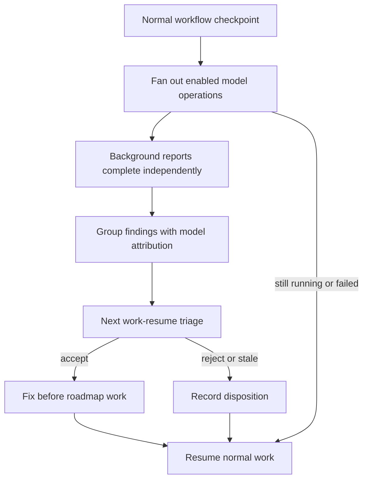
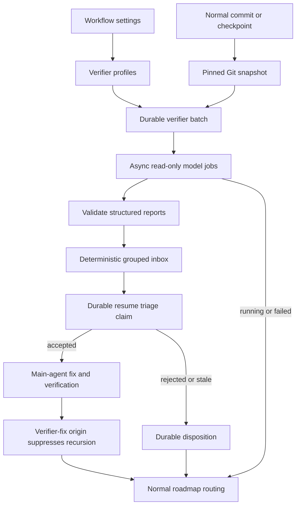
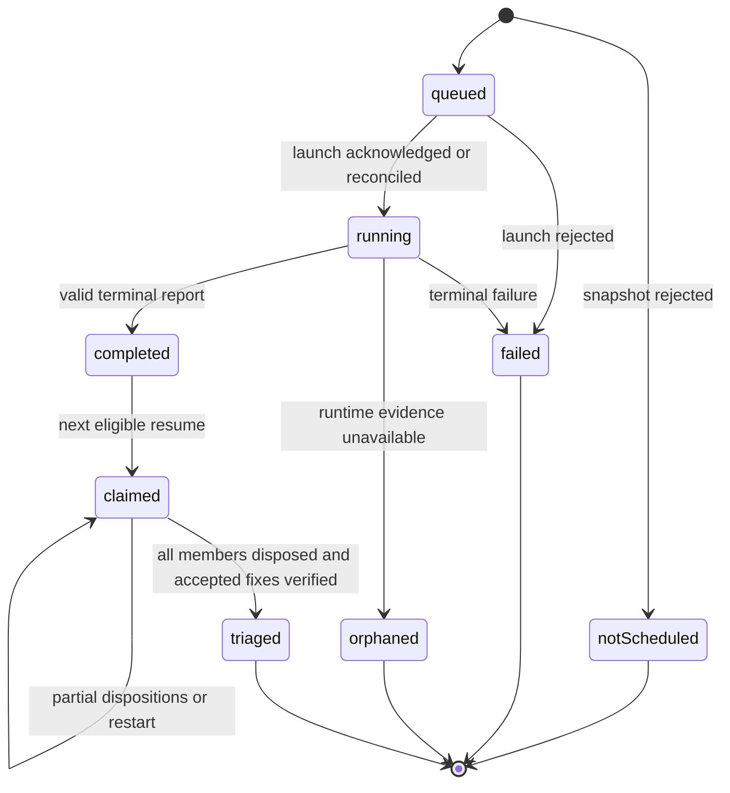

# Background Verifier Models - Plan

## Goal Capsule

- **Objective:** Use otherwise-idle model subscriptions for asynchronous code improvement without delaying the primary workflow.
- **Authority:** Product Contract requirements and acceptance examples override the Planning Contract; the Planning Contract overrides unit-level detail.
- **Execution profile:** Deep, behavior-changing code work with deterministic lifecycle tests before live-model smoke evidence.
- **Stop conditions:** Stop if immutable checkpoint capture would alter the user's branch or index, if async launch or triage cannot be made idempotent, or if accepted findings can be bypassed by normal resume routing.
- **Tail ownership:** LFG owns implementation, simplification, independent review, commit/push/PR, and CI follow-through after the units and verification gates pass.
- **Open blockers:** None.

---

## Product Contract

### Summary

Add a configurable pool of background verifier models that reviews normal workflow checkpoints asynchronously.
Completed findings enter a grouped, attributed inbox that the main agent must triage at the next `/work-resume` before continuing roadmap work.

### Problem Frame

Security evaluation and broad code-quality review consume substantial time and context when performed by the main agent.
Meanwhile, multiple available model subscriptions are underused even though prior testing showed that different models catch different issues.
The workflow needs to convert that spare capacity into useful second opinions without putting those models on the critical path or allowing stale suggestions to change code blindly.

### Key Decisions

- **Configure workers by model.** Each selected model has its own operation toggles and thinking effort so work can match subscription capacity and model strengths.
- **Treat security as a separate operation.** Security review is independently assignable because it is expensive and benefits from specialized attention.
- **Review immutable checkpoint scope.** Background work targets a recorded workflow checkpoint rather than a moving working tree.
- **Require triage, not blind compliance.** The main agent must validate every completed finding and record whether it is accepted, rejected, or stale.
- **Fix all accepted findings before continuing.** Accepted issues become immediate pre-code work, but their resulting commits do not launch recursive verifier batches.

### Actors

- A1. **User:** Selects verifier models, operations, and thinking effort.
- A2. **Background verifier model:** Reviews a checkpoint using only its enabled operations and produces attributable findings.
- A3. **Main agent:** Validates completed findings, applies every accepted fix, records dispositions, and resumes normal work.
- A4. **Workflow runtime:** Schedules jobs, preserves reports, groups findings, prevents duplicate processing, and keeps background failures off the critical path.

### Requirements

**Configuration**

- R1. The user can configure zero or more background verifier models from the available model registry.
- R2. Each configured model independently enables any combination of correctness, security, simplification and maintainability, test-gap, and performance review.
- R3. Each configured model has an independent thinking-effort setting.
- R4. A model is never invoked for an operation that is disabled for that model.
- R5. The first version does not require hard token caps or daily quotas.

**Scheduling and review scope**

- R6. Every normal workflow commit or checkpoint schedules the enabled verifier work without waiting for it to finish.
- R7. Background verification is fully asynchronous and does not delay the main operation beyond the work needed to schedule it durably.
- R8. Every verifier batch records the exact checkpoint and diff scope it reviewed.
- R9. Verifier work reads a stable checkpoint scope even when the primary workflow continues changing the checkout.
- R10. Commits created solely to fix accepted verifier findings do not schedule another verifier batch.
- R11. A model or operation failure is visible for diagnosis but never blocks normal workflow progress.

**Findings and inbox**

- R12. Every finding identifies its source model, operation, reviewed checkpoint, severity, affected location, rationale, and suggested action.
- R13. Completed findings are durably preserved across sessions until triaged.
- R14. Similar findings are grouped into one compact inbox entry while preserving every contributing model and operation.
- R15. Full per-model reports remain available when the grouped entry lacks enough detail for validation.
- R16. A completed report or finding is presented for triage at most once unless the user explicitly reopens it.

**Resume triage and fixes**

- R17. At the start of `/work-resume`, the main agent must triage every completed, unprocessed inbox entry before starting new roadmap code.
- R18. `/work-resume` does not wait for unfinished verifier jobs; their reports enter the next eligible resume after completion.
- R19. The main agent validates each finding against the current code and records an accepted, rejected, or stale disposition with a short reason.
- R20. Every accepted finding is fixed and verified before normal roadmap work resumes.
- R21. Findings against code that has changed since the reviewed checkpoint are revalidated rather than applied mechanically.
- R22. Rejected and stale findings remain attributable and auditable without repeatedly interrupting later resumes.

**Observability**

- R23. Workflow reporting shows verifier runs and findings by model, operation, status, duration, token usage, and disposition where the provider exposes those values.
- R24. The user can tell whether a checkpoint has no configured review, review still running, completed findings awaiting triage, or fully triaged review.

### Key Flows

- F1. **Configure a verifier model**
  - **Trigger:** The user opens workflow settings and adds or edits a background verifier.
  - **Actors:** A1, A4
  - **Steps:** Select a model, enable one or more operations, choose thinking effort, and save the profile.
  - **Outcome:** Future normal checkpoints use that model only for its enabled operations.
  - **Covered by:** R1-R5

- F2. **Run background verification**
  - **Trigger:** A normal workflow checkpoint completes.
  - **Actors:** A2, A4
  - **Steps:** Record stable review scope, launch enabled verifier work asynchronously, preserve terminal results, and group completed findings.
  - **Outcome:** The main workflow continues immediately while reports become durable inbox entries when ready.
  - **Covered by:** R6-R16

- F3. **Triage at resume**
  - **Trigger:** `/work-resume` starts with completed, unprocessed verifier findings.
  - **Actors:** A3, A4
  - **Steps:** Present grouped entries, inspect current code, record each disposition, fix and verify every accepted finding, then continue normal roadmap work.
  - **Outcome:** Useful findings improve the code without stale or weak suggestions being applied blindly.
  - **Covered by:** R17-R22

### Acceptance Examples

- AE1. **Different capacity by model**
  - **Covers R1-R5.**
  - **Given:** One selected model has correctness and test-gap review enabled while another has only security enabled.
  - **When:** A normal workflow checkpoint completes.
  - **Then:** Each model runs only its configured operations with its configured thinking effort.

- AE2. **Background work is still running**
  - **Covers R6-R9, R18.**
  - **Given:** A security review has not finished when `/work-resume` starts.
  - **When:** The main agent checks the verifier inbox.
  - **Then:** Resume continues without waiting, and the security report is offered at the first later resume after it completes.

- AE3. **Multiple models find the same issue**
  - **Covers R12-R16.**
  - **Given:** Three verifier models report the same unsafe call site.
  - **When:** Their reports are prepared for triage.
  - **Then:** The inbox shows one grouped finding with all three model and operation attributions, while retaining access to each full report.

- AE4. **Reviewed code changed before triage**
  - **Covers R19, R21-R22.**
  - **Given:** A finding targets code modified after the reviewed checkpoint.
  - **When:** The main agent triages it.
  - **Then:** The current code is inspected and the finding is accepted, rejected, or marked stale with a reason; the old suggestion is not applied mechanically.

- AE5. **Accepted finding does not create a loop**
  - **Covers R10, R17, R20.**
  - **Given:** The main agent accepts and fixes a simplification finding.
  - **When:** The verifier-fix commit is created.
  - **Then:** The fix is verified before roadmap work resumes, and that commit does not launch another background verifier batch.

### Success Criteria

- Normal workflow checkpoints and resumes never wait for background models to finish.
- Every completed finding is attributable, processed once, and given a durable disposition.
- Every accepted finding is fixed and verified before new roadmap code begins.
- Different model subscriptions can be assigned materially different workloads through operation toggles and thinking effort.
- Verifier telemetry makes utilization and payoff visible by model and operation.

### Scope Boundaries

- Plan and architecture critique are deferred until code-diff verification proves useful.
- Whole-repository patrol and scheduled audits are deferred because they create broader noise and staleness than checkpoint-scoped review.
- Hard token caps, daily quotas, adaptive scheduling, and automatic provider allowance detection are not part of the first version.
- Background verifiers never write code directly; the main agent owns validation and fixes.
- Background reports do not replace the workflow's existing required review and finish gates.

### Dependencies / Assumptions

- The runtime can enumerate available models and apply per-role model and thinking settings.
- Background subagent runs can be launched asynchronously and reconciled from durable state in later sessions.
- Workflow checkpoints expose enough Git identity to review an immutable diff.
- `/work-resume` retains a pre-writer decision point where completed reports can be triaged.
- Provider token and cost telemetry may be absent; missing optional usage fields do not affect correctness.

### Sources / Research

- `extensions/work-models.js` — existing model-slot settings, thinking effort, asynchronous run reconciliation, telemetry, checkpoint behavior, and resume gating.
- `extensions/work-store.js` — durable work-item note storage.
- `agents/work-reviewer.md` — existing read-only review and durable verdict pattern.

---

## Planning Contract

**Product Contract preservation:** Requirements, actors, flows, acceptance examples, success criteria, and scope boundaries are unchanged. The three deferred planning questions are resolved by KTD1, KTD3, and KTD6.

### Key Technical Decisions

- **KTD1 — One job per model per checkpoint.** A configured model receives one request containing all enabled operations and must return one terminal result per requested operation: findings, explicit no-findings, or failure. This avoids paying the same diff/context cost once per operation while keeping operation status trustworthy.
- **KTD2 — Keep settings authoritative and lifecycle state separate.** Existing scoped settings are the only editable configuration source. Add a focused `extensions/background-verifiers.js` domain module and persist immutable effective-profile snapshots plus runtime evidence under `.ce-workflow/work-runs/verifiers/`, reusing native-store durability without mixing reports into roadmap WorkItems.
- **KTD3 — Materialize every checkpoint as pinned Git identity.** Build dirty snapshots with a temporary Git index seeded from the base commit, stage all non-ignored repository content into that index, write a synthetic commit, and pin it under a private verifier ref. The operation must not change the active branch, real index, or working tree; unreadable or conflicted input records terminal `not-scheduled` state and launches nothing.
- **KTD4 — Use a versioned Pi Subagents adapter and never guess after ambiguous launch.** Each request records logical job ID, explicit model, thinking, operations, fresh context, immutable working directory, output path, and asynchronous mode; each acknowledgement records run ID and async directory used for status reconciliation. If acknowledgement is lost before runtime identity is known, mark the job visibly orphaned and prohibit automatic redispatch.
- **KTD5 — Enforce the read-only boundary outside the prompt.** Launch only when the verifier role has no write, shell, process, or network tools and runs in a disposable snapshot workspace that cannot access host/project credentials or escape through symlinks. Treat reviewed source and model output as hostile data.
- **KTD6 — Validate and render reports as bounded data.** Require exact per-operation coverage and validate identity, checkpoint, repository-relative path, range, category, severity, and bounded free text. Triage receives only deterministic quoted fields labeled untrusted; raw output remains a non-executed private artifact and never enters telemetry.
- **KTD7 — Group conservatively and deterministically.** Group only when normalized path, overlapping validated ranges, and issue category agree. Preserve every source report and allow per-member dispositions; symbol, fuzzy, and LLM-based grouping are deferred.
- **KTD8 — Claim triage with a renewable lease.** An atomic claim records owner session, a 30-minute lease, and renewal on every disposition or fix-completion event. A live lease blocks another claimant; an expired lease can be atomically taken over so crashes do not strand mandatory triage.
- **KTD9 — Mark verifier fixes structurally.** Pass a `verifier-fix` origin through the coded fix/finish path so those commits suppress background scheduling without relying on commit-message or changed-path heuristics.
- **KTD10 — Deduplicate canonical checkpoint events.** Work-pause and coded-finish boundaries both call one scheduling primitive; batch identity derives from repository, base/snapshot object IDs, scoped paths, patch hash, and effective profile hash so equivalent scope launches once.
- **KTD11 — Background review remains advisory infrastructure.** Verifiers cannot write, approve, commit, satisfy the required foreground review gate, or turn suggested commands into trusted actions.

### High-Level Technical Design

### Implementation Constraints

- Configuration uses existing global/project settings precedence, keyed by canonical model ID; duplicate models are rejected and project tombstones can disable inherited profiles.
- The verifier store is authoritative only for lifecycle and triage; telemetry is observational and may omit provider usage fields.
- Raw reports and checkpoint provenance remain immutable after ingestion; grouped views reference rather than replace them.
- Verifier state, recovery copies, and raw artifacts use owner-only permissions, remain ignored/unpackaged, and never copy raw text or likely credentials into status or telemetry.
- Reject reports over 1 MiB, more than 100 findings, free-text fields over 10,000 characters, or JSON deeper than 20 levels before full ingestion; retain only bounded diagnostic metadata for over-limit output.
- Snapshot refs/workspaces stay pinned until all jobs in the batch are terminal and reports are validated; terminal workspace cleanup must not delete reports or dispositions.
- Required tests use fake launch/status adapters and temporary Git repositories, never live provider calls.
- Automatic retries, hard quotas, semantic deduplication, whole-repository patrol, and recursive verifier cycles remain out of scope.

### Sequencing

1. Establish the durable domain model and deterministic tests.
2. Add profile configuration and immutable checkpoint capture.
3. Integrate asynchronous launch, reconciliation, and report ingestion.
4. Add grouping, resume claims, dispositions, and accepted-fix routing.
5. Surface status/telemetry, document the contract, and run package-wide verification.

### System-Wide Impact

- **Settings:** Adds a repeated per-model profile surface alongside existing role slots, with global and project overrides.
- **Git:** Creates short-lived pinned snapshot refs/workspaces without changing the user's active branch or index.
- **Agent execution:** Adds parallel read-only jobs with explicit models, operation sets, thinking effort, and durable outputs.
- **Resume routing:** Inserts completed-report triage before planner/writer selection while allowing queued, running, failed, and orphaned jobs through.
- **Review policy:** Keeps current foreground review and finish gates authoritative.
- **Telemetry/storage:** Adds model/operation utilization, findings, and dispositions while preventing optional cost fields from becoming correctness dependencies.

### Risks and Mitigations

- **Ambiguous launch acknowledgement could duplicate paid work.** Persist a stable logical job before dispatch; without returned runtime identity, fail visibly as orphaned and never auto-retry.
- **Moving code could invalidate findings.** Review pinned objects and require current-code evidence during triage when target bytes changed.
- **Prompt injection could escape either agent boundary.** Remove mutation/shell/network tools from verifiers, isolate credentials, validate reports, and render only bounded quoted data to the main agent.
- **Private artifacts could retain secrets or exhaust disk/memory.** Enforce owner-only storage, bounded ingestion, redacted summaries, and terminal workspace cleanup.
- **Grouping could hide distinct issues.** Prefer false negatives over false merges and preserve member-level dispositions.
- **Crash or concurrent resume could lose findings.** Use renewable leased claims and resumable per-member triage state.
- **Pinned snapshots could consume disk or disappear.** Expose failed/orphaned status, clean terminal workspaces, and retain immutable reports and provenance.
- **Many models could create noisy mandatory triage.** One job per model and deterministic grouping bound repeated context; operation toggles remain the user's capacity control.

### Sources and Research

- `extensions/work-models.js` — model registry/settings UI, checkpoint/finish boundaries, async RPC reconciliation, resume routing, and telemetry patterns.
- `extensions/work-store.js` — validated JSON, locking, recovery copy, fsync, and atomic persistence patterns.
- `scripts/test-work-settings.mjs`, `scripts/test-work-resume.mjs`, `scripts/test-work-start-finish.mjs`, `scripts/test-work-telemetry.mjs` — nearby fixture and integration-test patterns.
- [Pi Subagents async and parallel execution](https://github.com/nicobailon/pi-subagents/blob/main/skills/pi-subagents/SKILL.md) — asynchronous runs, explicit per-task models, parallel reviewer fan-out, and durable output options.
- [Pi Subagents background artifacts](https://github.com/nicobailon/pi-subagents/blob/main/README.md) — `status.json`, `events.jsonl`, logs, and async run-directory semantics.
- External best-practice research timed out; the plan therefore relies on repository patterns, Pi Subagents documentation, and explicit trust/lifecycle tests rather than unsupported external claims.

---

## Implementation Units

### U1. Durable verifier domain and lifecycle store

- **Goal:** Create the authoritative batch, job, report, finding, group, claim, and disposition lifecycle with crash-safe persistence.
- **Requirements:** R1-R5, R8, R10-R16, R22, R24; supports AE1, AE3, AE5.
- **Dependencies:** None.
- **Files:** `extensions/background-verifiers.js`, `scripts/test-background-verifiers.mjs`.
- **Approach:** Normalize effective model profiles supplied by scoped settings; snapshot them into batches; derive stable batch/job IDs; validate versioned state; use lock/recovery/atomic-write behavior patterned after `extensions/work-store.js`; expose pure query/mutation functions for later adapters.
- **Patterns to follow:** Native store validation and recovery; pending-direct logical identity; optional telemetry fields remain undefined rather than synthesized.
- **Test scenarios:**
  - Two unique model profiles with several enabled operations produce exactly two logical jobs whose requests carry the correct operation sets and thinking effort.
  - Every requested operation records findings, explicit no-findings, or failure; omission of one operation makes the job partially failed without discarding other results.
  - Unknown models, duplicate models, operations, effort values, paths outside the repository, and mismatched checkpoint identities fail closed.
  - Restart after each state mutation reloads one valid state without duplicate jobs, reports, groups, or dispositions.
  - Duplicate terminal events and duplicate disposition calls are idempotent.
  - Missing optional token/cost fields do not invalidate an otherwise valid report.
- **Verification:** Temporary-directory domain tests prove valid recovery, exact logical cardinality, and deterministic state transitions.

### U2. Per-model verifier settings

- **Goal:** Add global/project settings UI for selecting any number of verifier models, operation toggles, and thinking effort.
- **Requirements:** R1-R5, R24; covers F1 and AE1.
- **Dependencies:** U1.
- **Files:** `extensions/work-models.js`, `scripts/test-work-settings.mjs`.
- **Approach:** Add a background-verifier submenu that reuses model registry choices and thinking-level vocabulary. Persist profiles as a map keyed by canonical model ID; merge project entries by that key, preserve unmatched global entries, and use a project tombstone to disable an inherited model.
- **Patterns to follow:** `modelItems`, `thinkingItemsFor`, scoped setting writes, project override markers, and immediate settings persistence.
- **Test scenarios:**
  - Adding two different models preserves independent operation sets and thinking values across reload.
  - Project settings override or disable one global verifier profile without deleting unrelated global profiles.
  - Duplicate additions of one canonical model are rejected, so one model cannot produce ambiguous jobs or effort settings.
  - Removing the final operation removes or disables that profile without leaving an invocable empty worker.
  - An unavailable saved model remains visible as configuration but produces a non-blocking launch failure rather than silently changing models.
- **Verification:** Settings tests prove merge precedence, round-trip persistence, and zero-model behavior.

### U3. Immutable checkpoint capture and async launch

- **Goal:** Schedule one read-only asynchronous verifier job per configured model against stable Git content without delaying workflow checkpoints.
- **Requirements:** R6-R11; covers F2, AE1, AE2, AE5.
- **Dependencies:** U1, U2.
- **Files:** `extensions/background-verifiers.js`, `extensions/work-models.js`, `agents/work-background-verifier.md`, `scripts/test-background-verifiers.mjs`, `scripts/test-work-start-finish.mjs`.
- **Approach:** Route work-pause and coded-finish through one deduplicating scheduler. Materialize dirty checkpoints with a temporary Git index and private pinned ref without mutating the active branch/index/worktree; persist queued jobs before invoking the versioned Pi Subagents adapter; attach returned run ID/async directory for reconciliation; pass explicit model, thinking, operations, immutable workspace, and output path to an enforced no-write/no-shell/no-network role; mark verifier-fix origin structurally.
- **Execution note:** Start with temporary-Git characterization tests proving snapshot bytes and branch/index preservation before wiring live workflow hooks.
- **Patterns to follow:** `spawnSubagentRpc`, pending-direct reconciliation, checkpoint notes, coded finish rollback, and Pi Subagents asynchronous task artifacts.
- **Test scenarios:**
  - Covers AE2. A running job leaves checkpoint/resume latency independent of model completion and becomes eligible after later reconciliation.
  - Staged, unstaged, and non-ignored untracked checkpoint content reproduces identical bytes after the primary checkout changes while branch, index, and working tree hashes remain unchanged by capture.
  - Conflicted, unreadable, or unsafe symlink input records terminal `not-scheduled`, launches no job, and leaves normal work unblocked.
  - Traversing equivalent work-pause and coded-finish scope creates one batch/job per enabled model from the canonical batch key.
  - Crash before launch recovers one queued job; acknowledgement without runtime identity becomes orphaned and is never automatically relaunched.
  - Fake adapter fixtures prove request fields and run-ID/async-directory status reconciliation match the Pi Subagents contract.
  - A verifier-fix checkpoint schedules zero jobs while the next normal checkpoint schedules normally.
  - A prompt-injected snapshot cannot write, execute processes, use the network, read credentials, or escape through a tracked symlink.
- **Verification:** Focused lifecycle tests prove immutable scope, durable enqueue-before-launch, non-blocking behavior, and recursion suppression.

### U4. Report validation, grouping, status, and telemetry

- **Goal:** Turn terminal model outputs into safe, attributable, grouped inbox entries and observable run status.
- **Requirements:** R11-R16, R23-R24; covers AE3.
- **Dependencies:** U1, U3.
- **Files:** `extensions/background-verifiers.js`, `extensions/work-models.js`, `scripts/test-background-verifiers.mjs`, `scripts/test-work-telemetry.mjs`.
- **Approach:** Reconcile runtime status/artifacts with bounded reads; quarantine malformed or over-limit reports; validate exact requested-operation coverage and all trust-boundary fields; preserve private raw artifacts; group by path, overlapping range, and category only; render bounded quoted data for triage; emit redacted lifecycle/utilization telemetry from authoritative store state.
- **Patterns to follow:** `reconcilePendingDirectRuns`, `recordWorkTelemetry`, subagent result summaries, path containment checks, and exact-once telemetry identity.
- **Test scenarios:**
  - A valid report covers every requested operation with findings, explicit no-findings, or failure and retains per-finding operation attribution.
  - Absolute/traversal paths, wrong job/checkpoint/model identity, malformed JSON, and embedded command text remain auditable but never become actionable findings.
  - Reports exceeding byte, depth, finding-count, or free-text limits are quarantined before full parsing or rendering.
  - Instruction injection in every free-text field is rendered only as bounded quoted data and never becomes control text or telemetry.
  - Synthetic credentials in raw output never appear in status/telemetry, and verifier artifact paths remain private and ignored.
  - Covers AE3. Overlapping same-category findings group with all model attributions; adjacent, symbol-only, or different-category findings remain separate.
  - Provider failure, missing status artifacts, and malformed terminal state become visible failed/orphaned outcomes without blocking normal work.
  - Missing cost/token data is displayed as unavailable and does not alter lifecycle correctness.
- **Verification:** Domain and telemetry tests prove safe ingestion, conservative grouping, full provenance, and every R24 status.

### U5. Resume triage and accepted-fix gate

- **Goal:** Require crash-safe triage of completed findings before normal writer routing and require every accepted finding to be fixed and verified.
- **Requirements:** R17-R22; covers F3, AE4, AE5.
- **Dependencies:** U1, U4.
- **Files:** `extensions/background-verifiers.js`, `extensions/work-models.js`, `scripts/test-background-verifiers.mjs`, `scripts/test-work-resume.mjs`, `scripts/test-work-start-finish.mjs`.
- **Approach:** Reconcile first, atomically claim completed groups with owner session and renewable 30-minute lease, add a pre-writer resume action with safe grouped summaries and non-executed artifact references, expose coded disposition/fix-completion operations, require current-code evidence for changed targets, and keep the claim open until accepted fixes have verification and verifier-fix commit evidence.
- **Patterns to follow:** `planResumeAction`, coded workflow tools, durable review notes, resume handoff prompts, and finish-state origin propagation.
- **Test scenarios:**
  - Running, failed, or orphaned jobs do not block normal resume; completed unclaimed findings do.
  - Two concurrent resumes produce one live claim; an expired claimant can be atomically taken over while an actively renewed claim cannot.
  - Restart during partial triage resumes that claim without presenting disposed members again.
  - One grouped entry can record accepted, rejected, and stale member dispositions without losing attribution.
  - Covers AE4. Changed target bytes require current-code evidence before acceptance and allow an explicit stale result.
  - Covers AE5. Roadmap selection remains unavailable until all accepted findings have fix and verification evidence; the resulting verifier-fix commit suppresses scheduling.
  - A fully triaged claim is absent from every later resume until explicit reopen causes exactly one new presentation.
- **Verification:** Resume and lifecycle tests prove no bypass, no double claim, resumable partial progress, and bounded non-recursive fixes.

### U6. Packaging, documentation, and regression gate

- **Goal:** Ship the new role/module safely and document configuration, lifecycle, recovery, and trust boundaries.
- **Requirements:** R23-R24 and all Success Criteria.
- **Dependencies:** U2-U5.
- **Files:** `scripts/verify-package.mjs`, `README.md`, `agents/work-background-verifier.md`, `scripts/test-background-verifiers.mjs`.
- **Approach:** Register the shipped role in package assertions, include focused verifier tests in package verification, document settings/status/report locations and recovery, and preserve the distinction between background advice and required foreground review.
- **Patterns to follow:** Existing package-role assertions, command documentation, and coded status descriptions.
- **Test scenarios:**
  - Package verification fails when the verifier role, focused test, or required contract markers are missing.
  - README examples cover zero, one, and multiple verifier profiles without promising hard quotas or automatic retries.
  - A full package verification run includes the focused lifecycle test exactly once.
- **Verification:** Package verification passes and documentation matches the shipped settings and status vocabulary.

---

## Verification Contract

| Gate | Applies to | Command | Required evidence |
| --- | --- | --- | --- |
| Verifier domain/lifecycle | U1, U3-U5 | `node scripts/test-background-verifiers.mjs` | Immutable snapshots, exact job cardinality, crash recovery, safe report ingestion, grouping, claims, dispositions, and recursion suppression pass in temporary repositories. |
| Settings | U2 | `node scripts/test-work-settings.mjs` | Global/project model profiles, operations, effort, add/remove, and unavailable-model behavior pass. |
| Checkpoint and finish integration | U3, U5 | `node scripts/test-work-start-finish.mjs` | Normal checkpoints schedule once and verifier-fix commits schedule zero jobs. |
| Resume routing | U5 | `node scripts/test-work-resume.mjs` | Completed findings gate writers; unfinished/failed jobs do not; accepted fixes cannot be bypassed. |
| Telemetry/status | U4, U6 | `node scripts/test-work-telemetry.mjs` | Model/operation/status/disposition attribution and optional usage handling pass. |
| Static diagnostics | U1-U6 | Pi Lens diagnostics on changed JavaScript and Markdown | No blocking diagnostics remain in changed files. |
| Package regression | U1-U6 | `npm run verify:quiet` | Full package checks pass once after all production changes. |
| Diff hygiene | U1-U6 | `git diff --check` | No whitespace errors or unintended runtime artifacts are tracked. |
| Optional live smoke | U3-U5 | Manual run with two low-cost configured models | Jobs run asynchronously, reports group correctly, and the next resume triages them; this is supplementary, not required CI evidence. |

---

## Definition of Done

- U1 is done when verifier state reloads safely across every tested crash boundary and duplicate lifecycle events are idempotent.
- U2 is done when any number of model profiles round-trip through global/project settings with independent operations and effort.
- U3 is done when normal checkpoints launch immutable read-only jobs without waiting and verifier-fix checkpoints never recurse.
- U4 is done when only validated findings enter a fully attributable grouped inbox and all lifecycle states are observable.
- U5 is done when completed findings cannot bypass mandatory triage, accepted fixes cannot bypass verification, and partial/concurrent triage cannot lose or duplicate work.
- U6 is done when package assertions, user documentation, focused tests, and full regression verification match the shipped behavior.
- Product Contract R1-R24, F1-F3, and AE1-AE5 are traceable to passing implementation evidence.
- Existing required foreground review and finish gates behave unchanged.
- External research timeout is not masked as evidence; implementation relies only on verified repository and Pi Subagents contracts.
- Abandoned experiments, temporary snapshot workspaces, debug logs, and untracked runtime artifacts are removed before shipping.
- The final diff contains only scoped implementation, tests, documentation, and this enriched plan.
