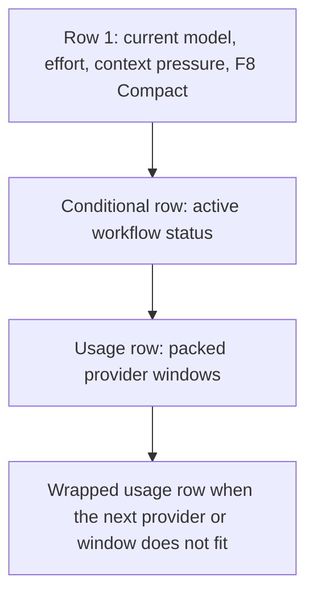
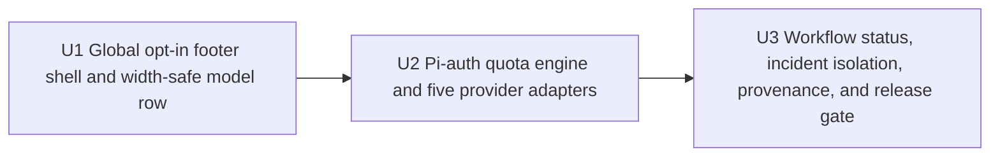

# Multimodel Subscription Footer - Plan

## Goal Capsule

- **Objective:** Let a Pi operator see current context pressure and every usable AI subscription quota without leaving the terminal, so review and background work can be routed toward available capacity.
- **Product authority:** This Product Contract, the confirmed work-4.1 dialogue, and the pinned upstream sources under Sources / Research.
- **Open blockers:** None before planning.

---

> Product Contract preservation: changed after planning at the user's direction — fixture proof is permitted when a subscription is unavailable, GLM monthly tools are hidden, quota typography is explicit, and active workflow status joins the custom footer; stable R1-R31, F1-F5, and AE1-AE14 IDs are unchanged, with R32-R33, F6, and AE15 added.

## Product Contract

### Summary

Add an optional ce-workflow footer with current-model context on its first row and simultaneous subscription quota bars for Codex, Claude, GitHub Copilot, GLM/Z.ai, and Kimi on wrapped rows below.
The footer is global, default-off, Pi-auth-only, and refreshed about every two minutes.

### Problem Frame

The main model carries most work, while several other subscriptions handle side reviews, background re-reviews, code review, and plan critique.
How much work can move to those subscriptions depends on their short- and long-window availability.
Today the operator must visit each provider homepage to inspect quota, which is slow enough that spare paid capacity often remains unused and ce-workflow cannot route work confidently.
The trusted outcome is near-real-time terminal visibility that makes those homepage checks unnecessary during normal operation.

### Key Decisions

- **A full custom footer, not a status widget.** The first row replaces the current footer with the requested model/context view, active workflow status appears as a conditional row within the same footer, and provider quotas occupy subsequent wrapped rows.
- **Global-only and default-off.** Subscription state belongs to the operator account rather than a repository, so projects cannot override the feature.
- **Pi auth is the visibility authority.** The five supported adapters are available by default after enablement, but a provider is rendered only while Pi resolves its credential; CLI, environment, inline-key, and OpenCode fallbacks are excluded.
- **Complete, stable quota presentation.** Included subscription windows are shown in the fixed order Codex, Claude, GitHub Copilot, GLM/Z.ai, then Kimi, skipping unauthenticated providers and GLM's monthly tools allowance; rows pack left-to-right and wrap rather than rotate content.
- **A declared width floor.** Full footer behavior is supported from 56 columns upward; narrower terminals receive one width-safe diagnostic row rather than partial or misleading quota data.
- **Trust degrades visibly.** Last-known values become stale immediately after a failed refresh and become unavailable after ten minutes without success.
- **Upstream provider logic is the baseline.** Provider request/parsing, cache, timeout, polling, backoff, and defensive failure behavior derive from the pinned MIT `pi-usage-bar` source, with explicit divergence for Pi-auth-only credentials, footer rendering, account-bound cache validity, and the ten-minute unavailable state.

### Actors

- A1. **Operator:** Uses the footer to decide which subscription can accept foreground, review, or background work.
- A2. **ce-workflow footer:** Resolves settings and auth, refreshes snapshots, applies freshness rules, and renders terminal-safe rows.
- A3. **Pi auth store:** Determines whether each supported provider is currently logged in and identifies the non-secret account scope for cached data.
- A4. **Provider services:** Return subscription quotas and, when enabled separately, public incident state.

### Footer Shape



The number of usage rows varies with terminal width and available authenticated providers; the logical order does not vary after refreshes.

### Requirements

**Settings and ownership**

- R1. The footer must be controlled by a global F7 setting that is off by default and applies enable or disable changes during the active session.
- R2. Enabling the footer for the first time must make Codex, Claude, GitHub Copilot, GLM/Z.ai, and Kimi supported by default without requiring per-provider setup toggles.
- R3. An enabled provider must appear only when its credential resolves from Pi auth, and it must disappear when that Pi credential no longer resolves.
- R4. Public incident markers for Claude, Codex, and GitHub Copilot must be controlled by a separate global setting that is off by default; GLM/Z.ai and Kimi incident polling is excluded until authoritative status sources are identified.
- R5. Enabling the footer must warn once that it takes ownership from any other custom footer.
- R6. Disabling the footer must restore Pi's built-in footer; the notice must explain that `/reload` is required for another footer extension to reclaim ownership.

**Current-model row**

- R7. The first row must show the current model, effective effort, a context bar, context percentage, used and total context tokens, and the `F8 Compact` hint.
- R8. Context pressure must be green through 150,000 used tokens, yellow above 150,000 through 200,000, and red above 200,000.
- R9. At widths of at least 80 columns, the first row must use full labels and a 12-cell context bar; from 56 through 79 columns it must preserve model, effort, context percentage, token counts, and `F8 Compact` while shrinking the bar no smaller than four cells and truncating only the model label with an ellipsis.
- R10. Below 56 columns, the footer must render one width-safe diagnostic stating that at least 56 columns are required and must not render partial quota data; no rendered line at any width may exceed the available terminal width.
- R11. cwd, git state, and other future current-session fields must not appear in the first release.

**Subscription rows**

- R12. At widths of at least 56 columns, every Pi-authenticated supported provider must be visible simultaneously in the fixed order Codex, Claude, GitHub Copilot, GLM/Z.ai, then Kimi, skipping providers hidden by missing auth.
- R13. Each provider segment must show every included subscription quota window returned by that provider as `label(reset countdown) [bar] percentage` when reset is supplied and without parentheses when it is not; GLM's monthly tools allowance is excluded while its 5-hour and 7-day token windows remain.
- R14. Provider labels must use the accent color, reset countdowns a dim color, and each bar plus percentage the green/yellow/red usage color: green below 50 percent, yellow from 50 through 80 percent, and red above 80 percent.
- R15. Provider segments must pack left-to-right using ` · ` between windows of one provider and ` │ ` only between providers, wrapping onto additional footer rows only when the next window or provider cannot fit.
- R16. Width handling must keep a provider label with its first quota window, repeat the provider label on continuation rows, truncate only bars before text fields, and never emit a partial ANSI sequence.
- R17. Provider and window order must remain stable across refreshes so the footer does not jump as pressure changes.

**Freshness, caching, and failure**

- R18. Each authenticated provider must refresh independently on a nominal 120-second normal cadence so one slow provider cannot delay the others; defensive backoff applies only after failure.
- R19. A valid cached snapshot must render immediately while a fresh request runs in the background.
- R20. Cached data must be bound to a non-secret identity derived from the current Pi credential and invalidated when that identity changes.
- R21. A provider refresh must publish a complete snapshot atomically; malformed or incomplete responses must retain the prior complete snapshot rather than mix old and new windows.
- R22. The first failed refresh after a success must keep the last-known values and add a compact stale marker with its age.
- R23. Ten minutes after the last successful refresh, an authenticated provider must show as unavailable until a complete refresh succeeds.
- R24. An authenticated provider with no successful snapshot must show unavailable, while a provider with no Pi credential must remain hidden.
- R25. Diagnostic labels must use sanitized categories such as stale, auth rejected, rate limited, or unavailable and must never render credentials or vendor response bodies.
- R26. Pi credentials must be re-resolved at refresh time so login removal, renewal, or account switching changes footer visibility and cache validity without restarting Pi.

**Lifecycle, incidents, and extensibility**

- R27. The extension must do nothing in headless sessions and must not make quota or incident requests without an interactive UI, even when the global setting is enabled.
- R28. Polling must start only while the footer is enabled, stop on disable or session shutdown, and discard late responses from an obsolete or ended session.
- R29. When incident monitoring is enabled, Claude, Codex, and GitHub Copilot incident state must appear as a compact warning without replacing quota data; incident-fetch failure must retain the last known incident state and must not mark quota unavailable.
- R30. A provider must implement one common capability contract for identity, quota windows, reset times, and optional incident state so another subscription provider can be added without changing footer composition rules.
- R31. Vendored upstream logic must retain its MIT copyright and license notice, record the pinned source revision, and keep intentional divergences identifiable for later upstream comparison.
- R32. While the custom footer is enabled, any active ce-workflow goal status currently published through Pi's workflow status entry must appear as a conditional footer row and disappear when no workflow status exists.
- R33. Workflow-status changes must repaint the custom footer without creating a duplicate row, while disabling the custom footer must leave the existing built-in `setStatus` behavior intact.

### Key Flows

- F1. **Enable and first render**
  - **Trigger:** A1 enables the global footer setting.
  - **Actors:** A1, A2, A3.
  - **Steps:** A2 warns about footer ownership, installs the custom footer, resolves all five providers from A3, renders valid matching caches, and begins independent refreshes.
  - **Outcome:** The first row appears immediately; authenticated providers appear from cache or as unavailable until their first successful refresh.
  - **Covered by:** R1-R7, R12, R18-R20, R24.
- F2. **Successful quota refresh**
  - **Trigger:** An authenticated provider reaches its refresh deadline.
  - **Actors:** A2, A3, A4.
  - **Steps:** A2 re-resolves identity, requests the provider quota, validates all returned windows, atomically stores the snapshot, and requests a render.
  - **Outcome:** Every valid window is shown with current percentage, color, and reset countdown.
  - **Covered by:** R13-R21, R26.
- F3. **Provider degradation**
  - **Trigger:** A quota request fails, returns malformed data, or stops succeeding.
  - **Actors:** A2, A4.
  - **Steps:** A2 retains the last complete snapshot, marks it stale with age, backs off defensively, and changes the provider to unavailable after ten minutes without success.
  - **Outcome:** The operator can distinguish fresh, stale, and unusable information without seeing sensitive error payloads.
  - **Covered by:** R21-R25.
- F4. **Credential change**
  - **Trigger:** Pi auth adds, removes, renews, or switches a provider credential.
  - **Actors:** A2, A3.
  - **Steps:** The next provider refresh re-resolves identity, invalidates mismatched cache data, and updates visibility.
  - **Outcome:** Old-account quota is never shown as current, and provider disappearance signals lost Pi login state.
  - **Covered by:** R3, R20, R24, R26.
- F5. **Disable or shutdown**
  - **Trigger:** A1 disables the setting or the Pi session ends.
  - **Actors:** A1, A2.
  - **Steps:** A2 invalidates the session generation, cancels timers and in-flight work, discards late callbacks, and releases custom footer ownership.
  - **Outcome:** Pi's built-in footer is restored on live disable and no background work survives shutdown.
  - **Covered by:** R6, R28.
- F6. **Workflow status changes**
  - **Trigger:** An autonomous ce-workflow goal starts, changes state, or ends while the custom footer is enabled.
  - **Actors:** A1, A2.
  - **Steps:** A2 reads the same formatted status used by Pi's workflow status entry and requests a footer repaint.
  - **Outcome:** One conditional workflow row appears, updates, or disappears inside the custom footer; disabling the footer returns status rendering to Pi's built-in footer.
  - **Covered by:** R32-R33.

### Acceptance Examples

- AE1. **Covers R1, R27.** Given the footer setting is enabled, when a headless session starts, then no custom footer is installed and no provider request is made; the same no-op holds in an interactive session when the setting is off.
- AE2. **Covers R2, R3, R12, R13, R17.** Given Pi auth contains Codex, Claude, and GLM credentials but not Copilot or Kimi credentials, when two successive snapshots render at a width where they fit with changed percentages, then exactly Codex, Claude, and GLM appear in that order, each provider's included windows remain in order, and GLM shows 5h and 7d but not its monthly tools allowance.
- AE3. **Covers R7-R9, R11.** Given 175,000 of 272,000 context tokens are used, when the first row renders at 80 columns, then its 12-cell context bar is yellow and the row includes model, effort, percent, token counts, and `F8 Compact` without cwd or git state.
- AE4. **Covers R14-R16.** Given multiple authenticated providers, when their windows render, then each provider label is accented, reset countdowns are dim, each bar and percentage use its threshold color, windows within one provider use ` · `, providers use ` │ `, and segments pack on the current row until the next one cannot fit; at 56 columns continuation rows repeat their provider label and every row fits.
- AE5. **Covers R19, R22, R23.** Given a provider has a valid cached snapshot, when refreshes fail for less than ten minutes, then the values remain visible with stale age; once ten minutes elapse without success, the provider shows unavailable.
- AE6. **Covers R20, R26.** Given Pi auth switches a provider to another account, when the next refresh begins, then the old account's cached snapshot is discarded before the new account's quota can render.
- AE7. **Covers R3, R24, R26.** Given a provider has Pi auth but no successful snapshot, when it first renders, then it shows unavailable; when that Pi credential is later removed and auth is re-resolved, then the provider disappears rather than continuing through a CLI, environment, or OpenCode fallback.
- AE8. **Covers R4, R29.** Given incident monitoring is off, when quotas refresh, then no public status request is made; when it is on, only Claude, Codex, and Copilot status sources are polled, a known incident adds a warning without hiding quota, and a failed incident request leaves quota freshness unchanged while retaining the last incident state.
- AE9. **Covers R5, R6, R28.** Given another custom footer was installed, when this footer is enabled and later disabled, then the operator sees the ownership warning, live disable restores the built-in footer, late callbacks do not reclaim it, and `/reload` remains the path for the other footer to reassert itself.
- AE10. **Covers R9, R10, R15, R16.** Given identical footer data, when it renders at 80, 56, and 55 columns, then 80 uses full labels and a 12-cell context bar, 56 preserves every required field with at least a four-cell bar and wrapped quotas, and 55 renders only the minimum-width diagnostic; every rendered line has visible width at most the supplied width and valid ANSI boundaries.
- AE11. **Covers R18, R21.** Given fake time and one slow provider, when 120 seconds elapse, then every other authenticated provider starts its own refresh on schedule; a malformed partial response from the slow provider leaves its prior complete snapshot unchanged.
- AE12. **Covers R25.** Given simulated auth rejection, rate limiting, malformed vendor data, and a thrown response body containing a sentinel secret, when diagnostics render, then only approved failure categories and ages appear and the sentinel never does.
- AE13. **Covers R30.** Given a conforming fake sixth provider, when it is registered, then its identity and windows render through the existing composition and wrapping behavior without provider-specific renderer changes.
- AE14. **Covers R31.** Given the packaged extension, when provenance is inspected, then it contains the upstream MIT notice, exact pinned revision, and an identifiable list of intentional divergences.
- AE15. **Covers R32-R33.** Given an active workflow status and the custom footer enabled, when the status changes and then clears, then exactly one workflow row appears, updates, and disappears inside the custom footer; after disable, Pi's existing built-in status path remains unchanged.

### Acceptance Coverage

| Requirements | Automated proof | Live or human proof |
|---|---|---|
| R1-R6 | Settings-state transitions, auth-source fixtures, and footer ownership lifecycle cover AE1, AE2, and AE9. | Interactive approval confirms the ownership warning and built-in footer restoration are understandable. |
| R7-R17 | Deterministic renderer fixtures cover thresholds, exact order, every-window rendering, widths 80/56/55, visible-width bounds, and ANSI integrity in AE2-AE4 and AE10. | One interactive terminal check confirms the compact and wrapped rows remain readable. |
| R18-R26 | Fake-clock, fetch, malformed-response, cache-identity, secret-sentinel, and pinned provider fixtures cover AE5-AE7, AE11, and AE12. | Each provider with an available operator subscription requires one live authenticated sample whose footer values match its vendor quota view within one completed 120-second poll; an unavailable subscription may use its pinned fixture plus public-auth contract checks. |
| R27-R29 | UI-absence, shutdown, late-callback, and incident-failure fixtures cover AE1, AE8, and AE9. | A live incident is not required; fixture payloads pinned from the selected baseline prove incident rendering and isolation. |
| R30 | A fake-provider contract fixture covers AE13. | None. |
| R31 | Package inventory verifies license text, revision, and divergence record as in AE14. | None. |
| R32-R33 | Controller/status fixtures prove the conditional workflow row updates without duplication and built-in status remains intact after disable as in AE15. | An active autonomous goal confirms the workflow row is readable inside the enabled custom footer. |

### Success Criteria

- In normal operation, each authenticated provider starts an independent refresh every 120 seconds, excluding defensive failure backoff, and a completed valid snapshot becomes visible on the next render.
- Release acceptance includes one live authenticated quota comparison for every provider subscription available to the operator; unavailable subscriptions are accepted through pinned payload fixtures and public-auth contract checks.
- The operator signs off after one normal work session in which foreground, review, and background work are routed without opening provider homepages for routine quota checks.
- Loss of freshness, credentials, or endpoint availability is distinguishable without exposing secret material.
- All five first-release providers render together at widths of at least 56 columns, with wrapping rather than silent omission; narrower widths show only the declared diagnostic.

### Scope Boundaries

- API-key spend, monetary balance, and pay-as-you-go usage are deferred; subscription quota windows are the first-release identity.
- Project-level overrides, per-window controls, custom provider ordering, and automatic credential-source detection are excluded.
- cwd, git state, current-session fields beyond the active workflow status, and a richer first-row design are deferred.
- Vendor CLI, environment-variable, inline-key, and OpenCode credential fallbacks are excluded even where upstream supports them.
- GLM's monthly tools allowance is excluded; only its 5-hour and 7-day token windows belong in the footer.
- Provider-aware automatic work routing is not part of this footer; the footer supplies the visibility needed to design that separately.

### Dependencies / Assumptions

- Pi continues to expose custom footer registration, built-in footer restoration, terminal-width rendering, session lifecycle events, current model data, and its auth store.
- Provider quota endpoints remain reachable by subscription credentials and may change without notice; such drift must degrade to stale or unavailable rather than crash the session.
- `pi-usage-bar` revision `f21cabaafabe6aef90be88b0de229ab736abb486` is the provider-logic comparison baseline.
- The installed `@ogulcancelik/pi-minimal-footer` 0.1.10 is a rendering reference, not the quota authority, because it polls only the active model's provider.

### Sources / Research

- [`satas20/pi-usage-bar` at `f21caba`](https://github.com/satas20/pi-usage-bar/tree/f21cabaafabe6aef90be88b0de229ab736abb486) — MIT, runtime dependency-free, and the selected baseline for Claude, Codex, Copilot, GLM/Z.ai, and Kimi provider behavior, cache, polling, backoff, and incident checks.
- [`@ogulcancelik/pi-minimal-footer` 0.1.10](https://github.com/ogulcancelik/pi-extensions/tree/main/packages/pi-minimal-footer) — MIT reference for `setFooter` composition, context rendering, width fitting, and cleanup; its active-provider-only quota behavior is intentionally replaced.
- [`extensions/work-models.js`](../../extensions/work-models.js) — existing F7 global settings persistence and global-only submenu precedent.
- [Pi TUI documentation](https://github.com/badlogic/pi-mono/blob/main/packages/coding-agent/docs/tui.md) — custom footer registration and restoration contract; no documented prior-footer capture API was found in the reviewed Pi 0.82.1 docs/types.

---

## Planning Status

- **Roadmap:** `work-4`
- **Readiness:** Implementation-ready; no Product Contract decisions remain open.
- **Delivery shape:** Three dependency-ordered tracer bullets. Each unit leaves the package runnable and has owned proof that fails before the unit and passes after it.
- **Implementation boundary:** Extend the existing packaged extension through `extensions/work-models.js`; do not add another independently loaded Pi extension because two package extensions could race for footer ownership.
- **Runtime dependencies:** None. Use Node built-ins, Pi's public extension context, model-registry auth, and footer APIs.

## Repository Grounding

### Current package and integration points

- `package.json` packages `extensions/`, `scripts/`, and only registers `extensions/work-models.js` as the Pi extension entry point. The footer therefore belongs in a focused module imported and registered by `work-models.js`, rather than in a second `pi.extensions` entry.
- `extensions/work-models.js` already owns F7 settings, reads global settings from `${PI_CODING_AGENT_DIR || ~/.pi/agent}/settings.json`, writes settings at the selected scope, and uses `extensions/work-dialogs.js` for filterable global/project menus. The new setting must read and write the global object directly so `.pi/settings.json` cannot override it.
- `scripts/test-work-settings.mjs` isolates `PI_CODING_AGENT_DIR`, drives the shared dialog component, and verifies persisted settings. Extend that fixture for the new global-only submenu and active-session toggle callback.
- `scripts/verify-package.mjs` automatically executes `scripts/test-work-*.mjs` files and already verifies packaged inventory. Add provenance inventory assertions there; `scripts/test-work-subscription-footer.mjs` will consequently run under `npm run verify` without another script-list edit.

### Pi public API contracts verified against the installed coding-agent package

- `ctx.mode === "tui"` is the terminal-only guard. `ctx.hasUI` is also true in RPC mode, while RPC's `setFooter()` is a no-op, so `hasUI` alone is insufficient for R27.
- `ctx.ui.setFooter(factory)` installs a component factory; `ctx.ui.setFooter(undefined)` restores Pi's built-in footer. The component implements `render(width)`, `invalidate()`, and optional `dispose()`. There is no public API to capture or restore a previous extension footer.
- `ctx.getContextUsage()` returns `{ tokens, contextWindow, percent }`; `ctx.model` supplies the current provider/model and `ctx.thinkingLevel` supplies effective effort. These public values replace the installed minimal footer's older session-history reconstruction.
- `ctx.modelRegistry.getProviderAuth(providerId)` re-resolves request auth and OAuth refresh through Pi. Its `AuthResult.source` distinguishes Pi-stored `OAuth` or `stored credential` from ambient environment sources. Only those two stored sources are eligible.
- `pi.on("session_start", ...)` and `pi.on("session_shutdown", ...)` bracket setup and teardown. The footer component's `dispose()` is an additional ownership-loss cleanup boundary.

### Pinned upstream patterns to adapt, not depend on

- `C:/Users/flex/.pi/agent/npm/node_modules/@satas/pi-usage-bar/extensions/usage-bar.ts` is the installed copy corresponding to the pinned `pi-usage-bar` baseline. Reuse its five endpoint parsers, 10-second request timeout, 120-second polling, provider-local backoff, status-page isolation, defensive Kimi parsing, and generation fencing. Remove its CLI, environment, inline-key, OpenCode, direct `auth.json`, per-window toggle, and status-widget paths.
- `C:/Users/flex/.pi/agent/npm/node_modules/@ogulcancelik/pi-minimal-footer/index.ts` is the installed 0.1.10 rendering reference. Reuse its `setFooter` component lifecycle, model/effort/context composition, bar shrink-before-text strategy, render invalidation, and cleanup shape. Replace active-provider-only quota state, cwd/git fields, and its pressure thresholds with the Product Contract.
- Pi's installed `examples/extensions/custom-footer.ts` confirms that `tui.requestRender()` is the correct async repaint path and that `setFooter(undefined)` restores the built-in footer.

## Technical Design

### File map

| Path | Planned responsibility |
|---|---|
| `extensions/subscription-footer.js` | Provider capability registry, Pi-auth resolver, quota/status fetch and validation, identity-bound cache, independent scheduler, freshness state machine, ANSI-safe width layout, and footer controller exports. |
| `extensions/work-models.js` | Import/register one footer controller, add the global-only F7 settings row/submenu, persist settings, relay live enable/disable, and invoke controller shutdown with the existing lifecycle. |
| `extensions/subscription-footer-UPSTREAM.md` | Full MIT notice for `satas20/pi-usage-bar`, exact revision `f21cabaafabe6aef90be88b0de229ab736abb486`, installed minimal-footer reference/version, copied/adapted areas, and intentional divergences. |
| `scripts/test-work-subscription-footer.mjs` | One dependency-free test harness with fake time, fetch, Pi auth, cache directory, theme, TUI, and inline provider/status payloads covering renderer, adapters, polling, cache, freshness, security, and lifecycle. |
| `scripts/test-work-settings.mjs` | Global default/persistence, no project override, F7 dialog behavior, one-time ownership notice, and live controller apply checks. |
| `scripts/verify-package.mjs` | Packaged provenance-file and pinned-revision/license/divergence assertions. |

### Runtime contracts

`extensions/subscription-footer.js` will expose a small testable surface rather than embedding provider code in the 22k-line entry module:

```js
createSubscriptionFooterController(pi, {
  readGlobalSettings,
  writeGlobalSettings,
  now = Date.now,
  fetchImpl = globalThis.fetch,
  agentDir,
})

// provider capability
{
  id, label, piProviderId, statusUrl?,
  resolveAuth(ctx), identity(auth), fetchQuota(auth, { signal, now, fetchImpl })
}

// atomically published snapshot
{
  providerId, identityKey, fetchedAt,
  windows: [{ id, label, usedPercent, resetsAt? }]
}
```

The production registry order is Codex (`openai-codex`), Claude (`anthropic`), GitHub Copilot (`github-copilot`), GLM/Z.ai (`zai`), and Kimi (`kimi-coding`). The renderer consumes only the common snapshot contract; provider-specific response fields never enter layout code. A conforming fake sixth adapter can therefore prove R30.

### Key decisions and rationale

1. **One controller inside the existing extension.** `work-models.js` is already the package entry and F7 owner. Registering a second extension would introduce undefined footer ownership order and make live disable unreliable.
2. **Global settings shape:** `workOrchestrator.subscriptionFooter = { enabled: false, incidents: false, ownershipNoticeAcknowledged: false }`. Resolve this block only from `readGlobalSettings()`. The F7 row remains visible from either scope but is labeled “global only” and always opens a global submenu; no project-local marker or clear action is created.
3. **One-time ownership warning is persisted before first install.** First enable shows a confirmation explaining replacement and disable/reload behavior. On confirmation, persist `ownershipNoticeAcknowledged: true` and `enabled: true`, then install immediately. Later enables apply immediately without repeating the warning. Cancellation performs neither write nor install.
4. **Pi public auth is the sole credential gateway.** At each provider deadline call `ctx.modelRegistry.getProviderAuth(piProviderId)`. Accept only `source === "OAuth"` or `source === "stored credential"`; reject environment-variable, command, inline, CLI, OpenCode, and absent results before any request. Never read `auth.json` directly.
5. **Account binding favors safety over cache retention.** Derive `identityKey` from a stable non-secret account claim/header when resolved auth exposes one; otherwise use a SHA-256 fingerprint computed in memory from resolved request-auth material. Persist only the fingerprint, never tokens or headers. A token renewal may conservatively invalidate a cache when no stable claim exists; showing no old-account data is more important than preserving that cache hit.
6. **Resolved auth goes only to its adapter's fixed HTTPS host.** Every adapter owns a constant URL and header builder. The shared fetch helper applies a 10-second abort timeout, never follows a response-provided URL, parses JSON only after status classification, and returns sanitized categories (`auth rejected`, `rate limited`, `unavailable`) without retaining body text.
7. **Complete provider snapshots are atomic.** Parse all valid windows into a new array, reject the response when no valid window remains, then replace state and cache in one assignment/write. A partial/malformed response cannot merge with the prior array.
8. **Independent one-shot timers, not one interval.** Each authenticated provider schedules its next 120-second deadline after success and its own bounded baseline-compatible backoff after failure. Slow requests run concurrently and cannot delay siblings. One controller generation plus per-provider abort controllers fences disable, dispose, shutdown, and late completion.
9. **Freshness derives from `lastSuccessAt`.** On first failure retain the complete snapshot and render `stale <age>` immediately. At `>= 10 minutes` since success render provider label plus `unavailable` and suppress old values until success. Authenticated providers without a snapshot render unavailable; missing/rejected Pi auth hides them and deletes mismatched in-memory state.
10. **Cache is best-effort and identity-scoped.** Store versioned snapshots at `${PI_CODING_AGENT_DIR || ~/.pi/agent}/subscription-footer-cache.json`, write through a sibling temporary file plus rename, and ignore malformed/unknown versions. Load only entries whose identity matches auth resolved for the current session, render those immediately, and refresh in the background.
11. **Render from plain segments, then color.** Build each window as `label(reset) [bar] percentage`, measure and truncate plain grapheme segments before applying theme escapes, and never slice a themed string. Accent provider labels, dim reset countdowns, apply threshold color to each bar plus percentage, join same-provider windows with ` · ` and providers with ` │ `, repeat labels on continuation rows, and assert visible width after stripping ANSI in tests.
12. **Incident state is separate.** Only Codex, Claude, and Copilot receive fixed public Statuspage URLs. Poll them only when `incidents` is true, keep the last known incident when status fetch fails, and never modify quota success/failure timestamps from incident outcomes.
13. **No new package dependency.** Node built-ins cover hashing, files, aborts, timers, and parsing; the focused renderer avoids importing a transitive TUI package solely for width helpers.

### Provider adaptation notes

| Provider | Pi auth ID | Baseline request/parser retained | Required divergence/risk control |
|---|---|---|---|
| Codex | `openai-codex` | `https://chatgpt.com/backend-api/wham/usage`; primary/secondary duration classification and reset parsing. | Use Pi-resolved OAuth access and optional account header only; derive identity from non-secret JWT/account claim when available. |
| Claude | `anthropic` | `https://api.anthropic.com/api/oauth/usage`; `anthropic-beta: oauth-2025-04-20`; session/weekly/model windows. | Pi OAuth only; a current upstream 429 is `rate limited`, then stale/unavailable, never hidden. |
| GitHub Copilot | `github-copilot` | Premium-interactions percentage and monthly reset parser. | Use Pi-resolved OAuth request auth, not raw auth-store fields. Validate the resolved token against the quota endpoint during the live gate; if Pi's public token is not accepted, stop this unit and record an API blocker rather than reading private auth storage. |
| GLM/Z.ai | `zai` | `https://api.z.ai/api/monitor/usage/quota/limit`; 5-hour and 7-day token-unit classification, including numeric-string and resetless session shapes. | Only a Pi-stored credential source is eligible even though the provider also supports ambient `ZAI_API_KEY`; omit the monthly tools allowance. |
| Kimi | `kimi-coding` | `https://api.kimi.com/coding/v1/usages`; defensive data/limits parsing, reset and duration variants. | Map current Pi ID to the baseline's Kimi adapter; reject ambient `KIMI_API_KEY`. |

## Existing Patterns to Reuse

- Use `readGlobalSettings()` / `writeScopedSettings(ctx.cwd, "global", settings)` and `boolLabel()` from `extensions/work-models.js`; do not introduce another settings file.
- Use `showListDialog()` from `extensions/work-dialogs.js` for the subscription-footer submenu so purpose line, Escape behavior, Enter/Space toggling, cursor retention, and filtering remain consistent with repository UX rules.
- Follow `editPerformanceSettings()` for a compact global checklist loop and `scripts/test-work-settings.mjs`'s fake custom UI for keyboard behavior.
- Follow the existing `session_start`/`session_shutdown` block in `work-models.js` for one registration site and deterministic teardown.
- Follow the installed minimal footer's component factory (`dispose`, `invalidate`, `render`) and render invalidation, but use Pi's newer `ctx.getContextUsage()` and `ctx.thinkingLevel` public fields.
- Follow the pinned usage bar's generation fence, provider-local one-shot timers, timeout, defensive parsers, and best-effort cache while applying the documented credential/freshness/footer divergences.

## Dependency Sequencing



- U1 must land first because it creates the controller lifecycle, global setting, footer ownership behavior, and renderer contract consumed by quota rows.
- U2 depends only on U1 and closes all quota/auth/cache/freshness behavior for all five providers as one coherent vertical slice.
- U3 depends on U2 because workflow status and incident markers join the completed custom footer, while package provenance describes the completed adaptations.
- Do not split parser/service/renderer into separate WorkItems: that would create horizontal units with no independently observable footer behavior.

## Risks and Mitigations

| Severity | Risk | Mitigation / closure evidence |
|---|---|---|
| High | Pi's public Copilot resolved access token may not authorize the baseline premium-quota endpoint, while the baseline reads a private refresh field. | Prefer one live Pi-login request. When the operator has no Copilot subscription, accept the pinned fixture and public-auth contract check, record the missing live proof, and never fall back to direct `auth.json`. |
| High | Undocumented provider endpoints or payloads drift, especially Claude 429s and Kimi variants. | Fixed-host fetchers, strict complete-snapshot validation, sanitized categories, retained last success, ten-minute cutoff, inline pinned fixtures, and one live sample per provider. |
| High | A late request could repaint or persist data after disable/session replacement. | Generation comparison before every publish/write/reschedule plus abort controllers; fake deferred promises prove late results are discarded. |
| Medium | Another extension can replace this footer after enable; Pi exposes no prior-footer capture API. | Persist the one-time ownership notice, restore only built-in footer on disable, explain `/reload`, and stop timers when the component is disposed. |
| Medium | Token rotation without a stable public account claim invalidates otherwise reusable cache. | Conservative fingerprinting prevents cross-account leakage; accept the extra refresh/unavailable interval rather than guessing identity. |
| Medium | Terminal cell width and ANSI escape truncation can overflow or corrupt output. | Truncate plain graphemes before styling; widths 80/56/55, long Unicode model names, all-provider wrapping, and ANSI-boundary assertions are mandatory automated cases. |
| Medium | Global-only state could inherit a project override through the generic settings merge. | Controller and submenu read `readGlobalSettings()` directly; settings tests write a contradictory project block and prove it is ignored. |
| Low | Cache write failure or malformed cache could disrupt startup. | Best-effort temp/rename, schema versioning, parse guards, and no-crash fixtures; network refresh remains authoritative. |

## Verification Plan

### Automated scenarios

`node scripts/test-work-subscription-footer.mjs` uses injected fake time/fetch/auth/filesystem and must print named failures for:

1. Off and non-TUI startup install no footer and make zero quota/status requests (AE1).
2. The first row at 80 columns includes current model, effective effort, a 12-cell bar, percent, used/total tokens, and `F8 Compact`; 150000/150001/200000/200001 boundaries use required colors and cwd/git are absent (AE3).
3. Widths 80, 56, and 55 produce full, compact/wrapped, and diagnostic-only output; every stripped line is within width and every escape sequence is complete (AE4, AE10).
4. Fake Pi auth for Codex, Claude, and GLM produces exactly that order and all returned windows; missing Copilot/Kimi auth makes no request and renders no segment (AE2).
5. Inline pinned payloads exercise each production adapter, including Codex duration order, Claude model windows, Copilot remaining-to-used conversion, GLM 5h/7d numeric-string and resetless shapes with monthly tools excluded, and Kimi shape variants.
6. Cached state renders before deferred network completion only for a matching identity; account switch removes the old snapshot before new fetch publication (AE5, AE6).
7. Auth present/no snapshot renders unavailable; auth removal hides the provider. Environment-like auth sources are rejected without fetch (AE7).
8. Failure after success renders stale age immediately, retains atomic prior windows, crosses to unavailable at exactly ten minutes, and recovers only on complete success (AE5).
9. Advancing fake time 120 seconds starts every provider independently while one promise remains pending; malformed partial data cannot replace a complete snapshot; provider-local backoff does not move sibling deadlines (AE11).
10. Incident off performs no status requests; incident on polls only three supported sources, preserves known incident on status failure, and leaves quota freshness unchanged (AE8).
11. Disable, component dispose, and session shutdown cancel timers, restore the built-in footer where applicable, and discard deferred completions by generation (AE9).
12. Auth rejection, rate limit, malformed payload, and a response-body sentinel secret render only approved categories/ages; neither output, cache, nor thrown diagnostics contains the sentinel (AE12).
13. A fake sixth provider renders and wraps through the common registry without a renderer change (AE13).
14. Active workflow status appears once inside the custom footer, repaints on change, clears on completion, and leaves the existing built-in status path intact after footer disable (AE15).

`node scripts/test-work-settings.mjs` additionally proves default-off global persistence, separate default-off incident toggle, one-time/cancelable ownership warning, live controller apply, and ignored project overrides.

`node scripts/verify-package.mjs --quiet` proves the provenance artifact is packaged and contains the MIT copyright notice, exact pinned revision, and named intentional divergences (AE14).

### Commands

Run focused checks while implementing, then the package gate once after production behavior is complete:

```text
node scripts/test-work-subscription-footer.mjs
node scripts/test-work-settings.mjs
node scripts/verify-package.mjs --quiet
npm run verify
```

`npm run verify` is the final regression gate because `extensions/work-models.js` is the package entry and the new `test-work-*.mjs` is auto-discovered. Do not substitute guessed npm commands.

### Required live acceptance

Use an interactive TUI at widths 80, 56, and 55 with the global footer enabled. For each provider subscription available to the operator:

1. Authenticate through Pi `/login` only; clear matching CLI/environment fallbacks from the test process.
2. Capture the Pi provider ID, footer windows/percent/reset, terminal width, and observation time without recording credentials.
3. Compare the footer against the vendor quota view after one completed 120-second poll and record match/mismatch in WorkItem evidence.
4. Remove or switch the Pi login and confirm the old account value disappears at the next provider deadline.
5. Disable live incident polling after the status-marker check if routine network requests are not desired.

For a provider whose subscription is unavailable to the operator, pinned payload fixtures plus public `getProviderAuth()` contract checks replace the live comparison and the missing live proof is recorded. A live incident is not required; fixture payloads prove markers. Final roadmap acceptance also requires the operator's one-session usability sign-off from the Product Contract.

## Implementation Units

### U1 — Global opt-in footer shell and width-safe model row

- **Depends on:** None.
- **Paths:** `extensions/subscription-footer.js`, `extensions/work-models.js`, `scripts/test-work-subscription-footer.mjs`, `scripts/test-work-settings.mjs`.
- **Scope:** Add the global default-off settings/submenu, persisted one-time ownership warning, controller registration, TUI-only lifecycle, immediate live enable/disable, built-in footer restoration, first-row context rendering, minimum-width diagnostic, deterministic plain-segment width helpers, and fake provider registry seam. No real quota or incident request is in scope yet.
- **Owned requirements/flows:** R1, R5-R11, R27-R28; F1 model-row/ownership portion and F5; AE1, AE3, AE9 model ownership/lifecycle portion, AE10 model/diagnostic portion.
- **Acceptance:** Before U1, F7 has no subscription-footer control and no conforming custom row. After U1, toggling the global setting in a fake or live TUI visibly installs/removes the required first row in-session; 80/56/55 and pressure-boundary assertions pass; print/json/RPC fixtures issue zero requests and install nothing; first enable warns once and disable restores `setFooter(undefined)` with `/reload` guidance.
- **Verification:** `node scripts/test-work-subscription-footer.mjs` and `node scripts/test-work-settings.mjs`.
- **Independent close condition:** The default-off first row is usable and fully width/lifecycle verified with a fake provider registry even though production quota adapters are not yet present.

### U2 — Pi-auth quota engine and five provider adapters

- **Depends on:** U1.
- **Paths:** `extensions/subscription-footer.js`, `scripts/test-work-subscription-footer.mjs`.
- **Scope:** Add the common capability contract; production registry; Pi stored-auth allowlist; identity derivation; fixed-host Codex, Claude, Copilot, GLM, and Kimi adapters; strict atomic parsing; immediate identity-matched cache; independent refresh/backoff; stale/unavailable transitions; exact quota typography/coloring, shared-row packing, continuation labels, GLM 5h/7d inclusion with monthly tools excluded, render invalidation, and secret-safe failures. Incident polling remains off/unimplemented.
- **Owned requirements/flows:** R2-R3, R12-R26, R28, R30; F1 quota portion and F2-F4; AE2, AE4-AE7, AE10 quota portion, AE11-AE13.
- **Acceptance:** Before U2, authenticated production providers cannot render quota. After U2, deterministic adapter fixtures and fake-clock scenarios pass, a fake sixth provider uses the same renderer, each available subscription passes one live Pi-auth-only comparison, and unavailable subscriptions pass pinned fixture plus public-auth contract checks with the missing live proof recorded. Missing or ambient-only auth makes no request; an account switch never renders old cache; a failed provider cannot delay or overwrite a sibling.
- **Verification:** `node scripts/test-work-subscription-footer.mjs`, followed by the five-provider live acceptance checklist.
- **Independent close condition:** All quota functionality is observable and releasable with incidents still disabled. A provider unavailable for live testing carries explicit fixture-only evidence; private auth-store access is never an acceptable workaround.

### U3 — Integrated workflow status, optional incidents, provenance, and release gate

- **Depends on:** U2.
- **Paths:** `extensions/subscription-footer.js`, `extensions/work-models.js`, `extensions/subscription-footer-UPSTREAM.md`, `scripts/test-work-subscription-footer.mjs`, `scripts/test-work-settings.mjs`, `scripts/verify-package.mjs`.
- **Scope:** Render the existing active workflow status as a conditional row inside the custom footer without duplicating or replacing the built-in status path; add the separate global default-off incident toggle; fixed Claude/Codex/Copilot public status adapters; marker rendering and last-known incident retention isolated from quota freshness; complete MIT/pin/divergence provenance; package inventory checks; final regression and interactive readability/usability evidence.
- **Owned requirements/flows:** R4, R29, R31-R33; incident portion of F2 and F6; AE8, AE14-AE15; final Success Criteria and live/human proof not already closed by U2.
- **Acceptance:** Before U3, workflow status is hidden by the custom footer and incident/provenance proof is absent. After U3, active workflow status appears exactly once inside the enabled custom footer and continues through Pi's built-in path after disable; incident off makes zero status requests; fixture incidents add warnings without hiding or aging quota; status failure retains incident state; provenance inventory passes; `npm run verify` passes; 80/56/55 interactive rows are readable and the operator records one normal session without routine provider-homepage checks.
- **Verification:** Focused footer/settings/provenance commands, then one final `npm run verify` and the interactive terminal checklist.
- **Independent close condition:** The feature is release-ready with optional incidents and auditable upstream licensing; no later implementation unit is required.

## Requirements-to-Unit Traceability

| Unit | Stable requirements | Stable acceptance examples |
|---|---|---|
| U1 | R1, R5-R11, R27-R28 | AE1, AE3, AE9 (ownership/lifecycle), AE10 (model/diagnostic) |
| U2 | R2-R3, R12-R26, R28, R30 | AE2, AE4-AE7, AE10 (quota wrapping), AE11-AE13 |
| U3 | R4, R29, R31-R33 | AE8, AE14-AE15 plus final live/human Success Criteria |

Every R1-R33 requirement and AE1-AE15 example is owned. The unit split follows observable vertical behavior rather than mirroring settings/service/renderer layers.

## Appendix

### wo:divergent-analysis

| Frame | Model | Merged contribution | Rejected candidate |
|---|---|---|---|
| Inversion and adversary | `gpt-5.6-sol` (high) | Bounded width degradation, atomic provider snapshots, and session-generation invalidation for late callbacks. | A single global atomic snapshot would let one slow provider delay every other provider. |
| 3am operator | `gpt-5.6-sol` (high) | Account-bound cache validity, sanitized stale age and failure categories, and reversible disable semantics. | Restoring an arbitrary previous custom footer is unsupported by Pi's public API. |
| Remove the load-bearing assumption | `gpt-5.6-sol` (high) | Independent provider refresh schedules and credential re-resolution on every refresh deadline. | Pressure-sorted rows would jump after refreshes; capturing the prior footer callback assumes an unavailable API. |
