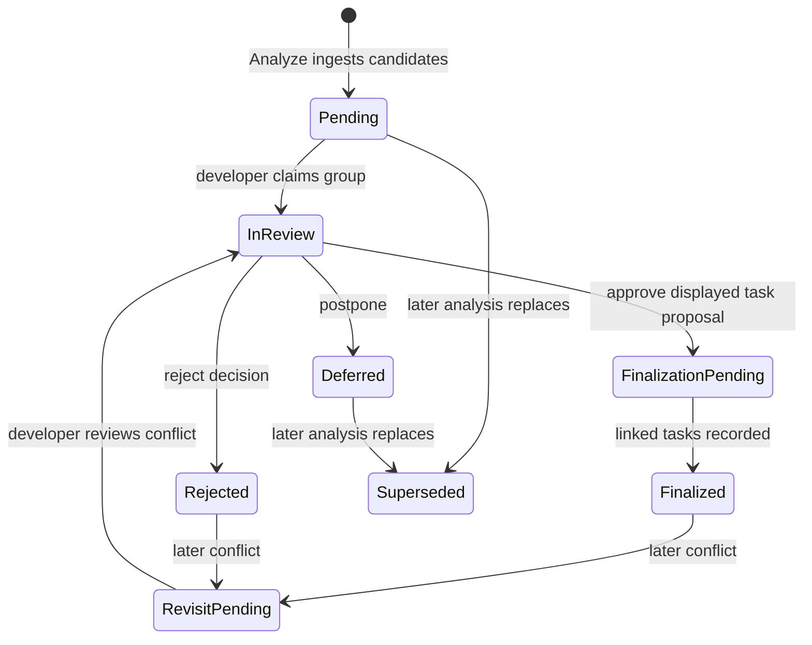
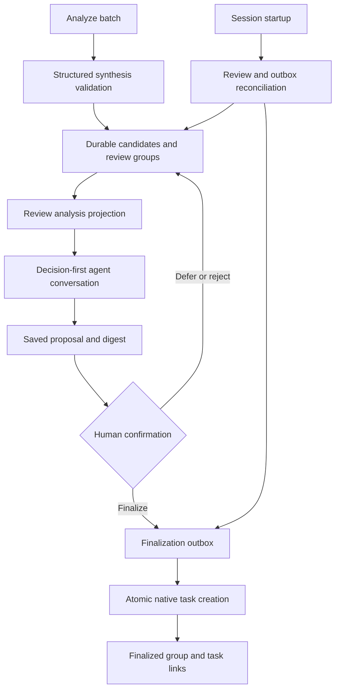

# Human-Gated Analysis Review - Plan

## Goal Capsule

- **Objective:** Insert a durable human decision stage between Analyze and executable work so analyzer findings remain candidates until explicitly approved.
- **Authority hierarchy:** The Product Contract governs behavior; KTDs govern implementation; the developer reviewing a group owns its final decision and task scope.
- **Stop conditions:** Stop rather than infer approval when a review group is stale, superseded, concurrently claimed, malformed, or no longer matches the displayed proposal.
- **Execution profile:** Implement the persisted review domain before changing Analyze, Resume, or dialogs; preserve existing raw verifier triage for non-Analyze batches.
- **Tail ownership:** The implementing agent owns focused tests, package verification, legacy-task quarantine, documentation, and removal of the immediate-materialization path.

---

## Product Contract

### Summary

Analyze will create a grouped review inbox rather than ready tasks. A decision-first review combines accepted and rejected candidates, and only finalizing a reviewed group creates executable Misc work.

### Problem Frame

The analyzer currently treats its semantic synthesis as implementation authority. This prevents the developer from rejecting an accepted recommendation, promoting a rejected alternative, or resolving a public API or product-policy question before work begins.

Raw findings also arrive across repeated runs and separate accepted and rejected sections. Presenting those records directly either overwhelms the developer or hides rejected candidates that materially constrain an accepted fix.

### Key Decisions

- **Mandatory human gate:** No analyzer candidate becomes executable work without explicit group finalization.
- **Decision-centric grouping:** Candidates are grouped by the shared decision or root cause they constrain, even when they span files or carry different analyzer verdicts.
- **Decision-first dialogue:** Review resolves the governing product or API question before deriving dispositions and tasks.
- **Group-level finalization:** The developer approves the displayed resolution and proposed task list as one unit after making any edits.
- **Stable approved work:** Later analyses replace pending and deferred groups but never silently alter finalized or rejected decisions.

### Actors

- A1. **Developer:** Reviews groups, answers decision questions, revises dispositions, and finalizes, defers, or rejects groups.
- A2. **Analysis reviewer:** Synthesizes candidates into related groups, conducts the decision conversation, and proposes the resulting task list.
- A3. **Work executor:** Receives only tasks created from finalized groups.

### Requirements

**Analysis inbox**

- R1. Analyze must store its synthesized output as review candidates without creating executable work items.
- R2. Every candidate must retain its original accepted or rejected verdict, rationale, evidence, source, and analysis-run provenance as advisory context.
- R3. The review inbox must group candidates by shared decision or root cause, including accepted and rejected candidates in the same group when they constrain the same outcome.
- R4. Rejected candidates that do not belong with an accepted candidate must remain reviewable rather than disappearing into report history.

**Human review**

- R5. Pending groups must appear through a separate `Review analysis` entry in the resume flow; Misc must contain finalized executable work only.
- R6. Reviewing a group must begin with its unresolved product, API, or policy decision when one exists, rather than asking the developer to accept findings as written.
- R7. The reviewer must use the developer's answers to promote, rewrite, merge, defer, or drop candidates regardless of their original analyzer verdict.
- R8. Before finalization, the reviewer must show the resolved decision, candidate dispositions, and exact proposed task list.
- R9. A group must create executable Misc tasks only after the developer explicitly chooses `Finalize group`.
- R10. A deferred group must create no tasks and retain its rationale in history while remaining replaceable by a later analysis; a rejected group is a durable human decision.

**Repeated analysis**

- R11. A later Analyze run must replace pending and deferred groups with the latest synthesis while preserving prior records as history.
- R12. A later Analyze run must leave finalized groups, rejected decisions, and their executable tasks unchanged.
- R13. A new candidate that conflicts with a finalized or rejected decision must open a linked review group that asks whether to revisit the decision instead of modifying prior work.
- R14. Re-running ingestion, finalization, or session recovery must not duplicate review groups or finalized tasks.

### Review Lifecycle

### Key Flows

- F1. **Create review inbox**
  - **Trigger:** Analyze completes with synthesized accepted or rejected candidates.
  - **Actors:** A2
  - **Steps:** Preserve candidate provenance, form decision-centric groups, and expose the groups under `Review analysis`.
  - **Outcome:** No executable task exists before human review.
  - **Covered by:** R1-R5
- F2. **Review and finalize a group**
  - **Trigger:** A1 resumes a pending analysis group.
  - **Actors:** A1, A2, A3
  - **Steps:** Resolve the governing decision, derive candidate dispositions, show proposed tasks, and wait for explicit finalization.
  - **Outcome:** Finalization creates the approved Misc tasks; deferral or rejection creates none.
  - **Covered by:** R6-R10
- F3. **Reconcile a later analysis**
  - **Trigger:** Analyze completes while earlier groups or tasks exist.
  - **Actors:** A1, A2
  - **Steps:** Replace pending and deferred groups, preserve terminal decisions, and surface conflicts as linked revisit decisions.
  - **Outcome:** The latest pending analysis is reviewable without erasing human-approved work.
  - **Covered by:** R11-R14

### Acceptance Examples

- AE1. **Rejected equality proposal can be promoted.** Given an accepted inventory-performance finding and a rejected proposal to change public tag equality, when they depend on the meaning of tag identity, then both appear in one group and the developer can choose either a private deduplication key or changed equality semantics before tasks are proposed. **Covers R2, R3, R6-R9.**
- AE2. **Licensing findings are decided together.** Given unreachable developer-key enforcement and an untrustworthy dormant verifier, when the group is reviewed, then the reviewer first asks whether entitlement enforcement belongs in the SDK contract and derives deletion or redesign tasks from that answer. **Covers R3, R6-R9.**
- AE3. **Analyzer acceptance is not approval.** Given a candidate marked accepted by Analyze, when its group has not been finalized, then Resume exposes it only under `Review analysis` and no executor can start it as Misc work. **Covers R1, R5, R9.**
- AE4. **Terminal decisions survive re-analysis.** Given a finalized or rejected group, when a later Analyze run repeats or contradicts its findings, then prior work remains unchanged and any conflict appears as a linked revisit group. **Covers R11-R14.**
- AE5. **Deferred work is refreshed.** Given a deferred group, when a later Analyze run produces a replacement, then the old rationale remains in history, the old group becomes superseded, and only the new group is pending. **Covers R10-R14.**

### Success Criteria

- Analyze completion never creates executable tasks directly.
- Every accepted and rejected candidate remains discoverable in a review group or preserved history.
- A developer can change any analyzer disposition before finalization.
- Resume clearly separates pending analysis review from approved Misc work.
- Repeated analyses do not duplicate candidates, erase terminal decisions, or reactivate superseded groups.

### Scope Boundaries

- The analyzer may recommend dispositions and task shapes, but it never owns approval.
- Existing auto-created `wo:analysis` tasks are quarantined as legacy review candidates rather than treated as approved work.
- This work does not redesign the code findings, licensing model, tag identity contract, or other analyzed product decisions; it creates the review procedure used to decide them.
- This work does not require per-task confirmation after a group resolution has already displayed the exact proposed task list.
- Multi-user merge resolution, semantic conflict scoring beyond explicit decision keys, and a historical review dashboard are deferred.

---

## Planning Contract

**Product Contract preservation:** Changed R10-R11 and related lifecycle text to record the confirmed rule that deferred groups are replaced by later analyses while their rationale remains history.

### Key Technical Decisions

- **KTD1 — Review state belongs to the verifier domain.** Extend the durable verifier store with separate analysis candidate, review group, review event, and finalization records. Do not overload raw finding groups or native work items with pre-approval state.
- **KTD2 — Structured synthesis is authoritative.** Analyze synthesis returns a bounded, validated structured payload containing candidates, advisory verdicts, provenance, decision keys, group membership, and explicit conflict links. Enforce byte, field-length, candidate/group/link, nesting, and rendered-output ceilings before canonicalization; normalize source paths to repo-relative form and escape control characters in all rendered evidence. Render Markdown locally for humans; malformed or oversized output remains a retryable `analysis-ingestion-failed` record and never falls through to raw triage or task creation.
- **KTD3 — Review identity is stable and conservative.** Candidate IDs combine immutable source provenance with a canonical content digest. Group and revisit IDs use a repository-scoped, schema-versioned decision-key namespace plus terminal-decision links; collisions or uncertain matches create separate quarantined or pending groups rather than mutating terminal decisions.
- **KTD4 — Finalization uses a fenced, idempotent outbox.** Persist an immutable outbox record with group revision, finalization ID, complete proposal/task digests, ordinals, and target roadmap before touching the native work store. Its states are `pending`, leased `claimed`, `completed`, and `blocked`; expired claims are reclaimable through a monotonically increasing fence. Each verifier-store or work-store compare-and-set holds only its own lock; nested locks are forbidden and the sole order is outbox claim, atomic missing-task creation, then ledger completion. Reconciliation adopts an ordinal only when finalization ID, complete task digest, target roadmap, parent, and dependencies match; duplicates or mismatches block the outbox.
- **KTD5 — Human approval is a coded capability boundary.** Agent-facing primitives may read/claim groups and save proposed resolutions, but cannot mint final approval or terminal dispositions. Only an extension-owned interactive callback responding to a human selection may issue a single-use capability bound to group ID, revision, proposal digest, session, nonce, and expiry; agent tools, headless callers, commands, text, and JSON can report `confirmation-required` but cannot invoke the issuer. Outbox creation consumes the capability atomically and stores only a non-secret receipt; token material is redacted from prompts, errors, telemetry, snapshots, and durable records.
- **KTD6 — Analyze and background verification remain distinct.** Persist a batch purpose and ingestion state, defaulting old batches to ordinary verification. Every raw-triage query, claim, and Resume projection excludes Analyze-purpose batches, including failed synthesis, while ordinary completion verifiers retain existing raw triage.
- **KTD7 — Review is a first-class resume action.** A single pure durable projection drives TUI, command, text, JSON, and restart behavior. `Review analysis` appears only for pending or revisit groups; no-target and remembered-target automatic Resume surface review first, while a caller's explicit work-item ID remains explicit.
- **KTD8 — Legacy auto-created work uses a migration ledger.** Before changing a corroborated legacy analysis task, persist its immutable snapshot and source-task digest in a verifier-side migration outbox. Planned, blocked, and open tasks are closed only after the review candidate is durable; in-progress or ambiguous lookalikes produce a blocking migration warning instead of silent mutation.

### High-Level Technical Design

The verifier store is authoritative for pre-approval state and the finalization ledger. The native work store remains authoritative for executable tasks. Stable finalization provenance connects them without requiring a cross-file transaction.

### Review Record Contract

A review candidate records source batch and finding IDs, original verdict, title, rationale, evidence, source location, recommendation, namespaced decision key, and immutable content digest. Source identity remains stable across content revisions: byte-equivalent re-ingestion is a no-op, changed content creates a linked candidate revision, reordered source IDs canonicalize identically, and moved or ambiguous sources remain separate unless synthesis supplies a validated explicit link. A review group records candidate IDs, lifecycle state, revision, source batches, predecessor or supersession links, optional terminal-decision conflict link, review lease, current proposal and digest, human resolution, finalization record, and audit timestamps.

Review history is append-only for terminal, superseded, migrated, and quarantined records. It retains immutable candidate/source snapshots, every proposal payload and digest, disposition and lease events, actor/session identity when available, timestamps, non-secret approval receipts, task IDs and payload digests, and all supersession/revisit links.

Legal transitions are `pending → in_review → finalization_pending → finalized`, `in_review → deferred`, `in_review → rejected`, `pending|deferred → superseded`, and `finalized|rejected → revisit_pending` through a newly linked group. Finalized and rejected records are monotonic; deferred records remain historical but replaceable.

### Review Interaction Contract

The shared dialog system owns every selection or checklist surface. The flow is inbox selection, governing-decision question when unresolved, candidate disposition review, exact task preview, then human-confirmed Finalize, Defer, or Reject. Escape, Back, filter no-match, empty inbox, invalid group, and cancelled prompt normalize to explicit non-mutating projections.

Inbox and group views distinguish loading/reconciling, empty, ingestion-failed, quarantined, stale-evidence, read-only lease, proposal-ready, and terminal states. Failed or quarantined records expose inspect-history and retry/reload actions but cannot finalize. Draft proposals are durable only after an explicit save; unsaved edits are discarded on Back, lease loss, error, or restart. Keyboard focus starts on the governing decision, preserves filtered selection, exposes accepted/rejected status in text rather than color alone, supports scrolling long evidence and previews, moves validation errors into focus, and requires a separately focused terminal confirmation.

A renewable review lease prevents two sessions from editing the same group. Another session may inspect a claimed group read-only. Proposal save and terminal actions compare group revision and lease owner; a stale session reloads instead of applying its prior proposal. TUI, text, and JSON share a canonical projection containing stage, group revision, lease state, advisory candidates, proposal digest status, allowed actions, and structured errors; noninteractive surfaces cannot issue terminal approval.

### Recovery and Integrity Rules

- Upgrade older verifier stores through an idempotent atomic schema migration; refuse newer schemas read-only and quarantine malformed review records without dropping raw evidence.
- Reconcile saved synthesis without groups by ingesting the same structured payload once.
- Reconcile `finalization_pending` without tasks by initializing a missing native store and creating the Misc parent plus missing tasks in one work-store mutation; corrupt stores, changed parents, duplicate ordinals, or non-exact payloads block without ledger completion.
- Reconcile tasks present without a finalized ledger by discovering their finalization-and-ordinal labels and recording their IDs.
- Expire abandoned review leases without changing group disposition.
- Bind evidence to repository revision, repo-relative path, and blob/content hash. A renamed path with the same blob may be revalidated; changed or deleted blobs require a newer analysis before finalization rather than acknowledgment alone.
- Report deleted or manually altered linked tasks as integrity warnings; never recreate them after the group is finalized.
- Treat malformed structured synthesis as a visible failed review ingestion with preserved source artifacts and no tasks.
- Never hold verifier and work-store locks together; racing finalizer, reconciler, or re-analysis paths must resolve through revision-fenced compare-and-set transitions.

### System-Wide Impact

- **Persistence:** The verifier schema gains an append-only approval and migration history; older stores upgrade atomically, newer unknown schemas remain untouched, and corrupt review records fail closed without invalidating unrelated raw verifier evidence.
- **Execution routing:** Analyze-purpose records are removed from raw mandatory-fix triage. Ordinary background verification keeps its existing lifecycle, while every Analyze entry point uses the same review projection.
- **Agent and UI parity:** TUI, command, text, JSON, and restart surfaces read one durable state. Agents can draft but cannot approve; only human-interactive surfaces mint confirmation capabilities.
- **Work-item integrity:** Native tasks remain ordinary executable work after finalization. Their immutable finalization provenance supports audit and recovery without making the verifier store authoritative for later task edits or closure.
- **Rollout:** Legacy analysis tasks are migrated through a replayable ledger. Ambiguous or in-progress tasks stop with a visible recovery decision rather than being closed automatically.

### Risks and Mitigations

- **Cross-store partial commit:** A crash can separate outbox and task writes. Mitigate with immutable finalization IDs, complete per-ordinal payload digests, no nested locks, and startup reconciliation that accepts only exact matches.
- **Approval replay or self-approval:** An agent or stale session could reuse confirmation. Mitigate with UI-only single-use capabilities bound to session, revision, digest, nonce, and expiry, plus atomic consumption and non-secret receipts.
- **Decision-key collision:** Analyzer-controlled keys could merge unrelated work. Mitigate with versioned repository namespaces, provenance/content digests, fail-closed collision quarantine, and no semantic mutation of terminal decisions.
- **Schema or record corruption:** A partial upgrade or malformed review record could hide work or bypass validation. Mitigate with atomic migration, recovery snapshots, referential validation, preserved raw bytes, and a hard prohibition on finalizing quarantined references.
- **Legacy migration loss:** Closing a task before preserving it could discard user context. Mitigate by snapshot-first migration, source-ID/digest identity, status-specific policy, and fault-injection coverage at every migration boundary.
- **Resume divergence:** Different renderers or aliases could bypass review. Mitigate with one pure projection and a target matrix covering no target, remembered target, explicit item, text, JSON, TUI, and restart.

### Sequencing

Implement the durable review model first, then ingestion and reconciliation, then guarded finalization, then user interaction and Resume routing. Remove direct task materialization only when the new ingestion path and recovery tests are in place; quarantine legacy tasks in the same rollout.

### Sources and Patterns

- `extensions/background-verifiers.js` — durable store, stable IDs, validation, locks, claims, dispositions, and reconciliation patterns.
- `extensions/work-models.js` — Analyze scheduling, synthesis presentation, Resume projection, F7 menu routing, commands, and current immediate materialization to replace.
- `extensions/work-store.js` — atomic native work-item mutation and canonical serialization.
- `extensions/work-dialogs.js` — mandatory overlay behavior, purpose lines, filtering, checklist toggles, and cursor preservation.
- `scripts/test-background-verifiers.mjs`, `scripts/test-work-background-verifier-flow.mjs`, `scripts/test-work-resume.mjs`, and `scripts/test-work-dialogs.mjs` — nearby fixture and behavior patterns.

---

## Implementation Units

### U1. Persist the analysis review domain

- **Goal:** Add validated, version-compatible review candidates, review groups, leases, events, and finalization records to the verifier store.
- **Requirements:** R1-R4, R10-R14; F1, F3; AE4, AE5; KTD1, KTD3.
- **Dependencies:** None.
- **Files:** `extensions/background-verifiers.js`, `scripts/test-background-verifiers.mjs`.
- **Approach:** Add a pre-validation schema migration entry point that snapshots and atomically upgrades older stores, defaults review maps, preserves every existing map, and refuses newer schemas read-only. Add pure mutations for ingesting candidates, grouping by decision key, claiming/renewing review leases, saving revision-fenced proposals, terminal dispositions, supersession, explicit revisit links, and integrity projection. Keep raw verifier groups and claims unchanged.
- **Patterns to follow:** Existing `stableId`, `edit`, `mutateVerifierStore`, claim lease, disposition validation, and canonical durable-write patterns.
- **Test scenarios:**
  - Ingest one accepted and one rejected candidate with the same decision key and assert one pending group retains both verdicts and provenance.
  - Ingest a rejected-only candidate and assert it remains discoverable.
  - Re-ingest the same payload and assert stable IDs, unchanged revision, and no duplicates.
  - Ingest a later payload and assert pending and deferred predecessors become superseded while finalized and rejected records remain unchanged.
  - Ingest an explicit conflict with a terminal decision and assert a linked revisit group is created.
  - Attempt stale-revision, wrong-owner, expired-lease, and illegal lifecycle mutations and assert fail-closed errors.
  - Load a pre-feature verifier store and assert optional review maps initialize without losing existing batches, findings, groups, claims, or dispositions.
- **Verification:** Review-state serialization round-trips, every legal transition is covered, and existing verifier domain tests remain green.

### U2. Replace immediate materialization with durable Analyze ingestion

- **Goal:** Make Analyze produce validated review candidates and a human-readable report without creating Misc or tasks.
- **Requirements:** R1-R4, R11-R14; F1, F3; AE1-AE5; KTD2, KTD3, KTD6.
- **Dependencies:** U1.
- **Files:** `extensions/work-models.js`, `extensions/background-verifiers.js`, `scripts/test-work-background-verifier-flow.mjs`, `scripts/test-work-analysis-review.mjs`.
- **Approach:** Mark manual Analyze batches with their review purpose, replace the Markdown-only synthesis contract with structured candidate/group output, validate it through the review domain, and render the saved Markdown report locally. Remove task creation and temporary-directory scanning from completion and startup recovery. Mark only successfully ingested Analyze batches as review-materialized so malformed output stays visible and retryable.
- **Patterns to follow:** Existing bounded structured verifier report validation, batch purpose/provenance, presentation status, and startup reconciliation.
- **Test scenarios:**
  - Covers AE1: accepted inventory performance and rejected equality candidates enter one review group and no work store exists.
  - Covers AE2: related licensing candidates share one decision group and retain separate sources and recommendations.
  - Covers AE3: Analyze completion creates review state and report history but no Misc roadmap or executable task.
  - Malformed, partial, oversized, or missing structured fields create a visible failed ingestion and no tasks.
  - Restart with the OS temp report removed reconstructs the inbox from durable review state without re-running synthesis.
  - Ordinary background-verifier batches continue through existing raw triage and are not silently converted into Analyze review groups.
- **Verification:** The old direct-materialization assertions are replaced by review-ingestion assertions, and no Analyze completion or recovery path calls native task creation.

### U3. Add guarded, crash-safe group finalization and legacy quarantine

- **Goal:** Make explicit group finalization the sole path from analysis review to executable Misc tasks.
- **Requirements:** R8-R14; F2, F3; AE3-AE5; KTD4, KTD5, KTD8.
- **Dependencies:** U1, U2.
- **Files:** `extensions/background-verifiers.js`, `extensions/work-models.js`, `extensions/work-store.js`, `scripts/test-work-analysis-review.mjs`, `scripts/test-work-store.mjs`.
- **Approach:** Save the exact reviewed task payload and digest, mint confirmation bound to its group revision, persist the finalization outbox, atomically create missing tasks with stable finalization provenance, then commit task links. Reconcile every crash boundary on startup. Migrate eligible `open`, `blocked`, `planned`, and `deferred` legacy analysis tasks through a snapshot-first ledger; retain `closed` history and stop for a human recovery decision on `in_progress` or ambiguous items.
- **Patterns to follow:** Existing native store lock/mutation, verifier durable mutation, approval-fingerprint patterns, provenance labels/notes, and dependency chaining for ordered tasks.
- **Test scenarios:**
  - Save a proposal, change one task after preview, and assert finalization rejects the digest mismatch.
  - Finalize an unchanged proposal and assert exactly its task list appears under one Misc roadmap in report order.
  - Retry finalization and restart after outbox save, after task creation, and before final ledger commit; assert exactly one task per ordinal.
  - Defer and reject groups and assert neither creates tasks; assert deferred is later replaceable and rejected is terminal.
  - Simulate changed revision, lost lease, expired/replayed/transferred capability, and every agent/headless entry point; assert none can create an outbox or task.
  - Quarantine eligible `open`, `blocked`, `planned`, and `deferred` legacy analysis tasks only after durable snapshots; retain `closed` history and assert `in_progress` or ambiguous items produce a blocking recovery decision.
  - Delete or edit a linked finalized task and assert an integrity warning without automatic recreation.
- **Verification:** Finalization is idempotent across every persisted boundary, only human-bound approval can cross the gate, and legacy tasks cannot bypass review.

### U4. Implement the grouped decision-first review experience

- **Goal:** Expose a shared interactive and non-TUI review flow that can revise analyzer verdicts and produce an exact task proposal.
- **Requirements:** R2-R10; F2; AE1-AE3; KTD5, KTD7.
- **Dependencies:** U1, U2, U3.
- **Files:** `extensions/work-models.js`, `extensions/work-dialogs.js`, `scripts/test-work-analysis-review.mjs`, `scripts/test-work-dialogs.mjs`.
- **Approach:** Add `Review analysis` inbox and group selection through the shared dialog system. Launch a reviewer prompt containing both accepted and rejected candidates, the governing decision, provenance, and legal operations. Expose constrained read, claim, and save-proposal primitives to the agent; Defer, Reject, and Finalize remain human-confirmed extension actions. Reuse Resume for non-TUI entry and expose equivalent text/JSON projections rather than adding a separate command unless implementation finds an existing caller that requires one.
- **Patterns to follow:** Existing `showListDialog` purpose line, filtering, checklist toggles, parent cursor memory, command telemetry, constrained tool registration, and follow-up handoffs.
- **Test scenarios:**
  - F7 shows one `Review analysis` entry only when pending or revisit groups exist and restores the parent cursor after return.
  - Selecting a mixed-verdict group includes every candidate and asks the governing decision before task dispositions.
  - Promoting a rejected candidate and dropping an accepted candidate changes the saved proposal without changing original advisory verdicts.
  - Escape, Back, empty/filter-no-match, invalid group, stale refresh, and cancelled prompt at every stage commit no terminal state or task.
  - Another session's active lease renders read-only; lease expiry allows a new claim without approving anything.
  - Text and JSON output expose the same group identity, lifecycle, proposal status, and allowed next actions as the TUI.
  - Keyboard-only review preserves filter selection, announces verdict/status labels, focuses errors, scrolls complete task previews, and cannot trigger a terminal action accidentally.
- **Verification:** Dialog behavior satisfies the shared overlay rules, agent tools cannot Finalize, Defer, or Reject, and all interfaces project the same durable review state.

### U5. Integrate review precedence with Resume and remove bypasses

- **Goal:** Route pending analysis through review before automatic execution while preserving explicit work selection and ordinary verifier triage.
- **Requirements:** R5, R9, R11-R14; F1-F3; AE3-AE5; KTD6, KTD7.
- **Dependencies:** U1-U4.
- **Files:** `extensions/work-models.js`, `README.md`, `scripts/test-work-resume.mjs`, `scripts/test-work-background-verifier-flow.mjs`, `scripts/test-work-native-smoke.mjs`.
- **Approach:** Add review projection to Resume state before automatic roadmap fallback, route the F7 action and explicit command through the same handler, and prevent Analyze-origin raw groups from entering the mandatory-fix triage path. Keep explicit work-item targets explicit and retain raw verifier triage for ordinary completion verification. Document the separate Review analysis and Misc queues.
- **Patterns to follow:** Existing `buildWorkResumeState`, renderers, `executeOrchestratorAction`, numbered actions, F7 menu entries, and native smoke harness.
- **Test scenarios:**
  - Default Resume with pending review returns `review-analysis-required` and starts no executor.
  - Explicit Resume of an unrelated work item remains available while review is pending.
  - After finalization, Resume selects the first approved Misc task and follows its dependency order.
  - Analyze-origin candidates never enter the raw triage prompt that says accepted findings must be fixed.
  - Ordinary verifier findings still enter existing claim/disposition/fix triage.
  - Restart preserves pending, in-review, deferred, rejected, finalized, superseded, and revisit projections without duplicate actions.
  - Covers AE4 and AE5: later analysis preserves terminal decisions, replaces deferred work, and exposes conflicts as linked review.
- **Verification:** Resume has no path that auto-executes an unfinalized analysis candidate, existing explicit routing remains intact, and user documentation matches actual menu/command behavior.

---

## Verification Contract

| Gate | Command | Proves |
|---|---|---|
| Review domain | `node scripts/test-background-verifiers.mjs` | Schema compatibility, candidate/group identity, lifecycle, leases, supersession, and revisit links |
| Analyze ingestion | `node scripts/test-work-background-verifier-flow.mjs` | Analyze completion, structured ingestion, durable recovery, and raw-triage isolation |
| Review lifecycle | `node scripts/test-work-analysis-review.mjs` | Human gate, proposal digest, finalization outbox, crash recovery, legacy quarantine, and no duplicate tasks |
| Resume routing | `node scripts/test-work-resume.mjs` | Review precedence, explicit-target behavior, finalized-task continuation, and text/JSON parity |
| Dialog behavior | `node scripts/test-work-dialogs.mjs` | Shared overlay purpose line, filtering, toggles, Escape behavior, and cursor restoration |
| Native persistence | `node scripts/test-work-store.mjs` | Atomic task creation, provenance, dependencies, and canonical serialization |
| Integration smoke | `node scripts/test-work-native-smoke.mjs` | F7/commands/session restart integrate without bypassing review |
| Static diagnostics | `lsp_diagnostics` and `lens_diagnostics mode=all` on changed files | No blocking language-server or structural diagnostics |
| Package regression | `npm run verify:quiet` | Full package regression suite |

The current Windows baseline may reproduce the unrelated shell-environment fixture failure in `scripts/test-work-optimization-helpers.mjs`. Document an unchanged baseline failure; do not waive any new or changed failure.

---

## Definition of Done

- U1 is done when review state is durable, validated, backward-compatible, revision-fenced, and independently tested without changing raw verifier triage.
- U2 is done when Analyze and restart recovery create review groups and reports but never Misc or tasks.
- U3 is done when finalization is human-bound and idempotent across all cross-store crash boundaries, and legacy unapproved tasks are quarantined.
- U4 is done when accepted and rejected candidates can be discussed together through shared TUI and non-TUI interfaces, with exact proposal preview before approval.
- U5 is done when Resume exposes `Review analysis` separately, blocks automatic execution of pending candidates, preserves explicit work selection, and documents the behavior.
- Every Product Contract requirement and acceptance example is covered by at least one implementation unit and runnable scenario.
- Focused gates and package verification pass, apart from a separately evidenced unchanged baseline failure.
- No temporary report path is required for durable recovery, no agent primitive can self-approve finalization, and no unfinalized analysis candidate is executable.
- Abandoned experimental code, superseded immediate-materialization helpers, obsolete tests, and temporary planning artifacts are removed from the final diff.
