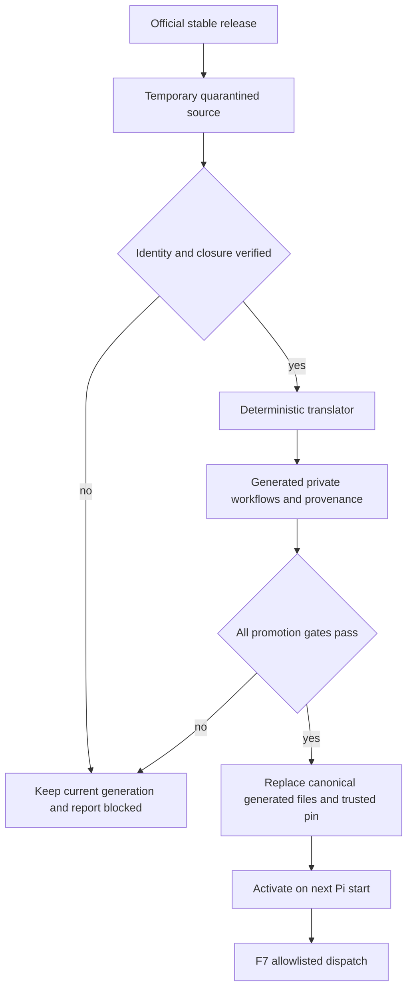

# Private Compound Engineering Workflows - Plan

## Goal Capsule

- **Objective:** Replace the third-party `pi-compound-engineering` runtime dependency with private ce-workflow-native workflows generated from verified official Compound Engineering stable releases.
- **Product authority:** ce-workflow owns runtime behavior and compatibility; the official stable release is update input, not runtime authority.
- **Open blockers:** None at the product level. Planning must prove source isolation, complete dependency closure, deterministic translation, and behavioral parity before legacy removal.

---

## Product Contract

### Summary

ce-workflow will fetch official stable Compound Engineering releases into quarantine during catch-up, translate useful changes into private ce-workflow-native workflows, and ship the generated result itself. Ordinary Pi sessions will have no Compound Engineering package, commands, skills, descriptions, or extension hooks installed.

### Problem Frame

ce-workflow currently depends on the third-party `npm:pi-compound-engineering` port for workflows that span brainstorming, planning, debugging, review, simplification, explanation, learning capture, and browser testing. The port exposes broad skill descriptions to Pi's discovery system, can leave managed instructions behind, and trails the official source.

Hiding skills has not provided a dependable internal-only boundary. The current catch-up path also understands npm package versions and npm diffs rather than the official repository's release tags and source identity.

The migration must improve ce-workflow's internal flows without making upstream prompts a new runtime authority. It must also preserve all reachable CE-backed behavior before users are asked to remove the legacy package.

### Key Decisions

- **Translate rather than load upstream at runtime:** Official playbooks are generation input. ce-workflow ships private native workflows adapted to its work-item, advisor, agent, tool, and verification contracts.
- **Keep the runtime surface empty:** No direct `/ce-*` command, CE skill catalog entry, CE description, or official resource-discovery extension remains after migration.
- **Track stable releases only:** Catch-up follows the latest official stable release, not unreleased `main` commits.
- **Promote automatically after hard gates:** A passing stable release updates the trusted pin and generated files in the source checkout without human review. Catch-up never commits or pushes those changes.
- **Fail closed to the previous generation:** Unknown source shape, incomplete closure, verification uncertainty, or any failed gate leaves the current generated workflows active and records the update as pending or blocked.
- **Preserve behavioral parity:** Every CE-backed ce-workflow path must retain its behavior or move to a verified native equivalent before legacy removal.
- **Preserve specialist intent selectively:** Translation may route compatible work through ce-workflow advisors and packaged agents, but it retains non-equivalent upstream specialist prompts and discipline.
- **Use temporary source acquisition:** The requested filtered Pi git-package prototype proves isolation behavior, but the final system fetches verified release source only during catch-up and keeps no official package installed at runtime.

### Actors

- A1. **ce-workflow maintainer:** Runs catch-up, inspects failures or generated changes when needed, commits accepted source-checkout changes through the normal workflow, and can restore the previous generation.
- A2. **Catch-up translator:** Resolves official stable releases, verifies source identity, generates private workflows, runs gates, and either promotes the complete candidate or preserves the current generation.
- A3. **F7 workflow:** Loads only ce-workflow-owned generated workflows for the action being executed.
- A4. **Ordinary Pi user:** Uses ce-workflow without installing, discovering, or invoking Compound Engineering directly.

### Requirements

**Source trust and isolation**

- R1. Catch-up must resolve the latest official stable release to its tag, peeled commit SHA, observed archive digest, imported-file hashes, and license or notice files before using its content.
- R2. Except for the R25 fallback snapshot, official source must enter only an ignored transient quarantine, must be deleted on every success and failure path, and must never become an installed runtime package.
- R3. The migration must first test a pinned official Pi git-package entry with `extensions: []` and `skills: []` and capture the effective registered commands, skill catalog and descriptions, extension hooks, and resource roots.
- R4. Unknown manifest surfaces, unresolved references, unsafe paths, symlinks, platform collisions, source identity mismatches, missing license evidence, or terms that do not permit derived redistribution must block translation and promotion.
- R5. A clean ordinary Pi session must report no official or legacy CE command, skill description, resource-discovery extension, resource root, or model-invocable CE entry through the same effective-runtime probe.

**Private workflow translation**

- R6. The migration must inventory every reachable ce-workflow CE call site across extensions, agents, policies, evaluation paths, and tests, plus the complete transitive resource closure used by each path.
- R7. Translation must generate private ce-workflow-native workflows for every required path and adapt them to current work-item, advisor, agent, tool, interaction, and verification contracts.
- R8. Generated workflows must be addressable only through an allowlisted ce-workflow dispatcher invoked by ce-workflow-owned F7 actions.
- R9. The dispatcher must reject unknown workflow names, path escape, missing resources, unverified generations, and calls originating outside the ce-workflow action contract.
- R10. Translation must preserve upstream specialist instructions when no verified ce-workflow-native role has equivalent responsibilities and capabilities.
- R11. The generated output must retain provenance and required attribution from each internal workflow and resource to the official release, source path, source hash, license evidence, and translator version that produced it.
- R12. Translation and promotion must be rule-based, reproducible offline, and free of model-generated content: identical verified input and translator version must produce identical generated output and provenance.

**Automatic catch-up and promotion**

- R13. Catch-up must replace its npm-only CE baseline with an official GitHub stable-release descriptor and represent successful, current, available-update, unknown, blocked, failed, non-writable-checkout, and unrelated-dirty-worktree states distinctly; unrelated dirt maps to blocked.
- R14. A network, authentication, rate-limit, upstream availability, non-writable-checkout, or unrelated-dirty-worktree failure must remain visible and must never be interpreted as current or promotable.
- R15. Catch-up must generate an audit diff covering upstream changes, dependency-closure changes, translated output, provenance, and compatibility impact before promotion.
- R16. Catch-up must automatically promote a candidate only when source-trust, license, no-discovery, closure, deterministic-generation, explicit-dispatch, parity-matrix, Windows, restart, and rollback gates all pass.
- R17. Promotion must refuse unrelated dirty files and declare its exact generated paths as owned output for the current catch-up so existing dirty-tree safety gates distinguish intended changes; it must not commit, push, publish, or edit global Pi settings.
- R18. A promoted generation must activate only on the next Pi start and retain the prior files and trusted pin until activation checks pass; one coded recovery action must restore that retained generation automatically after failed activation and remain operator-invocable before commit.
- R19. Any changed source surface not covered by a known translation rule and compatibility fixture must block promotion rather than pass through unchanged.

**Compatibility and legacy removal**

- R20. A parity matrix keyed to the R6 inventory must record at least one pass or fail per CE-backed path against its legacy trigger, decisions, tool boundary, artifacts, failure behavior, and actor-visible outcome; prose wording need not match.
- R21. The legacy port must remain available as the comparison baseline until every required parity-matrix entry passes or has a verified native replacement that passes the same fixtures.
- R22. The migration must remove legacy coupling from peer dependencies, installation guidance, catch-up, agents and policies, evaluation resources, and CE-name assertions in tests only after replacement parity passes.
- R23. Post-migration behavior must not read or fall back to the legacy package whether it is installed or absent; ce-workflow may detect it and recommend the exact uninstall action but must never uninstall it automatically.
- R24. Legacy managed `AGENTS.md` content may be removed only after a marker-bounded preview and explicit confirmation, preserving every surrounding byte and refusing ambiguous or malformed markers.
- R25. If the filtered-source prototype cannot prove isolation or temporary source acquisition cannot provide a complete safe closure, the fallback is a committed byte-preserved allowlisted source snapshot used only as translation input.

### Parity Contract

The R6 inventory is the index for migration parity. Each entry names its current CE-backed trigger, required user decisions, allowed tools and mutation boundary, durable artifacts or side effects, verification and waiver behavior, failure outcome, and actor-visible result. Representative fixtures record pass or fail against those observables for the legacy baseline, the translated workflow, and any claimed native replacement; nondeterministic prose style is not a parity requirement.

No dependency or uninstall guidance may be removed while a required inventory entry is missing, untested, or failing. The same matrix is a promotion gate for later stable releases, so a release that changes an imported path without an updated passing fixture remains blocked.

### Update and Runtime Flow

### Key Flows

- F1. **Catch up from an official stable release**
  - **Trigger:** Catch-up detects a newer official stable release.
  - **Actors:** A1, A2
  - **Steps:** Resolve and verify source identity, fetch into quarantine, compute the required closure, translate, generate provenance and an audit diff, then run every promotion gate.
  - **Outcome:** A fully passing candidate replaces the generated source files and trusted pin; any uncertainty preserves the current generation with a visible diagnosis.
  - **Covered by:** R1-R4, R11-R19
- F2. **Run a private generated workflow**
  - **Trigger:** A3 starts an F7 action that requires Compound Engineering-derived discipline.
  - **Actors:** A3, A4
  - **Steps:** Resolve the exact allowlisted generated workflow, verify its generation identity, and inject only that private workflow and its required resources into the owned action.
  - **Outcome:** The F7 action benefits from official CE changes without exposing a CE package or general skill surface.
  - **Covered by:** R5-R12
- F3. **Retire the legacy port**
  - **Trigger:** Every reachable CE-backed path passes parity and the replacement survives restart and rollback checks.
  - **Actors:** A1, A2, A4
  - **Steps:** Remove ce-workflow's dependency and assumptions, release the replacement, detect remaining legacy installation, recommend uninstall, and offer confirmed marker-bounded cleanup.
  - **Outcome:** ce-workflow remains behaviorally complete with no Compound Engineering runtime installation.
  - **Covered by:** R20-R25

### Acceptance Examples

- AE1. **Ordinary conversation has no CE surface.** Given a clean profile with migrated ce-workflow, when Pi starts and receives unrelated conversation, then no CE command, skill description, resource root, or official extension is registered or read. **Covers R2-R5.**
- AE2. **F7 loads one private workflow.** Given an F7 brainstorm action, when ce-workflow dispatches its generated brainstorm discipline, then only the verified allowlisted internal workflow and required resources enter that action. **Covers R7-R12.**
- AE3. **Known stable update promotes automatically.** Given a newer stable release whose changed closure is understood and whose full gate suite passes, when catch-up runs, then the trusted pin and generated working-tree files advance without a confirmation, commit, or push and activate after restart. **Covers R13, R15-R18.**
- AE4. **Unknown upstream shape does not promote.** Given a stable release that adds an unrecognized package discovery surface or unresolved resource reference, when catch-up runs, then it records a blocked update and leaves the current generation unchanged. **Covers R1, R4, R14, R18, R19.**
- AE5. **Network failure is not current state.** Given the release service cannot be reached, when catch-up runs, then status is unknown or failed, no source or generated file changes, and the previous generation remains usable. **Covers R13, R14, R18.**
- AE6. **Parity failure preserves the legacy baseline.** Given a required debug or review parity fixture from the complete call-site inventory fails under the generated workflow, when migration verification runs, then legacy dependency removal remains blocked and no uninstall recommendation is shown. **Covers R6, R20-R23.**
- AE7. **Legacy cleanup preserves user instructions.** Given an `AGENTS.md` containing user text around a valid legacy managed block, when the user confirms the preview, then only the exact managed block is removed. **Covers R24.**

### Success Criteria

- A clean migrated Pi profile after legacy uninstall has zero CE runtime discovery surface while all F7 flows remain operational, and the same F7 behavior is independent of whether the legacy package happens to remain installed.
- Every previously reachable CE-backed ce-workflow path has a recorded passing parity result or a verified native replacement.
- A compatible official stable release can regenerate and promote private workflows without human review, commit, or push.
- Every uncertain or failed update preserves the previous verified generation and explains why promotion stopped.
- Restart and rollback exercises prove that no partial generation becomes active.
- Users can remove the legacy port and its managed instruction block without losing ce-workflow behavior or unrelated instructions.

### Scope Boundaries

- Direct `/ce-*` commands and general-purpose CE skill invocation are removed rather than preserved.
- Official unreleased `main` commits, prereleases, and arbitrary forks are outside the automatic update channel.
- Auto-promotion does not include commit, push, package publication, or edits to global Pi settings.
- The official repository is not retained as an installed runtime or persistent user prerequisite.
- This work does not redesign the upstream Compound Engineering workflows; it imports useful stable-release changes while adapting them to ce-workflow's existing product contract.

### Dependencies and Assumptions

- Official stable release metadata, source archives, and commit identity remain available through GitHub.
- ce-workflow can define behavior fixtures for every current CE-backed path and can identify source changes outside their covered translation surface.
- Pi restart is the only activation boundary; in-session replacement of loaded workflow resources is not required.
- The peeled commit SHA and imported-file hashes are canonical identity. The archive digest is recorded as acquisition evidence rather than treated as the sole trust anchor.

### Sources and Research

- `extensions/work-models.js` — current CE handoffs, advisor routing, browser/review/simplification hooks, npm-only catch-up behavior, and dirty-tree safety gates.
- `extensions/work-catch-up-baseline.json` — current npm package baseline.
- `agents/work-debugger.md` and `skills/work-orchestrator/references/full-policy.md` — inherited CE debugging, learning-capture, and policy coupling.
- `package.json`, `README.md`, and `scripts/workflow-evaluation.mjs` — peer dependency, installation guidance, dependency-root lookup, required skill resources, and evaluation assumptions that must migrate together.
- `scripts/test-work-brainstorm.mjs`, `scripts/test-work-settings.mjs`, `scripts/test-work-goal.mjs`, `scripts/test-work-start-finish.mjs`, `scripts/test-work-resume.mjs`, `scripts/test-work-telemetry.mjs`, `scripts/test-work-optimization-helpers.mjs`, and `scripts/test-workflow-evaluation-rpc.mjs` — known CE-name, managed-block, scratch-root, and behavior assertions that must move with their production contracts; R6 remains authoritative for the complete inventory.
- `scripts/work-helper.mjs` and `.gitignore` — conservative managed-instruction cleanup and transient-path policy.
- [Official Compound Engineering repository](https://github.com/EveryInc/compound-engineering-plugin) and [license](https://github.com/EveryInc/compound-engineering-plugin/blob/main/LICENSE) — canonical upstream source and current redistribution terms.
- [Official Pi package manifest](https://github.com/EveryInc/compound-engineering-plugin/blob/main/package.json) and [Pi resource-discovery extension](https://github.com/EveryInc/compound-engineering-plugin/blob/main/.pi/extensions/compound-engineering.ts) — official Pi exposure surface.
- [Compound Engineering v3.21.0](https://github.com/EveryInc/compound-engineering-plugin/releases/tag/compound-engineering-v3.21.0) — stable release observed during the brainstorm.
- [Pi skills documentation](https://github.com/earendil-works/pi/blob/main/packages/coding-agent/docs/skills.md) and [Pi packages documentation](https://github.com/earendil-works/pi/blob/main/packages/coding-agent/docs/packages.md) — discovery, model-invocation, filtering, and pinned Git-ref behavior.

### wo:divergent-analysis

- **Inversion and adversary — `anthropic/claude-opus-5`:** Kept effective-runtime surface probing, unknown-manifest-key failure, and closure hashes. Rejected prompt-token neutralization because it would corrupt specialist semantics, and rejected a dual-installed shadow oracle because it would recreate the discovery surface being removed.
- **3am operator — `openai-codex/gpt-5.6-sol`:** The original branch and the user-requested retry produced no candidate because the configured provider had no authentication. No substitute branch was launched.
- **Remove the load-bearing assumption — `zai/glm-5.2`:** The original branch and the user-requested retry produced no candidate because the configured provider had no authentication. No substitute branch was launched.

### wo:advisor-analysis

- **Requirements and evidence — `work-advisor` / `anthropic/claude-opus-5`:** Completed, then passed one focused re-review. Its parity, call-site inventory, offline determinism, legacy independence, dirty-tree recovery, license, quarantine, writable-checkout, and effective-runtime probe findings were incorporated.
- **Builder and on-call — `work-advisor-2` / `openai-codex/gpt-5.6-sol`:** Unavailable because the configured provider had no authentication; recorded without replacement or retry.
- **Adversarial simplifier — `work-advisor-3` / `zai/glm-5.2`:** Unavailable because the configured provider had no authentication; recorded without replacement or retry.

---

## Planning Contract

### Current-state architecture findings

1. **CE behavior is prompt-coupled, not imported by ce-workflow code.** `extensions/work-models.js` assembles handoffs that name `ce-brainstorm`, `ce-plan`, `ce-code-review`, `ce-simplify-code`, `ce-test-browser`, `ce-pov`, and `ce-explain`; Pi discovers and loads those resources from the separately installed package. There is no confined dispatcher or verified generated-workflow reader today.
2. **The main runtime seam is centralized.** `extensions/work-models.js` owns the F7 action state, brainstorm/plan handoffs, slice-planning gates, review/simplification/browser gates, and catch-up command. A private dispatcher can therefore be inserted once and reused instead of adding guards to each caller.
3. **Some CE contracts also live in packaged prompts.** `agents/work-debugger.md`, `agents/work-migrator.md`, `skills/work-orchestrator/SKILL.md`, and `skills/work-orchestrator/references/full-policy.md` directly require CE disciplines. These are part of the R6 inventory and cannot be rewritten until the matching private workflow or verified native equivalent exists.
4. **Catch-up is npm-shaped and monolithic.** `extensions/work-catch-up-baseline.json` records `pi-compound-engineering` as an npm package. `extensions/work-models.js` resolves versions with `npm view`, creates diffs with `npm diff`, collapses unavailable network state into an empty version, and advances review state through one autonomous objective. It has no GitHub tag/peeled-SHA/archive/closure identity, quarantine, candidate generation, activation, or rollback model.
5. **Evaluation resolves CE from an installed dependency root.** `scripts/workflow-evaluation.mjs` defaults to `pi-compound-engineering` and declares `skill:ce-brainstorm` / `skill:ce-plan` as stage resources. Migration parity must update the harness only as each private tracer becomes executable; removing this root early would destroy the comparison oracle required by R20-R21.
6. **Legacy installation is explicit.** `package.json` declares the peer dependency and `README.md` instructs `pi install npm:pi-compound-engineering`. These stay until full parity, restart, rollback, and legacy-independence gates pass.
7. **Verification already has a final aggregate gate.** `scripts/verify-package.mjs` discovers the focused `scripts/test-work-*.mjs` and `scripts/test-workflow-evaluation-*.mjs` checks. New logic should leave small directly runnable tests and join `npm run verify:quiet` only at the roadmap-level finish gate.
8. **The package layout provides an inert private resource location.** `package.json` already ships `extensions/` recursively while Pi registers only `extensions/work-models.js` and `./skills`. Generated private playbooks should live below `extensions/private-workflows/`, not below the discoverable `skills/` root; only the ce-workflow extension imports the dispatcher module.

### Implementation units and vertical slices

The units below are traceability boundaries. The first three are deliberately small sequential slices; later units remain unsliced until the next planning boundary.

#### U1 — Prove official-source isolation and freeze the reachable inventory

- **Goal:** Produce one machine-readable proof that the pinned official stable source is readable but contributes zero effective runtime surface, while freezing every current CE-backed call site and its transitive resource closure as the parity index.
- **Requirements:** R1-R6 and the evidence prerequisite for R20.
- **Likely files:**
  - `extensions/work-compound-source.js` (new; path-confined identity, manifest, archive, and closure checks reusable by later catch-up)
  - `extensions/work-compound-source-policy.json` (new; stable tag, peeled SHA, observed digest, allowed source roots, license/notice identity, known manifest surface)
  - `extensions/work-compound-inventory.json` (new; call-site/parity index and closure hashes)
  - `scripts/probe-work-compound-source.mjs` (new; temporary filtered Pi git-package/effective-runtime probe and JSON evidence writer)
  - `scripts/test-work-compound-source.mjs` (new; offline fixture coverage for paths, symlinks, collisions, unknown surfaces, identity, cleanup, and Windows normalization)
  - `.gitignore` (only if a new bounded quarantine/evidence runtime path is not already covered by `.pi/` or `.ce-workflow/work-runs/`)
- **Approach:** Generate the filtered package entry only inside a temporary Pi home; pin the release by peeled commit SHA; capture commands, skill catalog/descriptions, extension hooks, and resource roots before and after enabling `extensions: []` / `skills: []`; read the required source files by exact allowlisted paths; delete quarantine in `finally`; fail closed on every unknown or unsafe shape. Build the inventory from repository-owned call sites plus the resolved official resource graph rather than from prompt-name guesses.
- **Independent proof:** The live report names the tag/SHA/digest/license and exact imported hashes, reports zero registered surface, proves exact source readability, lists every inventory row, and records quarantine cleanup. Offline tests fail before the source/probe module exists and pass after it handles both positive and adversarial fixtures.

#### U2 — Dispatch one private brainstorm workflow end to end

- **Goal:** Translate only the brainstorm closure and route F7 Brainstorm through one path-confined, allowlisted, generation-verified private dispatcher without registering a CE command, skill, description, extension, or resource root.
- **Requirements:** R5, R7-R12 for the brainstorm row; AE1-AE2 for that row only.
- **Likely files:**
  - `extensions/work-private-workflows.js` (new; sole dispatcher, caller contract, allowlist, containment and generation verification)
  - `scripts/generate-work-private-workflows.mjs` (new; deterministic rule-based translator consuming U1 identity/closure)
  - `extensions/private-workflows/manifest.json` (new generated allowlist and generation identity)
  - `extensions/private-workflows/provenance.json` (new generated release/path/hash/license/translator provenance)
  - `extensions/private-workflows/brainstorm.md` (new generated private playbook)
  - `extensions/work-models.js` (replace only the F7 Brainstorm CE handoff with explicit dispatcher output)
  - `scripts/test-work-private-workflows.mjs` (new focused dispatcher/translator/no-discovery checks)
  - `scripts/test-work-brainstorm.mjs` (update observable F7 handoff assertions)
- **Approach:** Keep the dispatcher as a plain internal module, not a Pi command/tool/skill. Require a coded ce-workflow action token plus a literal allowlisted workflow name; verify the manifest and resource hash before returning text; reject traversal, missing files, unknown workflows, changed hashes, unverified generation, and external callers. Generate twice from the same quarantined U1 closure and compare bytes.
- **Independent proof:** F7 Brainstorm produces the existing actor-visible artifact contract while its prompt contains only the private verified playbook; direct unknown/external dispatch fails; a clean runtime probe reports zero CE surface; two translations are byte-identical with complete provenance.

#### U3 — Dispatch private planning and remove evaluation's plan-stage runtime lookup

- **Goal:** Add the planning closure as the second complete tracer and make brainstorm/plan evaluation resolve the private manifest rather than an installed CE package, while retaining the legacy baseline fixture for comparison.
- **Requirements:** R7-R12 and R20-R21 for brainstorm and plan rows.
- **Likely files:**
  - `extensions/private-workflows/plan.md` (new generated private playbook)
  - `extensions/private-workflows/manifest.json` and `extensions/private-workflows/provenance.json` (generated updates)
  - `extensions/work-models.js` (all current plan/master/slice-plan handoffs call the private dispatcher)
  - `scripts/workflow-evaluation.mjs` (private resource resolver plus explicit legacy comparison descriptor)
  - `scripts/test-work-private-workflows.mjs`
  - `scripts/test-work-brainstorm.mjs`
  - `scripts/test-work-start-finish.mjs`
  - `scripts/test-workflow-evaluation-rpc.mjs`
- **Approach:** Reuse U2's translator, dispatcher, manifest, and caller contract; do not add a second loader. Extend the parity rows to cover plan trigger, clarification behavior, preservation/self-audit, artifact, Open Question Gate handoff, failure behavior, and actor-visible outcome. Keep legacy package lookup only behind an explicitly named baseline descriptor so ordinary candidate runs cannot fall back to it.
- **Independent proof:** All F7 plan entry paths and slice-plan depth variants dispatch the verified private plan resource; candidate evaluation succeeds with no `pi-compound-engineering` root; explicit legacy baseline evaluation still works for parity; unknown/mutated plan resources fail closed.

#### U4 — Complete private workflow coverage and the parity matrix (not yet sliced)

Extend the same dispatcher/translator to debug and learning capture, full review, simplification, browser testing, POV, and explain paths; preserve non-equivalent specialist prompts; update `agents/work-debugger.md`, `agents/work-migrator.md`, `skills/work-orchestrator/SKILL.md`, `skills/work-orchestrator/references/full-policy.md`, related `extensions/work-models.js` gates, and focused tests only as each inventory row gains a passing observable fixture. Claim native equivalence only when the same fixture passes without the imported prompt.

#### U5 — Replace npm catch-up with verified stable-release generation and promotion (not yet sliced)

Refactor the catch-up seam in `extensions/work-models.js` and `extensions/work-catch-up-baseline.json` around the U1 source descriptor and U2 translator. Add distinct current/update/unknown/blocked/failed/non-writable/unrelated-dirt states, temporary quarantine, audit diff, owned-output declaration, deterministic generation, complete gate orchestration, and fail-closed promotion. Likely extract a small `extensions/work-compound-catch-up.js` rather than expanding the existing monolith. Promotion remains impossible until U4's complete parity matrix passes.

#### U6 — Activate on restart and prove automatic rollback/no-discovery (not yet sliced)

Add retained-generation activation state, next-start verification, one coded rollback action, and Windows restart fixtures. Prove clean ordinary sessions before and after restart expose no CE surface and that interruption or failed activation leaves/restores the prior complete generation. Likely files are `extensions/work-private-workflows.js`, `extensions/work-models.js`, a small activation state fixture/module if needed, and focused start/restart tests.

#### U7 — Retire legacy coupling and provide safe operator cleanup (not yet sliced)

Only after U1-U6 pass, remove `pi-compound-engineering` from `package.json`, `README.md`, catch-up data, evaluation candidate roots, prompts/policies, and stale CE-name assertions. Add legacy detection that recommends but never runs `pi remove npm:pi-compound-engineering`; reuse the existing conservative managed-instruction cleanup seam in `scripts/work-helper.mjs` for marker-bounded preview plus explicit confirmation, preserving surrounding bytes and refusing malformed markers.

### Dependency order

`U1 → U2 → U3 → U4 → U5 → U6 → U7`.

- U2 needs U1's verified identity, closure, and inventory row.
- U3 reuses U2's sole dispatcher/translator and must not fork it.
- U4 extends the proven tracer pattern and completes the parity gate.
- U5 must not auto-promote incomplete workflow coverage.
- U6 verifies activation of the complete candidate produced by U5.
- U7 is contractually blocked on parity, restart, rollback, and legacy-independence proof.

### Risks and controls

- **Filtered package settings may not isolate unknown manifest surfaces.** Treat unknown keys and any observed registration as failure; use R25's committed inert snapshot only after the prototype proves native filtering insufficient.
- **Archive bytes can vary while a Git object does not.** Canonicalize on peeled commit plus imported-file hashes; retain the observed archive digest as acquisition evidence.
- **Untrusted archives can escape or alias on Windows.** Reject absolute/parent paths, symlinks, case-fold and separator collisions, device names, duplicate normalized paths, and files outside the allowlist before reading content.
- **Derived redistribution can violate upstream terms.** No generation or promotion without captured license/notice evidence and an allowlisted license policy result.
- **Prompt wording tests can masquerade as parity.** The matrix asserts triggers, decisions, tools/mutation boundaries, artifacts, failures, and actor-visible outcomes; wording alone is neither pass nor fail.
- **A public dispatcher would recreate discovery.** Keep it an internal module reachable only from coded ce-workflow action call sites; never register a command, tool, prompt template, or skill for it.
- **Dirty-tree or interrupted promotion can mix generations.** Stage candidates outside canonical paths, declare exact owned outputs, replace only after all gates, retain the prior generation, and activate only on restart.
- **Removing the legacy root early destroys the oracle.** Keep legacy lookup behind explicit comparison fixtures until every inventory row passes, then prove candidate behavior with the package present and absent before removal.

### Verification contract

#### Focused slice checks

- U1: `node scripts/test-work-compound-source.mjs` and `node scripts/probe-work-compound-source.mjs --release compound-engineering-v3.21.0 --require-zero-surface --require-cleanup`
- U2: `node scripts/test-work-compound-source.mjs && node scripts/test-work-private-workflows.mjs && node scripts/test-work-brainstorm.mjs`
- U3: `node scripts/test-work-private-workflows.mjs && node scripts/test-work-brainstorm.mjs && node scripts/test-work-start-finish.mjs && node scripts/test-workflow-evaluation-rpc.mjs`

#### Roadmap finish gates

1. `npm run verify:quiet` passes once after the final production/package surface is complete.
2. Generate twice offline from the same verified closure; every generated and provenance byte/hash matches.
3. Run the parity matrix for every R6 row against legacy and private/native implementations; every required row passes.
4. On Windows, run the effective-runtime probe in clean temporary Pi homes with legacy present and absent; candidate ordinary sessions show zero CE commands, descriptions, hooks, roots, and model-invocable entries.
5. Exercise available update, unknown network/auth/rate-limit, unsafe archive, changed unknown surface, unrelated dirt, non-writable checkout, interrupted promotion, restart, failed activation, automatic rollback, and operator rollback.
6. Reviewer gate is required for every created executable slice because this is a cross-cutting runtime trust migration. No slice closes without its exact focused command output, changed-files evidence, no-staged-files evidence, and a durable `wo:review PASS`.

### Next planning boundary

After U1-U3 close, create one new `wo:planning` item under roadmap `work-5` to re-read the inventory/parity results and cut the smallest remaining U4 tracer. Do not pre-create U4-U7 executable tasks; their exact shape depends on the source closure and the two tracer results. No product or architecture decision is currently unresolved.

